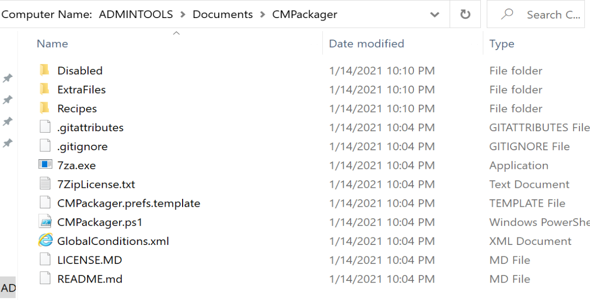
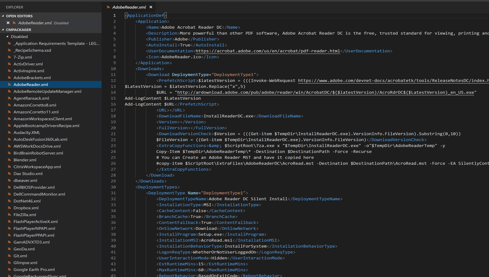

# CMPackager

"This Application is a PowerShell Script that can be used to create applications in SCCM, it takes care of downloading, packaging, distributing and deploying the applications described in XML "recipe" files. The goal is to be able to package any frequently updating application with little to no work after creating the recipes."  

## Background

This Community Resource was created and maintained by Andrew Jimenez ([@AndrewJimenez_](https://twitter.com/AndrewJimenez_)).  Andrew is pretty active in the community, and always willing to help out with your questions.  
Where to get this? [GitHub](https://github.com/asjimene/CMPackager)

From Andrew:
*"I built CMPackager back when I was the ConfigMgr admin at a large university. I got very tired of packaging new versions of software as they came out. I built CMPackager to save me time on creating apps that came out frequently. I now work for Patch My PC doing a lot of the same packaging work, but continue to support CMPackager as a free and open source project. I welcome community input and pull requests to improve CMPackager!"*

## Quick Steps Setup

From the GitHub Instructions:

- Download the Project [and unblock]
- Set up your SCCM Preferences in the CMPackager.prefs file (it is a standard XML file)
- Check out the Recipes in the "Disabled" Folder, Modify them to your needs, and copy them into the "Recipes" Folder
- Run CMPackager.ps1 - Recipes in the "Recipes" folder will be packaged if required. Note that some packages require admin to be packaged (App is installed then uninstalled to grab version info)

## Walk-Through Setup

I took this for a test drive, and it was quite easy to setup based on the above info.  I downloaded the entire GitHub folder, then unblocked the file.  Make sure you unblock it, or odd things happen.

I then extracted it to Documents\CMPackager

I then open the folder with VSCode (Elevated), because it makes life easier, and open up the Preference file and change to my preference.
cmpackager.pref.template which then you rename to cmpackager.pref (remove.template)

I'm going to use C:\CMPackager as my Root, with C:\CMPackager\Temp for my temp location.

I also change the path for where it goes on the server, I want it organized Apps\Publish\AppName\

After I set my preferences, now I need to create a "Recipes", but for now, I'll just steal one from the disabled folder, and Adobe Reader looks like a safe place to start, a quick look over the document and I notice one thing that could be an issue... "InstallProgram" = "Setup.exe".  

Lets just update that so it's a silent command:

Just copy the one you want into the recipe folder and fire it up.

Wow, that was easy, almost too easy, lets check out the Console and confirm it did what the recipe said it would do.

Ok, so the app is there, and it appends the version to the name, which is nice.  
And the files it downloaded and content it built:

Lets Deploy the App and Distribute to DPs and give it a Test:

It installed silently perfectly after that change to the Install Command in the XML recipe.

## Summary

CMPackager is easy to setup, very straight forward, and with very little effort, you can start automating your packaging.  If you are responsible for putting applications into CM for deployments, then you'll want to check out this project, steal some ideas, or the entire thing.  I know I'll be using it now that I see how easy it is!
