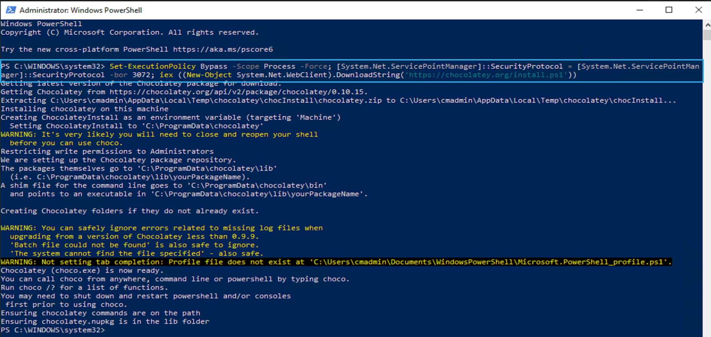
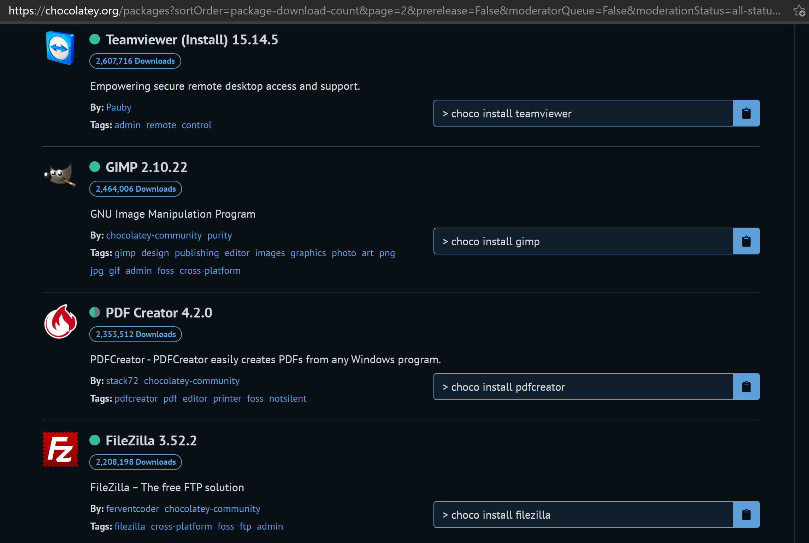
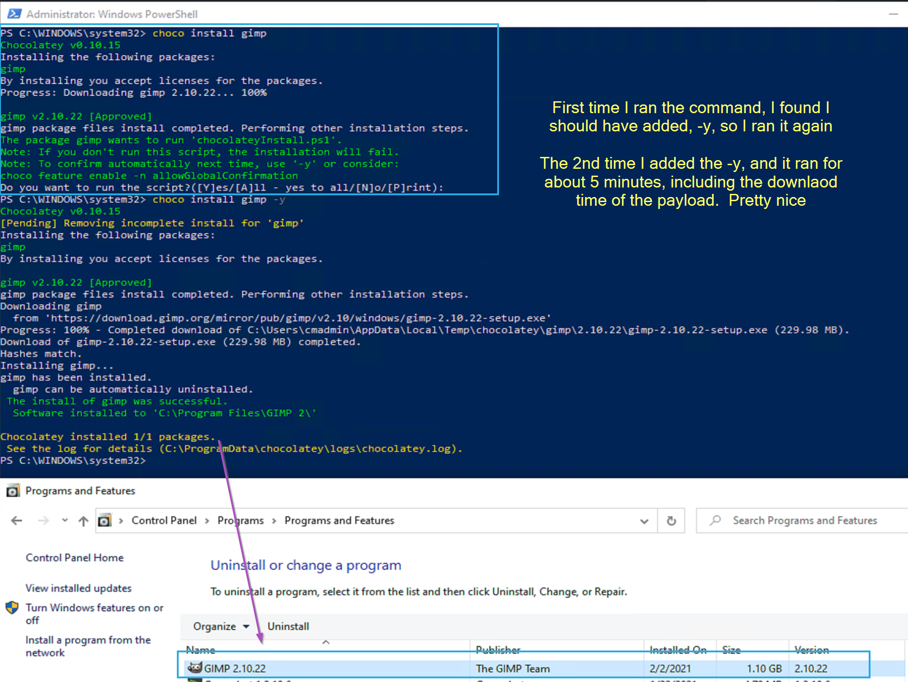
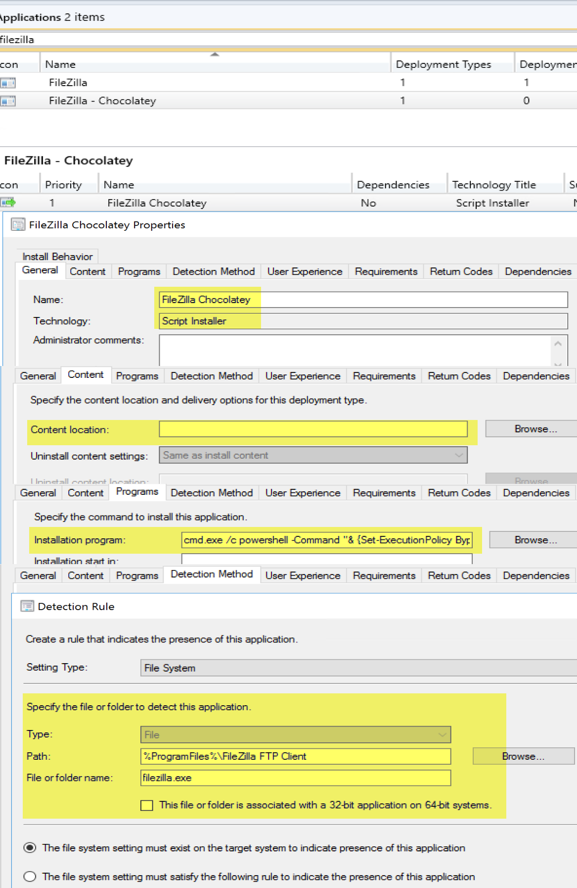
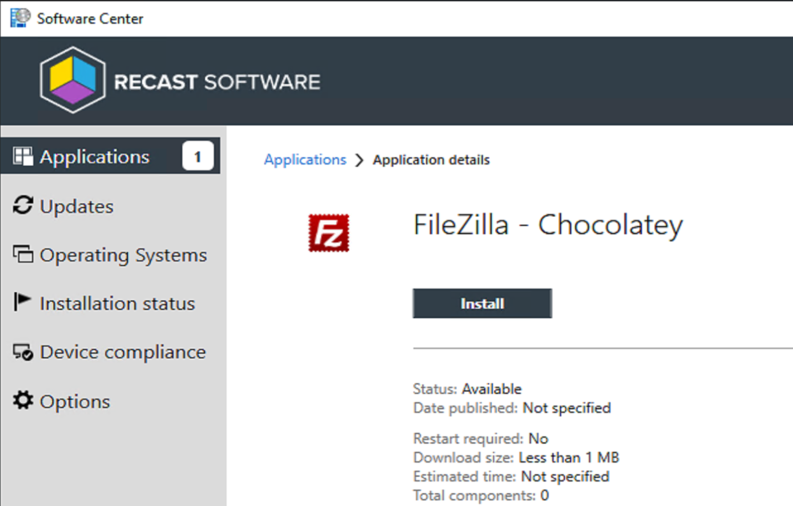
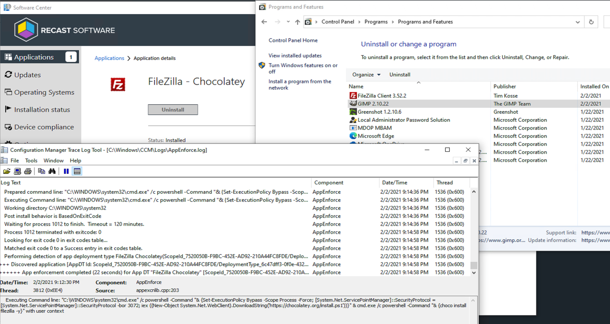
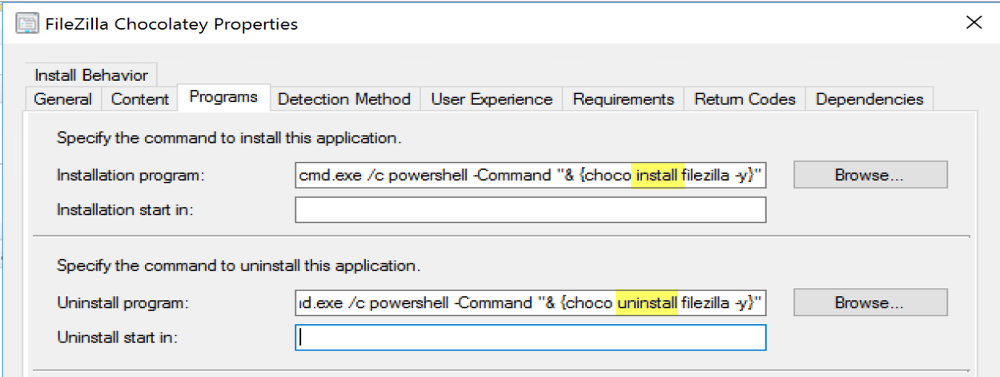
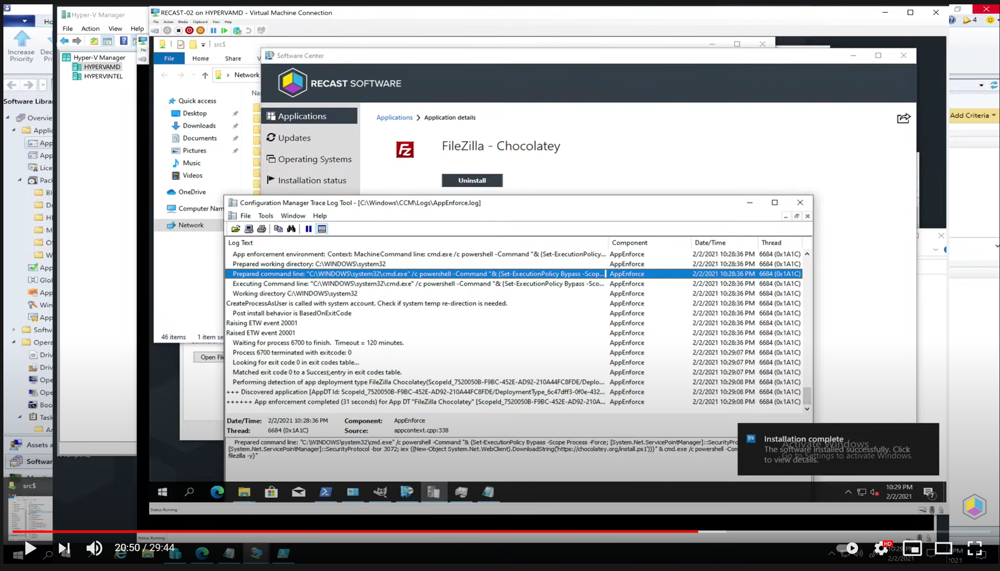

# Chocolatey

## Overview

[Chocolatey](https://chocolatey.org/) has a few of flavors, a basic tool, with community curated packages that you can install with a simple command line, or a  complex automation system for management of endpoints.  

Check out the 3 tiers on their [pricing page](https://chocolatey.org/pricing), this will give you an overview of what comes in their Open Source Version

## Demo 

Using a VM running Windows 10, going to install Chocolatey, then leverage it to install some applications. 

### Installation of Chocolatey

```PowerShell
Set-ExecutionPolicy Bypass -Scope Process -Force; [System.Net.ServicePointManager]::SecurityProtocol = [System.Net.ServicePointManager]::SecurityProtocol -bor 3072; iex ((New-Object System.Net.WebClient).DownloadString('https://chocolatey.org/install.ps1'))
```

[](media/Choco01.png)

### Installing apps with Chocolatey

I then went to this [package page](https://chocolatey.org/packages) to find something I wanted to install, found a few good items for testing:
[](media/Choco02.png)

I then open up an elevated PowerShell prompt and run the command:
[](media/Choco03.png)

```PowerShell
choco install gimp -y
```

### Using with Configuration Manager (LAB ONLY)

So I like to have several applications available in my lab for testing with OSD.  I don't want to take time to update applications, I just always want them to be current.  Several years ago I wrote a script that leverages Ninite to always install the latest version of specific software. (You can find it on GARYTOWN by searching Ninite)
I wanted to replicate that with Chocolatey for fun.

> [!CAUTION]
> This is not a good practice and should ONLY be used in a lab for testing.  To make this work, without getting super fancy, I've had to use generic detection methods.

The Application in CM, Name: FileZilla Chocolatey, AppDT Name: FileZilla Chocolatey.
[](media/Choco05.png)
Content: None
Installation Command:
```
cmd.exe /c PowerShell -Command "& {Set-ExecutionPolicy Bypass -Scope Process -Force; [System.Net.ServicePointManager]::SecurityProtocol = [System.Net.ServicePointManager]::SecurityProtocol -bor 3072; iex ((New-Object System.Net.WebClient).DownloadString('https://chocolatey.org/install.ps1'))}" & cmd.exe /c PowerShell -Command "& {choco install filezilla -y}"
```
Detection: %programFiles%\FileZilla FTP Client\filezilla.exe

In Software Center:
[](media/Choco06.png)

Running from Software Center:
[](media/Choco07.png)

The application doesn't need to download anything before it starts, it runs the commands then installs the application via downloading the content needed from the internet.

### Things to Watch For

If you manually uninstall an application you installed with Chocolatey, then try to reinstall with Chocolatey, it doesn't like that.  If you install it with Chocolatey, uninstall with Chocolately,

You can use basically the same Uninstall command as Install, and you'll be set:

```
cmd.exe /c PowerShell -Command "& {Set-ExecutionPolicy Bypass -Scope Process -Force; [System.Net.ServicePointManager]::SecurityProtocol = [System.Net.ServicePointManager]::SecurityProtocol -bor 3072; iex ((New-Object System.Net.WebClient).DownloadString('https://chocolatey.org/install.ps1'))}" & cmd.exe /c PowerShell -Command "& {choco uninstall filezilla -y}"
```
[](media/Choco08.png)

## Test Drive

YouTube Video, Click on Image:
[](https://www.youtube.com/watch?v=GhW5TL07PVQ)

## Community Related Posts

- [Add Microsoft Deployment Toolkit Applications with Chocolatey](https://www.comprofix.com/add-microsoft-deployment-toolkit-applications-with-chocolatey/)
- [New Tool: Chocolatey Application Wrapper for MDT](https://keithga.wordpress.com/2014/11/25/new-tool-chocolatey-wrapper-for-mdt/)

## Summary

This is a great tool for your lab if you're looking for a free way to install applications during OSD without maintaining them.  If you're looking to do more with it, like packaging your software, you can sure do that too, but that was more than I wanted to tackle here, plus the website has really good documentation.  I spent about a hour going over the few "quick start guides" to get a better grasp of Chocolatey and what it can do, which was a lot more than I previously thought, and much more than I talked about on this page.  If you're interested in application packaging automation, and other workstation management capabilities for your organization, check out their site.

**About Recast Software**
1 in 3 organizations using Microsoft Configuration Manager rely on Right Click Tools to surface vulnerabilities and remediate quicker than ever before.  
[Download Free Tools](https://www.recastsoftware.com/?utm_source=cmdocs&utm_medium=referral&utm_campaign=cmdocs#formarea)  
[Request Pricing](https://www.recastsoftware.com/pricing?utm_source=cmdocs&utm_medium=referral&utm_campaign=cmdocs)
