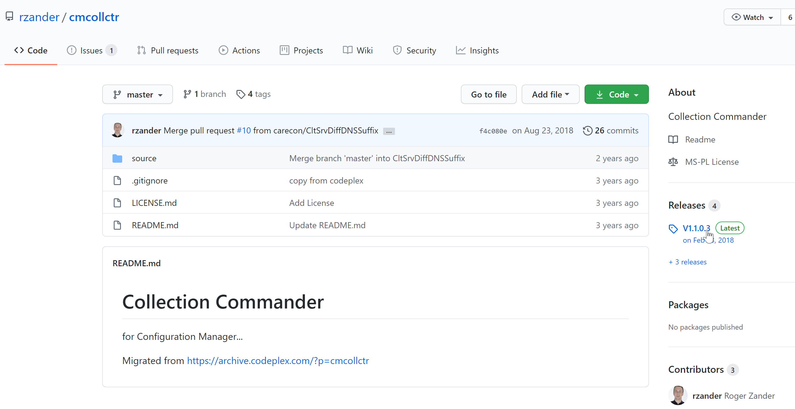
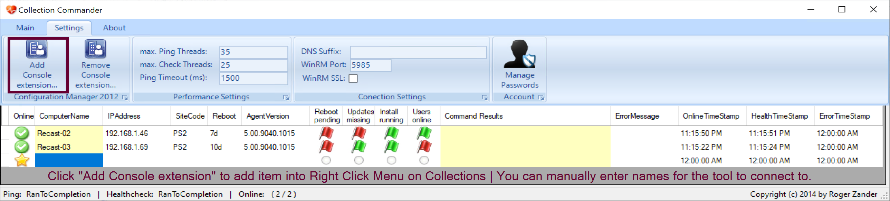
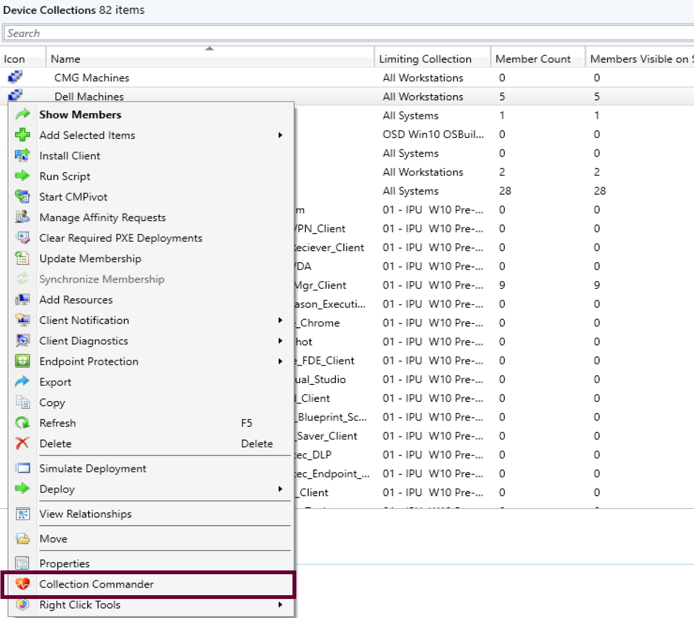
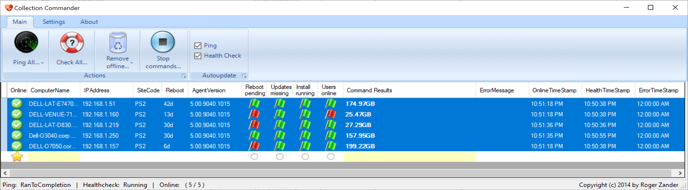
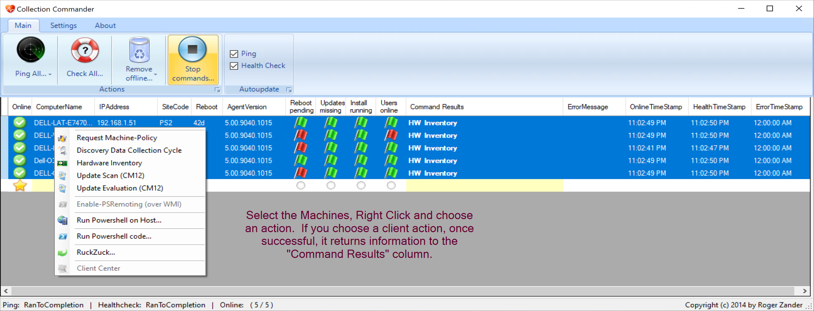
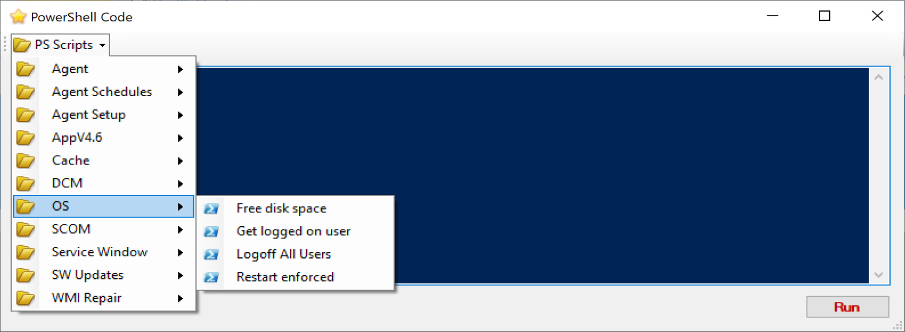
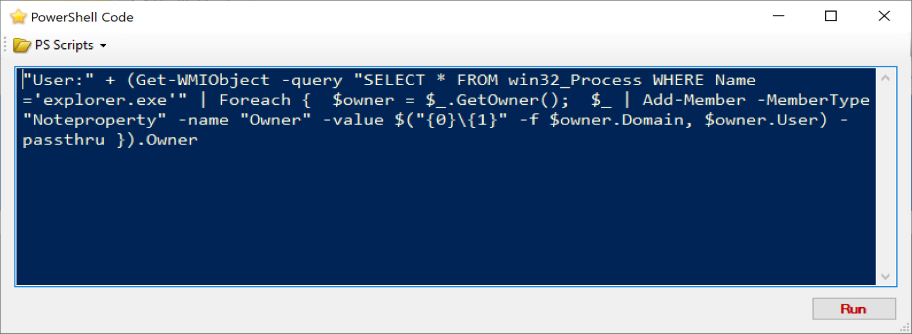
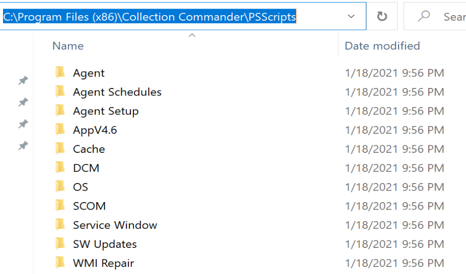

# Collection Commander

Collection commander is another great project created and maintained by [Roger Zander](https://twitter.com/roger_zander) on [GitHub](https://github.com/rzander/cmcollctr)

Once you've integrated it into ConfigMgr with a Click of a button, it adds a right click menu for you to pull up machines from a collection. This provides you the ability to run PowerShell scripts on one, many or all of the machines from the Collection Commander UI.

Differences from using "Run Scripts" that is built into the console:

Run Scripts is triggered through CM, and is logged in CM, leveraging the CM Client running in the System Content.  Collection Commander runs under the same context that you launched the CM Console in.

Collection Commander also comes with many pre-created scripts, worth looking at for a learning experience.

## Download & Install

Downloading is quite simple on the [GitHub](https://github.com/rzander/cmcollctr) Page, choose Release, which will provide you the MSI, go ahead and download and install.  You'll see a CMCollCtr Heart Shaped Icon on the desktop

Once you open the application, if you want to integrate it into CM, click the button.  Otherwise, you can manually add computer names for you to take actions on.

## UI & Usage

The UI shows lots of information, and allows you to take actions by right clicking.

The easiest way to leverage this tool is once it's integrated, right click on a collection, and choose "Collection Commander" which launches the UI.

Once open, you can select and right click on devices giving you a context menu with several options.

If you choose Run PowerShell Code, you get a tool to run PowerShell code, with many scripts pre-created and available.

You can add your own custom scripts too, just place them into the scripts folder: (C:\Program Files (x86)\Collection Commander\PSScripts)

This is another nice tool to have in your Service Desk / Admin arsenal.

**About Recast Software**
1 in 3 organizations using Microsoft Configuration Manager rely on Right Click Tools to surface vulnerabilities and remediate quicker than ever before.  
[Download Free Tools](https://www.recastsoftware.com/?utm_source=cmdocs&utm_medium=referral&utm_campaign=cmdocs#formarea)  
[Request Pricing](https://www.recastsoftware.com/pricing?utm_source=cmdocs&utm_medium=referral&utm_campaign=cmdocs)
