# OSD Builder

## Overview

OSD Builder is created and maintained by David Segura [@SeguraOSD](https://twitter.com/SeguraOSD).  

*OSDBuilder is a PowerShell module to help you perform Offline Servicing to a Windows Operating System Image. By using an Offline method of configuring an Operating System, it can then be imported in MDT or SCCM and used like any other OS Deployment. This includes being able to use in an Upgrade Task Sequence, which you cannot do with a Captured Image.*

Before I go on, David's site [OSDeploy.com](https://www.osdeploy.com/) has many great tools that can bolster your tool set. | [GitHub](https://github.com/OSDeploy)

- OSD Drivers
  - a unique take on driver management, worth checking out if you're starting down the road of driver management.
- OSD Update
  - Module that is used to download some common updates used in OS Deployment
- OSDSUS
  - Shared PowerShell Module that contains WSUS Update Catalogs used by OSDBuilder, OSDUpdate
- OSDCatalog
  - Module that David uses to generation WSUS XML files for OSDBuilder and OSDUpdate
- OSD Software
  - Module that is used to download some common software used in OS Deployments
    - Chrome | ADK | VS Code | MDT
- [PowerShell Gallery](https://www.powershellgallery.com/profiles/Segura)
  - You'll want to check out the gallery too, as there are other great tools he makes available and is constantly updating them.

In this page, I'm going to focus on OSD Builder, giving you a quick crash course in using it.

This tool is very powerful, and can be completely automated to update your source monthly.  I'm going to give a newbie guide to running it, and hopefully that is enough to entice you to learn more.

## Demo Pre-Reqs

- Demo Machine
  - At least 40GB Free for Demo
  - Local Admin Access
  - Internet Access
- Windows Media ISO you wish to create serviced media from.

## Demo - Straight PowerShell Commands - No Customization

My Demo Machine used to build media
  - HyperV VM
  - 50GB C Drive & 100GB Empty D Drive 
  - 4GB Memory
  - 2 vCPUs
  - Windows 10 1909

We're going to open an elevated PowerShell Window and get OSDBuilder Module Installed and Imported:

### Install Module

```PowerShell
Install-Module -Name OSDBuilder -Force
```

When I run the Install command for the first time, I get a message saying I need to update another module, so I go ahead and do that.
[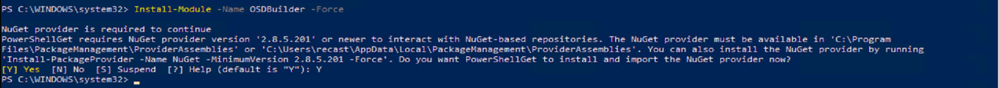](media/OSDBuilder01.png)

Then to avoid getting the error about my machine blocking scripts, I set the execution policy to bypass, then import the Module

### Import Module

```PowerShell
Set-ExecutionPolicy Bypass -Force
Import-Module -Name OSDBuilder -Force
```

[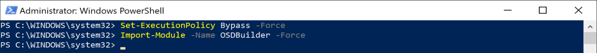](media/OSDBuilder02.png)

Ok, now we have what we need.

I've downloaded the Windows 10 20H2 Media from VLSC and mounted it on my VM (Double clicked ISO and it mounted as the "E" Drive)

I have a lot of space on the D Drive, so I'm going to tell OSDBuilder to set the path to the D Drive:

### Set OSD Builder's Path

```PowerShell
Get-OSDBuilder -SetPath d:\OSDBuilder
```

[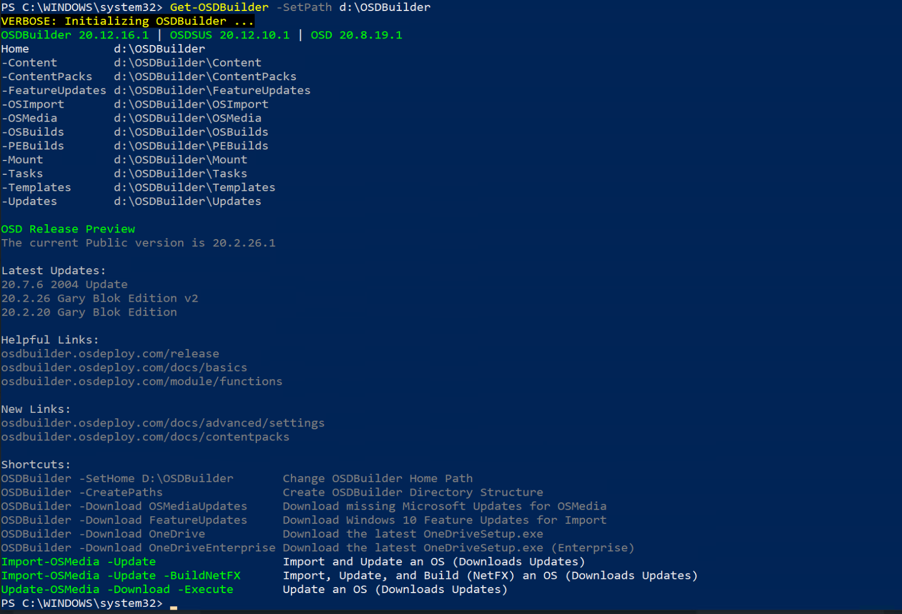](media/OSDBuilder03.png)

Now Lets Import some Media that we can use to Service Later

### Import Windows Media

```PowerShell
Import-OSMedia
```

This will scan your machine for Mounted Media and give you a list of items to import.  If you had mounted several iso's it would present you will all of them.  I'm going to choose Index 3, Enterprise EditionID. 

[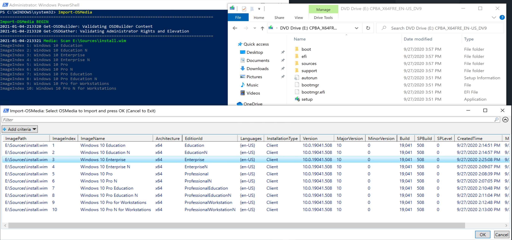](media/OSDBuilder04.png)

After I choose the Index I wanted, I click OK and it starts the import process:
[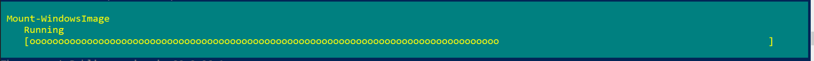](media/OSDBuilder05.png)
[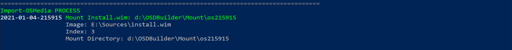](media/OSDBuilder06.png)

And at the end, OSDBuilder provides info about the WIM Index imported, and you can see the files in the Import Folder:

[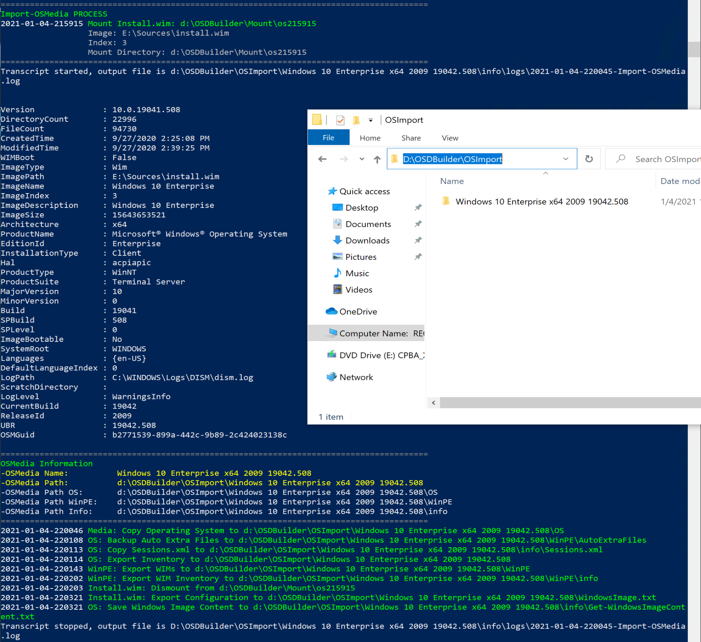](media/OSDBuilder07.png)

### Build Updated Media

Here we are going to run the commands to trigger the Build Process to provide updated media.

```PowerShell
New-OSBuild -Download -Execute -EnableNetFX -SelectUpdates
```
New-OSBuild -Download -Execute -EnableNetFX -SelectUpdates -SkipTask

Lets break down that command
- [-Download](https://osdbuilder.osdeploy.com/docs/osbuild/untitled-3/osbuild-download#new-osbuild-download): Downloads Missing Updates from MS to Apply to Image
- [-Execute](https://osdbuilder.osdeploy.com/docs/osbuild/untitled-3/osbuild-execute#new-osbuild-execute): Executes the Build Process
- -EnableNetFX: Enable NetFX 3.5
- -SelectUpdates: Launches a Grid with available updates you can apply
- -SkipTask: Starts Process based on command line only

It will display a list of the Imported OS Images allowing you to choose which one you'd like to run the build process on:
[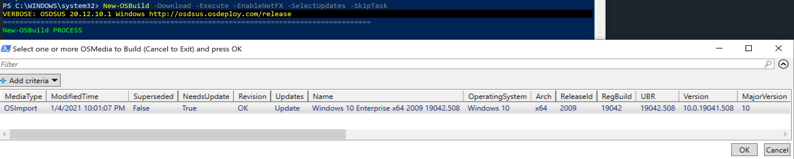](media/OSDBuilder08.png)

Then it launches the grid allowing you to choose the updates you'd like services in:
[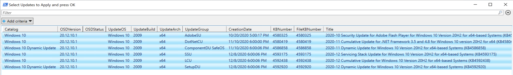](media/OSDBuilder09.png)

Back in the console, you'll get to watch the process, as it downloads, applies updates and creates the new media.
[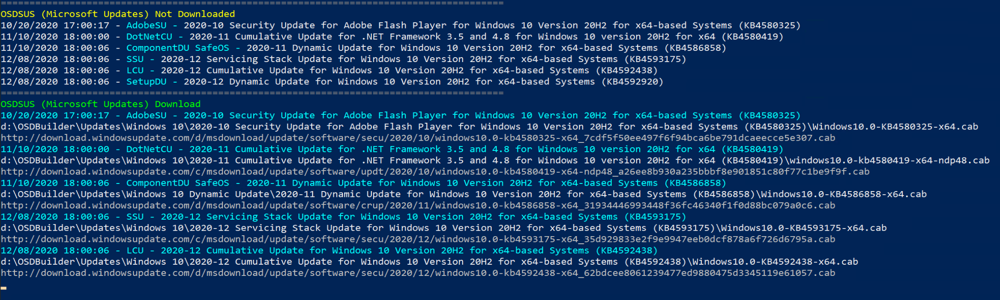](media/OSDBuilder10.png)

At the end of the run, you'll see:
[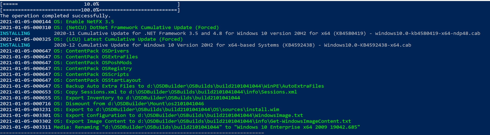](media/OSDBuilder11.png)

The folder will have the Name of the OS Edition along with the Build number, the media you'll want to import into CM will be in the "OS" folder.
[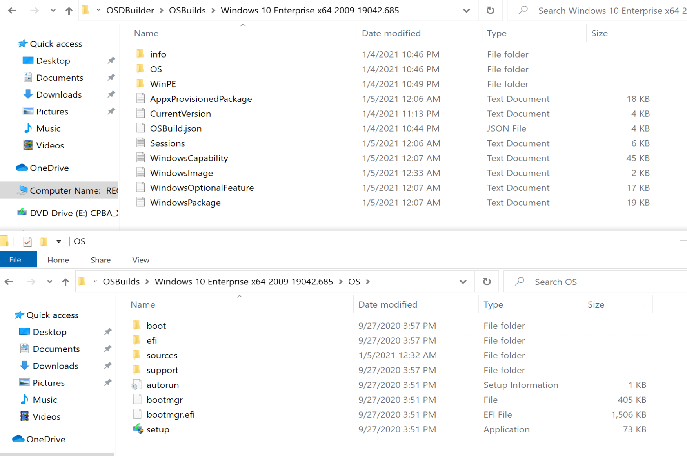](media/OSDBuilder12.png)

What I appreciate about OSDBuilder is the logging.  Everything you could want is logged. Using this method, then posting the logs to your internal doc site provides complete transparency for what is going into your OS Media.

**About Recast Software**
1 in 3 organizations using Microsoft Configuration Manager rely on Right Click Tools to surface vulnerabilities and remediate quicker than ever before.  
[Download Free Tools](https://www.recastsoftware.com/?utm_source=cmdocs&utm_medium=referral&utm_campaign=cmdocs#formarea)  
[Request Pricing](https://www.recastsoftware.com/pricing?utm_source=cmdocs&utm_medium=referral&utm_campaign=cmdocs)