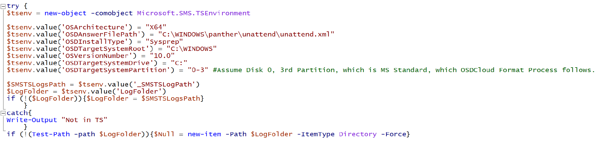
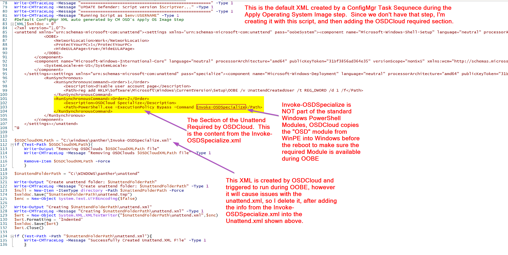

# OSD Cloud with ConfigMgr

## Overview

OSD Cloud is created and maintained by David Segura [@SeguraOSD](https://twitter.com/SeguraOSD).  

For basics about OSD Cloud, check out the other OSD [Cloud Post](Community-Tools-OSD-Cloud.md)  

In this post, I'll be going deeper into ConfigMgr and how you can replace the Apply OS Step and Apply Drivers step with OSDCloud, and continue with rest of your Task Sequence to install the ConfigMgr Client, join the domain, and do your Apps and customizations during OSD, like regular old OSD.

## Why Use OSD Cloud with ConfigMgr?

Why would you want to replace your Apply OS Step, and Apply Drivers step with OSD Cloud?  Using OSD Cloud, you no longer need to maintain a WIM or Driver Packs, OSD Cloud does that for you.  

### Pros

- Never maintain a WIM again
- Passing a parameter gives you the ability to deploy several different Windows Builds and Editions.
- Automatically pull that latest Driver Packs and leverage Windows Updates for Drivers
- No Storage requirements on your on-prem infrastructure
- Customizable, you can break it down and leverage just the features you want, ie, just the Windows image, or just the drivers, allowing you to still have some control if wanted.

### Cons

- Must have internet access, and a lot of bandwidth.
- Less control of what is being applied, near impossible to regression test or maintain a change management, since the core parts of OSD are controlled by vendors.

## Task Sequence

So basically, you can take your current OSD Task Sequence, make a copy, disable the parts where you apply the OS and drivers, and replace it with a couple of steps for OSDCloud.

I set additional variables that I use to pass to OSDCloud:

This allows easy control over the Build that OSDCloud installs. Since it's controlled by variable, you could leverage collections or other methods to set the Build you want.

Then I have two steps to setup the WinPE requirements and launch OSDCloud, all from pulling the content from the internet.

In the Task Sequence, it's running the script that it found at that URL, which then enables the PS Gallery and installs modules for CloudOSD

The command line that I call for OSDCloud is leveraging those TS Variables I manually set in the first step.

OSDCloud requires the PowerShell Module to still be present when booting the full OS the first time, so it's available in OOBE to be used.  To ensure this happens, OSDCloud copies several PowerShell Modules from WinPE into the offline OS before it completes.

Once OSD Cloud finishes downloading and applying the Operating System image from Microsoft, it downloads the drivers and depending on the vendor, applies them offline or stages them to be installed during the OOBE Specialize stage.

OSDCloud logs everything to c:\OSDCloud\Logs...

The entire download & apply of the OS took under 10 minutes on my 100MB internet connection.  Sure, that's 3-4 times longer than using an image on my DP, but it's pretty decent, and I didn't have to create anything.

Before the computer reboots, the Task Sequence takes back over and continues on, basically picking up where you'd have a normal OSD task sequence, except one thing, you need to "trick" the task sequence into thinking you ran the Apply OS step by creating the variables that the Task Sequence would have created if you were doing it normal.

Required Variables you have to manually create:

- OSArchitecture
- OSDAnswerFilePath
- OSDInstallType
- OSDTargetSystemRoot
- OSVersionNumber
- OSDTargetSystemDrive
- OSDTargetSystemPartition

 Once those are created, rest of the Task Sequence steps will work as expected.  If you don't have those, you'll be seeing a lot of errors in your log and OSD breaks.  

 I've created a script that I've stored on GitHub which creates the basic requirements for OSD to continue, the TS Variables and a basic unattend.xml, and merges the requirements for OSDCloud to run items in the OOBE specialize phase, which is a small line in the unattend.xml.

Snip of Script that creates the required variables.

Snip of Script that creates the Unattend.xml

Now that we have all of that done, we can continue on and have our custom Windows & Network settings be applied, which will update the unattend.xml file for us.  If you want a deeper dive into how that works, please check out the Task Sequence Basics area, and look under Steps, [Settings](https://www.recastsoftware.com/resources/configmgr-docs/task-sequence-basics/task-sequence-steps/settings/capture-apply-settings-combined/).

Apply Windows Setting Step in Editor:

Apply Windows Setting Step during Task Sequence:

Apply Network Setting Step in Editor:

Apply Network Setting Step during Task Sequence:

You can see in those steps, it creates TS variables and uses those to update the unattend.xml

The last critical step in OSD is the [Setup Windows and Configuration Manager step](https://www.recastsoftware.com/resources/configmgr-docs/task-sequence-basics/task-sequence-steps/images/setup-windows-and-configmgr/), this step sets of the Task Sequence to be able to continue after it reboots, and then hands off the TS to the CM Client in the full OS.  Check out the Details I wrote up in the Task Sequence Steps ara for this step.

The step should look just like it does in your other OSD task sequences, nothing special to accommodate OSDCloud.

At this point, the Task Sequence continues like any other OSD Build, and when you're done, you have a Domain Joined CM Client workstation ready to go.

## Scripts

Official Scripts used in the Task Sequence and an exported copy of the Task Sequence will be available after MMS 2022 (May 5th) on GitHub

## Video of Process

**About Recast Software**
1 in 3 organizations using Microsoft Configuration Manager rely on Right Click Tools to surface vulnerabilities and remediate quicker than ever before.  
[Download Free Tools](https://www.recastsoftware.com/?utm_source=cmdocs&utm_medium=referral&utm_campaign=cmdocs#formarea)  
[Request Pricing](https://www.recastsoftware.com/pricing?utm_source=cmdocs&utm_medium=referral&utm_campaign=cmdocs)
