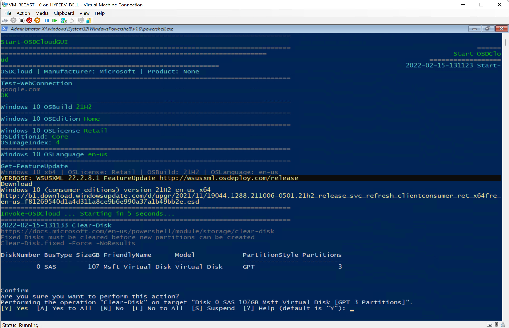

# OSD Cloud

## Overview

OSD Cloud is created and maintained by David Segura [@SeguraOSD](https://twitter.com/SeguraOSD).  

*OSDCloud is a solution for deploying Windows 10/11 x64 over the internet using the OSD PowerShell Module.  This works by booting to WinPE where the OSDisk is wiped and partitioned.  Once this is complete, the Windows Operating System is downloaded from Microsoft Update (using CuRL), before finally being staged (expanded) on the OSDisk.  Driver Packs from Dell, Lenovo, and HP are downloaded directly from each of the manufacturers where they are installed in WinPE or in the Windows Specialize Phase.  For computers that do not have a Driver Pack, hardware drivers are downloaded from Microsoft Update, so this should work on just about any computer model out there*

On this page, I'm going to give a very simple overview and demo, for the basic functionality.  Once you know the basics, you can start to go much further, implementing your own unattend file, enable or disable capabilities, remove Appx packages and more. [See Functions](https://www.osdcloud.com/sandbox/functions)

## Requirements

OSDCloud requires that you boot from WinPE which has PowerShell and a few other items enabled, and has Internet Access.  Rest of the hard work of adding Modules to WinPE, David has simplified down to a couple commands.  The content is hosted on GitHub, so you can always go behind the scenes and take a look, nothing is a black box.

What I appreciate about OSDBuilder is the logging.  Everything you could want is logged. Using this method, then posting the logs to your internal doc site provides complete transparency for what is going into your OS Media.

## Demo

### WinPE

I'm leveraging a ConfigMgr Task Sequence, since ConfigMgr already had WinPE with PowerShell and other items integrated into it.  I also have BGInfo integrated into my WinPE, which is slick.

[](media/OSDCloud01.png)

However, if you want, you can create your own completely custom WinPE, which David talks about in his docs.

### Task Sequence

My Task Sequence is very simple for the demo, just to show how David has done all the work for you.  I've added an "Eject CD" step for when I'm running it on VMs, just to ensure it doesn't reboot into WinPE on accident.

PowerShell Step

```PowerShell
iex(irm sandbox.osdcloud.com)
```

[](media/OSDCloud02.png)

Run Command Line Step

```
cmd.exe /c start /wait %SYSTEMROOT%\System32\WindowsPowershell\v1.0\powershell.exe -ep bypass -command (new-object -ComObject Microsoft.SMS.TsProgressUI).CloseProgressDialog() ; Start-OSDCloudGUI
```

[](media/OSDCloud03.png)

And that's it, it will launch OSD Cloud's GUI and allow you to continue.

### In Action

Using the ConfigMgr Custom Boot Image, WinPE loads and presents the Task Sequences:
[](media/OSDCloud04.png)

The Pre-Req Step runs the command to load the requirements into WinPE.  You can see exactly what it is doing in the logs, as well as see items downloaded into the temp folder.
[](media/OSDCloud05.png)

The next step launches OSDCloudGUI, with all of it's options.
[](media/OSDCloud06.png)
[](media/OSDCloud07.png)
[](media/OSDCloud08.png)
[](media/OSDCloud09.png)

Once you've chosen your options, it will continue in PowerShell Console, formatting the drive properly, then downloading the required Windows content.
[](media/OSDCloud10.png)
[](media/OSDCloud11.png)

Similar to "Apply Operating Step", OSDCloud extracts the Windows Image to the Drive, as shown in the command window.
[](media/OSDCloud12.png)

After the reboot, you'll see it running OOBE, and eventually get to the point you're asked questions. (Unless you leverage a custom unattend file)
[](media/OSDCloud13.png)

After going through rest of the dialogs and adding a user, you'll be able to logon and use the computer.

[](media/OSDCloud14.png)

**About Recast Software**
1 in 3 organizations using Microsoft Configuration Manager rely on Right Click Tools to surface vulnerabilities and remediate quicker than ever before.  
[Download Free Tools](https://www.recastsoftware.com/?utm_source=cmdocs&utm_medium=referral&utm_campaign=cmdocs#formarea)  
[Request Pricing](https://www.recastsoftware.com/pricing?utm_source=cmdocs&utm_medium=referral&utm_campaign=cmdocs)
