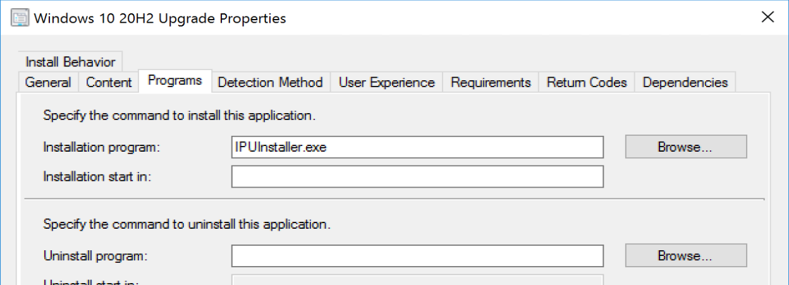
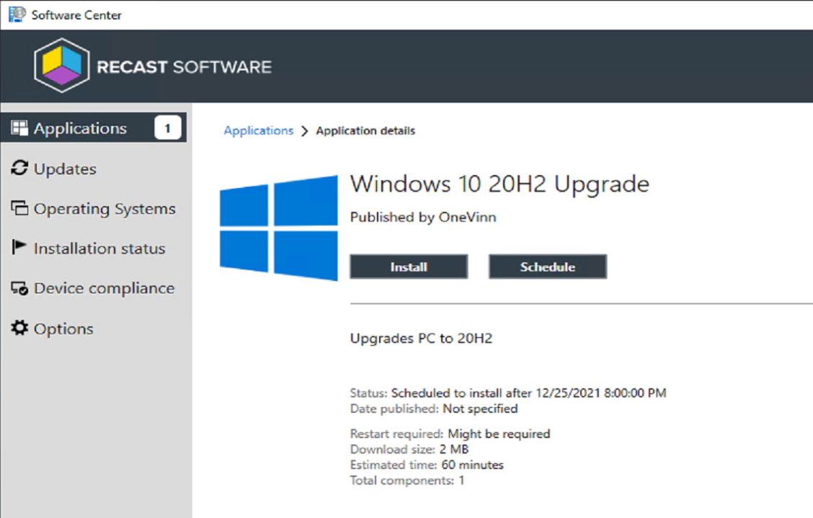
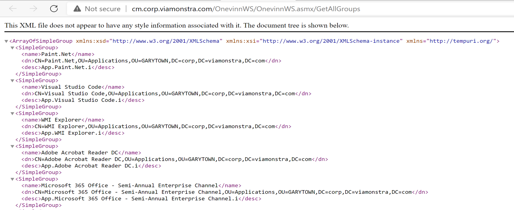
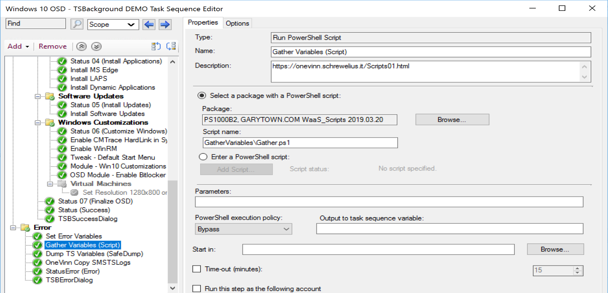

# OneVinn Tools

## Webinar

[March 24: : OneVinn Tools, by Johan Schrewelius & Jorgen Nilsson](https://www.recastsoftware.com/configmgr-community-tools-webinar-series)

## Overview

Johan Schrewelius from OneVinn tools has created a treasure trove of tools and scripts that integrate into ConfigMgr from [his Blog](https://onevinn.schrewelius.it/index.html)

I'm going to cover several here as I integrate them into my lab.

- ## TSBackground

TS Background is an odd on for your Task Sequence.  If used in WinPE, you'll need* to add some content to your boot images.  Technically you don't have to, but you'll have to wait until after you've formatted the drives before you can launch it.  Basically TSBackground will replace the current "look" of a Task Sequence, taking over the TSProgressUI communications and being the replacement UI making the OSD process pretty.  Lets face it, Native OSD looks like 90s, which for the most part it totally fine.  But if you're doing in-place reimaging where users might see the process, I personally feel improving the UI brings a professionalism to the IT Department.  Anything that interacts with end users should be polished and pretty.  

> [!NOTE]
> This is NOT a full guide, and I'm skipping some parts that add additional functionality, I'm basically setting up minium viable product, to provide a glimpse into the tool.  For full implementation, refer to the PDF documentation provided on the download site.

### Setup

Setup is well documented in a PDF file.  I'm going to give a quick start.

#### **Files and Config**

Download the Content, I kept it with my other OSD Source materials. Here is what it looks like extracted:

First thing I did was gather my corporate wallpapers and find one that fit the template best, and gather the corporate colors.  I then replaced the Background.jpg that came in the download, which I renamed to BackgroundBackup.jpg, and Place my corporate image in the folder and named it Background.jpg

I then edit the file TSBackground.exe.config, changing colors and updating things for my environment.

#### **Boot Image Modification**

Now its on to your boot image, first you need to ensure you have a few options enabled:

I've highlighted the two minimum components, however for OSD, I have several others to support my OSD TS.

Then we need to go to the Customization Tab

Here we create a command that does nothing, but you can't include content without a command.  The Content is pointed to the TSBackground folder, and optionally, you can set your corporate background so it's set as soon as WinPE boots.

#### **Task Sequence Integration**

This has been made pretty easy thanks to a zip file that can be imported with all of the steps needed, and you can then copy them into the correct locations:

At this point, it's time to add steps in the TS.  In the image below, the left side is the provided template, and my OSD TS on the Right.

> [!NOTE]
> I'm breaking from the docs on how I implemented it.  The Docs recommend OSDInjection to trigger TSBackground.exe, look for section "15", but I'm cheating and using a step to kick it off manually, which is why you don't see it in the TS Template provided.

Using the provided steps, I copy them into the corresponding places in my TS.  You'll also want to make sure your TS is setup for Error handling by using Groups and Continue on error. Adam wrote a nice [post explaining error handling in depth.](https://www.asquaredozen.com/2018/11/29/building-a-better-task-sequence/).

### Test Drive

Now that we have the basics in place, lets give it a test drive before we spend too much time customizing.  Make sure the basics are working:

VIDEO:  Click to open in YouTube

### Summary

It's a great tool, overall pretty easy to setup, and if you have end users watching your OSD, it's a great way to add corporate branding to make your processes look polished.

- ## Windows 10 Upgrade Tools

Tool number two that I'm going to cover is the Windows 10 Upgrade Tools.  This is another multi piece solution to improve the end user experience of upgrading a Windows PC while leveraging a task sequence to do it.

This too I'm not going to implement everything in my lab, just the basics to get it up and running to get you hooked.

### Setup

First thing was to download and create the package / Program:

The docs provide a nice walk through for creating the package / program and modifying the config file, I also copied the UPGBackgound MSI into the folder (as the documentation explained to do), along with a branded image.

#### **Files and Config**

I made a few modifications to the default highlighted below:

I then deployed the program to a test collection, then waited and watched:

I noticed a couple things I'd like to change in the text, so a quick modification to a file Message.rtf:

Then I saw what I wanted:

I then Scheduled:

I then poked around to see what was created:

Three Scheduled Tasks and a Registry Key with several properties.

So I waited 10 minutes, for when I scheduled the upgrade, and sure enough, I was logged off, and the upgrade screen kicked in.  You can see the time on the host machine is exactly when the VM was supposed to upgrade.

### Test Drive

VIDEO:  Click to open in YouTube

### The Console Extension

There is an additional addon to install that adds a monitoring dashboard in the CM Console to easily monitor the progress of the upgrades.

### Summary

This tool too is pretty simple to setup with some basic defaults to get the hang of it, then start to customize once you've had a few practice runs down so you understand exactly the experience the end user will receive.

This tool does not play well with other community tools, that do similar things, which I had incorporated into my Task Sequence.  Once I disabled those, the Upgrade Tools provided by OneVinn worked very well.

> [!NOTE]
> Things I didn't test, were upgrade rollback situations or failures.

- ## IPU Application

This is the most recent addition OneVinn added and I'm circling back to try it out.  The IPU Application is what it sounds like, it's an Application Model deployment of the Windows Upgrade.  It's not a Task Sequence, it's not Servicing, but it is still deployed via ConfigMgr. This setup would be more alignment with Servicing with Feature Updates, as it will require updating the SetupConfig.ini file, along with SetupComplete.cmd and other Client Actions to do any customizations or additional tasks.

The Tool helps you configures some options, like injecting driver updates into the Windows upgrade, and adding additional reporting but leveraging static locations in the provided tool.  

### Setup

Setup is well documented, on par with the other tools.  It requires several things for the "basic" setup

- Hardware Inventory Changes
  - Update to the Configuration.mof
  - Import of the SMS.mof in the Custom Settings hardware inventory tab.
- Application
  - Very Simple to create, point the Source at a folder
  - Add the Install Command
  - Add the detection logic
  - Copy your Windows Upgrade Media to the Source "Media" folder
- Collections
  - 5 Collections in all, 3 with queries that require the hardware inventory already setup.
- Deployment & Maintenance Window (otional)

All of that was fairly simple, so I scripted it and added it to [GitHub](https://github.com/gwblok/garytown/blob/master/OneVinn_IPUApplication.ps1)

#### **Files and Config**

#### Hardware Inventory Changes - Configuration.mof

#### Hardware Inventory Changes - sms.mof (Client Settings)

Once completed, you'll see "IpuResult" added with several values.

#### Setting up App & Collections ([GitHub Script](https://github.com/gwblok/garytown/blob/master/OneVinn_IPUApplication.ps1))

I had already run it once to create the apps, but then it errored creating the collection since the hardware inventory wasn't done, once I did that, I ran the script again, and it finished successfully.

The App that the script creates:

#### Collections

5 Collections are created, 3 that require the updated hardware inventory to be created (basically for reporting), 1 that shows downlevel machines, and one for the deployment.  Below shows one using a query based on the custom inventory data.
I've set the script to create a custom folder for the collections to keep them organized.

#### In Software Center

### Demo

In this Demo, I first installed the Custom Action Scripts to create the notifications about the upgrade to provide better insights into what is happening. I felt it would compliment this tool nicely.  

- [Custom Action Scripts](https://docs.recastsoftware.com/ConfigMgr-Docs/Windows-Servicing/Windows-Setup-Custom-Action-Scripts.html)
- [Custom Action Script Application](https://github.com/gwblok/garytown/tree/master/Feature-Updates) (As seen in these images)

Here we see the install kick off, triggering the setup.exe, and the other windows 10 setup executables.

IPUApplication creates logs in the programdata folder:

In the log you can see that it created the SetupConfig.ini file for you.

When complete, user is presented with a nice restart prompt.

#### Deployment Scheduler Add-on

I had to test out the Deployment Scheduler application too, since it was included in the download.  Once installed, it creates an icon in the start menu, and when launched is a "replica" of the Software Center:  

I went ahead and scheduled the upgrade, which was an available deployment.  At the scheduled time, it kicked off, starting the download, then installation.

The Deployment Scheduler, highlighting the IPU Application: Windows 10 20H2 Upgrade.  Once it has downloaded the content it populates this new tab.  You can see that this is a very friendly interface for the users.

### Test Drive

YouTube Video:

### Summary

This is a nifty alternative way to deploying Windows Upgrades.  Leveraging the App Model, SetupConfig.ini, SetupComplete.cmd, and Custom Action Scripts you can do quite a bit with your upgrades.

[External Blog Post (CCMEXEC)](https://ccmexec.com/2021/02/windows-servicing-in-the-work-from-anywhere-era-using-ipuinstaller/)

- ## Web Service for CM

Having a web service opens up a several possibilities during OSD to dynamically pull information, change machine OU, add machine to AD and others.

### Setup

To setup the web service, I had to setup a couple active directory users, add an iis feature on my server and then install the application.

Once that is setup, a couple of test, then add the steps to the task sequence using the provided PowerShell scripts.

Once again, a very nicely created solution and a step by step document to help setup.

#### Files and Config

After extracting the file (Make sure you unblocked the zip file first), I installed the MSI, referencing the documentation, and plugging in the service account information I setup based on the docs.

Then I created the package to use in OSD

I updated the Configuration.ps1

Take note of the PreFix & Suffix, you'll use those when you create the corresponding AD Groups for your software, you'll need to tag the description in a specific way.

#### Task Sequence Steps Setup & Test Machine

- Test Machine = Recast-Lab-60
- Test User = jim.halpert

The steps are very well documented in the PDF.  I added a single step to grab groups which will look up the groups for the primary user (or machine) and build variables.

I then added my test account as the primary user of the device I am testing on:

This can be accomplished by right-click, edit primary user, on your test device.

#### Active Directory Groups for Software

Remember the Configuration.ps1 file that I modified, here you'll see how the PreFix & Suffix gets used. You can also see I have my test user in this group (along with others).

#### Web Portal Test

Before we test in OSD, you can test in your browser on the machine you installed the WebService On.
When you try to connect, you'll get prompted for creds, use the service account you created for the Task Sequence (SVC_CMTSAction)

Lets test out if it can get the primary user for a device:

That looked good, lets test the service for getting groups:

Sweet, that too looks good.

In the Task Sequence now:

The Connection info is set using a dynamic variable and the value to hidden and will not be shown.  The PowerShell Script then runs, leveraging those variables to request the information and build the variables for applications based on the AD Group Membership.  Nice!

### Test Drive

Youtube Video which covers the Web Service, TSBackground and at the end, LSWatermark OneVinn tools. (My First Live Video with Voice Over)

### Summary

If you're looking for a way to take OSD up to the next level, and deploy apps dynamically based on users, this is a handy way to do it.  

While my demo was using a device I imported and set the primary user on, which is the way I'd always recommend doing OSD, if you use a front end and deploy to unknown devices, you could easily retrofit this to work by having your frontend set your default user, then use the webservice to pull the information for the primary user, I set this up as a proof of concept in my lab, and it also works fine.  Point being, once you have this webservice, it's really up to your creativity how you want to enhance your OSD.

- ## Lock Screen Water Mark

This so far has been the most simple of the tools I've played with from OneVinn.  But it still serves a great purpose if you're in need of this sorta thing.  This tool, when installed on a machine, adds a "Water Mark" image to the lock screen.  You can use it for notifications or extra branding, along with information you want to provided to users before logon.

### Setup

Setup, create your images, create the app, and deploy it.

#### Files and Config

### Test Drive

An Image of the Tool in action.  Here is an image I've created and pushed with the install letting people get a message.  Now this looks horrible (My White Background Image), because I wanted it to be very obvious the image location that was being displayed, which is 100% configurable.  

### Summary

This one was pretty straight forward, you can either point the install at a file share for images, or have several in the local folder on the machine, which you could add to or change after install as well.

- ## Scripts

- ### Gather Variables Script

This script is will create several variables in your task sequence.  If you're making the move from MDT to native CM, this script will help you make the move.  It creates a lot of those variables you're used to from the "MDT Gather" Step.

The Script:

In a Task Sequence:

Once I run that steps, I have lots of extra nifty variables at my disposal used for conditions or scripts.

- ### TS Variables Safe Dump

This script I leverage a lot when troubleshooting.  I'll often use this script before and after a step that leverages variables for a specific outcome, especially when I'm not getting the expected outcome.

I'll also often place this step in the error handling area, so if a TS fails, it grabs a copy of the variables which can help in troubleshooting.

The Script:  

In a Task Sequence:  

When you run the step, it creates a file called "TSVariables-DATE"  

And it captures all of the variables that aren't sensitive, hence "Safe Dump".  

- ### PS Partition and Format

This script replaces the normal Format Steps in your Task Sequence with one script that leverages a "best practice" method for formatting your partitions to utilize the highest % of the drive for usable storage.

In the TS:

In Action:

YouTube Video Demo:

- ### Copy SMSTSLogs

Copy SMSTSLogs is a simple way to have logs zipped up and shipped over to a file share.  It leverages your Network Access Account.  So if you're not using one, then you'll either have to set one up, or look for a another solution, or modify this to use a different account.

You'll need to setup a variable "SLShare" that points to the UNC path for the logs to go.

Then, a step for the script:

In my TS, when I fails, it goes into that Error handling error and captures the info and saves to a server: (Note, I need to update the TSBackground text for when errors happen)

**About Recast Software**
1 in 3 organizations using Microsoft Configuration Manager rely on Right Click Tools to surface vulnerabilities and remediate quicker than ever before.  
[Download Free Tools](https://www.recastsoftware.com/?utm_source=cmdocs&utm_medium=referral&utm_campaign=cmdocs#formarea)  
[Request Pricing](https://www.recastsoftware.com/pricing?utm_source=cmdocs&utm_medium=referral&utm_campaign=cmdocs)
