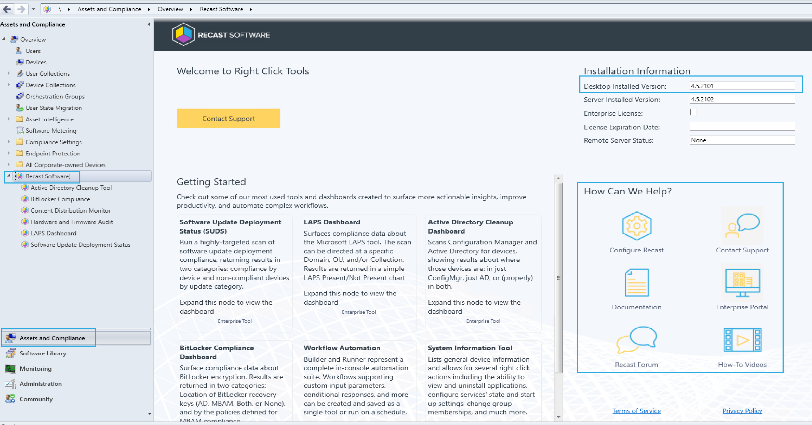

# Recast Software Right Click Tools - Community Edition

My Personal Story and Opinion:
The Recast Software Right Click Tools are a life saver for any ConfigMgr admin who spends  the majority of their day in the console. I started using the Tools at the same time I become a ConfigMgr Admin, so I honestly didn't know what life was like without them until I started working at a place that would not allow the installation of the toolset, due to the miles of red tape involved. This is when I noticed all the extra clicks I had to do on a daily basis, and then was forced to learn how to script many of the functions - spending hours upon hours recreating some of the basic functions that came in the Free Community Edition of the Right Click Tools. Many admins don't have the time to invest in scripting these functions. And why should they when they are freely available? End of Personal Story. - Gary Blok

## Overview

At it's simplest, the Right Click Tools are a collection of individual tools or functions that allow you to take action on a single device, many devices, or entire collections, all via a right click in the ConfigMgr Console.  Actions range from triggering client policies, application installs or scheduling a restart of a computer.  Other Console tasks include adding or removing machines from a collection, getting detailed system information, quickly launching the content location of a package, deleting or changing the client cache.

There so many tools and actions available in the free tools, I can't go over them all here, but thankfully the docs are great, and are listed in details on our [doc site](https://docs.recastsoftware.com/features/Device_Management/index.html)

## Demo

We're going to show installing the Free Version in the lab and what is included (after the Enterprise Trial ends)

### Installation of Recast Right Click Tools

We're going to choose the Recast RCT Community Option, and that's basically it... click next a couple times and you're all set.

Now at this point, in your start menu, you'll find Configure Recast RCT option.  
  
If you open that, you can setup some preferences for the tool and set a couple options, like I typically do:

I keep those apps on hand and place them in the 3rdPartyTools folder I create.
More info at the bottom on those.

### Using with Configuration Manager

Go ahead and launch the console and you'll find a new section under Assets and Compliance:

This will provide some details about what you've installed, including the version, and some of the other options that are available with the Enterprise license. There is also a handy "How Can We Help?" area on the right that can get you started if you run into any questions.

Moving into the Devices area of the Console, we're going to pick four devices, highlight them, right click and choose "Remote Software Center".

The community version is mostly Read Only data, but it is still a great way to confirm if a device has policies for Apps, Updates, Task Sequences and Baselines, without having to log onto the machine.

Let's check out a few other tools:  

Launching the "Install Missing Software Updates" brings us to the "Software Updates" Tab in the Remote Software Center, and allows us to take action to trigger installing a missing patch on the machines.

I also decide I want to clear the ccmcache on those machines. I think I'll be nice and clear up some additional space on those devices.

TThen I think to myself, now that they have more space, let’s add them to a collection to pull down a huge update. So I run the "Add Device(s) to Collection tool, allowing me to select a collection to have them go into, and then show me the progress.

There are several more actions, but you'll also notice several that are unavailable. Those are left there and simply disabled if you're not licensed for them.  So here is a really busy image of the items available when right clicking on a Collection:  

The Free Version has many items available:

- Client Actions
- Client Tools
- Console Tools

Disabled:

- Kiosk Manager
- Security Tools
- Unified Write Filter
- Collection Status Messages
- RCT Builder & Runner (Automation Platform)

One of my favorite things is that ability to launch the source location for content, this has saved me so much time. Right Click on Object, "Open Content Source Folder":  

## Community Related Posts

- [Deploying Right Click Tools via ConfigMgr](https://www.recastsoftware.com/blog/right-click-tools-client-community-tools) [Recast Blog]
- [10 Most Used Right Click Tools for Configuration Manager](https://msendpointmgr.com/2020/10/20/10-most-used-right-click-tools-for-configuration-manager/)
- [Definitive List of SCCM Addons, Tools, Extensions, & Scripts](https://cireson.com/blog/definitive-list-of-sccm-addons-extensions-scripts/)
- [My 5 Favorite Now Micro’s Right Click Tools Features.](https://garytown.com/my-5-favorite-now-micros-right-click-tools-features) (This one is from the olden days, and you can avoid using scripts provided, but I think he proves a point about the tools he likes, even if from 6 years ago. We should talk to him and have him update it.)

## Summary

Its no secret we like the Recast Right Click Tools. If we didn't believe in them, we wouldn't be here. We're glad we can make a Free version available, that is highly valuable in saving time for ConfigMgr admins in their daily tasks. We are constantly innovating and adding features, many of which come [directly by request](https://www.recastsoftware.com/feature-requests) from our user base. We are large supporters of the Community and want everyone to have the tools to do their best work.

**About Recast Software**
1 in 3 organizations using Microsoft Configuration Manager rely on Right Click Tools to surface vulnerabilities and remediate quicker than ever before.  
[Download Free Tools](https://www.recastsoftware.com/?utm_source=cmdocs&utm_medium=referral&utm_campaign=cmdocs#formarea)  
[Request Pricing](https://www.recastsoftware.com/pricing?utm_source=cmdocs&utm_medium=referral&utm_campaign=cmdocs)
