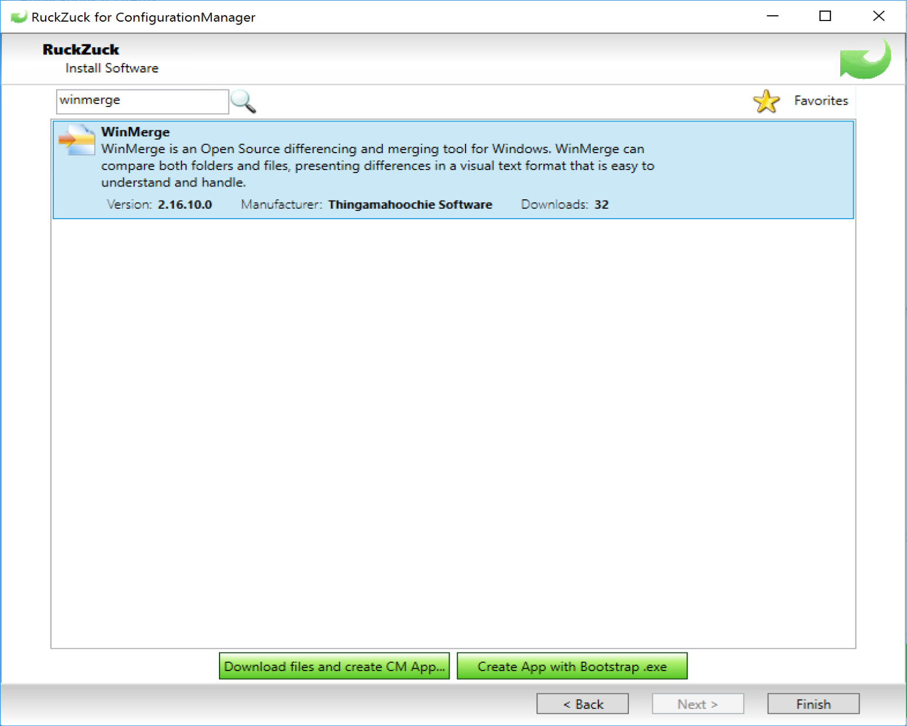
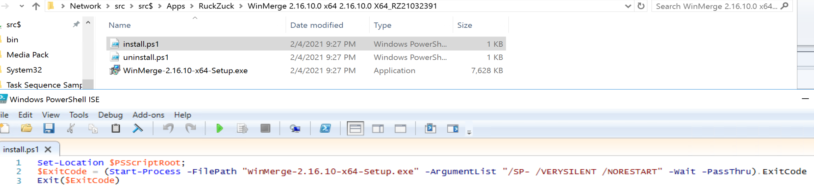
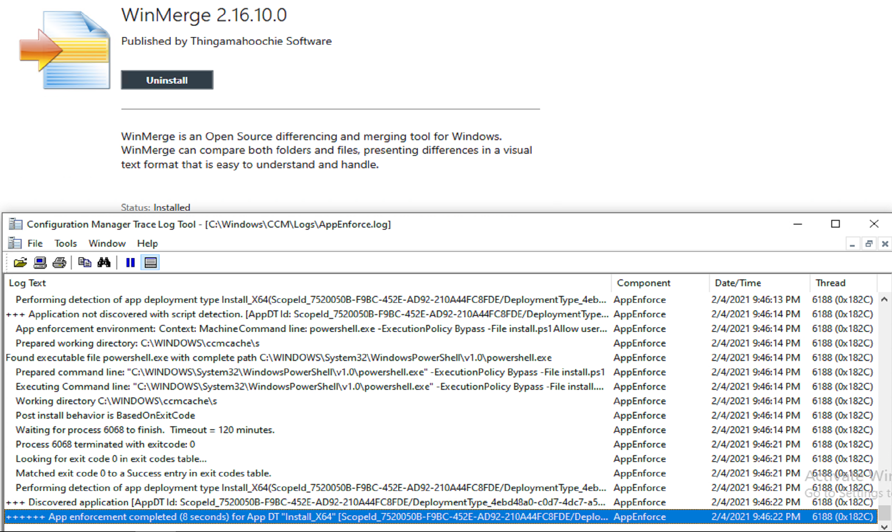

# RuckZuck

## Overview

[RuckZuck](https://ruckzuck.tools/) is a package manager for Windows.

The website has a link to a Wiki, which I used to help explain the config file, and a forum to get help from other users.  

I'm going to be focusing on the integration of this tool with Configuration Manager.

Basically, RuckZuck reaches out to software vendors and downloads the installers and does silent installs with a simple command line.

## Demo

This Demo will be using the ConfigMgr integration component and using it to populate applications into ConfigMgr.

### Installation of RuckZuck

I closed the CM Console

I downloaded the RuckZuck for CM, and ran the installer:

That is the ONLY dialog box you see, once you click install, you're done, it does what it needs to do and then pops up the Config File

I update a few things for my environment.  Since this is my lab, and my lab is simple, I've installed the software on my Single Primary Server.

In my lab, this is what I changed, so you'd need to adust for your lab. If you use this in your production, you'll want to go over each setting and confirm / change values, as these are fine for a lab, but not recommended for production.

### Adding apps to CM with RuckZuck

This is very simple as well, basically you're presented with a catalog, you pick what you want and click "go" basically...

  
Once I click on Install New Software, the next dialog opens with a list of categories of available applications:  
  
I decided to use the search feature, I have a need for WinMerge, lets see if it's here:  

Sweet, it's here, lets go ahead and "Download files and create CM App."
  
A new Dialog box (as shown above) opens and gives you progress as it creates the app in CM, downloads the content, creates the collection and deployment.  Below shows the console with all of the apps I've used RuckZuck to add tonight:
  
It distributed the content and created the deployment:

Lets look at the application:

It populates a lot of the fields in General information, and also the Software Center tab, along with a nice icon.

The Deployment Type is created for X64:  

Here it shows that it used my content locations that I set in the config file:

Then creates simple commands for install and uninstall:  

Content:

RuckZuck downloads the install, and creates two PowerShell files, one for install and one for uninstall.  

### Software Center - Endpoint Install Test

Most of the apps on the top row I just created with RuckZuck as I test this tool out:

When I look at the log, it all looks normal.  You can see the AppDT (Install_X64) installed.

> [!TIP]
> When I create Applications, I always have a descriptive AppDT Name so when I look in this log I know exactly what was installing.  Instead of Install_X64, I would have done WinMerge_i_X64, that's just a tip to easily find things in the logs.

## Test Drive

Click on the image to open in YouTube:

## Summary

This was very slick, so far the most easy way to get applications into CM.  There is another function that will update these apps when new versions come out, which I might have to look into in the future as new versions for these gets released.  I'll make sure I update this post with those results.

**About Recast Software**
1 in 3 organizations using Microsoft Configuration Manager rely on Right Click Tools to surface vulnerabilities and remediate quicker than ever before.  
[Download Free Tools](https://www.recastsoftware.com/?utm_source=cmdocs&utm_medium=referral&utm_campaign=cmdocs#formarea)  
[Request Pricing](https://www.recastsoftware.com/pricing?utm_source=cmdocs&utm_medium=referral&utm_campaign=cmdocs)
