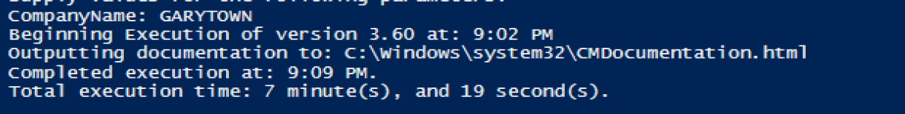

# Scripts

This page could be quite long, and thanks to GitHub, it will be impossible to keep up.  I too have started to publish a lot of my work on GitHub without blogging it or providing details, and so have many others.  I hope to try to keep links to GitHub repos that have ConfigMgr | intune | Workstation Management Scripts in them, so this page will grow overtime as I come across them in my wanderings.

## GitHub Repos | Blogs

- GitHub Link | Blog Link (if available)
- [Gary Blok](https://github.com/gwblok/garytown) | [GARYTOWN.com](https://garytown.com)
- [Paul Wetter](https://github.com/paulwetter) | [wetterssource.com](https://wetterssource.com/)
- [Noah Swanson](https://github.com/sombrerosheep) | [ndswanson.wordpress](https://ndswanson.wordpress.com/)
- [Adam Gross](https://github.com/AdamGrossTX) | [asquaredozen](https://www.asquaredozen.com/)
- [Ben Whitmore](https://github.com/byteben) | [byteben](https://byteben.com/)
- [Ioan Popovici](https://github.com/Ioan-Popovici) & [MEM-Zone](https://github.com/MEM-Zone) | [sccm-zone](https://sccm-zone.com/)
- [Damien Van Robaeys](https://github.com/damienvanrobaeys) | [systanddeploy](http://www.systanddeploy.com/)
- [Sune Thomsen](https://github.com/SuneThomsenDK) | [osdsune](https://www.osdsune.com/)
- [Paul Winstanley](https://github.com/sccmentor) | [sccmentor](https://sccmentor.com/)
- [Adam Cook](https://github.com/codaamok) | [adamcook.io](https://adamcook.io/)
- [Skatter brainzz](https://github.com/Skatterbrainz) | [skatterbrainz.wordpress](https://skatterbrainz.wordpress.com/)
- [Windows Admins Discord community](https://github.com/windows-admins) | [winadmins.io](https://winadmins.io/)
- [Cody Mathis](https://github.com/CodyMathis123)
- [Andrew Jimenez](https://github.com/asjimene)
- [Nathan Ziehnert](https://github.com/theznerd) | [z-nerd](https://z-nerd.com/)
- [MSEndpointMgr](https://github.com/MSEndpointMgr) | [MSEndpointMgr](https://msendpointmgr.com/)
- [Martin Bengtsson](https://github.com/imabdk) | [imab.dk](https://www.imab.dk/)
- [Aaron Parker](https://github.com/aaronparker) | [stealthpuppy](https://stealthpuppy.com/)
- [Insentra](https://github.com/Insentra) | [insentragroup](https://www.insentragroup.com/au/)
- [Eswar Koneti](https://github.com/eskonr) | [eskonr](http://eskonr.com/)
- [PowerShell App Deployment Toolkit](https://github.com/PSAppDeployToolkit) | [psappdeploytoolkit](https://psappdeploytoolkit.com/)
- [Daniel Ratliff](https://github.com/PotentEngineer) | [potentengineer](http://www.potentengineer.com/)
- [Mick Pletcher](https://github.com/MicksITBlogs) | [mickitblog.blogspot](https://mickitblog.blogspot.com/)
- [Jay Williams](https://github.com/portaldotjay)
- [Mattias Melkersen](https://github.com/mmelkersen) | [blog.mindcore.dk](https://blog.mindcore.dk/)
- [Trevor Jones](https://github.com/SMSAgentSoftware) | [smsagent.blog](https://smsagent.blog/)
- [Robert Marshall](https://github.com/RobUK101) | [configmgr.com](https://configmgr.com/)
- [Mike Marable](https://github.com/mmarable)
- [Ryan Ephgrave](https://github.com/Eph-It) | [ephingadmin](https://www.ephingadmin.com/)
- [Vagner Pilar](https://github.com/vagnerpilar)
- [Carl Luberti](https://github.com/cluberti)
- [Bruce Sa](https://github.com/brucesa85)
- [Benoit Lecours](https://github.com/prae1809) | [systemcenterdudes](https://systemcenterdudes.com/)
- [Johan Arwidmark](https://github.com/arwidmark) | [deploymentresearch.com](https://deploymentresearch.com/)
- [DeploymentArtist](https://github.com/DeploymentArtist) | [deploymentartist.com](https://deploymentartist.com/)
- [Nicolas Lacour](https://github.com/Diagg) | [osd-couture](https://www.osd-couture.com/)
- [TCOX8 - OSDReporting](https://github.com/tcox8/OSD-Reporting)
- [Jonathan Lefebvre-Globensky](https://github.com/JonathanLefebvreGlobensky/) | [systemcenterdudes](https://systemcenterdudes.com/)
- [Niall C. Brady](https://github.com/NCBrady) | [Windows Noob](https://www.windows-noob.com/forums/portal/) | [Niall Brady](https://www.niallbrady.com/)
- [Tobias Almen](https://github.com/almenscorner) | [almen's MEM corner](https://almenscorner.io/)
- [Sjoukje Zaal](https://github.com/SjoukjeZaal/) | [sjoukjezaal.com](https://sjoukjezaal.com/)
- [Daniel Engberg](https://github.com/danielclasson) | [danielengberg.com](https://www.danielengberg.com/)
- [Jon Anderson](https://github.com/ConfigJon) | [Jon's Notes](https://www.configjon.com/)
- [Katy Nicholson](https://github.com/CoasterKaty) | [katystech.blog](https://katystech.blog/)

**Youtube Channels**

- [Recast Software](https://www.youtube.com/channel/UC49H48aLBcIDBJPP6iOC9xA)
- [PatchMyPC](https://www.youtube.com/channel/UCT9BKiLpbO1pGxXsU1-_zBg)
- [The MEM Xperience](https://www.youtube.com/channel/UC9Y0iEK0sr2zzmYieYvhtgw)
- [Labs Hands On](https://www.youtube.com/channel/UCP2uPp7TUXwJCicB0byzDnQ)
- [MMS](https://www.youtube.com/channel/UCdLyCpZOXHLEU90qE3HzzNQ)
- [Intune Training](https://www.youtube.com/channel/UCfmMlhX5TW8cicxHw6ExYVA)
- [Namaste Techies](https://www.youtube.com/channel/UCDh5BKN1TDQBOirb_PA6fFg/featured)
- [Mike Tholfsen's quick tips video channel on Microsoft products](https://www.youtube.com/channel/UC2dSE9W3lGYbFi_CPmVtA-A)

So that list can be overwhelming, but if you ever find yourself with a few extra minutes, instead of checking out Facebook, or looking at how your stocks are doing, check out another GitHub repo, click around, and see if you find something you could use, or something that sparks an idea for you to build off to improve your work life.

## Highlights

As I looked though these repos, I sampled some things that stood out and recorded my findings on just a few.

### ConfigMgr Documentation Script

I checked out a few myself and I wanted to call attention to some, the first one is Paul's CM Documentation Script, I thought I'd run it and share the results:

I copied the Code from the GitHub into PowerShell ISE on my Primary Server, and clicked Play:

#### ConfigMgr Documentation Script Summary

There was so much great info, I can't share it all, just too much... so I highly recommend checking this one out.  I'd recommend a yearly self-audit of your CM system, maybe around a slow part of your year, run it, audit it and look for things that could be cleaned up, or things that you just didn't realize where setup and should probably change.

### [ConfigMgr Task Sequence | BootImages to Excel](https://github.com/gwblok/garytown/tree/master/TaskSequenceSteps2Excel)

#### **Task Sequence Script**

This is basically just like it sounds, you run the scripts, provide a Task Sequence Name and it builds and Excel document.

Requires the CM Console & Excel on the machine you're running the script.

Running the Script:  

General Tab:  

References Tab:  

Step Tab:

#### **Boot Image Script**

#### ConfigMgr Task Sequence Step to Excel Summary

Feel free to make requests and I'll see if I can get it updated.  Thanks to Gregory Bouchu & Nathan Ziehnert for code to help make it possible

**About Recast Software**
1 in 3 organizations using Microsoft Configuration Manager rely on Right Click Tools to surface vulnerabilities and remediate quicker than ever before.  
[Download Free Tools](https://www.recastsoftware.com/?utm_source=cmdocs&utm_medium=referral&utm_campaign=cmdocs#formarea)  
[Request Pricing](https://www.recastsoftware.com/pricing?utm_source=cmdocs&utm_medium=referral&utm_campaign=cmdocs)
