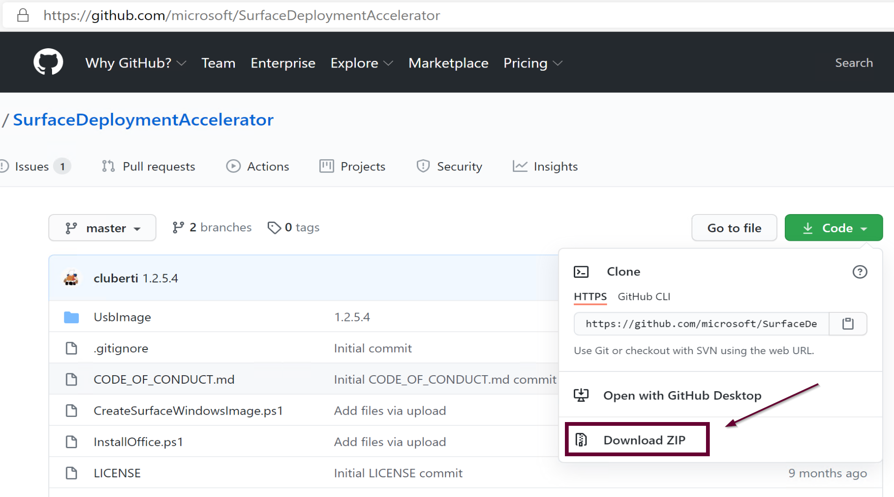
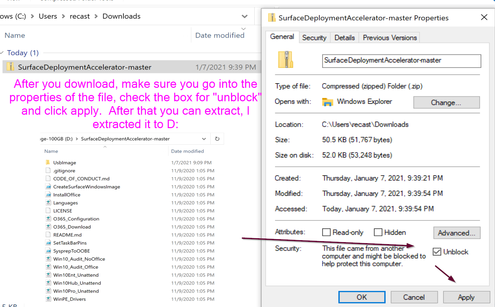
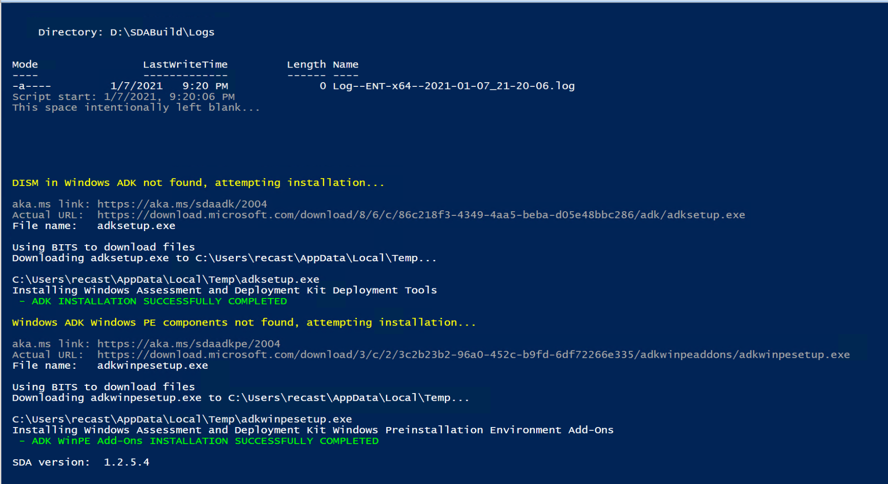
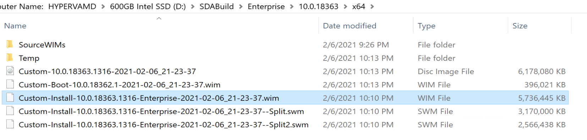
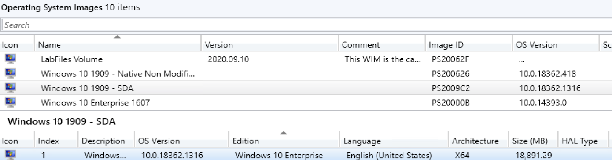
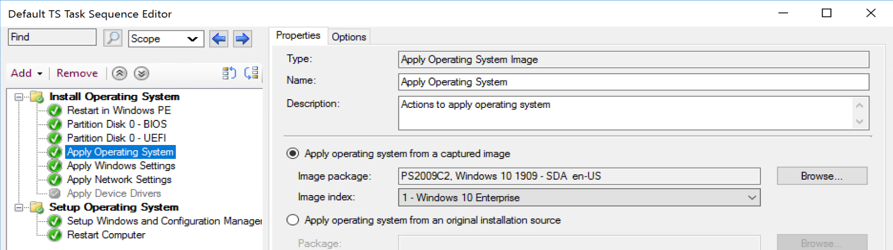
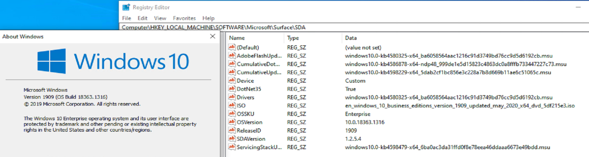
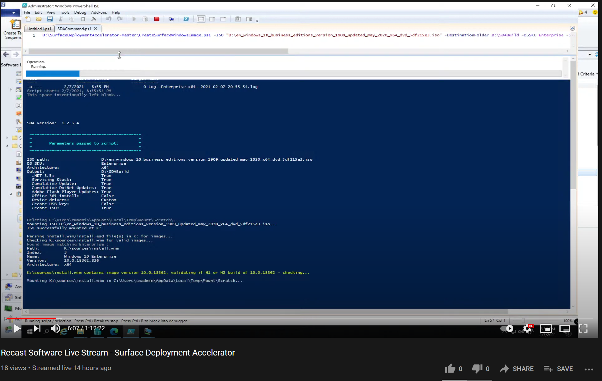
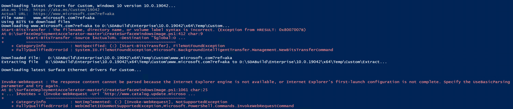

# Surface Deployment Accelerator

## Overview

[Surface Deployment Accelerator (SDA)](https://github.com/microsoft/SurfaceDeploymentAccelerator/) is a PowerShell command line tool to create Images for Surface Devices... or anything that installs Windows.

## Demo Pre-Reqs

- Demo Machine
  - At least 40GB Free for Demo
  - Local Admin Access
  - Internet Access
  - **Windows 10 2004 or Newer**
    - if you don't you'll have problems, trust me
  - **Internet Explorer** must be installed on the device used to create images, and **first run wizard must be completed** (you must successfully start Internet Explorer once) or file downloads may fail.
    - if you don't you'll have problems, trust me
- Windows Media ISO you wish to create serviced media from.

## Demo - Simple Servicing of Windows 10 VLSC Media

In this Demo, I'll be using the Folder D:\SDABuild as my Destination directory

### Install Script

You'll need to download the Project from GitHub, then unblock and copy the contents to your storage location:

[](media/SDA00.png)
After you download, open the properies and check the box to unblock the file.  Then extract it where you want to run it from:  
[](media/SDA00a.png)

### Running SDA

In this example, I'm going to point to the ISO I want to be used for my base media, then pass several other parameters to give me the outcome I want.

```PowerShell
D:\SurfaceDeploymentAccelerator-master\CreateSurfaceWindowsImage.ps1 -ISO "D:\en_windows_10_business_editions_version_1909_updated_may_2020_x64_dvd_5df215e3.iso" -DestinationFolder D:\SDABuild -OSSKU Enterprise -ServicingStack:$true -CumulativeUpdate:$true -CumulativeDotNetUpdate:$true -Architecture x64 -AdobeFlashUpdate:$true -Device Custom -DotNet35:$true -Office365:$false -CreateUSB:$false -CreateISO:$true
```

SDA requires ADK being installed, if you don't it does it for you:

[](media/SDA01.png)

### PowerShell Output

Instead of taking a pile of screen shots, I'm pasting in the output, which will show you all the things it does, which is updating the WIM, and this process took 51 Minutes to update the 1909 Media.

``` output
    Directory: D:\SDABuild\Logs


Mode                LastWriteTime         Length Name                                                                                                                                                                   
----                -------------         ------ ----                                                                                                                                                                   
-a----         2/6/2021  12:40 PM              0 Log--Enterprise-x64--2021-02-06_12-40-35.log                                                                                                                           
Script start: 2/6/2021, 12:40:35 PM
This space intentionally left blank...


SDA version:  1.2.5.4
 
 
 *********************************************
 *                                           *
 *       Parameters passed to script:        *
 *                                           *
 *********************************************
 
ISO path:                     D:\en_windows_10_business_editions_version_1909_updated_may_2020_x64_dvd_5df215e3.iso
OS SKU:                       Enterprise
Architecture:                 x64
Output:                       D:\SDABuild
  .NET 3.5:                   True
  Servicing Stack:            True
  Cumulative Update:          True
  Cumulative DotNet Updates:  True
  Adobe Flash Player Updates: True
  Office 365 install:         False
  Device drivers:             Custom
  Create USB key:             False
  Create ISO:                 True
 
 
Deleting C:\Users\cmadmin\AppData\Local\Temp\Mount\Scratch\...
Mounting ISO D:\en_windows_10_business_editions_version_1909_updated_may_2020_x64_dvd_5df215e3.iso...
ISO successfully mounted at K:

Parsing install.wim/install.esd file(s) in K: for images...
Checking K:\sources\install.wim for valid images...
Found image matching Enterprise :
Path:          K:\sources\install.wim
Index:         3
Name:          Windows 10 Enterprise
Version:       10.0.18362.836
Architecture:  x64

K:\sources\install.wim contains image version 10.0.18362, validating if H1 or H2 build of 10.0.18362 - checking...

Mounting K:\sources\install.wim in C:\Users\cmadmin\AppData\Local\Temp\Mount\Scratch...
Querying image registry for ReleaseId...
The operation completed successfully.

Unloading image registry...
The operation completed successfully.

Dismounting C:\Users\cmadmin\AppData\Local\Temp\Mount\Scratch...

Copying C:\Program Files (x86)\Windows Kits\10\Assessment and Deployment Kit\Windows Preinstallation Environment\amd64\en-us\winpe.wim to D:\SDABuild\Enterprise\10.0.18363\x64\SourceWIMs\boot.wim...
Copying K:\Sources\sxs\* to D:\SDABuild\Enterprise\10.0.18363\x64\Temp\sxs\...
Copying K:\sources\install.wim to D:\SDABuild\Enterprise\10.0.18363\x64\SourceWIMs\install.wim...

OSVersion:  10.0.18363
ReleaseId:  1909

Deleting C:\Users\cmadmin\AppData\Local\Temp\Mount\OSImage\...
Deleting C:\Users\cmadmin\AppData\Local\Temp\Mount\BootImage\...
Deleting C:\Users\cmadmin\AppData\Local\Temp\Mount\WinREImage\...


Surface device not specified. Skipping driver download.


Downloading latest VisualC++ Runtimes...
aka.ms link: https://aka.ms/vcpp2013x86
Actual URL:  https://download.visualstudio.microsoft.com/download/pr/10912113/5da66ddebb0ad32ebd4b922fd82e8e25/vcredist_x86.exe
File name:   vcredist_x86.exe
Using BITS to download files
Downloading vcredist_x86.exe to D:\SDABuild\Enterprise\10.0.18363\x64\Temp\VCRuntimes\2013...
Downloaded File:   D:\SDABuild\Enterprise\10.0.18363\x64\Temp\VCRuntimes\2013\vcredist_x86.exe

aka.ms link: https://aka.ms/vcpp2013x64
Actual URL:  https://download.visualstudio.microsoft.com/download/pr/10912041/cee5d6bca2ddbcd039da727bf4acb48a/vcredist_x64.exe
File name:   vcredist_x64.exe
Using BITS to download files
Downloading vcredist_x64.exe to D:\SDABuild\Enterprise\10.0.18363\x64\Temp\VCRuntimes\2013...
Downloaded File:   D:\SDABuild\Enterprise\10.0.18363\x64\Temp\VCRuntimes\2013\vcredist_x64.exe

aka.ms link: https://aka.ms/vcpp2019x86
Actual URL:  https://download.visualstudio.microsoft.com/download/pr/8c211be1-c537-4402-82e7-a8fb5ee05e8a/AC96016F1511AE3EB5EC9DE04551146FE351B7F97858DCD67163912E2302F5D6/VC_redist.x86.exe
File name:   VC_redist.x86.exe
Using BITS to download files
Downloading VC_redist.x86.exe to D:\SDABuild\Enterprise\10.0.18363\x64\Temp\VCRuntimes\2019...
Downloaded File:   D:\SDABuild\Enterprise\10.0.18363\x64\Temp\VCRuntimes\2019\VC_redist.x86.exe

aka.ms link: https://aka.ms/vcpp2019x64
Actual URL:  https://download.visualstudio.microsoft.com/download/pr/8c211be1-c537-4402-82e7-a8fb5ee05e8a/B6C82087A2C443DB859FDBEAAE7F46244D06C3F2A7F71C35E50358066253DE52/VC_redist.x64.exe
File name:   VC_redist.x64.exe
Using BITS to download files
Downloading VC_redist.x64.exe to D:\SDABuild\Enterprise\10.0.18363\x64\Temp\VCRuntimes\2019...
Downloaded File:   D:\SDABuild\Enterprise\10.0.18363\x64\Temp\VCRuntimes\2019\VC_redist.x64.exe

Downloading latest Servicing Stack update for 10.0.18363...
Attempting to find and download Servicing Stack updates for x64 Windows 10 version 1909 for month 2021-02...
No update found for month (2021-02) - attempting previous month (2021-01)...
Download found:
2021-01 Servicing Stack Update for Windows 10 Version 1909 for x64-based Systems (KB4598479)


Actual URL:  http://download.windowsupdate.com/c/msdownload/update/software/secu/2021/01/windows10.0-kb4598479-x64_6ba0ac3da31ffd0f8e78eea46ddaaa6673e49bdd.msu
File name:   windows10.0-kb4598479-x64_6ba0ac3da31ffd0f8e78eea46ddaaa6673e49bdd.msu

Using BITS to download files
Downloading windows10.0-kb4598479-x64_6ba0ac3da31ffd0f8e78eea46ddaaa6673e49bdd.msu to D:\SDABuild\Enterprise\10.0.18363\x64\Temp\Servicing...

D:\SDABuild\Enterprise\10.0.18363\x64\Temp\Servicing\windows10.0-kb4598479-x64_6ba0ac3da31ffd0f8e78eea46ddaaa6673e49bdd.msu


Downloading latest Cumulative Update for 10.0.18363...
Attempting to find and download Cumulative Update updates for x64 Windows 10 version 1909 for month 2021-02...
No update found for month (2021-02) - attempting previous month (2021-01)...
Download found:
2021-01 Cumulative Update for Windows 10 Version 1909 for x64-based Systems (KB4598229)


Actual URL:  http://download.windowsupdate.com/d/msdownload/update/software/secu/2021/01/windows10.0-kb4598229-x64_5dab2cf1bc856e3c228a7b8d669b11ae6c51065c.msu
File name:   windows10.0-kb4598229-x64_5dab2cf1bc856e3c228a7b8d669b11ae6c51065c.msu

Using BITS to download files
Downloading windows10.0-kb4598229-x64_5dab2cf1bc856e3c228a7b8d669b11ae6c51065c.msu to D:\SDABuild\Enterprise\10.0.18363\x64\Temp\Cumulative...

D:\SDABuild\Enterprise\10.0.18363\x64\Temp\Cumulative\windows10.0-kb4598229-x64_5dab2cf1bc856e3c228a7b8d669b11ae6c51065c.msu


Downloading latest Dot Net Cumulative updates for 10.0.18363...
Attempting to find and download Cumulative .NET Framework Update updates for x64 Windows 10 version 1909 for month 2021-02...
No update found for month (2021-02) - attempting previous month (2021-01)...
Download found:
2021-01 Cumulative Update for .NET Framework 3.5 and 4.8 for Windows 10 Version 1909 for x64 (KB4586878)


Actual URL:  http://download.windowsupdate.com/d/msdownload/update/software/updt/2020/11/windows10.0-kb4586878-x64-ndp48_999de1e5d15823c4863dc0a8fffb733447227c73.msu
File name:   windows10.0-kb4586878-x64-ndp48_999de1e5d15823c4863dc0a8fffb733447227c73.msu

Using BITS to download files
Downloading windows10.0-kb4586878-x64-ndp48_999de1e5d15823c4863dc0a8fffb733447227c73.msu to D:\SDABuild\Enterprise\10.0.18363\x64\Temp\DotNet...

D:\SDABuild\Enterprise\10.0.18363\x64\Temp\DotNet\windows10.0-kb4586878-x64-ndp48_999de1e5d15823c4863dc0a8fffb733447227c73.msu


Downloading latest Adobe Flash update for 10.0.18363...
Attempting to find and download Adobe Flash Player updates for x64 Windows 10 version 1909 for month 2021-02...
No update found for month (2021-02) - attempting previous month (2021-01)...
No update found for month (2021-01) - attempting previous month (2020-12)...
No update found for month (2020-12) - attempting previous month (2020-11)...
No update found for month (2020-11) - attempting previous month (2020-10)...
Download found:
2020-10 Security Update for Adobe Flash Player for Windows 10 Version 1909 for x64-based Systems (KB4580325)


Actual URL:  http://download.windowsupdate.com/d/msdownload/update/software/secu/2020/10/windows10.0-kb4580325-x64_ba6058564aac1216c91d3749bd76cc9d5d6192cb.msu
File name:   windows10.0-kb4580325-x64_ba6058564aac1216c91d3749bd76cc9d5d6192cb.msu

Using BITS to download files
Downloading windows10.0-kb4580325-x64_ba6058564aac1216c91d3749bd76cc9d5d6192cb.msu to D:\SDABuild\Enterprise\10.0.18363\x64\Temp\Adobe...

D:\SDABuild\Enterprise\10.0.18363\x64\Temp\Adobe\windows10.0-kb4580325-x64_ba6058564aac1216c91d3749bd76cc9d5d6192cb.msu


 
 
 *********************************************
 *                                           *
 *           Updating install.wim            *
 *                                           *
 *********************************************
 
 
Exporting D:\SDABuild\Enterprise\10.0.18363\x64\SourceWIMs\install.wim to D:\SDABuild\Enterprise\10.0.18363\x64\Temp\tmp_install.wim...

ImagePath        : D:\SDABuild\Enterprise\10.0.18363\x64\Temp\tmp_install.wim
Name             : 
LogPath          : C:\Windows\Logs\DISM\dism.log
ScratchDirectory : C:\Windows\temp\
LogLevel         : WarningsInfo


Mounting D:\SDABuild\Enterprise\10.0.18363\x64\Temp\tmp_install.wim in C:\Users\cmadmin\AppData\Local\Temp\Mount\OSImage...

Path   : C:\Users\cmadmin\AppData\Local\Temp\Mount\OSImage
Online : False


Running image cleanup on C:\Users\cmadmin\AppData\Local\Temp\Mount\OSImage...

Deployment Image Servicing and Management tool
Version: 10.0.18362.1

Image Version: 10.0.18363.836


[=====                      10.0%                          ] 

[===========                19.0%                          ] 

[===========                20.0%                          ] 

[===========                20.0%                          ] 
The operation completed successfully.


Saving D:\SDABuild\Enterprise\10.0.18363\x64\Temp\tmp_install.wim...

LogPath          : C:\Windows\Logs\DISM\dism.log
ScratchDirectory : 
LogLevel         : WarningsInfo


Mounting D:\SDABuild\Enterprise\10.0.18363\x64\Temp\tmp_install.wim in C:\Users\cmadmin\AppData\Local\Temp\Mount\OSImage...

Path   : C:\Users\cmadmin\AppData\Local\Temp\Mount\OSImage
Online : False


Adding .NET Framework 3.5 to C:\Users\cmadmin\AppData\Local\Temp\Mount\OSImage...

Path   : C:\Users\cmadmin\AppData\Local\Temp\Mount\OSImage
Online : False


Adding Servicing Stack updates to C:\Users\cmadmin\AppData\Local\Temp\Mount\OSImage...

Path   : C:\Users\cmadmin\AppData\Local\Temp\Mount\OSImage
Online : False


Saving D:\SDABuild\Enterprise\10.0.18363\x64\Temp\tmp_install.wim...

LogPath          : C:\Windows\Logs\DISM\dism.log
ScratchDirectory : 
LogLevel         : WarningsInfo


Mounting D:\SDABuild\Enterprise\10.0.18363\x64\Temp\tmp_install.wim in C:\Users\cmadmin\AppData\Local\Temp\Mount\OSImage...

Path   : C:\Users\cmadmin\AppData\Local\Temp\Mount\OSImage
Online : False


Adding Cumulative updates to C:\Users\cmadmin\AppData\Local\Temp\Mount\OSImage...

Path   : C:\Users\cmadmin\AppData\Local\Temp\Mount\OSImage
Online : False


Adding Cumulative .NET updates to C:\Users\cmadmin\AppData\Local\Temp\Mount\OSImage...

Path   : C:\Users\cmadmin\AppData\Local\Temp\Mount\OSImage
Online : False


Adding Adobe Flash updates to C:\Users\cmadmin\AppData\Local\Temp\Mount\OSImage...

Path   : C:\Users\cmadmin\AppData\Local\Temp\Mount\OSImage
Online : False


Adding Driver updates for Custom to C:\Users\cmadmin\AppData\Local\Temp\Mount\OSImage from D:\SDABuild\Enterprise\10.0.18363\x64\Temp\Custom...
Add-WindowsDriver : Driver file or path not found
At D:\SurfaceDeploymentAccelerator-master\CreateSurfaceWindowsImage.ps1:2613 char:13
+             Add-WindowsDriver -Path $ImageMountFolder -Driver "$Devic ...
+             ~~~~~~~~~~~~~~~~~~~~~~~~~~~~~~~~~~~~~~~~~~~~~~~~~~~~~~~~~
    + CategoryInfo          : NotSpecified: (:) [Add-WindowsDriver], FileNotFoundException
    + FullyQualifiedErrorId : Add-WindowsDriver,Microsoft.Dism.Commands.AddWindowsDriverCommand
 


Copying VC++ Runtime binaries to C:\Users\cmadmin\AppData\Local\Temp\Mount\OSImage\Windows\Temp...

Copying files to disk for unattended installation...

 
 
 *********************************************
 *                                           *
 *           Updating winre.wim              *
 *                                           *
 *********************************************
 
 
Copying WinRE image to D:\SDABuild\Enterprise\10.0.18363\x64\Temp\tmp_winre.wim...


Mounting D:\SDABuild\Enterprise\10.0.18363\x64\Temp\tmp_winre.wim to C:\Users\cmadmin\AppData\Local\Temp\Mount\WinREImage...

Path   : C:\Users\cmadmin\AppData\Local\Temp\Mount\WinREImage
Online : False


Adding Servicing Stack updates to C:\Users\cmadmin\AppData\Local\Temp\Mount\WinREImage...

Path   : C:\Users\cmadmin\AppData\Local\Temp\Mount\WinREImage
Online : False


Saving D:\SDABuild\Enterprise\10.0.18363\x64\Temp\tmp_winre.wim...

LogPath          : C:\Windows\Logs\DISM\dism.log
ScratchDirectory : 
LogLevel         : WarningsInfo


Mounting D:\SDABuild\Enterprise\10.0.18363\x64\Temp\tmp_winre.wim in C:\Users\cmadmin\AppData\Local\Temp\Mount\WinREImage...

Path   : C:\Users\cmadmin\AppData\Local\Temp\Mount\WinREImage
Online : False


Adding Cumulative updates to C:\Users\cmadmin\AppData\Local\Temp\Mount\WinREImage...

Path   : C:\Users\cmadmin\AppData\Local\Temp\Mount\WinREImage
Online : False


Running image cleanup on D:\SDABuild\Enterprise\10.0.18363\x64\Temp\tmp_winre.wim...

Deployment Image Servicing and Management tool
Version: 10.0.18362.1

Image Version: 10.0.18362.1


[=====                      10.0%                          ] 

[===========                19.0%                          ] 

[===========                20.0%                          ] 

[===========                20.0%                          ] 

[===========                20.0%                          ] 

[===========                20.0%                          ] 

[===========                20.0%                          ] 

[===========                20.0%                          ] 

[===========                20.0%                          ] 

[===========================60.0%==                        ] 
The operation completed successfully.


Saving D:\SDABuild\Enterprise\10.0.18363\x64\Temp\tmp_winre.wim...

LogPath          : C:\Windows\Logs\DISM\dism.log
ScratchDirectory : 
LogLevel         : WarningsInfo


 
 
 *********************************************
 *                                           *
 *            Saving winre.wim               *
 *                                           *
 *********************************************
 
 
Exporting D:\SDABuild\Enterprise\10.0.18363\x64\Temp\tmp_winre.wim to C:\Users\cmadmin\AppData\Local\Temp\Mount\OSImage\Windows\System32\Recovery\winre.wim...

ImagePath        : C:\Users\cmadmin\AppData\Local\Temp\Mount\OSImage\Windows\System32\Recovery\winre.wim
Name             : 
LogPath          : C:\Windows\Logs\DISM\dism.log
ScratchDirectory : C:\Windows\temp\
LogLevel         : WarningsInfo


 
 
 *********************************************
 *                                           *
 *            Saving install.wim             *
 *                                           *
 *********************************************
 
 
Adding registry tattoo...

The operation completed successfully.

The operation completed successfully.

Saving D:\SDABuild\Enterprise\10.0.18363\x64\Temp\tmp_install.wim...

LogPath          : C:\Windows\Logs\DISM\dism.log
ScratchDirectory : 
LogLevel         : WarningsInfo


Exporting D:\SDABuild\Enterprise\10.0.18363\x64\Temp\tmp_install.wim to D:\SDABuild\Enterprise\10.0.18363\x64\Custom-Install-10.0.18363.1316-Enterprise-2021-02-06_12-40-35.wim...

ImagePath        : D:\SDABuild\Enterprise\10.0.18363\x64\Custom-Install-10.0.18363.1316-Enterprise-2021-02-06_12-40-35.wim
Name             : 
LogPath          : C:\Windows\Logs\DISM\dism.log
ScratchDirectory : C:\Windows\temp\
LogLevel         : WarningsInfo


Splitting D:\SDABuild\Enterprise\10.0.18363\x64\Custom-Install-10.0.18363.1316-Enterprise-2021-02-06_12-40-35.wim into 3GB files as D:\SDABuild\Enterprise\10.0.18363\x64\Custom-Install-10.0.18363.1316-Enterprise-2021-
02-06_12-40-35--Split.swm...

ImagePath        : D:\SDABuild\Enterprise\10.0.18363\x64\Custom-Install-10.0.18363.1316-Enterprise-2021-02-06_12-40-35.wim
Name             : 
LogPath          : C:\Windows\Logs\DISM\dism.log
ScratchDirectory : C:\Windows\temp\
LogLevel         : WarningsInfo


 
 
 *********************************************
 *                                           *
 *           Updating boot.wim               *
 *                                           *
 *********************************************
 
 
Copying D:\SDABuild\Enterprise\10.0.18363\x64\SourceWIMs\boot.wim to D:\SDABuild\Enterprise\10.0.18363\x64\Temp\tmp_boot.wim...


Mounting D:\SDABuild\Enterprise\10.0.18363\x64\Temp\tmp_boot.wim to C:\Users\cmadmin\AppData\Local\Temp\Mount\BootImage using Index 1...

Path   : C:\Users\cmadmin\AppData\Local\Temp\Mount\BootImage
Online : False


Adding WMI...
Adding PE Scripting...
Adding Enhanced Storage...
Adding Bitlocker support...
Adding .NET...
Adding PowerShell...
Adding Storage WMI...
Adding DISM support...
Adding Secure Boot support...
Adding Secure Startup support...
Adding WinRE support...
Copying scripts to C:\Users\cmadmin\AppData\Local\Temp\Mount\BootImage...


 
 
 *********************************************
 *                                           *
 *            Saving boot.wim                *
 *                                           *
 *********************************************
 
 
Saving D:\SDABuild\Enterprise\10.0.18363\x64\Temp\tmp_boot.wim...

LogPath          : C:\Windows\Logs\DISM\dism.log
ScratchDirectory : 
LogLevel         : WarningsInfo


Exporting D:\SDABuild\Enterprise\10.0.18363\x64\Temp\tmp_boot.wim to D:\SDABuild\Enterprise\10.0.18363\x64\Custom-Boot-10.0.18362.1-2021-02-06_12-40-35.wim...

ImagePath        : D:\SDABuild\Enterprise\10.0.18363\x64\Custom-Boot-10.0.18362.1-2021-02-06_12-40-35.wim
Name             : 
LogPath          : C:\Windows\Logs\DISM\dism.log
ScratchDirectory : C:\Windows\temp\
LogLevel         : WarningsInfo


Creating WinPE media in D:\SDABuild\Enterprise\10.0.18363\x64\Temp\Media...
C:\Program Files (x86)\Windows Kits\10\Assessment and Deployment Kit\Windows Preinstallation Environment\amd64\Media\bootmgr
C:\Program Files (x86)\Windows Kits\10\Assessment and Deployment Kit\Windows Preinstallation Environment\amd64\Media\bootmgr.efi
C:\Program Files (x86)\Windows Kits\10\Assessment and Deployment Kit\Windows Preinstallation Environment\amd64\Media\bg-bg\bootmgr.efi.mui
C:\Program Files (x86)\Windows Kits\10\Assessment and Deployment Kit\Windows Preinstallation Environment\amd64\Media\Boot\BCD
C:\Program Files (x86)\Windows Kits\10\Assessment and Deployment Kit\Windows Preinstallation Environment\amd64\Media\Boot\boot.sdi
C:\Program Files (x86)\Windows Kits\10\Assessment and Deployment Kit\Windows Preinstallation Environment\amd64\Media\Boot\bootfix.bin
C:\Program Files (x86)\Windows Kits\10\Assessment and Deployment Kit\Windows Preinstallation Environment\amd64\Media\Boot\memtest.exe
C:\Program Files (x86)\Windows Kits\10\Assessment and Deployment Kit\Windows Preinstallation Environment\amd64\Media\Boot\bg-bg\bootmgr.exe.mui
C:\Program Files (x86)\Windows Kits\10\Assessment and Deployment Kit\Windows Preinstallation Environment\amd64\Media\Boot\cs-cz\bootmgr.exe.mui
C:\Program Files (x86)\Windows Kits\10\Assessment and Deployment Kit\Windows Preinstallation Environment\amd64\Media\Boot\cs-cz\memtest.exe.mui
C:\Program Files (x86)\Windows Kits\10\Assessment and Deployment Kit\Windows Preinstallation Environment\amd64\Media\Boot\da-dk\bootmgr.exe.mui
C:\Program Files (x86)\Windows Kits\10\Assessment and Deployment Kit\Windows Preinstallation Environment\amd64\Media\Boot\da-dk\memtest.exe.mui
C:\Program Files (x86)\Windows Kits\10\Assessment and Deployment Kit\Windows Preinstallation Environment\amd64\Media\Boot\de-de\bootmgr.exe.mui
C:\Program Files (x86)\Windows Kits\10\Assessment and Deployment Kit\Windows Preinstallation Environment\amd64\Media\Boot\de-de\memtest.exe.mui
C:\Program Files (x86)\Windows Kits\10\Assessment and Deployment Kit\Windows Preinstallation Environment\amd64\Media\Boot\el-gr\bootmgr.exe.mui
C:\Program Files (x86)\Windows Kits\10\Assessment and Deployment Kit\Windows Preinstallation Environment\amd64\Media\Boot\el-gr\memtest.exe.mui
C:\Program Files (x86)\Windows Kits\10\Assessment and Deployment Kit\Windows Preinstallation Environment\amd64\Media\Boot\en-gb\bootmgr.exe.mui
C:\Program Files (x86)\Windows Kits\10\Assessment and Deployment Kit\Windows Preinstallation Environment\amd64\Media\Boot\en-us\bootmgr.exe.mui
C:\Program Files (x86)\Windows Kits\10\Assessment and Deployment Kit\Windows Preinstallation Environment\amd64\Media\Boot\en-us\memtest.exe.mui
C:\Program Files (x86)\Windows Kits\10\Assessment and Deployment Kit\Windows Preinstallation Environment\amd64\Media\Boot\es-es\bootmgr.exe.mui
C:\Program Files (x86)\Windows Kits\10\Assessment and Deployment Kit\Windows Preinstallation Environment\amd64\Media\Boot\es-es\memtest.exe.mui
C:\Program Files (x86)\Windows Kits\10\Assessment and Deployment Kit\Windows Preinstallation Environment\amd64\Media\Boot\es-mx\bootmgr.exe.mui
C:\Program Files (x86)\Windows Kits\10\Assessment and Deployment Kit\Windows Preinstallation Environment\amd64\Media\Boot\et-ee\bootmgr.exe.mui
C:\Program Files (x86)\Windows Kits\10\Assessment and Deployment Kit\Windows Preinstallation Environment\amd64\Media\Boot\fi-fi\bootmgr.exe.mui
C:\Program Files (x86)\Windows Kits\10\Assessment and Deployment Kit\Windows Preinstallation Environment\amd64\Media\Boot\fi-fi\memtest.exe.mui
C:\Program Files (x86)\Windows Kits\10\Assessment and Deployment Kit\Windows Preinstallation Environment\amd64\Media\Boot\Fonts\chs_boot.ttf
C:\Program Files (x86)\Windows Kits\10\Assessment and Deployment Kit\Windows Preinstallation Environment\amd64\Media\Boot\Fonts\cht_boot.ttf
C:\Program Files (x86)\Windows Kits\10\Assessment and Deployment Kit\Windows Preinstallation Environment\amd64\Media\Boot\Fonts\jpn_boot.ttf
C:\Program Files (x86)\Windows Kits\10\Assessment and Deployment Kit\Windows Preinstallation Environment\amd64\Media\Boot\Fonts\kor_boot.ttf
C:\Program Files (x86)\Windows Kits\10\Assessment and Deployment Kit\Windows Preinstallation Environment\amd64\Media\Boot\Fonts\malgunn_boot.ttf
C:\Program Files (x86)\Windows Kits\10\Assessment and Deployment Kit\Windows Preinstallation Environment\amd64\Media\Boot\Fonts\malgun_boot.ttf
C:\Program Files (x86)\Windows Kits\10\Assessment and Deployment Kit\Windows Preinstallation Environment\amd64\Media\Boot\Fonts\meiryon_boot.ttf
C:\Program Files (x86)\Windows Kits\10\Assessment and Deployment Kit\Windows Preinstallation Environment\amd64\Media\Boot\Fonts\meiryo_boot.ttf
C:\Program Files (x86)\Windows Kits\10\Assessment and Deployment Kit\Windows Preinstallation Environment\amd64\Media\Boot\Fonts\msjhn_boot.ttf
C:\Program Files (x86)\Windows Kits\10\Assessment and Deployment Kit\Windows Preinstallation Environment\amd64\Media\Boot\Fonts\msjh_boot.ttf
C:\Program Files (x86)\Windows Kits\10\Assessment and Deployment Kit\Windows Preinstallation Environment\amd64\Media\Boot\Fonts\msyhn_boot.ttf
C:\Program Files (x86)\Windows Kits\10\Assessment and Deployment Kit\Windows Preinstallation Environment\amd64\Media\Boot\Fonts\msyh_boot.ttf
C:\Program Files (x86)\Windows Kits\10\Assessment and Deployment Kit\Windows Preinstallation Environment\amd64\Media\Boot\Fonts\segmono_boot.ttf
C:\Program Files (x86)\Windows Kits\10\Assessment and Deployment Kit\Windows Preinstallation Environment\amd64\Media\Boot\Fonts\segoen_slboot.ttf
C:\Program Files (x86)\Windows Kits\10\Assessment and Deployment Kit\Windows Preinstallation Environment\amd64\Media\Boot\Fonts\segoe_slboot.ttf
C:\Program Files (x86)\Windows Kits\10\Assessment and Deployment Kit\Windows Preinstallation Environment\amd64\Media\Boot\Fonts\wgl4_boot.ttf
C:\Program Files (x86)\Windows Kits\10\Assessment and Deployment Kit\Windows Preinstallation Environment\amd64\Media\Boot\fr-ca\bootmgr.exe.mui
C:\Program Files (x86)\Windows Kits\10\Assessment and Deployment Kit\Windows Preinstallation Environment\amd64\Media\Boot\fr-fr\bootmgr.exe.mui
C:\Program Files (x86)\Windows Kits\10\Assessment and Deployment Kit\Windows Preinstallation Environment\amd64\Media\Boot\fr-fr\memtest.exe.mui
C:\Program Files (x86)\Windows Kits\10\Assessment and Deployment Kit\Windows Preinstallation Environment\amd64\Media\Boot\hr-hr\bootmgr.exe.mui
C:\Program Files (x86)\Windows Kits\10\Assessment and Deployment Kit\Windows Preinstallation Environment\amd64\Media\Boot\hu-hu\bootmgr.exe.mui
C:\Program Files (x86)\Windows Kits\10\Assessment and Deployment Kit\Windows Preinstallation Environment\amd64\Media\Boot\hu-hu\memtest.exe.mui
C:\Program Files (x86)\Windows Kits\10\Assessment and Deployment Kit\Windows Preinstallation Environment\amd64\Media\Boot\it-it\bootmgr.exe.mui
C:\Program Files (x86)\Windows Kits\10\Assessment and Deployment Kit\Windows Preinstallation Environment\amd64\Media\Boot\it-it\memtest.exe.mui
C:\Program Files (x86)\Windows Kits\10\Assessment and Deployment Kit\Windows Preinstallation Environment\amd64\Media\Boot\ja-jp\bootmgr.exe.mui
C:\Program Files (x86)\Windows Kits\10\Assessment and Deployment Kit\Windows Preinstallation Environment\amd64\Media\Boot\ja-jp\memtest.exe.mui
C:\Program Files (x86)\Windows Kits\10\Assessment and Deployment Kit\Windows Preinstallation Environment\amd64\Media\Boot\ko-kr\bootmgr.exe.mui
C:\Program Files (x86)\Windows Kits\10\Assessment and Deployment Kit\Windows Preinstallation Environment\amd64\Media\Boot\ko-kr\memtest.exe.mui
C:\Program Files (x86)\Windows Kits\10\Assessment and Deployment Kit\Windows Preinstallation Environment\amd64\Media\Boot\lt-lt\bootmgr.exe.mui
C:\Program Files (x86)\Windows Kits\10\Assessment and Deployment Kit\Windows Preinstallation Environment\amd64\Media\Boot\lv-lv\bootmgr.exe.mui
C:\Program Files (x86)\Windows Kits\10\Assessment and Deployment Kit\Windows Preinstallation Environment\amd64\Media\Boot\nb-no\bootmgr.exe.mui
C:\Program Files (x86)\Windows Kits\10\Assessment and Deployment Kit\Windows Preinstallation Environment\amd64\Media\Boot\nb-no\memtest.exe.mui
C:\Program Files (x86)\Windows Kits\10\Assessment and Deployment Kit\Windows Preinstallation Environment\amd64\Media\Boot\nl-nl\bootmgr.exe.mui
C:\Program Files (x86)\Windows Kits\10\Assessment and Deployment Kit\Windows Preinstallation Environment\amd64\Media\Boot\nl-nl\memtest.exe.mui
C:\Program Files (x86)\Windows Kits\10\Assessment and Deployment Kit\Windows Preinstallation Environment\amd64\Media\Boot\pl-pl\bootmgr.exe.mui
C:\Program Files (x86)\Windows Kits\10\Assessment and Deployment Kit\Windows Preinstallation Environment\amd64\Media\Boot\pl-pl\memtest.exe.mui
C:\Program Files (x86)\Windows Kits\10\Assessment and Deployment Kit\Windows Preinstallation Environment\amd64\Media\Boot\pt-br\bootmgr.exe.mui
C:\Program Files (x86)\Windows Kits\10\Assessment and Deployment Kit\Windows Preinstallation Environment\amd64\Media\Boot\pt-br\memtest.exe.mui
C:\Program Files (x86)\Windows Kits\10\Assessment and Deployment Kit\Windows Preinstallation Environment\amd64\Media\Boot\pt-pt\bootmgr.exe.mui
C:\Program Files (x86)\Windows Kits\10\Assessment and Deployment Kit\Windows Preinstallation Environment\amd64\Media\Boot\pt-pt\memtest.exe.mui
C:\Program Files (x86)\Windows Kits\10\Assessment and Deployment Kit\Windows Preinstallation Environment\amd64\Media\Boot\Resources\bootres.dll
C:\Program Files (x86)\Windows Kits\10\Assessment and Deployment Kit\Windows Preinstallation Environment\amd64\Media\Boot\ro-ro\bootmgr.exe.mui
C:\Program Files (x86)\Windows Kits\10\Assessment and Deployment Kit\Windows Preinstallation Environment\amd64\Media\Boot\ru-ru\bootmgr.exe.mui
C:\Program Files (x86)\Windows Kits\10\Assessment and Deployment Kit\Windows Preinstallation Environment\amd64\Media\Boot\ru-ru\memtest.exe.mui
C:\Program Files (x86)\Windows Kits\10\Assessment and Deployment Kit\Windows Preinstallation Environment\amd64\Media\Boot\sk-sk\bootmgr.exe.mui
C:\Program Files (x86)\Windows Kits\10\Assessment and Deployment Kit\Windows Preinstallation Environment\amd64\Media\Boot\sl-si\bootmgr.exe.mui
C:\Program Files (x86)\Windows Kits\10\Assessment and Deployment Kit\Windows Preinstallation Environment\amd64\Media\Boot\sr-latn-rs\bootmgr.exe.mui
C:\Program Files (x86)\Windows Kits\10\Assessment and Deployment Kit\Windows Preinstallation Environment\amd64\Media\Boot\sv-se\bootmgr.exe.mui
C:\Program Files (x86)\Windows Kits\10\Assessment and Deployment Kit\Windows Preinstallation Environment\amd64\Media\Boot\sv-se\memtest.exe.mui
C:\Program Files (x86)\Windows Kits\10\Assessment and Deployment Kit\Windows Preinstallation Environment\amd64\Media\Boot\tr-tr\bootmgr.exe.mui
C:\Program Files (x86)\Windows Kits\10\Assessment and Deployment Kit\Windows Preinstallation Environment\amd64\Media\Boot\tr-tr\memtest.exe.mui
C:\Program Files (x86)\Windows Kits\10\Assessment and Deployment Kit\Windows Preinstallation Environment\amd64\Media\Boot\uk-ua\bootmgr.exe.mui
C:\Program Files (x86)\Windows Kits\10\Assessment and Deployment Kit\Windows Preinstallation Environment\amd64\Media\Boot\zh-cn\bootmgr.exe.mui
C:\Program Files (x86)\Windows Kits\10\Assessment and Deployment Kit\Windows Preinstallation Environment\amd64\Media\Boot\zh-cn\memtest.exe.mui
C:\Program Files (x86)\Windows Kits\10\Assessment and Deployment Kit\Windows Preinstallation Environment\amd64\Media\Boot\zh-tw\bootmgr.exe.mui
C:\Program Files (x86)\Windows Kits\10\Assessment and Deployment Kit\Windows Preinstallation Environment\amd64\Media\Boot\zh-tw\memtest.exe.mui
C:\Program Files (x86)\Windows Kits\10\Assessment and Deployment Kit\Windows Preinstallation Environment\amd64\Media\cs-cz\bootmgr.efi.mui
C:\Program Files (x86)\Windows Kits\10\Assessment and Deployment Kit\Windows Preinstallation Environment\amd64\Media\da-dk\bootmgr.efi.mui
C:\Program Files (x86)\Windows Kits\10\Assessment and Deployment Kit\Windows Preinstallation Environment\amd64\Media\de-de\bootmgr.efi.mui
C:\Program Files (x86)\Windows Kits\10\Assessment and Deployment Kit\Windows Preinstallation Environment\amd64\Media\EFI\Boot\bootx64.efi
C:\Program Files (x86)\Windows Kits\10\Assessment and Deployment Kit\Windows Preinstallation Environment\amd64\Media\EFI\Boot\en-us\bootx64.efi.mui
C:\Program Files (x86)\Windows Kits\10\Assessment and Deployment Kit\Windows Preinstallation Environment\amd64\Media\EFI\Microsoft\Boot\BCD
C:\Program Files (x86)\Windows Kits\10\Assessment and Deployment Kit\Windows Preinstallation Environment\amd64\Media\EFI\Microsoft\Boot\memtest.efi
C:\Program Files (x86)\Windows Kits\10\Assessment and Deployment Kit\Windows Preinstallation Environment\amd64\Media\EFI\Microsoft\Boot\cs-cz\memtest.efi.mui
C:\Program Files (x86)\Windows Kits\10\Assessment and Deployment Kit\Windows Preinstallation Environment\amd64\Media\EFI\Microsoft\Boot\da-dk\memtest.efi.mui
C:\Program Files (x86)\Windows Kits\10\Assessment and Deployment Kit\Windows Preinstallation Environment\amd64\Media\EFI\Microsoft\Boot\de-de\memtest.efi.mui
C:\Program Files (x86)\Windows Kits\10\Assessment and Deployment Kit\Windows Preinstallation Environment\amd64\Media\EFI\Microsoft\Boot\el-gr\memtest.efi.mui
C:\Program Files (x86)\Windows Kits\10\Assessment and Deployment Kit\Windows Preinstallation Environment\amd64\Media\EFI\Microsoft\Boot\en-us\memtest.efi.mui
C:\Program Files (x86)\Windows Kits\10\Assessment and Deployment Kit\Windows Preinstallation Environment\amd64\Media\EFI\Microsoft\Boot\es-es\memtest.efi.mui
C:\Program Files (x86)\Windows Kits\10\Assessment and Deployment Kit\Windows Preinstallation Environment\amd64\Media\EFI\Microsoft\Boot\fi-fi\memtest.efi.mui
C:\Program Files (x86)\Windows Kits\10\Assessment and Deployment Kit\Windows Preinstallation Environment\amd64\Media\EFI\Microsoft\Boot\Fonts\chs_boot.ttf
C:\Program Files (x86)\Windows Kits\10\Assessment and Deployment Kit\Windows Preinstallation Environment\amd64\Media\EFI\Microsoft\Boot\Fonts\cht_boot.ttf
C:\Program Files (x86)\Windows Kits\10\Assessment and Deployment Kit\Windows Preinstallation Environment\amd64\Media\EFI\Microsoft\Boot\Fonts\jpn_boot.ttf
C:\Program Files (x86)\Windows Kits\10\Assessment and Deployment Kit\Windows Preinstallation Environment\amd64\Media\EFI\Microsoft\Boot\Fonts\kor_boot.ttf
C:\Program Files (x86)\Windows Kits\10\Assessment and Deployment Kit\Windows Preinstallation Environment\amd64\Media\EFI\Microsoft\Boot\Fonts\malgun_boot.ttf
C:\Program Files (x86)\Windows Kits\10\Assessment and Deployment Kit\Windows Preinstallation Environment\amd64\Media\EFI\Microsoft\Boot\Fonts\meiryo_boot.ttf
C:\Program Files (x86)\Windows Kits\10\Assessment and Deployment Kit\Windows Preinstallation Environment\amd64\Media\EFI\Microsoft\Boot\Fonts\msjh_boot.ttf
C:\Program Files (x86)\Windows Kits\10\Assessment and Deployment Kit\Windows Preinstallation Environment\amd64\Media\EFI\Microsoft\Boot\Fonts\msyh_boot.ttf
C:\Program Files (x86)\Windows Kits\10\Assessment and Deployment Kit\Windows Preinstallation Environment\amd64\Media\EFI\Microsoft\Boot\Fonts\segmono_boot.ttf
C:\Program Files (x86)\Windows Kits\10\Assessment and Deployment Kit\Windows Preinstallation Environment\amd64\Media\EFI\Microsoft\Boot\Fonts\segoe_slboot.ttf
C:\Program Files (x86)\Windows Kits\10\Assessment and Deployment Kit\Windows Preinstallation Environment\amd64\Media\EFI\Microsoft\Boot\Fonts\wgl4_boot.ttf
C:\Program Files (x86)\Windows Kits\10\Assessment and Deployment Kit\Windows Preinstallation Environment\amd64\Media\EFI\Microsoft\Boot\fr-fr\memtest.efi.mui
C:\Program Files (x86)\Windows Kits\10\Assessment and Deployment Kit\Windows Preinstallation Environment\amd64\Media\EFI\Microsoft\Boot\hu-hu\memtest.efi.mui
C:\Program Files (x86)\Windows Kits\10\Assessment and Deployment Kit\Windows Preinstallation Environment\amd64\Media\EFI\Microsoft\Boot\it-it\memtest.efi.mui
C:\Program Files (x86)\Windows Kits\10\Assessment and Deployment Kit\Windows Preinstallation Environment\amd64\Media\EFI\Microsoft\Boot\ja-jp\memtest.efi.mui
C:\Program Files (x86)\Windows Kits\10\Assessment and Deployment Kit\Windows Preinstallation Environment\amd64\Media\EFI\Microsoft\Boot\ko-kr\memtest.efi.mui
C:\Program Files (x86)\Windows Kits\10\Assessment and Deployment Kit\Windows Preinstallation Environment\amd64\Media\EFI\Microsoft\Boot\nb-no\memtest.efi.mui
C:\Program Files (x86)\Windows Kits\10\Assessment and Deployment Kit\Windows Preinstallation Environment\amd64\Media\EFI\Microsoft\Boot\nl-nl\memtest.efi.mui
C:\Program Files (x86)\Windows Kits\10\Assessment and Deployment Kit\Windows Preinstallation Environment\amd64\Media\EFI\Microsoft\Boot\pl-pl\memtest.efi.mui
C:\Program Files (x86)\Windows Kits\10\Assessment and Deployment Kit\Windows Preinstallation Environment\amd64\Media\EFI\Microsoft\Boot\pt-br\memtest.efi.mui
C:\Program Files (x86)\Windows Kits\10\Assessment and Deployment Kit\Windows Preinstallation Environment\amd64\Media\EFI\Microsoft\Boot\pt-pt\memtest.efi.mui
C:\Program Files (x86)\Windows Kits\10\Assessment and Deployment Kit\Windows Preinstallation Environment\amd64\Media\EFI\Microsoft\Boot\Resources\bootres.dll
C:\Program Files (x86)\Windows Kits\10\Assessment and Deployment Kit\Windows Preinstallation Environment\amd64\Media\EFI\Microsoft\Boot\ru-ru\memtest.efi.mui
C:\Program Files (x86)\Windows Kits\10\Assessment and Deployment Kit\Windows Preinstallation Environment\amd64\Media\EFI\Microsoft\Boot\sv-se\memtest.efi.mui
C:\Program Files (x86)\Windows Kits\10\Assessment and Deployment Kit\Windows Preinstallation Environment\amd64\Media\EFI\Microsoft\Boot\tr-tr\memtest.efi.mui
C:\Program Files (x86)\Windows Kits\10\Assessment and Deployment Kit\Windows Preinstallation Environment\amd64\Media\EFI\Microsoft\Boot\zh-cn\memtest.efi.mui
C:\Program Files (x86)\Windows Kits\10\Assessment and Deployment Kit\Windows Preinstallation Environment\amd64\Media\EFI\Microsoft\Boot\zh-tw\memtest.efi.mui
C:\Program Files (x86)\Windows Kits\10\Assessment and Deployment Kit\Windows Preinstallation Environment\amd64\Media\el-gr\bootmgr.efi.mui
C:\Program Files (x86)\Windows Kits\10\Assessment and Deployment Kit\Windows Preinstallation Environment\amd64\Media\en-gb\bootmgr.efi.mui
C:\Program Files (x86)\Windows Kits\10\Assessment and Deployment Kit\Windows Preinstallation Environment\amd64\Media\en-us\bootmgr.efi.mui
C:\Program Files (x86)\Windows Kits\10\Assessment and Deployment Kit\Windows Preinstallation Environment\amd64\Media\es-es\bootmgr.efi.mui
C:\Program Files (x86)\Windows Kits\10\Assessment and Deployment Kit\Windows Preinstallation Environment\amd64\Media\es-mx\bootmgr.efi.mui
C:\Program Files (x86)\Windows Kits\10\Assessment and Deployment Kit\Windows Preinstallation Environment\amd64\Media\et-ee\bootmgr.efi.mui
C:\Program Files (x86)\Windows Kits\10\Assessment and Deployment Kit\Windows Preinstallation Environment\amd64\Media\fi-fi\bootmgr.efi.mui
C:\Program Files (x86)\Windows Kits\10\Assessment and Deployment Kit\Windows Preinstallation Environment\amd64\Media\fr-ca\bootmgr.efi.mui
C:\Program Files (x86)\Windows Kits\10\Assessment and Deployment Kit\Windows Preinstallation Environment\amd64\Media\fr-fr\bootmgr.efi.mui
C:\Program Files (x86)\Windows Kits\10\Assessment and Deployment Kit\Windows Preinstallation Environment\amd64\Media\hr-hr\bootmgr.efi.mui
C:\Program Files (x86)\Windows Kits\10\Assessment and Deployment Kit\Windows Preinstallation Environment\amd64\Media\hu-hu\bootmgr.efi.mui
C:\Program Files (x86)\Windows Kits\10\Assessment and Deployment Kit\Windows Preinstallation Environment\amd64\Media\it-it\bootmgr.efi.mui
C:\Program Files (x86)\Windows Kits\10\Assessment and Deployment Kit\Windows Preinstallation Environment\amd64\Media\ja-jp\bootmgr.efi.mui
C:\Program Files (x86)\Windows Kits\10\Assessment and Deployment Kit\Windows Preinstallation Environment\amd64\Media\ko-kr\bootmgr.efi.mui
C:\Program Files (x86)\Windows Kits\10\Assessment and Deployment Kit\Windows Preinstallation Environment\amd64\Media\lt-lt\bootmgr.efi.mui
C:\Program Files (x86)\Windows Kits\10\Assessment and Deployment Kit\Windows Preinstallation Environment\amd64\Media\lv-lv\bootmgr.efi.mui
C:\Program Files (x86)\Windows Kits\10\Assessment and Deployment Kit\Windows Preinstallation Environment\amd64\Media\nb-no\bootmgr.efi.mui
C:\Program Files (x86)\Windows Kits\10\Assessment and Deployment Kit\Windows Preinstallation Environment\amd64\Media\nl-nl\bootmgr.efi.mui
C:\Program Files (x86)\Windows Kits\10\Assessment and Deployment Kit\Windows Preinstallation Environment\amd64\Media\pl-pl\bootmgr.efi.mui
C:\Program Files (x86)\Windows Kits\10\Assessment and Deployment Kit\Windows Preinstallation Environment\amd64\Media\pt-br\bootmgr.efi.mui
C:\Program Files (x86)\Windows Kits\10\Assessment and Deployment Kit\Windows Preinstallation Environment\amd64\Media\pt-pt\bootmgr.efi.mui
C:\Program Files (x86)\Windows Kits\10\Assessment and Deployment Kit\Windows Preinstallation Environment\amd64\Media\ro-ro\bootmgr.efi.mui
C:\Program Files (x86)\Windows Kits\10\Assessment and Deployment Kit\Windows Preinstallation Environment\amd64\Media\ru-ru\bootmgr.efi.mui
C:\Program Files (x86)\Windows Kits\10\Assessment and Deployment Kit\Windows Preinstallation Environment\amd64\Media\sk-sk\bootmgr.efi.mui
C:\Program Files (x86)\Windows Kits\10\Assessment and Deployment Kit\Windows Preinstallation Environment\amd64\Media\sl-si\bootmgr.efi.mui
C:\Program Files (x86)\Windows Kits\10\Assessment and Deployment Kit\Windows Preinstallation Environment\amd64\Media\sr-latn-rs\bootmgr.efi.mui
C:\Program Files (x86)\Windows Kits\10\Assessment and Deployment Kit\Windows Preinstallation Environment\amd64\Media\sv-se\bootmgr.efi.mui
C:\Program Files (x86)\Windows Kits\10\Assessment and Deployment Kit\Windows Preinstallation Environment\amd64\Media\tr-tr\bootmgr.efi.mui
C:\Program Files (x86)\Windows Kits\10\Assessment and Deployment Kit\Windows Preinstallation Environment\amd64\Media\uk-ua\bootmgr.efi.mui
C:\Program Files (x86)\Windows Kits\10\Assessment and Deployment Kit\Windows Preinstallation Environment\amd64\Media\zh-cn\bootmgr.efi.mui
C:\Program Files (x86)\Windows Kits\10\Assessment and Deployment Kit\Windows Preinstallation Environment\amd64\Media\zh-tw\bootmgr.efi.mui
153 File(s) copied
Copying D:\SDABuild\Enterprise\10.0.18363\x64\Custom-Install-10.0.18363.1316-Enterprise-2021-02-06_12-40-35--Split.swm to D:\SDABuild\Enterprise\10.0.18363\x64\Temp\Media...
Copying D:\SDABuild\Enterprise\10.0.18363\x64\Custom-Install-10.0.18363.1316-Enterprise-2021-02-06_12-40-35--Split2.swm to D:\SDABuild\Enterprise\10.0.18363\x64\Temp\Media...
 
 
 *********************************************
 *                                           *
 *       Image modifications complete!       *
 *                                           *
 *********************************************
 
 
Finalized image files can be found here:

ISO:      D:\SDABuild\Enterprise\10.0.18363\x64\Custom-10.0.18363.1316-2021-02-06_12-40-35.iso

Install:  D:\SDABuild\Enterprise\10.0.18363\x64\Custom-Install-10.0.18363.1316-Enterprise-2021-02-06_12-40-35--Split.swm
Boot:     D:\SDABuild\Enterprise\10.0.18363\x64\Custom-Boot-10.0.18362.1-2021-02-06_12-40-35.wim

Script start: 2/6/2021, 12:40:35 PM
Script end:   2/6/2021, 1:32:11 PM

Execution time: 00:51:36 seconds
```

### Deployment via ConfigMgr

So once it built, you'll see the files in the folder you specified in the command, then drill down:  
[](media/SDA05.png)

I then imported the Image:
[](media/SDA06.png)

Added to a Default OSD TS for testing:
[](media/SDA07.png)

Then Ran OSD on a HyperV VM and checked out the results.  SDA will tattoo some basic info into the registry:  

```
HKLM\SOFTWARE\Microsoft\Surface\SDA
```

[](media/SDA04.png)

## Test Drive Video

Click on image to view YouTube Video
[](https://www.youtube.com/watch?v=bVjyHF2kJM0)

## Troubleshooting

If you don't use 2004 or newer, when you run the script it fails very quickly being unable to mount your ISO file.

If you don't launch IE first and have the first run wizard complete, then you'll get these issues:

[](media/SDA03.png)

## Summary

Surface Deployment Accelerator is a nice tool especially if you're deploying Microsoft Surface devices. The ability to inject Surface drivers into the WIM automatically is pretty slick.  My honest opinion on this, if you're using CM, the native features in CM are on par, this doesn't buy you much, if you're using MDT, this would be useful, or if you're 100% cloud and no using any imaging tools, and you need to help an end user get their surface device back into a working state so you can get them onboarded into your MDM solution like intune again, this could be a viable solution.

I liked the simplicity of this solution, a script that is easy to read and see exactly what is happening, along with some really nice functions that I'd say are worth looking at if you're trying to learn PowerShell and make enhancements to your own scripts.  I'll touch on this in the video.  Overall, it's worth a test drive and a look over the script at the very least.

**About Recast Software**
1 in 3 organizations using Microsoft Configuration Manager rely on Right Click Tools to surface vulnerabilities and remediate quicker than ever before.  
[Download Free Tools](https://www.recastsoftware.com/?utm_source=cmdocs&utm_medium=referral&utm_campaign=cmdocs#formarea)  
[Request Pricing](https://www.recastsoftware.com/pricing?utm_source=cmdocs&utm_medium=referral&utm_campaign=cmdocs)
