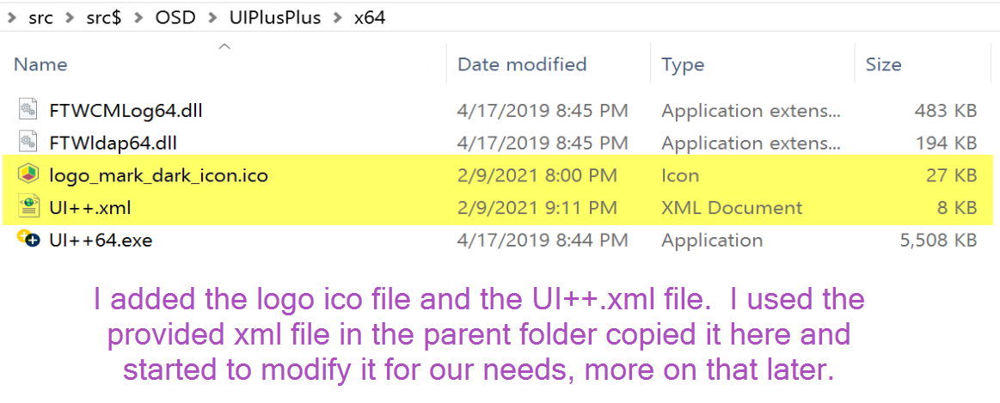
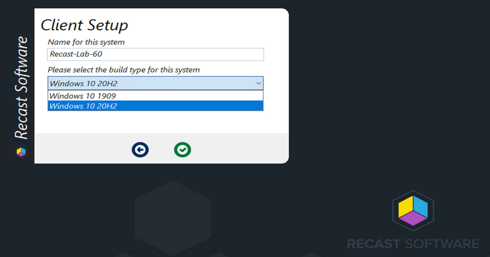
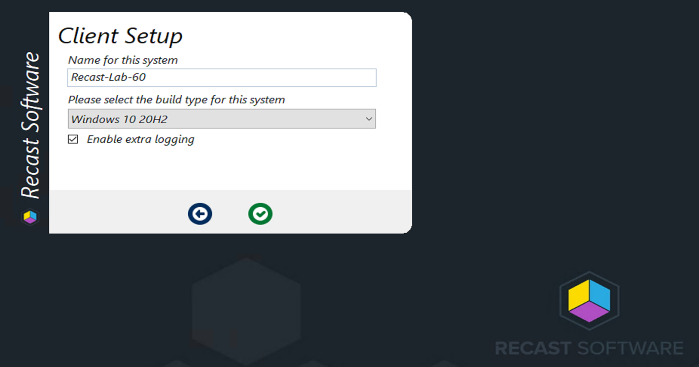
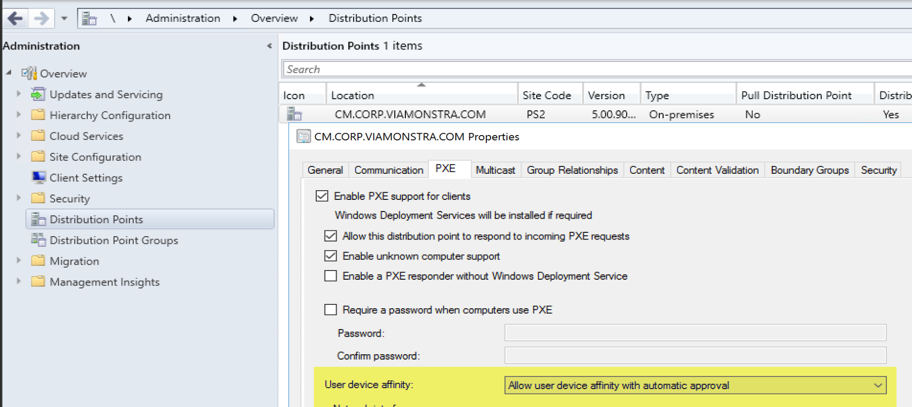

# UI++

In this Post, we're going to implement UI++ in our CM environment.  We're going to go through downloading, making some basic modifications and branding.  But before we get into that, what is UI++?  Lets see what the creator has to say:

## Overview

[UI++](https://uiplusplus.configmgrftw.com/) *is a dynamic, user interface (UI) generation tool. UI++ displays information to the interactive user, solicits input from the interactive user, and then performs actions based on that user’s input and selections including populating task sequence variables during System Center Configuration Manager (ConfigMgr) Operating System Deployment (OSD). UI++ also works outside of task sequences because, at its heart, UI++ is simply a generic UI framework. It’s still great during task sequences, but its certainly not limited to them.*

*Nearly every aspect of UI++ is customizable including, the number of dialogs, colors, icons, and the exact text to display — everything shown is up to you. Examples of information commonly requested from users include the system name, business unit, primary user, time zone, OU, and application selection.*

## Demo

The plan we have is to go over a full implementation of some basics.  Can it do more than what we're going to show you?  Yes, yes it can! The more we use it, the more we learn about what can be done, and with the amount of samples in the documentation, it easy to start building out and making it your own.  One thing, we aren't using UI++ to pick software, we have some core applications that everyone gets, then everything else is based on AD Group membership, which is why I'm using UI++ to set the primary user.  Point being, you can populate UI++ with applications you'd like to have the option of making available, and can even set rules to have them enabled or disabled by default.

### Download

First and foremost, you need to get it, download the ZIP file from the link above, UNBLOCK the zip file after you download, extract and create a package.
Zip File Contents:  
[](media/UI00.png)

In the X64 folder, my source looks like this after I added my own .ico file, and copied the UI++.xml from the parent folder:  
[](media/UI01.png)

CM Package (No Programs, just Content):  
[](media/UI02.png)

I then opt to use it in the Task Sequence as a step, instead of a PreStart Command.  Why?  I don't like having to modify my boot images, or keep separate ones for different purposes.  However, there are good reasons to embed it in your Boot Image, like the ability to have UI++ trigger different task sequences.  You could literally create a drop down of different task sequences in UI++, then have UI++ trigger them, or based on several questions you ask the "Tech", it would pick the correct TS for the scenario, without ever showing the Tech which TS it was going to run. If you're interested in a demo on that idea, let me know.

In the Task Sequence:  
[](media/UI03.png)

Now you can see, I'm just calling the exe file, you can get more creative, have different XML files, use variables to run the command differently, like you could have completely different UI++ experiences based on the device it's running on, etc.  You can even keep the XML on a webserver, so if you're finding yourself updating it regularly and don't want to keep updating the package, that's an option.

### Documentation

The Documentation can seem a bit overwhelming, I'll admit, at first I opened the nearly 100 page PDF, I was like... this is too hard, moving along.  But then I stopped to actually read it, and was comforted. I'm a guy who learns by doing, and the PDF had several examples, which helped me greatly.  

Besides the PDF, the website has a nicely layed out ["wiki" type documentation section](https://uiplusplus.configmgrftw.com/docs/intro/overview.html).

### XML - Functional Options

I'm going to break up the XML into a couple of items, one for functionality which would be where you're creating the variables that will drive the task sequence, and the other, Branding, lower in the page.   I found it the easiest to take the provided XML, then grab items from the samples and insert where I wanted, then delete the extra stuff I didn't want.

[My XML I used for the Demo on GitHub](https://github.com/gwblok/garytown/blob/master/DEMOS/UI%2B%2B.xml)

My Goal was to accomplish several things.

- Authentication, only specified users can run OSD
- Display a Custom Message
- Set the Computer Name (or keep the same one if it was a known system)
- Choose the Windows 10 Release, ex: 1909 / 20H2
- Ability to set CM Client to Debug Logging (for testing and troubleshooting)
- Ability to use Bitlocker or Not
- Ability to set Primary Device User
- Ability to set a Static IP
- Ability to have the OU set based on Location

I felt that was a doable goal for a first try at UI++.

I'm going to start showing snips of XML, I recommend opening the default XML provided and look over it first to become slightly familiar.  

#### **Authentication**

Built-in is an authentication process, and you can leverage an AD Group to control who can run the UI++ [Doc Reference - Authentication](https://uiplusplus.configmgrftw.com/docs/actionconfig/userauth.html)

User not in the Group:
[](media/UI04a.png)

Otherwise, it will automatically continue when you enter approved creds.
[](media/UI04.png)

```
<Action Type="UserAuth" Title="User Authentication" Domain="corp.viamonstra.com" MaxRetryCount="5" Group="CM-OSD-UI" GetGroups="True"/>
```

#### **Custom Message**

This will be a splash screen that presents information to whoever is running the task sequence.  You're able to leverage HTML tags to accomplish your formatting. [Doc Reference - Text Formatting](https://uiplusplus.configmgrftw.com/docs/reference/textformatting.html)

```
    <Action Type="Info" Name="myInfo" Title="Welcome %XAuthenticatedUser%">
      <![CDATA[<b>Recast Software - ConfigMgr Docs</b><br> <br>docs.recastsoftware.com<br><br>Demo of UI++, which includes:<br> - All of the power of UI++ 1.0 combined with UI App Tree!<br> - It's UI, <b>interactive </b>, evolved, and customized.<br> <br> Time Taken to Download, read documentation, customize and implement, about 4 hours.]]>
    </Action>
```

[](media/UI05.png)

#### **Setting Computer Name \ OS Release & Logging**

This dialog box has a few elements, and now that I think about it, I'd probably re-organize this XML and put the Computer Name with the Location Request later which sets the AD OU... oh well.

Here I have it allowing you to set the name, but it will default to the value in the TS Variable "_SMSTSMachineName", it also confirms that it is between 3 & 15 characters.  

I then wanted to have an easy way to deploy different releases of Windows 10, so I created a drop down, but I have it default to 20H2

[](media/UI06.png)

I also wanted to have an option to have the TS create additional logging and set the CM Client into verbose logging, so I felt a check box was a simple way to create a variable, which will control steps in the TS to do those things.

[](media/UI07.png)

You'll notice in one "Action", it's creating the Input page that can be interacted with, which creates an "internal" variable then additional "Action" tags to create the corresponding task sequence variables.

```
    <Action Type="Input" Name="ClientSetupInput" Title="Client Setup" ShowBack="True">
      <TextInput Prompt="Computer Name" Hint="Enter the name for this system" RegEx="[^\&quot;/\\\[\]:;\|=,\+\*\?&gt;&lt;]{3,15}" Variable="ZZComputerName" Question="Name for this system" Default="%_SMSTSMachineName%"/>
      <ChoiceInput Variable="ZZBuildType" Question="Please select the build type for this system" Required="True" Default="2009">
        <Choice Option="Windows 10 1909" Value="1909" />
        <Choice Option="Windows 10 20H2" Value="2009" />
      </ChoiceInput>
      <CheckboxInput Variable="ZZExtraLogging" Question="Enable extra logging" CheckedValue="True" UncheckedValue="False" Default="True"/>
    </Action>
    <Action Type="TSVar" Name="OSDComputerName" >"%ZZComputerName%"</Action>
    <Action Type="TSVar" Name="OSDBuildType" >"%ZZBuildType%"</Action>
```

How the Variables are then leveraged, the OSDBuildType you choose will let the TS know which Apply OS step to run:  
[](media/UI12.png)

Another thing about UI++, if will dump all of the "internal" variables as task sequence variables too, so while I'm not specifically creating a task sequence variable for the Extra logging, I can leverage the default one UI++ creates:

[](media/UI13.png)

It's really up to your personal preference how you want to create and leverage the variables.

#### **Setting Device Primary User**

Setting the Device's Primary User is essential for moving from Machine based deployments to User based, which is the dream, right?  Yes, Yes it is.  In this next "Input", I stole the XML code right from the default XML. I then updated the XML to add "defaults" for each drop down.  When a User is interacting with the dialog, based on the output of the drop down boxes on the user chose, it will either create additional dialogs requesting the user account for UDA and IP Address info for a Static IP or skip it.

[](media/UI108.png)

I'm setting the user here which will now become the Primary User Associated with the machine in ConfigMgr.
[](media/UI09.png)

This will leverage the variable: [SMSTSUDAUsers](https://docs.microsoft.com/en-us/mem/configmgr/osd/understand/task-sequence-variables#SMSTSUDAUsers)

More info about Setting Primary Device User (UDA)

- MS Docs: [Associate users with a destination computer in Configuration Manager](https://docs.microsoft.com/en-us/mem/configmgr/osd/get-started/associate-users-with-a-destination-computer)
  - Take note of the settings you'll need to set on your Boot Media / DP Servers to make this work.

Boot Media:
[](media/UI14.png)
PXE DPs:  
[](media/UI15.png)

#### **Setting Active Directory OU**

The last thing we wanted to do was be able to set the OU the computer was being imaged into.  Now you need to make sure your domain join account has rights to each of these OUs

[](media/UI10.png)

I have a simple drop down that will set a value, and I've set Minneapolis as the default, as most of our users are located at the Minneapolis office.

```
    <Action Type="Input" Name="LocationChoice" Title="System Location">
      <ChoiceInput Variable="MyLocation" Question="Please choose a final location for this computer" Required="True" Default="Minneapolis" >
        <Choice Option="Minneapolis" Value="Minneapolis"/>
        <Choice Option="Ottawa" Value="Ottawa"/>
        <Choice Option="Woodbury" Value="Woodbury"/>
        <Choice Option="Grand Rapids" Value="GrandRapids" />
        <Choice Option="Phoenix" Value="Phoenix" />
      </ChoiceInput>
    </Action>
    <Action Type="TSVar" Name="OSDDomainOUName" Condition='"%MyLocation%" = "Minneapolis"'>"LDAP://OU=Minneapolis,OU=Workstations,OU=RECAST,DC=corp,DC=viamonstra,DC=com"'</Action> 
    <Action Type="TSVar" Name="OSDDomainOUName" Condition='"%MyLocation%" = "Ottawa"'>"LDAP://OU=Ottawa,OU=Workstations,OU=RECAST,DC=corp,DC=viamonstra,DC=com"'</Action> 
    <Action Type="TSVar" Name="OSDDomainOUName" Condition='"%MyLocation%" = "Woodbury"'>"LDAP://OU=Workstations,OU=RECAST,DC=corp,DC=viamonstra,DC=com"'</Action> 
    <Action Type="TSVar" Name="OSDDomainOUName" Condition='"%MyLocation%" = "GrandRapids"'>"LDAP://OU=Workstations,OU=RECAST,DC=corp,DC=viamonstra,DC=com"'</Action> 
    <Action Type="TSVar" Name="OSDDomainOUName" Condition='"%MyLocation%" = "Phoenix"'>"LDAP://OU=Workstations,OU=RECAST,DC=corp,DC=viamonstra,DC=com"'</Action> 
```

After the Technician has chosen, the XML will set the [OSDDomainOUName](https://docs.microsoft.com/en-us/mem/configmgr/osd/understand/task-sequence-variables#OSDDomainOUName) variable to the OU I want based on the value of the drop down.

### XML - Branding Options

Alright, this is the fun part, you get to play with colors, and your corporate logo.  Feel free to work with your marketing department or human resources group to get their input if you plan to have end users see the OSD process (in-place reimages). While in-place reimages, you'd want to have it completely silent skipping a front end, the point still stands, you'd want to have OSD looking pretty.  Perhaps you'll have an executive break their computer and it will have to be "White Glove" reimaged in front of them, how nice would it be to have a fully branded solution that looks professional?  Very Nice!  

So for UI++, We created a ICO file from our logo using a free online converter, then got the color code for our "dark gray" color.

```
<UIpp Title="Recast Software" Icon="logo_mark_dark_icon.ico" Color="#1C252C" >
```

Yep, that's it.  We pointed it at our .ico file, and set the color and done.

## Test Drive

YouTube Video, Click to Open in YouTube:
[](https://www.youtube.com/watch?v=dHjzhipjKkY)

## Summary

We are VERY Impressed with UI++.  This tool is only held back by the admin's creativity. If you want to do something, you can probably do it.  

The [Documentation](https://uiplusplus.configmgrftw.com/docs/intro/overview.html) is well done, there is a large install base, along with a [support forum](https://uiplusplus.boards.net/).  There are a lot of references to it on Reddit, plus the creator [Jason Sandys](https://twitter.com/JasonSandys) is very active in the community and forums. This is the first front end we're going over, and it's going to be a hard one to beat.

**About Recast Software**
1 in 3 organizations using Microsoft Configuration Manager rely on Right Click Tools to surface vulnerabilities and remediate quicker than ever before.  
[Download Free Tools](https://www.recastsoftware.com/?utm_source=cmdocs&utm_medium=referral&utm_campaign=cmdocs#formarea)  
[Request Pricing](https://www.recastsoftware.com/pricing?utm_source=cmdocs&utm_medium=referral&utm_campaign=cmdocs)
