# WIMWitch

## Webinar

[March 23: Update and Modify WIM Files for Windows Deployment Scenarios, by Donna Ryan](https://www.recastsoftware.com/configmgr-community-tools-webinar-series)

## Overview

[WIMWitch](https://msendpointmgr.com/wim-witch/) is a great GUI alternative to OSDBuilder created and maintained by Donna Ryan ([@TheNotoriousDRR](https://twitter.com/TheNotoriousDRR)) ([Recast Interview](https://www.recastsoftware.com/blog/recasts-configmgr-community-influencer-highlights-donna-ryan))

A couple of my favorite features are the integration with ConfigMgr.  If you're using WIMWitch to create media for ConfigMgr, then WIMWitch can save you a few steps and some time by taking care of updating your Source Locations and triggering the distributions.  In the demo below, I'll be doing a vanilla run, not leveraging this cool feature, but wanted to make sure you were aware of this nice feature that other tools don't have.

What is WIMWitch?  

*WIM Witch is a utility that can be used to update and modify WIM files for Windows deployment scenarios. She currently supports the following:*

- *Integration into Configuration Manager*
- *Apply Software Updates*
- *Apply Drivers*
- *Apply Autopilot Profiles*
- *Apply Registry Keys*
- *Apply Default App Association*
- *Apply Start Menu Layout*
- *Apply Language Packs, Local Experience Packs, and Features on Demand*
- *Apply .Net 3.5*
- *Remove in-box provisioned apps apps*
- *Create content for ConfigMgr Upgrade Package*
- *Create updated bootable ISO*
- *Pause build process for manual customization*
- *Run custom PowerShell scripts for additional functionality*
- *Command line support for automation tasks*

*WIM Witch supports servicing Windows 10, Windows Server 2016 and 2019 images. For more information, please read the documentation listed in the Documentation Tab.*

## Demo Pre-Reqs

- Demo Machine
  - At least 40GB Free for Demo
  - Local Admin Access
  - Internet Access
- Windows Media ISO you wish to create serviced media from.

## Demo - Simple Servicing of Windows 10 VLSC Media

In this Demo, I'll be using the Folder D:\WIMWitch as my working directory

### Install Script

Running this command will pull the most recent WIMWitch Relase from the PowerShell Gallery:

```PowerShell
save-script -name wimwitch -path D:\WIMWitch\ -force   
```

[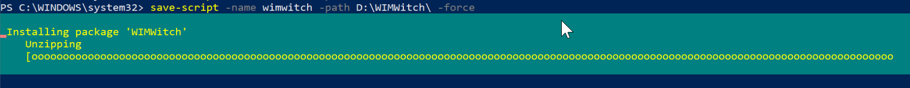](media/WIMWitch01.png)

### Launch WIMWitch

I'm going to set my execution policy to bypass, then launch the script:

```PowerShell
Set-ExecutionPolicy Bypass -Force
D:\WIMWitch\WIMWitch.ps1   
```

[](media/WIMWitch02.png)

You'll be prompted to Install the WIMWitch Contents in the same directory the script is currently in.  This is what I want, so I type "Y" and hit Enter.
[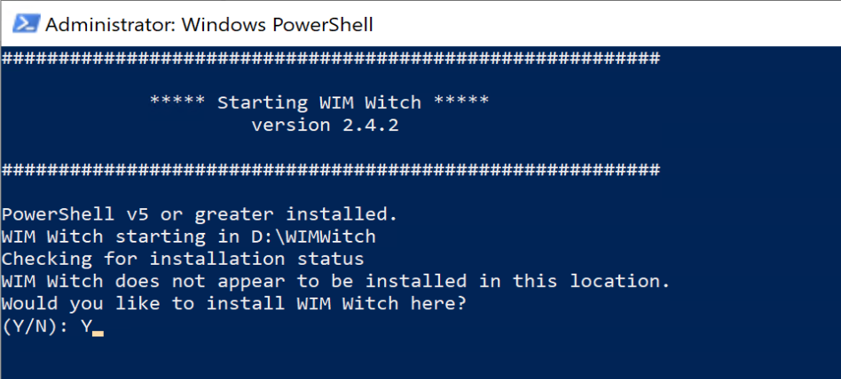](media/WIMWitch03.png)
[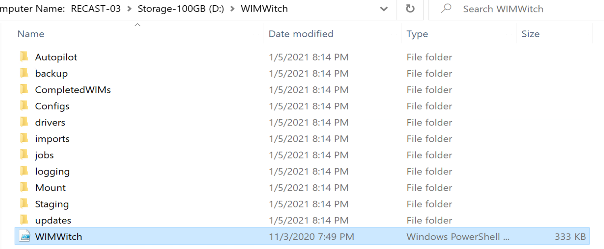](media/WIMWitch05.png)
Now I watch it build an launch:
[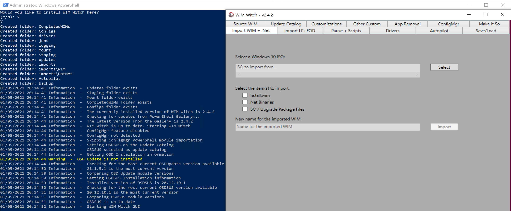](media/WIMWitch04.png)

### Importing Windows Media

This is very intuitive, simply browse to your Windows 10 Media, chose the parts to import, I'm doing all 3, and click "Import", and watch the progress in the PowerShell window:
[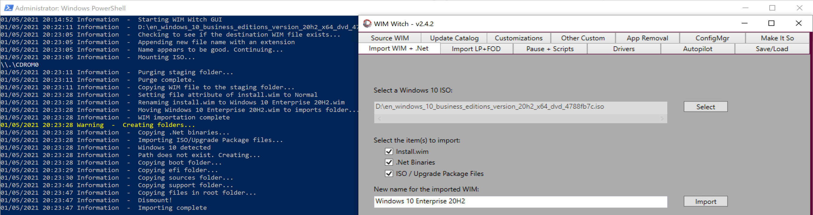](media/WIMWitch06.png)

### Source WIM

Now that we have imported media, lets select one, then select the index we want to work with, we'll do that in the Source WIM tab:

[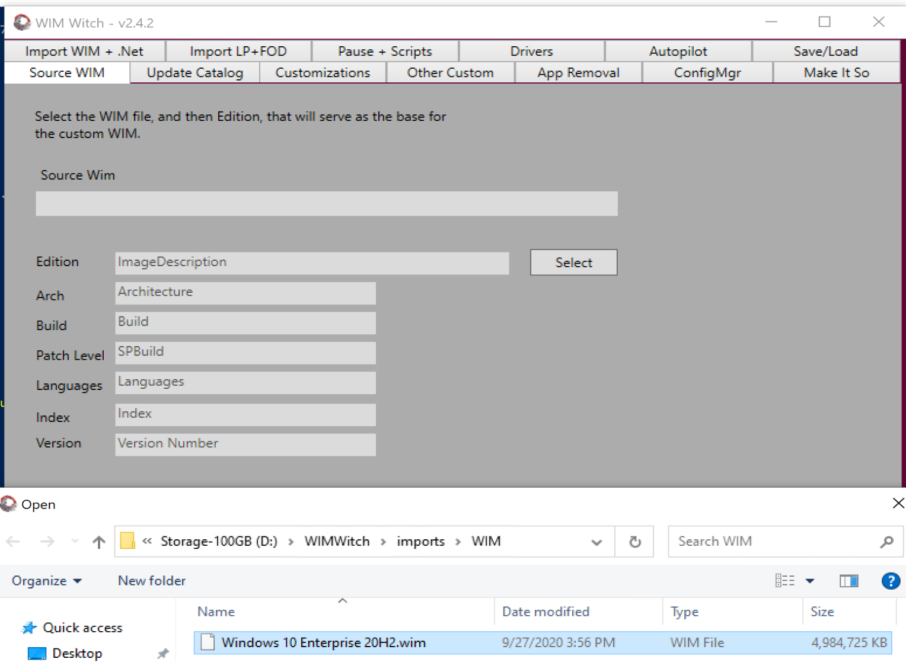](media/WIMWitch07.png)
[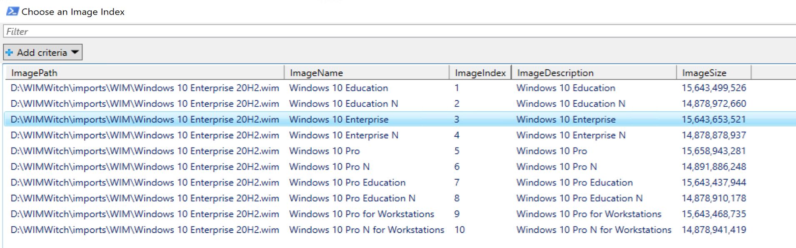](media/WIMWitch08.png)

### Update Catalog

Pulling in updates is an essential function of servicing your WIM.  WIMWitch is unique in the way that it gives you options to pull in Updates from CM, which is great that it can leverage things you already have implemented, and removes the need for you to pull down updates from the internet, which some security teams can put up a stink about.  WIMWitch also gives you the option to leverage the OSDSUS PowerShell module, which is nice if you don't have CM, or your role doesn't have access to CM and you're just building the WIM for others to consume. OSDSUS will pull updates directly from Microsoft.

For the Demo, I'll be leveraging the OSDSUS integration, If you plan to leverage it, WIMWitch will go ahead and install it for you, but you'll have to re-launch WIMWitch to leverage it.  No big deal.
So if you haven't already, go ahead and click "Install / Update" and see if you need to reload WIMWitch, which I do.
[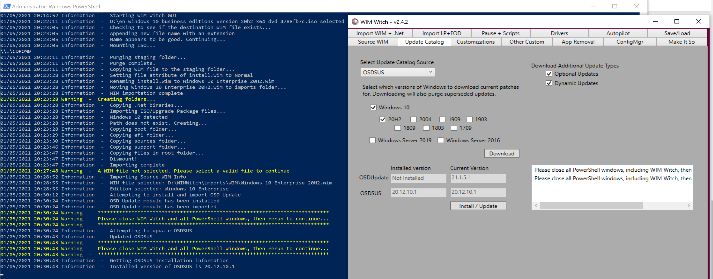](media/WIMWitch09.png)

After a quick reload....  I use the Source WIM tab to connect to the Media I wanted updated, and go back to the Update Catalog Tab:  
I've got it set to download the additional Optional Updates and Dynamic Updates for Windows 10 20H2, which is the only Media I'm currently supporting.  But if you have more, go ahead and choose those boxes.

Then lets click Download and watch the magic:
[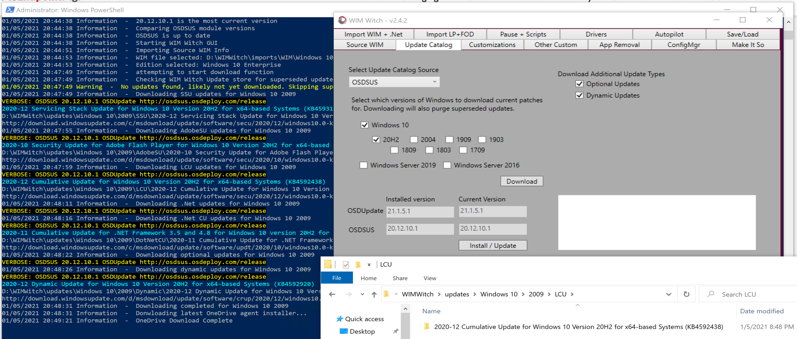](media/WIMWitch10.png)

You will see that it downloaded all of the updates to the updates directory and then organizes them nicely for you.

### Enable Customizations (Including the Updates)

You'll then need to move to the customization tab and check a few boxes there.  To keep it simple, I'm checking the box for updates, the ones we just downloaded, along with updating OneDrive Client, and enabling .Net 3.5

[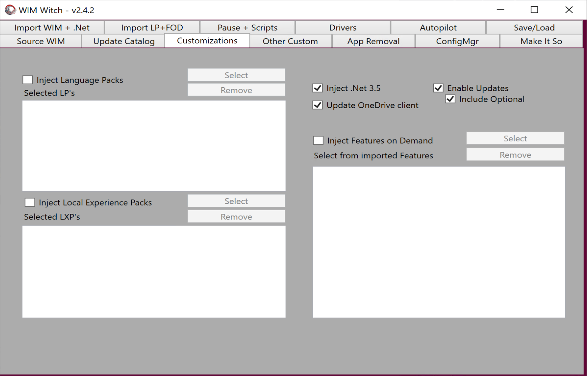](media/WIMWitch11.png)

### Make it So (Building the Media)

Now that we have everything configured, lets build us some updated customized media.  

Here you have more options, all I want is an upgrade media package content, so I manually place in the path

[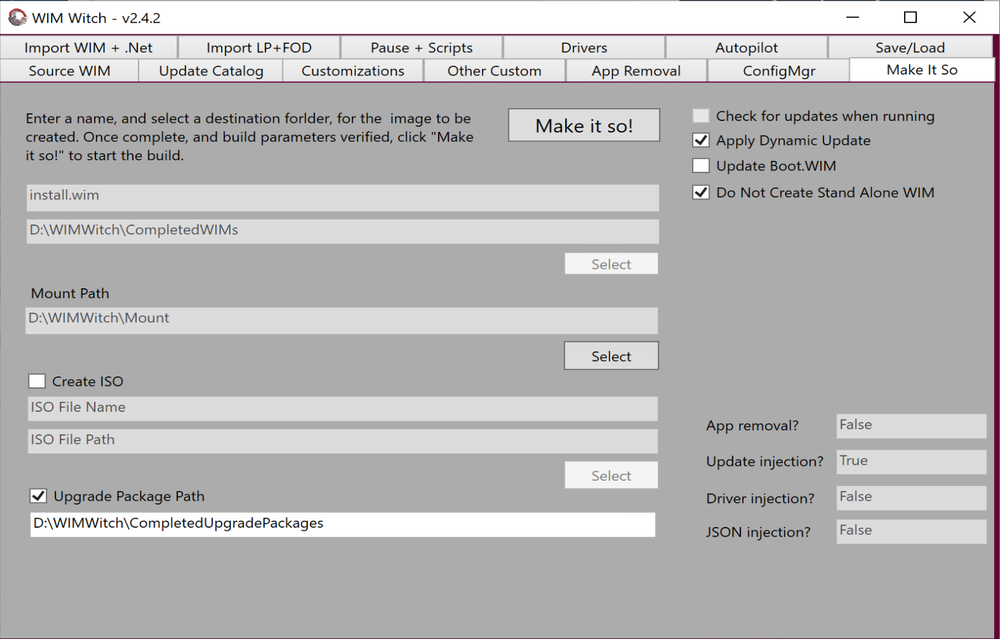](media/WIMWitch12.png)

Then lets kick it off: (Make it So)
You can watch the process in the PowerShell Window, or just walk away and come back later.
[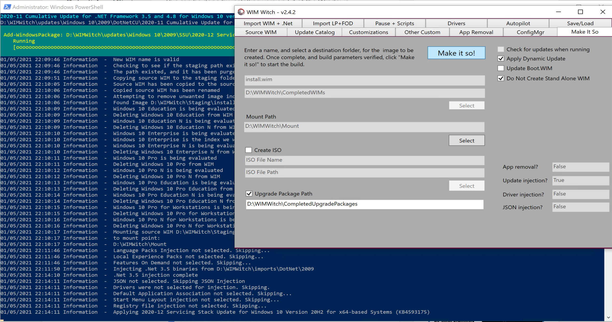](media/WIMWitch13.png)
When it's done:
[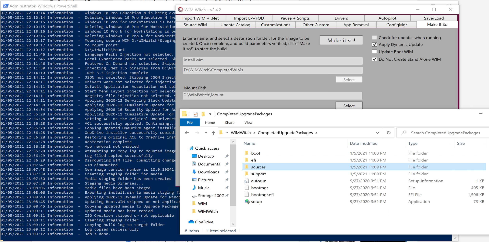](media/WIMWitch14.png)
And in the folder I told it to build to, you can see the install.wim was just updated:
[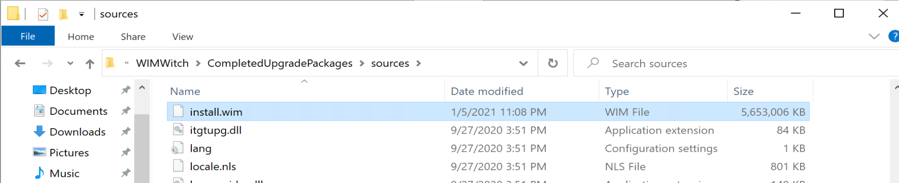](media/WIMWitch15.png)

## Summary

WIMWitch is a great way to take your Servicing of Media to the next level very quickly.  With almost no time to setup, you can start pumping out updated media very quickly.  I didn't even start to scratch the surface of what it can do in this demo.  I'd recommend checking out the other features which can be your solution for adding additional languages, drivers, or setup the machine for autopilot.  WIMWitch isn't short on features.  

**About Recast Software**
1 in 3 organizations using Microsoft Configuration Manager rely on Right Click Tools to surface vulnerabilities and remediate quicker than ever before.  
[Download Free Tools](https://www.recastsoftware.com/?utm_source=cmdocs&utm_medium=referral&utm_campaign=cmdocs#formarea)  
[Request Pricing](https://www.recastsoftware.com/pricing?utm_source=cmdocs&utm_medium=referral&utm_campaign=cmdocs)
