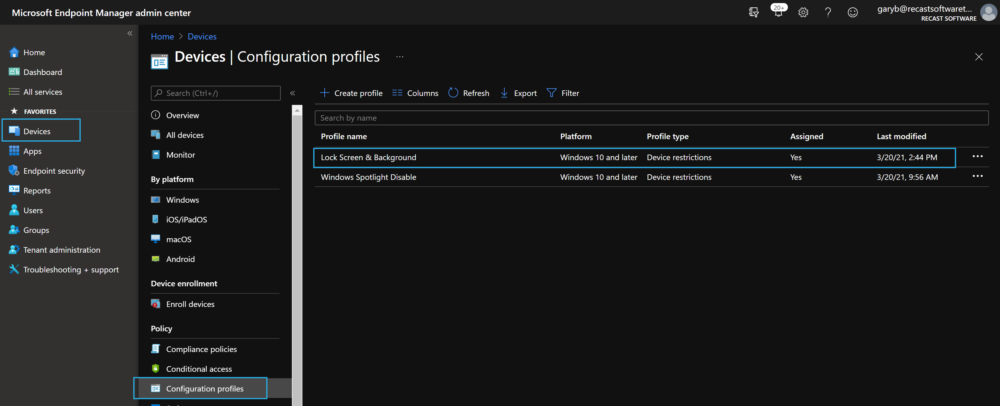
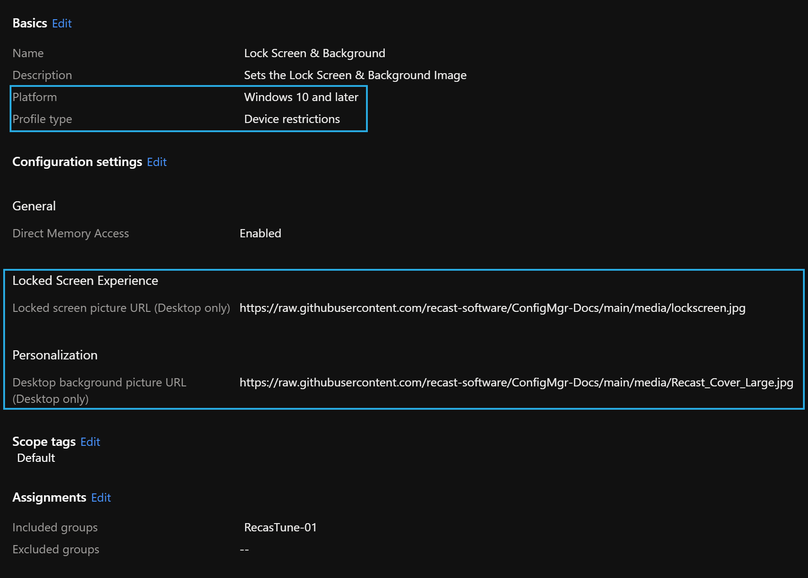

# Set Windows 10 Background \ Wallpaper Image

This can be done a several ways, first off, do you want to lock it down, or do you just want to set a default and allow your end users to change it.  That's going to be a theme for most of your changes.  I typically like to enforce a Lock Screen image, but only set the default for Background image, allowing the users to change it... but that's just my opinion.  Business requirements will in the end be the deciding factor.

Let's take a look at some ways:

- Intune Management
- Group Policy
- ConfigMgr OSD

Yes, there are several ways to do it, basically if you have a way to deploy files, run commands, and set registry values, you can do this.

How this all works: (Setting Default, but allowing User to Change)

- Replace img0.jpg (Default Wallpaper Image)

Windows Location: c:\windows\web\Wallpaper\Windows

[](media/Customization_Wallpaper01.png)

``` PowerShell
Copy-Item .\wallpaper.jpg C:\Windows\Web\Wallpaper\Windows\img0.jpg -Force
```

You might have also noticed other resolutions of this file.  If you have some unique resolutions in your environment, I'd work directly with your marketing team to see if they can create those exact resolutions.

You would then need to replace these files with your updated version too:
[](media/Customization_Wallpaper02.png)
Windows Location: c:\windows\web\4K\Wallpaper\Windows

That's the basics behind it.  How I've often implemented this is deleting the "4K" folder since I don't have customized sizes, and just replace the img0 file, which I'll show in the Task Sequence Demo. 

## Demos

### Task Sequence

To use in a task sequence, the images need to be in a package.

#### **Run Command Line Option**

If you want, you can have use two simple "Run Command" Steps and reference the package with the image

Step 1: Take OwnerShip & Grant Permissions & Delete files in "4K" Folder 

```
cmd.exe /c takeown /f C:\Windows\Web\4K\Wallpaper\Windows\*.* & cmd.exe /c icacls C:\Windows\Web\4K\Wallpaper\Windows\*.* /Grant System:(F) & cmd.exe /c del /q C:\Windows\Web\4K\Wallpaper\Windows\*.*
```
If you're going to replace the 4K folder images, you'll need to still run the previous command, then add the new custom wallpapers with the exact same names.


[](media/Customization_Wallpaper04.png)

Step 2: Copy Images (Reference Package that has your wallpaper.jpg image)

```
cmd.exe /c copy WallPapersLockScreens\Recast_Cover_Large.jpg C:\Windows\Web\Wallpaper\Windows\img0.jpg /Y
```

[](media/Customization_Wallpaper05.png)

#### **PowerShell Option**

You'd have a "Run PowerShell Script" Step, that points to the Script: [Set-Wallpaper.ps1](https://github.com/gwblok/garytown/blob/master/Customizations/Set-Wallpaper.ps1), and the package would include both the lockscreen.jpg & the powershell script [Set-Wallpaper.ps1](https://github.com/gwblok/garytown/blob/master/Customizations/Set-Wallpaper.ps1)

[](media/Customization_Wallpaper06.png)


### Group Policy

You can do both methods using group policy.  Forcing the Background is quite easy, where as replacing the default images is bit more tricky.

#### **Forcing Wallpaper**

This is by far the most easy way to set a branded lock screen in your environment.  
This is actually a User Policy, but in all my examples I'm configuring them as Machine Polices which then requires loop-back enabled. [Group policy loopback Info](https://docs.microsoft.com/en-us/troubleshoot/windows-server/group-policy/loopback-processing-of-group-policy)
[](media/Customization_Wallpaper10.png)

Machine->Admin Templates->System->Group Policy->Configure user Group Policy Loopback set to Enable (Mode = Merge)
Then I use Preference to copy the jpg file local
Finally the user Policy:
User->Admin Template->Desktop->Desktop->Desktop Wallpaper -> Set location to where you're copying it local.  I typically set it to Fill.

Once you've done this and applied it to the endpoint, the next restart it will be applied.

#### **Setting the Default with Group Policy**

This is much more tricky, and request a very extensive group policy setup which changes permissions on files, then copies the file to overwrite the one there.  I personally do not like this method and wouldn't implement it myself, as I feel using ConfigMgr for this is a better option, but I'm going to show you anyway.

Required enabling Group Policy Loopback and setting up both machine & user polices.

Here we take add permissions for System & Administrators to have Full Control of the *C:\Windows\Web* folder & enable User Loop Back: 
[](media/Customization_Wallpaper07.png)

Here we overwrite the Windows Default Wallpaper with our own and delete all of the files in the 4K folder.
[](media/Customization_Wallpaper08.png)  

This is part of why this method is messy.  Windows will cache the background in the user's profile, so even if you replace the Windows default, you'll notice it doesn't impact users who have already logged on, so you need to remove it from their profile cache, which is what this will accomplish for you:  
[](media/Customization_Wallpaper09.png)

Once I moved a computer into the OU with this policy applied, it took 2 restarts and logons for it to fully take.

### Intune (Enforced)

[MS Docs](https://docs.microsoft.com/en-us/mem/intune/configuration/device-restrictions-windows-10#locked-screen-experience) has good information about setting up a lock screen that is enforced.

Basically, you setup a Device Policy in Devices then Assign it to a group:

[](media/Customization_LockScreen14.png)

[](media/Customization_LockScreen13.png)

## Summary

That's it, simple concept, some methods easier than others.  I'm a fan of having it all set during OSD so you don't have to fight with replacing it after a user profile is already created.

**About Recast Software**
1 in 3 organizations using Microsoft Configuration Manager rely on Right Click Tools to surface vulnerabilities and remediate quicker than ever before.  
[Download Free Tools](https://www.recastsoftware.com/?utm_source=cmdocs&utm_medium=referral&utm_campaign=cmdocs#formarea)  
[Request Pricing](https://www.recastsoftware.com/pricing?utm_source=cmdocs&utm_medium=referral&utm_campaign=cmdocs)
