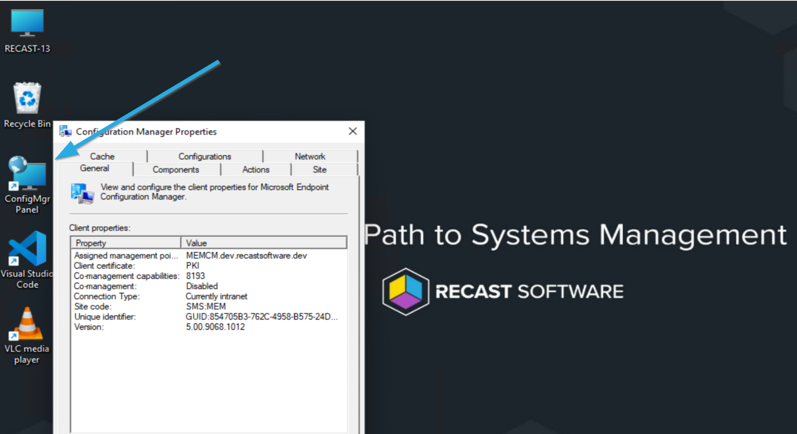
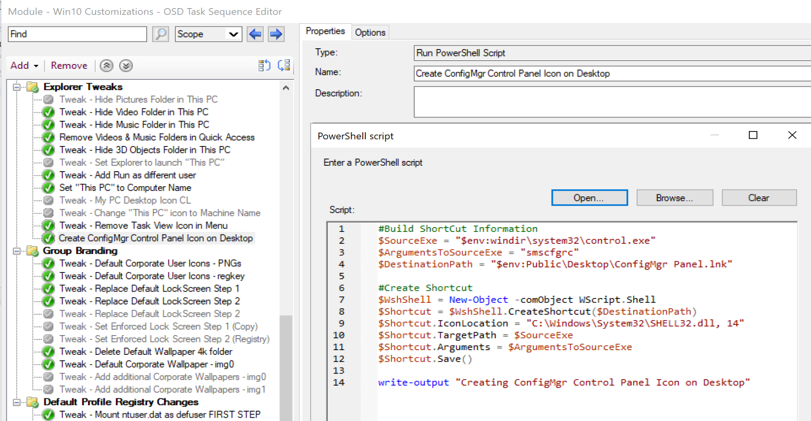

# Create Shortcuts with PowerShell

Windows 10 / Windows 11 customizations leveraging powershell.  The idea behind this was I wanted to create a shortcut to the Configuration Manager Control Panel applet on the desktop during OSD on all test machines.

## Demo Image

Results after OSD:
[](media/Customization_CreateShortcut01.png)

In the Task Sequence:
[](media/Customization_CreateShortcut02.png)

## Deployment Methods

This is just a few lines of PowerShell code that you can run in system context, so Intune or CM is a great way to deploy the script to create shortcuts.

## Code

```PowerShell
#Build ShortCut Information
$SourceExe = "$env:windir\system32\control.exe"
$ArgumentsToSourceExe = "smscfgrc"
$DestinationPath = "$env:Public\Desktop\ConfigMgr Panel.lnk"

#Create Shortcut
$WshShell = New-Object -comObject WScript.Shell
$Shortcut = $WshShell.CreateShortcut($DestinationPath)
$Shortcut.IconLocation = "C:\Windows\System32\SHELL32.dll, 14"
$Shortcut.TargetPath = $SourceExe
$Shortcut.Arguments = $ArgumentsToSourceExe
$Shortcut.Save()

write-output "Creating ConfigMgr Control Panel Icon on Desktop"
```

So breaking that down, the first section is building the information required to be used in the shortcut itself.  The EXE, any additional arguments, many times you won't need this for creating shortcuts to files or programs, and then the destination of where you want the shortcut placed, in this example, it's the all users desktop.

In the next section, we connect to the com object, and leverage the CreateShortcut method.  For the icon, we steal one of the many icons that are built into Windows 11 by calling Shell32.dll, and then choosing one from the many available, the index for the one I wanted was 14.  Feel free to change "14" to a different number and re-run and keep going until you find one you like.  

## Summary

That's it, simple concept, simple to add to your task sequence, and super handy.

## References

- [Forum - Stackoverflow](https://stackoverflow.com/questions/41707358/how-can-i-change-icons-for-existing-url-shortcuts-using-powershell)

**About Recast Software**
1 in 3 organizations using Microsoft Configuration Manager rely on Right Click Tools to surface vulnerabilities and remediate quicker than ever before.  
[Download Free Tools](https://www.recastsoftware.com/?utm_source=cmdocs&utm_medium=referral&utm_campaign=cmdocs#formarea)  
[Request Pricing](https://www.recastsoftware.com/pricing?utm_source=cmdocs&utm_medium=referral&utm_campaign=cmdocs)
