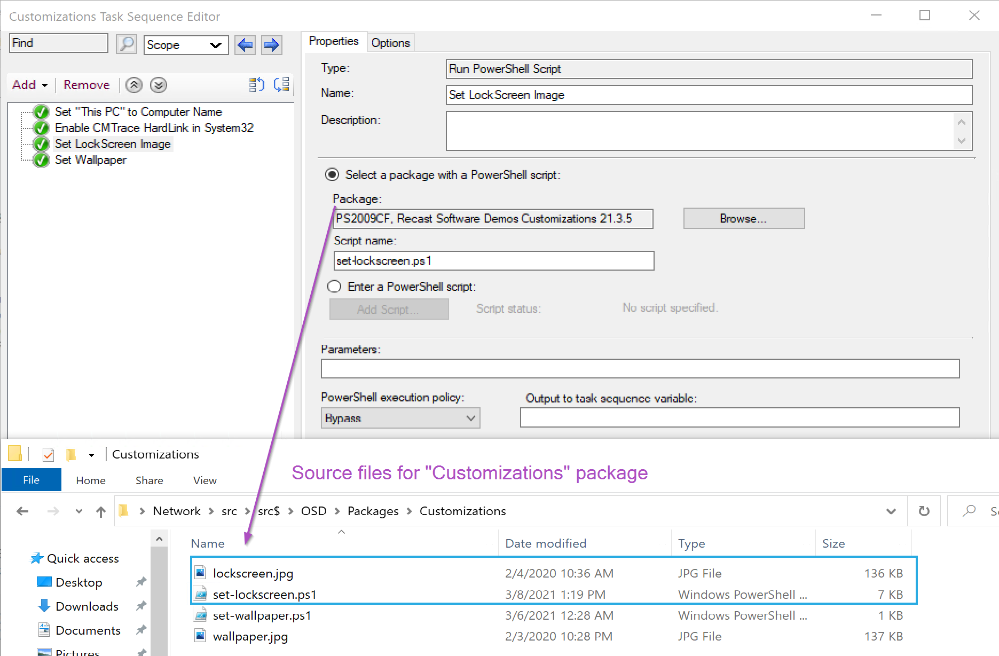
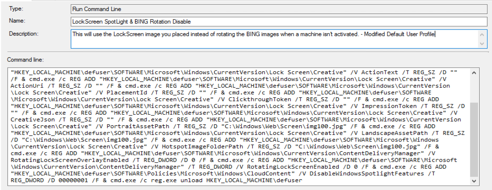

# Set Windows 10 Lock Screen Image

The Default Lock Screen:  
[](media/Customization_LockScreen06.png)

I actually like the Windows Default, with Bing Rotation and Spotlight enabled.  I enjoy getting a new picture everyday. But that's a personal thing, and perhaps on your enterprise devices you want to brand some machines in your classrooms, or other specialized machines, like a call center, whatever the reason maybe, there are ways to do it.

This can be done a couple of ways, first off, do you want to lock it down, or do you just want to set a default and allow your end users to change it.  That's going to be a theme for most of your changes.

Let's take a look at some ways:

- Intune Management
- Group Policy
- ConfigMgr OSD
- ConfigMgr Application

Yes, there are several ways to do it, basically if you have a way to deploy files, run commands, and set registry values, you can do this.

How this all works: (Setting Default, but allowing User to Change)

- Replace img100.jpg (Default Lockscreen Image)

Windows Location: c:\windows\web\Screen
[](media/Customization_LockScreen01.png)

``` PowerShell
Copy-Item .\lockscreen.jpg C:\windows\web\Screen\img100.jpg -Force -Verbose
Copy-Item .\lockscreen.jpg C:\windows\web\Screen\img105.jpg -Force -Verbose
```

However, if you tried that, you might have gotten access denied errors, even if running as system.  You'll need to take ownership of those files and then add permissions for system account.

That process isn't too difficult using a couple command line utilities.

``` PowerSHell
takeown /f c:\windows\WEB\Screen\*.*
icacls c:\windows\WEB\Screen\*.* /Grant 'System:(F)'
```

Or you can do it all with native powershell, which takes a bit more [code](https://github.com/gwblok/garytown/blob/master/OSD/Set-LockScreen.ps1).

Using this method, you'll need to copy down an image to the local machine, and set a registry value to the path of the image.

Key: HKLM\SOFTWARE\Policies\Microsoft\Windows\Personalization  
Property: LockScreenImage  
[Reg_SZ]Value: Path to Image  

Task Sequence Run Command or Batch File:

```
REG ADD HKEY_LOCAL_MACHINE\SOFTWARE\Policies\Microsoft\Windows\Personalization" /V LockScreenImage /T REG_SZ /D C:\programdata\organization\lockscreen.jpg /F
```

## Windows Activation & Lock Screen Quirks

If you're using a lab and you don't activate the machines you're get the "Bing" Images instead of what you wanted.  There are some extra registry keys you can set to override that.

This is what I've done to override these settings and allow the lock screen to work without "spotlight" and "bing" to take over.

```
Key: HKEY_CURRENT_USER\SOFTWARE\Microsoft\Windows\CurrentVersion\Lock Screen\Creative Property: LockImageFlags Type: REG_DWORD Value: 00000000  
Key: HKEY_CURRENT_USER\SOFTWARE\Microsoft\Windows\CurrentVersion\Lock Screen\Creative Property: LockScreenOptions Type: REG_DWORD Value: 00000000  
Key: HKEY_CURRENT_USER\SOFTWARE\Microsoft\Windows\CurrentVersion\Lock Screen\Creative Property: CreativeId Type: REG_SZ Value: ""   
Key: HKEY_CURRENT_USER\SOFTWARE\Microsoft\Windows\CurrentVersion\Lock Screen\Creative Property: DescriptionText Type: REG_SZ Value: ""  
Key: HKEY_CURRENT_USER\SOFTWARE\Microsoft\Windows\CurrentVersion\Lock Screen\Creative Property: ActionText Type: REG_SZ Value: ""  
Key: HKEY_CURRENT_USER\SOFTWARE\Microsoft\Windows\CurrentVersion\Lock Screen\Creative Property: ActionUri Type: REG_SZ Value: ""  
Key: HKEY_CURRENT_USER\SOFTWARE\Microsoft\Windows\CurrentVersion\Lock Screen\Creative Property: PlacementId Type: REG_SZ Value: ""  
Key: HKEY_CURRENT_USER\SOFTWARE\Microsoft\Windows\CurrentVersion\Lock Screen\Creative Property: ClickthroughToken Type: REG_SZ Value: ""  
Key: HKEY_CURRENT_USER\SOFTWARE\Microsoft\Windows\CurrentVersion\Lock Screen\Creative Property: ImpressionToken Type: REG_SZ Value: ""  
Key: HKEY_CURRENT_USER\SOFTWARE\Microsoft\Windows\CurrentVersion\Lock Screen\Creative Property: CreativeJson Type: REG_SZ Value: ""  
Key: HKEY_CURRENT_USER\SOFTWARE\Microsoft\Windows\CurrentVersion\Lock Screen\Creative Property: PortraitAssetPath Type: REG_SZ Value: "C:\Windows\Web\Screen\img100.jpg"  
Key: HKEY_CURRENT_USER\SOFTWARE\Microsoft\Windows\CurrentVersion\Lock Screen\Creative Property: LandscapeAssetPath Type: REG_SZ Value: "C:\Windows\Web\Screen\img100.jpg"  
Key: HKEY_CURRENT_USER\SOFTWARE\Microsoft\Windows\CurrentVersion\Lock Screen\Creative Property: HotspotImageFolderPath Type: REG_SZ Value: "C:\Windows\Web\Screen\img100.jpg"  
Key: HKEY_CURRENT_USER\SOFTWARE\Microsoft\Windows\CurrentVersion\ContentDeliveryManager Property: RotatingLockScreenOverlayEnabled Type: REG_DWORD Value: 0  
Key: HKEY_CURRENT_USER\SOFTWARE\Microsoft\Windows\CurrentVersion\ContentDeliveryManager Property: RotatingLockScreenEnabled Type: REG_DWORD Value: 0  
Key: HKEY_CURRENT_USER\SOFTWARE\Policies\Microsoft\Windows\CloudContent Property: DisableWindowsSpotlightFeatures Type: REG_DWORD Value: 00000001  
```

## Demos

### Task Sequence

To use in a task sequence, the images need to be in a package.

#### **Run Command Line Option**

If you want, you can have use two simple "Run Command" Steps and reference the package with the image

Step 1: Take OwnerShip & Grant Permissions

```
cmd.exe /c takeown /f C:\Windows\Web\Screen\*.* & cmd.exe /c icacls C:\Windows\Web\Screen\*.* /Grant System:(F)
```

[](media/Customization_LockScreen04.png)

Step 2: Copy Images (Reference Package that has your lockscreen.jpg image)

```
cmd.exe /c copy lockscreen.jpg C:\Windows\Web\Screen\img100.jpg /Y & cmd.exe /c copy lockscreen.jpg C:\Windows\Web\Screen\img105.jpg /Y
```

[](media/Customization_LockScreen02.png)

#### **PowerShell Option**

You'd have a "Run PowerShell Script" Step, that points to the Script: [Set-LockScreen.ps1](https://github.com/gwblok/garytown/blob/master/Customizations/Set-LockScreen.ps1), and the package would include both the lockscreen.jpg & the powershell script [Set-LockScreen.ps1](https://github.com/gwblok/garytown/blob/master/Customizations/Set-LockScreen.ps1)

[](media/Customization_LockScreen02.png)

#### **Disable Spotlight / Bing Rotate**

I have a run command line step that strings all this together.

```
Key: HKEY_CURRENT_USER\SOFTWARE\Microsoft\Windows\CurrentVersion\Lock Screen\Creative Property: LockImageFlags Type: REG_DWORD Value: 00000000  
Key: HKEY_CURRENT_USER\SOFTWARE\Microsoft\Windows\CurrentVersion\Lock Screen\Creative Property: LockScreenOptions Type: REG_DWORD Value: 00000000  
Key: HKEY_CURRENT_USER\SOFTWARE\Microsoft\Windows\CurrentVersion\Lock Screen\Creative Property: CreativeId Type: REG_SZ Value: ""   
Key: HKEY_CURRENT_USER\SOFTWARE\Microsoft\Windows\CurrentVersion\Lock Screen\Creative Property: DescriptionText Type: REG_SZ Value: ""  
Key: HKEY_CURRENT_USER\SOFTWARE\Microsoft\Windows\CurrentVersion\Lock Screen\Creative Property: ActionText Type: REG_SZ Value: ""  
Key: HKEY_CURRENT_USER\SOFTWARE\Microsoft\Windows\CurrentVersion\Lock Screen\Creative Property: ActionUri Type: REG_SZ Value: ""  
Key: HKEY_CURRENT_USER\SOFTWARE\Microsoft\Windows\CurrentVersion\Lock Screen\Creative Property: PlacementId Type: REG_SZ Value: ""  
Key: HKEY_CURRENT_USER\SOFTWARE\Microsoft\Windows\CurrentVersion\Lock Screen\Creative Property: ClickthroughToken Type: REG_SZ Value: ""  
Key: HKEY_CURRENT_USER\SOFTWARE\Microsoft\Windows\CurrentVersion\Lock Screen\Creative Property: ImpressionToken Type: REG_SZ Value: ""  
Key: HKEY_CURRENT_USER\SOFTWARE\Microsoft\Windows\CurrentVersion\Lock Screen\Creative Property: CreativeJson Type: REG_SZ Value: ""  
Key: HKEY_CURRENT_USER\SOFTWARE\Microsoft\Windows\CurrentVersion\Lock Screen\Creative Property: PortraitAssetPath Type: REG_SZ Value: "C:\Windows\Web\Screen\img100.jpg"  
Key: HKEY_CURRENT_USER\SOFTWARE\Microsoft\Windows\CurrentVersion\Lock Screen\Creative Property: LandscapeAssetPath Type: REG_SZ Value: "C:\Windows\Web\Screen\img100.jpg"  
Key: HKEY_CURRENT_USER\SOFTWARE\Microsoft\Windows\CurrentVersion\Lock Screen\Creative Property: HotspotImageFolderPath Type: REG_SZ Value: "C:\Windows\Web\Screen\img100.jpg"  
Key: HKEY_CURRENT_USER\SOFTWARE\Microsoft\Windows\CurrentVersion\ContentDeliveryManager Property: RotatingLockScreenOverlayEnabled Type: REG_DWORD Value: 0  
Key: HKEY_CURRENT_USER\SOFTWARE\Microsoft\Windows\CurrentVersion\ContentDeliveryManager Property: RotatingLockScreenEnabled Type: REG_DWORD Value: 0  
Key: HKEY_CURRENT_USER\SOFTWARE\Policies\Microsoft\Windows\CloudContent Property: DisableWindowsSpotlightFeatures Type: REG_DWORD Value: 00000001  
```

[](media/Customization_LockScreen05.png)

### Group Policy

You can do both methods using group policy.  Forcing the lockscreen is quite easy, where as replacing the default images is bit more tricky.

#### **Forcing Lock Screen**

This is by far the most easy way to set a branded lock screen in your environment.  
Group Policy Path: Administrative Templates\Control Panel\Personalization  
Item: Force a specific default lock screen and logon image:  
[](media/Customization_LockScreen07.png)
Coping the Image Locally:  
[](media/Customization_LockScreen08.png)

Once you've done this and applied it to the endpoint, the next restart it will be applied.

#### **Setting the Default with Group Policy**

This is much more tricky, and request a very extensive group policy setup which changes permissions on files, then copies the file to overwrite the one there.  I personally do not like this method and wouldn't implement it myself, as I feel using ConfigMgr for this is a better option, but I'm going to show you anyway.

Note, because I'm setting this up in a lab on Windows machines that are NOT activated, it required enabling [group policy loopback](https://docs.microsoft.com/en-us/troubleshoot/windows-server/group-policy/loopback-processing-of-group-policy) and setting up both machine & user polices. In your environment, I'd suggest starting with the machine policy part and seeing if that is good enough.
Here we take add permissions for System & Administrators to have Full Control of the *C:\Windows\Web* folder
[](media/Customization_LockScreen11.png)

Here we copy the branded lockscreen image over the ones on the machine
[](media/Customization_LockScreen09.png)
And here I clean out cached lock screen images that can drive you crazy when you see the lock screen images in c:\windows\web\screen have been overwritten, and yet the lock screen image hasn't updated.  This is not required if you apply these during OSD, because it will never have cached the wrong image before the policy is set.
[](media/Customization_LockScreen10.png)

And now lets deal with all of the user policies that need to get set too:
[](media/Customization_LockScreen12.png)
These are all of the Registry items listed above on the page.  Remember, you might not need to do this in a non-lab environment.  Do lots of testing.

Once I moved a computer into the OU with this policy applied, it took 2 restarts and logons for it to fully take.

### Intune (Enforced)

[MS Docs](https://docs.microsoft.com/en-us/mem/intune/configuration/device-restrictions-windows-10#locked-screen-experience) has good information about setting up a lock screen that is enforced.

Basically, you setup a Device Policy in Devices then Assign it to a group:

[](media/Customization_LockScreen14.png)

[](media/Customization_LockScreen13.png)

## Summary

That's it, simple concept, simple to add to your task sequence, and super handy.

**About Recast Software**
1 in 3 organizations using Microsoft Configuration Manager rely on Right Click Tools to surface vulnerabilities and remediate quicker than ever before.  
[Download Free Tools](https://www.recastsoftware.com/?utm_source=cmdocs&utm_medium=referral&utm_campaign=cmdocs#formarea)  
[Request Pricing](https://www.recastsoftware.com/pricing?utm_source=cmdocs&utm_medium=referral&utm_campaign=cmdocs)
