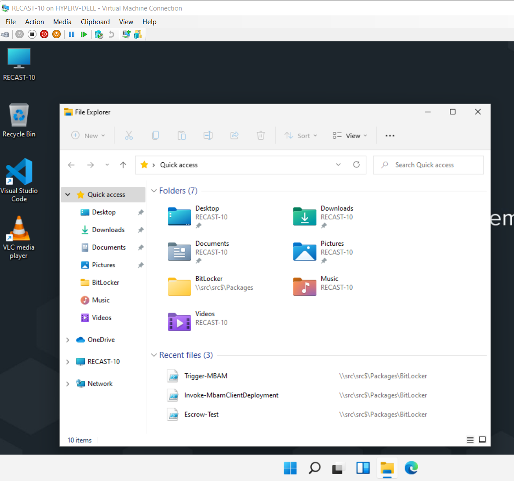
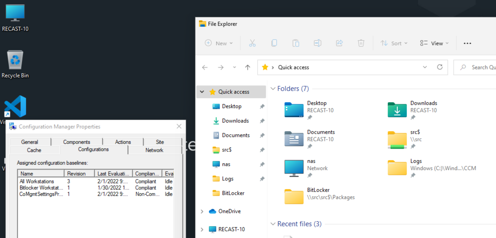

# Modify Windows Explorer Quick Access Items

Windows 10 / Windows 11 customization of Quick Access.
I'm providing a couple of examples, both adding items to the quick access and removing items.

## Demo Image

Typical Quick Access area, with Folder defaults:
[](media/Customizations_QA01.png)

After running the Add / Remove scripts:
[](media/Customizations_QA02.png)

## Deployment Methods

This is just a few lines of PowerShell code, but the catch is that it needs to be run in the User Context. To do that, I'm deploying it as a Configuration Item in a Baseline.

## Code

### Adding Folders

This code is pretty straight forward, connect to the shell com object, then "pin" the folders.

```PowerShell
$QuickAccess = New-Object -ComObject shell.application
$Folders = @("\\src\src$","C:\Windows\CCM\Logs")
foreach ($Folder in $Folders)
    {
    $QuickAccess.Namespace($Folder).Self.InvokeVerb("pintohome")
    }
```

### Remove Folders

This is similar, but with a couple of nuances.  Music & Videos folders require different "verb" to remove (removefromhome), vs other folders (unpinfromhome).
To keep it simple, I run both verbs against each object.  If the folder you want to remove doesn't exist, you will get an error, which is why the code below checks for the folder in the quick access items first.

```PowerShell
$Namespace = "shell:::{679f85cb-0220-4080-b29b-5540cc05aab6}"
$QuickAccess = New-Object -ComObject shell.application
$RecentFiles = $QuickAccess.Namespace($Namespace).Items()
$Folders = @("Videos", "Music", "Pictures")
foreach ($Folder in $Folders)
    {
    $SelectFolder = $RecentFiles | Where-Object {$_.Path -match $Folder}
    if ($SelectFolder){
        $SelectFolder.InvokeVerb("unpinfromhome")
        $SelectFolder.InvokeVerb("removefromhome")
        }
    }
```

To grab the full scripts used in baseline, you can grab them from [GitHub](https://github.com/gwblok/garytown/tree/master/ConfigMgr/Baselines)

## Summary

That's it, simple concept, simple to add to your task sequence, and super handy.

## References

- [Forum - Stackoverflow](https://stackoverflow.com/questions/30051634/is-it-possible-programmatically-add-folders-to-the-windows-10-quick-access-panel)

**About Recast Software**
1 in 3 organizations using Microsoft Configuration Manager rely on Right Click Tools to surface vulnerabilities and remediate quicker than ever before.  
[Download Free Tools](https://www.recastsoftware.com/?utm_source=cmdocs&utm_medium=referral&utm_campaign=cmdocs#formarea)  
[Request Pricing](https://www.recastsoftware.com/pricing?utm_source=cmdocs&utm_medium=referral&utm_campaign=cmdocs)
