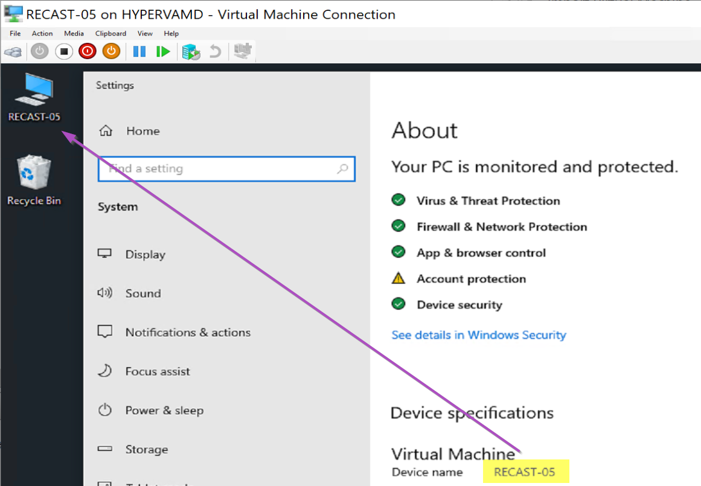
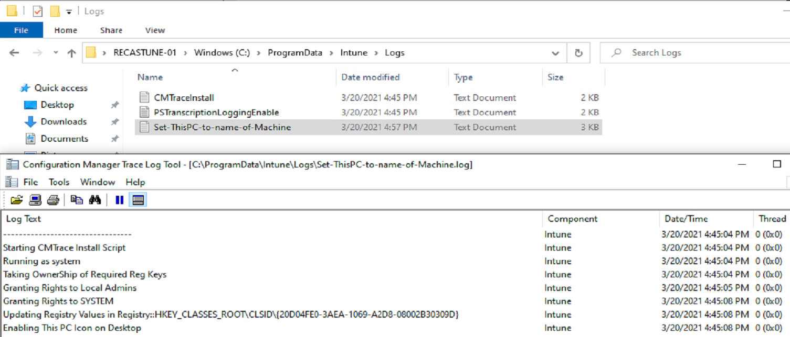
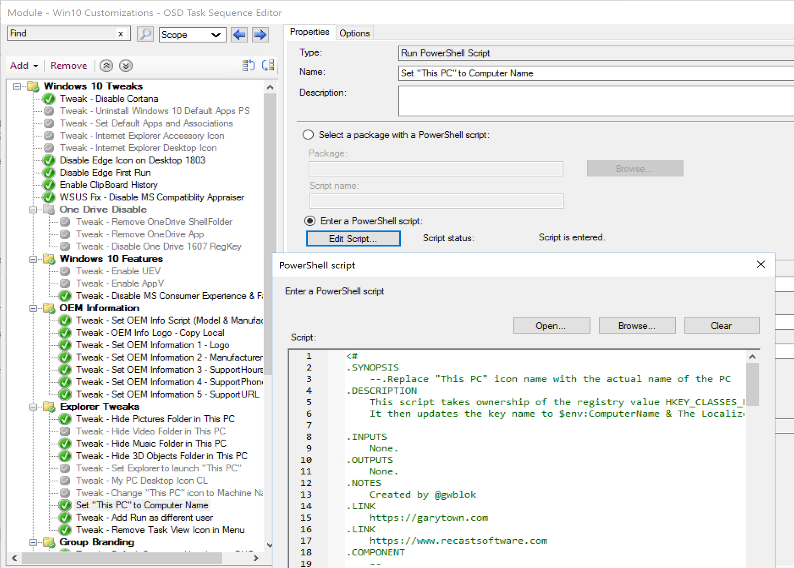

# Set This PC to Machine's hostname

This is a very simple idea, but a bit tricky to implement.  The idea is, enabling the "This PC" icon on the desktop, then rename it to the actual name of the computer.  This is a handy and simple help desk tool, when requesting the computer name.

## Demo Image

[](media/Customization_ThisPC01.png)

## Deployment Methods

- Intune*
- ConfigMgr
  - Package
  - Baseline
  - Task Sequence*

 *Methods I'll cover

 I'm going to Cover the Intune method, and the Task Sequence method, basically all other methods are just different ways of running the PowerShell Script.

## Intune

 I've uploaded the [script to GitHub](https://github.com/gwblok/garytown/blob/master/Intune/Set-ThisPC-icon-to-Machine-name.ps1) which can be leveraged in Intune.

In Intune:
[](media/Customization_ThisPC03.png)

Script creates logs:
[](media/Customization_ThisPC04.png)

Finished Product:
[](media/Customization_ThisPC05.png)

## Task Sequence Step

[](media/Customization_ThisPC02.png)

While this example is an embedded script, it's long enough I recommend creating a powershell file and placing it in a Package and calling it from there, but for development, this was faster.

## Code

```PowerShell

<#
.SYNOPSIS
    --.Replace "This PC" icon name with the actual name of the PC
.DESCRIPTION
    This script takes ownership of the registry value HKEY_CLASSES_ROOT\CLSID\{20D04FE0-3AEA-1069-A2D8-08002B30309D}
    It then updates the key name to $env:ComputerName & The LocalizedName as well

.INPUTS
    None.
.OUTPUTS
    None.
.NOTES
    Created by @gwblok
.LINK
    https://garytown.com
.LINK
    https://www.recastsoftware.com
.COMPONENT
    --
.FUNCTIONALITY
    --
#>

## Set script requirements
#Requires -Version 3.0

##*=============================================
##* VARIABLE DECLARATION
##*=============================================
#region VariableDeclaration

$ScriptVersion = "21.2.7.1"

#endregion
##*=============================================
##* END VARIABLE DECLARATION
##*=============================================

##*=============================================
##* FUNCTION LISTINGS
##*=============================================
#region FunctionListings

function enable-privilege {
 param(
  ## The privilege to adjust. This set is taken from
  ## http://msdn.microsoft.com/en-us/library/bb530716(VS.85).aspx
  [ValidateSet(
   "SeAssignPrimaryTokenPrivilege", "SeAuditPrivilege", "SeBackupPrivilege",
   "SeChangeNotifyPrivilege", "SeCreateGlobalPrivilege", "SeCreatePagefilePrivilege",
   "SeCreatePermanentPrivilege", "SeCreateSymbolicLinkPrivilege", "SeCreateTokenPrivilege",
   "SeDebugPrivilege", "SeEnableDelegationPrivilege", "SeImpersonatePrivilege", "SeIncreaseBasePriorityPrivilege",
   "SeIncreaseQuotaPrivilege", "SeIncreaseWorkingSetPrivilege", "SeLoadDriverPrivilege",
   "SeLockMemoryPrivilege", "SeMachineAccountPrivilege", "SeManageVolumePrivilege",
   "SeProfileSingleProcessPrivilege", "SeRelabelPrivilege", "SeRemoteShutdownPrivilege",
   "SeRestorePrivilege", "SeSecurityPrivilege", "SeShutdownPrivilege", "SeSyncAgentPrivilege",
   "SeSystemEnvironmentPrivilege", "SeSystemProfilePrivilege", "SeSystemtimePrivilege",
   "SeTakeOwnershipPrivilege", "SeTcbPrivilege", "SeTimeZonePrivilege", "SeTrustedCredManAccessPrivilege",
   "SeUndockPrivilege", "SeUnsolicitedInputPrivilege")]
  $Privilege,
  ## The process on which to adjust the privilege. Defaults to the current process.
  $ProcessId = $pid,
  ## Switch to disable the privilege, rather than enable it.
  [Switch] $Disable
 )

 ## Taken from P/Invoke.NET with minor adjustments.
 $definition = @'
 using System;
 using System.Runtime.InteropServices;
  
 public class AdjPriv
 {
  [DllImport("advapi32.dll", ExactSpelling = true, SetLastError = true)]
  internal static extern bool AdjustTokenPrivileges(IntPtr htok, bool disall,
   ref TokPriv1Luid newst, int len, IntPtr prev, IntPtr relen);
  
  [DllImport("advapi32.dll", ExactSpelling = true, SetLastError = true)]
  internal static extern bool OpenProcessToken(IntPtr h, int acc, ref IntPtr phtok);
  [DllImport("advapi32.dll", SetLastError = true)]
  internal static extern bool LookupPrivilegeValue(string host, string name, ref long pluid);
  [StructLayout(LayoutKind.Sequential, Pack = 1)]
  internal struct TokPriv1Luid
  {
   public int Count;
   public long Luid;
   public int Attr;
  }
  
  internal const int SE_PRIVILEGE_ENABLED = 0x00000002;
  internal const int SE_PRIVILEGE_DISABLED = 0x00000000;
  internal const int TOKEN_QUERY = 0x00000008;
  internal const int TOKEN_ADJUST_PRIVILEGES = 0x00000020;
  public static bool EnablePrivilege(long processHandle, string privilege, bool disable)
  {
   bool retVal;
   TokPriv1Luid tp;
   IntPtr hproc = new IntPtr(processHandle);
   IntPtr htok = IntPtr.Zero;
   retVal = OpenProcessToken(hproc, TOKEN_ADJUST_PRIVILEGES | TOKEN_QUERY, ref htok);
   tp.Count = 1;
   tp.Luid = 0;
   if(disable)
   {
    tp.Attr = SE_PRIVILEGE_DISABLED;
   }
   else
   {
    tp.Attr = SE_PRIVILEGE_ENABLED;
   }
   retVal = LookupPrivilegeValue(null, privilege, ref tp.Luid);
   retVal = AdjustTokenPrivileges(htok, false, ref tp, 0, IntPtr.Zero, IntPtr.Zero);
   return retVal;
  }
 }
'@

 $processHandle = (Get-Process -id $ProcessId).Handle
 $type = Add-Type $definition -PassThru
 $type[0]::EnablePrivilege($processHandle, $Privilege, $Disable)
}

#endregion
##*=============================================
##* END FUNCTION LISTINGS
##*=============================================

##*=============================================
##* SCRIPT BODY
##*=============================================
#region ScriptBody

#Take OwnerShip
enable-privilege SeTakeOwnershipPrivilege 
$key = [Microsoft.Win32.Registry]::ClassesRoot.OpenSubKey("CLSID\{20D04FE0-3AEA-1069-A2D8-08002B30309D}",[Microsoft.Win32.RegistryKeyPermissionCheck]::ReadWriteSubTree,[System.Security.AccessControl.RegistryRights]::takeownership)
# You must get a blank acl for the key b/c you do not currently have access
$acl = $key.GetAccessControl([System.Security.AccessControl.AccessControlSections]::None)
$identity = "BUILTIN\Administrators"
$me = [System.Security.Principal.NTAccount]$identity
$acl.SetOwner($me)
$key.SetAccessControl($acl)

# After you have set owner you need to get the acl with the perms so you can modify it.
$acl = $key.GetAccessControl()
$rule = New-Object System.Security.AccessControl.RegistryAccessRule ($identity,"FullControl","Allow")
$acl.SetAccessRule($rule)
$key.SetAccessControl($acl)

$key.Close()


#Grant Rights to Admin & System
# Set Adminstrators of Full Control of Registry Item
$RegistryPath = "Registry::HKEY_CLASSES_ROOT\CLSID\{20D04FE0-3AEA-1069-A2D8-08002B30309D}"

$identity = "BUILTIN\Administrators"
$RegistrySystemRights = "FullControl"
$type = "Allow"
# Create new rule
$RegistrySystemAccessRuleArgumentList = $identity, $RegistrySystemRights, $type
$RegistrySystemAccessRule = New-Object -TypeName System.Security.AccessControl.RegistryAccessRule -ArgumentList $RegistrySystemAccessRuleArgumentList
# Apply new rule
$NewAcl.SetAccessRule($RegistrySystemAccessRule)
Set-Acl -Path $RegistryPath -AclObject $NewAcl


# Set SYSTEM to Full Control of Registry Item
$identity = "NT AUTHORITY\SYSTEM"
$RegistrySystemRights = "FullControl"
$type = "Allow"
# Create new rule
$RegistrySystemAccessRuleArgumentList = $identity, $RegistrySystemRights, $type
$RegistrySystemAccessRule = New-Object -TypeName System.Security.AccessControl.RegistryAccessRule -ArgumentList $RegistrySystemAccessRuleArgumentList
# Apply new rule
$NewAcl.SetAccessRule($RegistrySystemAccessRule)
Set-Acl -Path $RegistryPath -AclObject $NewAcl


#Set the Values to actually make this work
Set-Item -Path $RegistryPath -Value $env:COMPUTERNAME -Force
Set-ItemProperty -Path $RegistryPath -Name "LocalizedString" -Value  $env:COMPUTERNAME -Force

#Enable the "This PC" Icon to show on Desktop
Set-ItemProperty -Path "HKLM:Software\Microsoft\Windows\CurrentVersion\Explorer\HideDesktopIcons\NewStartPanel" -Name "{20D04FE0-3AEA-1069-A2D8-08002B30309D}" -Value 0 -Force

#Write Out the Value of the Key
Get-Item -Path $RegistryPath


exit $exitcode
#endregion
##*=============================================
##* END SCRIPT BODY
##*=============================================

```

## Summary

That's it, simple concept, simple to add to your task sequence, and super handy.

**About Recast Software**
1 in 3 organizations using Microsoft Configuration Manager rely on Right Click Tools to surface vulnerabilities and remediate quicker than ever before.  
[Download Free Tools](https://www.recastsoftware.com/?utm_source=cmdocs&utm_medium=referral&utm_campaign=cmdocs#formarea)  
[Request Pricing](https://www.recastsoftware.com/pricing?utm_source=cmdocs&utm_medium=referral&utm_campaign=cmdocs)
