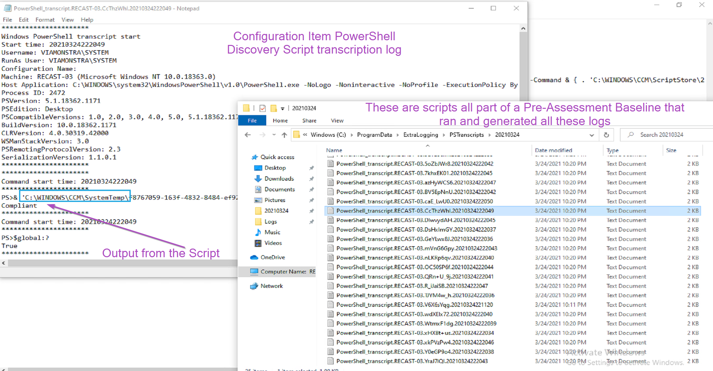

# ConfigMgr & Intune PowerShell Script Troubleshooting

Recently I've worked on several projects that I've had to troubleshoot PowerShell scripts on places that I didn't have access to "see" what was going on.  This was actually very beneficial in improving my powershell abilities, as I realized I needed to include way more logging and find additional ways to test.

On this page, the goal is to cover several methods to assist in troubleshooting scripts, when it's not as simple as opening powershell and running it as your logged on user.  

Here are some common places where you'll run into scripts that you won't have the most visibility into them and can make troubleshooting difficult.

- Intune Scripts
  - [Add Scripts](https://docs.microsoft.com/en-us/mem/intune/apps/intune-management-extension)
    - Runs from 'C:\Program Files (x86)\Microsoft Intune Management Extension\Policies\Scripts'
- ConfigMgr
  - [Task Sequences](https://docs.microsoft.com/en-us/mem/configmgr/osd/understand/task-sequence-steps#BKMK_RunPowerShellScript) | [Recast Docs](https://docs.recastsoftware.com/ConfigMgr-Docs/TaskSequence/SCCM_TaskSequence_Step_RunPowerShellScript.html)
    - During WinPE: **%temp%\SMSTSPowerShellScripts** where %temp% = X:\windows temp
    - During FullOS: **%temp%\SMSTSPowerShellScripts** where %temp% = C:\windows\Temp
  - [Configuration Items](https://docs.microsoft.com/en-us/mem/configmgr/compliance/deploy-use/create-custom-configuration-items-for-windows-desktop-and-server-computers-managed-with-the-client)
    - Runs from: 'C:\windows\ccm\SystemTemp'
  - [Run Scripts Node](https://docs.microsoft.com/en-us/mem/configmgr/apps/deploy-use/create-deploy-scripts)
    - Runs from: 'c:\windows\ccm\ScriptStore'
- Scheduled Tasks

Most of the time, leveraging those tools you'll have the scripts running as SYSTEM.  Scheduled tasks you can set to run as SYSTEM, or a Service Account, which I'd recommend leveraging group managed service accounts.

Methods I found helpful:

- PowerShell Transcription
- Custom Logging
- Leveraging Software Center
  - Providing a Task Sequence Environment for Testing Scripts
  - Launching ISE or VSCode as SYSTEM for Testing Scripts

## Demos

### Enable PS Transcription w/ Run Scripts

We're going to create a run script that enables PowerShell Transcription, you can find the
[Script File on GitHub](https://github.com/gwblok/garytown/blob/master/RunScripts/Set-PSTranscription.ps1)

You can then copy the RAW code, or put the link to RAW code in the import:

 

Since we know we only want 2 options for the parameter, lets pre-populate them, click edit, choose data type: List, then add Enable & Disable:

Once you're done, it will look like so:

Now lets pick a test machine, and run the script with the Enable Value:

And completed with Enable:

Lets go look at the client, this is our custom logging built into the script we just added:

Then to generate a PowerShell transcription log, I ran the run script again. In the folder we specified to host the transcription logs, we find:

### Configuration Items

### Task Sequence Scripts

First I'm going to show examples of some scripts and how they run.

So while not technically a script, a powershell command running from a command line step:  

There you see that when you run a powershell command via command line, no script is temporary created to run it, unlike an embedded script:

And here a script inside a package, as expected, runs out of the package location:

Once again, we leveraged PowerShell transcription to see where the scripts where running from, the context they were running under, and the write-output generated by the script.  

### Intune

With InTune, I've created two scripts, one to enable PowerShell Transcription and one to Disable.

One thing I've learned about using PowerShell Script with Intune, you never know when it's going to run, or how often.  This is why logging is so important.  I leverage CMTrace Style logging in all of my scripts based on [Ryan Ephgrave's function](https://www.ephingadmin.com/powershell-cmtrace-log-function/).

Another thing I've learned about creating scripts for Intune, design them like a Configuration Item.  What do I mean by that?  The Script needs to follow a template.

- Detection
  - Does the Script apply to this machine.  While sure, you can build groups in Intune, but building logic into the script is always a good idea.
- Discovery
  - Checking if the machine is compliant already (If the end goal of your script is already accomplished)
- Remediation
  - Run the Script Content to achieve your desired goal

For Intune, I'm going to deploy the [Enable-PSTranscription.ps1](https://github.com/gwblok/garytown/blob/master/Intune/Enable-PSTranscription.ps1) Script

The first time the script runs, it logs using the function, and setups up PS Transcription, which then will do additional logging every time after that.

In the image below, you can see the log file created by the script itself each time the script runs with the logging, and in the lower log, the transcription log for that execution of the script.

Looking at the logging I've added to the script, you can see how it follows the Discovery & Remediation process.  The first time it runs, it discovers that it is "Non-Compliant", and then "Remediates" by enabling Transcription.  The second run, it Discovers that it's already Compliant, and exits.

Following this method will help reduce the load on your Intune managed devices, especially for complicated scripts that could tie up an endpoint device for awhile each time the script runs.

### Troubleshooting Tips

- Custom Logging - Leverage a function like CMTraceLog
  - Lots of Error handling and write outputs
- Know how to Pause a Task Sequence in WinPE & Full OS
  - I recommend you create a ["Debug" Task Sequence](https://www.recastsoftware.com/resources/a-week-of-task-sequence-tips-day-02/) to assist
- Know how to test PowerShell as System
  - I like to use a [Package that triggers a Command Prompt from Software Center](https://garytown.com/run-powershell-ise-as-system-to-test-scripts-from-software-center)
- Make sure your AV has those areas excluded

**About Recast Software**
1 in 3 organizations using Microsoft Configuration Manager rely on Right Click Tools to surface vulnerabilities and remediate quicker than ever before.  
[Download Free Tools](https://www.recastsoftware.com/?utm_source=cmdocs&utm_medium=referral&utm_campaign=cmdocs#formarea)  
[Request Pricing](https://www.recastsoftware.com/pricing?utm_source=cmdocs&utm_medium=referral&utm_campaign=cmdocs)
