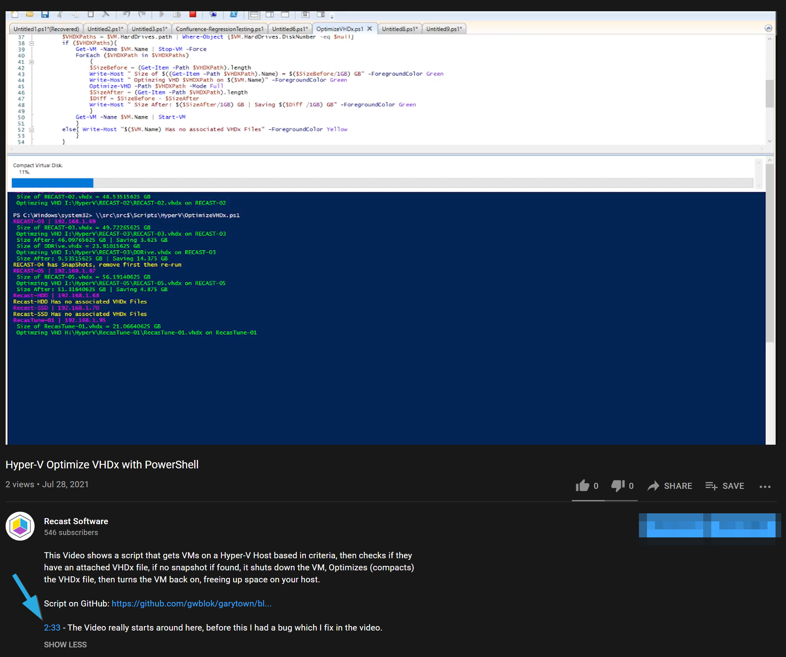

# Hyper-V - Automate VHDx Optimization

Another Hyper-V Post after I ran out of storage on my Windows 10 Hyper-V Host.

TLDR: Full Script on [GitHub](https://github.com/gwblok/garytown/blob/master/HyperV/HyperVOptimizeVHDxFiles.ps1)

The idea here was to create a script to run that would clean up each of the VMs (but only the ones I wanted), shut them down, compact the Virtual Hard Drive File (VHDx File), the boot up the VM again.

High Level Overview of an example:
Get all VMs on Host that match criteria that the VM is current On and that the VM Name (In Hyper-V) does not match Server.
```PowerShell
$VMs = Get-VM | Where-Object {$_.State -eq "Running" -and $_.Name -notmatch "Server"}
```
Once we have that infomration, we go a bit deeper by looping through each one using a ForEach

```PowerShell
Foreach ($VM in $VMs)
    {
    if (Get-VMSnapshot -VMName $VM.Name){
        Write-Host "$($VM.Name) has SnapShots, remove first then re-run" -ForegroundColor Yellow
        }
    else{

        #More Code...
        }
    }
```

First we check if there is a snapshot, if there is, we move on to the next one.  Sure we could automatically delete the snapshots too.. but they might be there for a reason, and I don't want to willy nilly delete them all.

If they don't have a snap shot... I get the IP Address assigned to the VM

```PowerShell
$IPAddress = (Get-VM -Name "$($VM.Name)" | Select -ExpandProperty networkadapters).IPAddresses | Select-Object -First 1
Write-Host "$($VM.Name) | $IPAddress" -ForegroundColor Magenta
```

Then as long as your DNS is setup properly, you can get the Machine's Windows Name from DNS.  I then have it run a remote powershell script to do cleanup.  The Script is in the $RemoteScript variable. 

```PowerShell
$VMNetName = [System.Net.Dns]::GetHostByAddress($IPAddress).Hostname
Write-Host "$($VM.Name) = $VMNetName | $IPAddress" -ForegroundColor Magenta
Invoke-Command -ScriptBlock $RemoteScript -ComputerName $VMNetName -ErrorAction Stop
```
Remote Script Example which deletes Branch Cache & CCM Cache Items.
```PowerShell
$RemoteScript = 
{  
Clear-BCCache -Force
$CMObject = New-Object -ComObject 'UIResource.UIResourceMgr' 
$CMCacheObjects = $CMObject.GetCacheInfo() 
# Delete Cache item 
$CMCacheObjects.GetCacheElements() | ForEach-Object { 
    $CMCacheObjects.DeleteCacheElement($_.CacheElementID)
    }
}
```
Once that is done, we confirm that it has a VHDx and not a passthrough drive then shut down the VM
``` PowerShell
$VHDXPaths = $VM.HardDrives.path | Where-Object {$VM.HardDrives.DiskNumber -eq $null}
        if ($VHDXPaths){
            Get-VM -Name $VM.Name | Stop-VM -Force
```
Once the VM is off, we optimize it.

```PowerShell
ForEach ($VHDXPath in $VHDXPaths)
  {
  $SizeBefore = (Get-Item -Path $VHDXPath).length
  Write-Host " Size of $((Get-Item -Path $VHDXPath).Name) = $($SizeBefore/1GB) GB" -ForegroundColor Green
  Write-Host " Optimzing VHD $VHDXPath on $($VM.Name)" -ForegroundColor Green
  Optimize-VHD -Path $VHDXPath -Mode Full
  $SizeAfter = (Get-Item -Path $VHDXPath).length
  $Diff = $SizeBefore - $SizeAfter
  Write-Host " Size After: $($SizeAfter/1GB) GB | Saving $($Diff /1GB) GB" -ForegroundColor Green
  }
Get-VM -Name $VM.Name | Start-VM
```

Full Script on [GitHub](https://github.com/gwblok/garytown/blob/master/HyperV/HyperVOptimizeVHDxFiles.ps1), grab it and edit it for own needs.

To watch it in motion, check out the script running on YouTube.

[](https://www.youtube.com/watch?v=XNrcSqan_bg)

**About Recast Software**
1 in 3 organizations using Microsoft Configuration Manager rely on Right Click Tools to surface vulnerabilities and remediate quicker than ever before.  
[Download Free Tools](https://www.recastsoftware.com/?utm_source=cmdocs&utm_medium=referral&utm_campaign=cmdocs#formarea)  
[Request Pricing](https://www.recastsoftware.com/pricing?utm_source=cmdocs&utm_medium=referral&utm_campaign=cmdocs)
