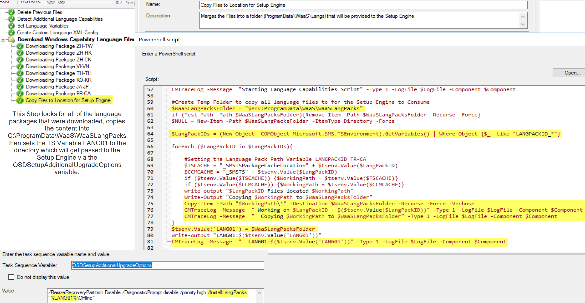

# Language Support CM Packages & Task Sequence Steps

## CM Packages

For keeping track of the language files, we've created a Package w/ a Pre-cache Program for each language we're supporting.

We also use the package to keep track of important elements of the Language, like the [GEO ID](https://docs.microsoft.com/en-us/windows/win32/intl/table-of-geographical-locations) and [Keyboard Layout](https://docs.microsoft.com/en-us/windows-hardware/manufacture/desktop/default-input-locales-for-windows-language-packs).

Required Content (ISOs) for the Language CM Packages.

- Features on Demand Part 1
- Language Pack
- Local Experience Packs

These ISOs can be downloaded from VLSC or My Visual Studio (Former MSDN).

The Language Package Contents:

It's broken up into 3 folders, the LocalExperiencePack (Installed after Upgrade), the Language Cabs that get passed to the setup engine (Offline), and the extra language FoDs that get installed via DISM after the upgrade.

Script on [GitHub](https://github.com/gwblok/garytown/blob/master/WaaS/Create-Language-CM-Packages.ps1) to create Packages once you have the 3 ISOs.

## Task Sequence Steps

With the packages created which holds the extra metadata needed to apply it to the Operating System, we leverage that information in the Task Sequence.  We've created a "Module", a child task sequence, which detects if additional languages packs are installed and records that information into task sequence variables, so it then knows which languages to download and apply during the upgrade.

Script on [GitHub](https://github.com/gwblok/garytown/blob/master/WaaS/Create-Lang-Package-Variables-TS-Function.ps1) to create the Dynamic Variables

Here we have a dynamic variable step that will based on detected languages will map which CM Packages need to be downloaded and the information needed to re-apply during the upgrade:

Downloading the language packs are completely dynamic, meaning that none of them are directly referenced, since we don't want machines downloading a language pack that doesn't need it.

So now that we have it download the language packages, we copy them all to a single location and set that location to TS Variable "LANG01", which we then pass to the Setup Engine using the OSDSetupAdditionalUpgradeOptions variable.  The Setup Engine then applies the Language Pack Cabs during the upgrade.

During the Upgrade Step you can see that the Language Cabs will get passed in:

Then after the upgrade when we're back online on the new OS, we install the Local Experience Pack and any other Windows Capabilities we need

We also run the command to apply an XML file to set the language defaults.  The file was created in the Module in the step "[Create Custom Language XML Config](https://execmgrnet.wordpress.com/2017/09/20/installing-language-packs-windows-10-waas/)".

## Overview

And with that, we are able to support several languages, having them automatically reinstall during the upgrade, without leveraging dynamic updates, or downloading unused content.

You can get all of the task sequences in the WaaS Download Pack on GARYTOWN.Com

Script Links in one place:

- CM Packages for Languages: [GitHub](https://github.com/gwblok/garytown/blob/master/WaaS/Create-Language-CM-Packages.ps1)
- Task Sequence Dynamic Step: [GitHub](https://github.com/gwblok/garytown/blob/master/WaaS/Create-Lang-Package-Variables-TS-Function.ps1)

**About Recast Software**
1 in 3 organizations using Microsoft Configuration Manager rely on Right Click Tools to surface vulnerabilities and remediate quicker than ever before.  
[Download Free Tools](https://www.recastsoftware.com/?utm_source=cmdocs&utm_medium=referral&utm_campaign=cmdocs#formarea)  
[Request Pricing](https://www.recastsoftware.com/pricing?utm_source=cmdocs&utm_medium=referral&utm_campaign=cmdocs)
