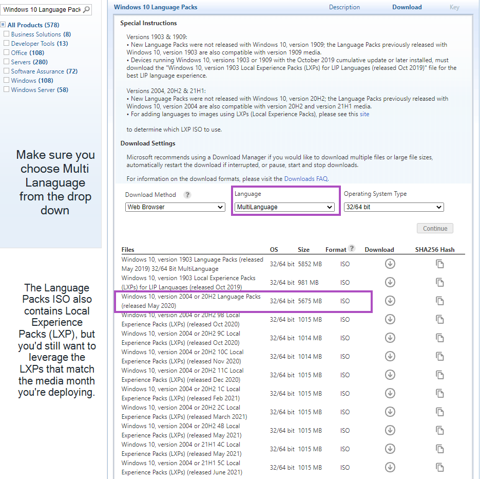

# Language Support

In this section, we're going to cover a method for supporting different language packs. The Baseline Windows WIM that we deploy is en-US, and to accommodate other languages, we apply additional language packs, features on demand (FoDs), and local experience packs (LXPs) This isn't the only method of course, but here we're going to focus on keeping all of the language packs in ConfigMgr Packages, and making them available for Operating System Deployment (OSD) or In-place upgrades (IPU) in a task sequence.

Resources we found helpful:

- [Available languages for Windows (MS Docs)](https://docs.microsoft.com/en-us/windows-hardware/manufacture/desktop/available-language-packs-for-windows)
- [Add languages to Windows images (MS Docs)](https://docs.microsoft.com/en-us/windows-hardware/manufacture/desktop/add-language-packs-to-windows)
- [Adding languages in Windows 10: Known issues (MS Docs)](https://docs.microsoft.com/en-us/windows-hardware/manufacture/desktop/language-packs-known-issue)

I was able to get the required ISOs from Microsoft Volume License Service Center, but they are also available on "My Visual Studio" aka MSDN.

**About Recast Software**
1 in 3 organizations using Microsoft Configuration Manager rely on Right Click Tools to surface vulnerabilities and remediate quicker than ever before.  
[Download Free Tools](https://www.recastsoftware.com/?utm_source=cmdocs&utm_medium=referral&utm_campaign=cmdocs#formarea)  
[Request Pricing](https://www.recastsoftware.com/pricing?utm_source=cmdocs&utm_medium=referral&utm_campaign=cmdocs)
