# Features on Demand - Reinstall RSAT

Remote Server Administration Tools or RSAT is used by a lot of System Admins.  During Windows 10 Servicing Upgrades, 1909 -> 20H2 for example, features on demands are removed.  This means you have to do something to have them automatically reinstalled if you want to improve the user experience.  You can achieve this by enabling dynamic updates, but if that isn't an option, you have a few other methods.

One method you can do is add them directly into the WIM file you're deploying, but then you're making your WIM bigger and it's applied to everyone.  I personally like to keep the WIM as lean as possible, then dynamically download only what is needed. 

The next method, and the one I'm going to go into more depth on, is creating a ConfigMgr package with the required feature on demand cab files, and then use a powershell step in the Windows upgrade task sequence to install RSAT

## Creating the ConfigMgr Package & Program

The Package is a standard package with the Feature on Demand Cabs.  You'll need to grab the Features on Demand (Disc 1) from Microsoft's Volume Licencing Site.  Once you have the ISO, you'll need to grab the Feature on Demand cabs you need.  Now the Disc has a lot more than just RSAT on it, along with many languages, so the entire ISO contents is about 5GB, which you don't want to have in your package.
I first found this script on the [Microsoft blog](https://techcommunity.microsoft.com/t5/core-infrastructure-and-security/rsat-on-windows-10-1809-in-disconnected-environments/ba-p/570833) that helped to get the files I needed, but quickly found there was still a lot of things left that I didn't need.

I took that script and modified it, then added the logic to automatically build a CM Package, along with a Program used for Pre-caching. The script can be found on [GitHub](https://techcommunity.microsoft.com/t5/core-infrastructure-and-security/rsat-on-windows-10-1809-in-disconnected-environments/ba-p/570833).

[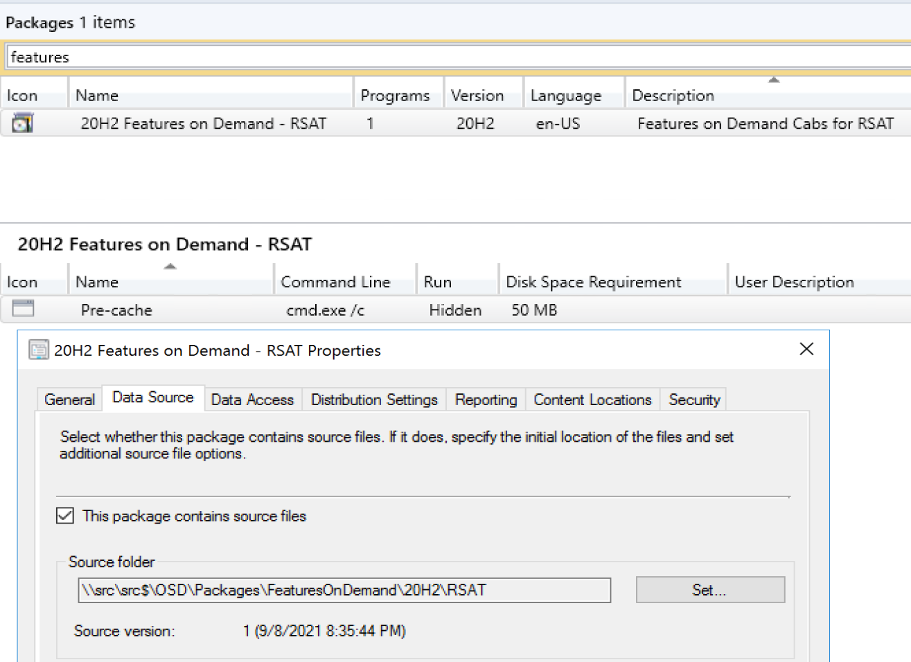](media/FoD02.png)
[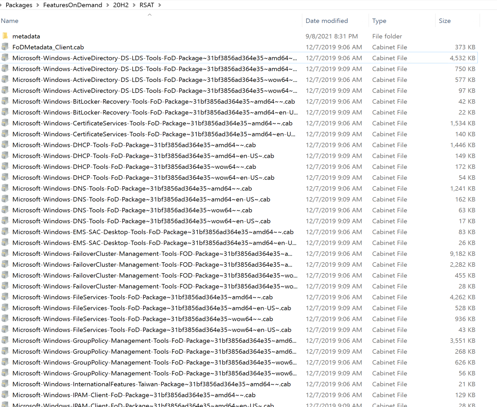](media/FoD01.png)
[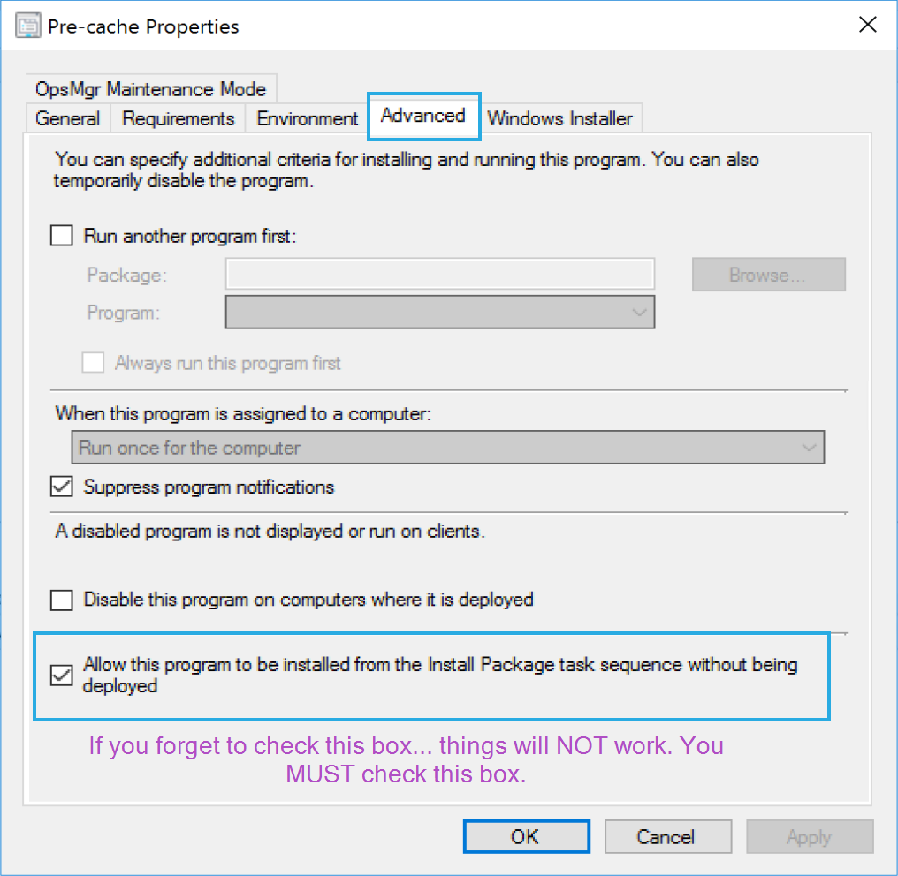](media/FoD10.png)

The Pre-cache Program is created which will allow you to call the package dynamically in the task sequence, so that it's not actually referenced in the task sequence.  Important, you must check the box on the program in the Advanced tab for "Allow this program to be installed from the Install Package task sequence without being deployed"

## Avoiding Referencing Packages in a Task Sequence

The reason you want to avoid having packages referenced in a task sequence is when that package is only needed on a small subset of machines.  You might want to pre-cache the task sequence ahead of time, or have it download all content before starting the task sequence, so you'd like to avoid having all machines download an extra 100MB or whatever it happens to be when only a few machines actually need it.  Prime examples for when this is helpful is Driver Packs, which can be very large and you'd like to have cached ahead of time, but they are model specific.

How do we achieve dynamically downloading the content only on machines that we want it downloaded?  It takes a few steps in the Task Sequence. 

Here is our Features on Demand Module for RSAT, you can see there are no references:
[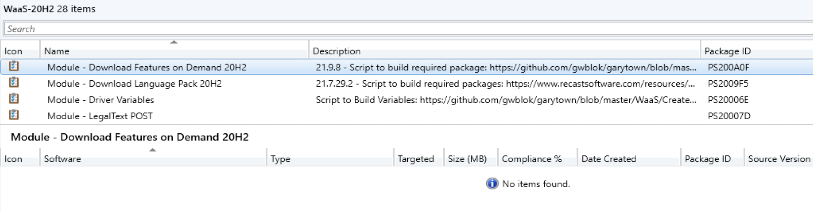](media/FoD03.png)

In the Task Sequence, I first check to see if RSAT is already installed on the machine while on the downlevel OS (1909).

[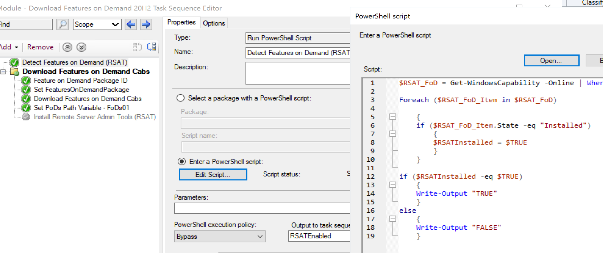](media/FoD04.png)

The next group will only run if RSAT was found, if it wasn't found, it just skips the group and moves on.
[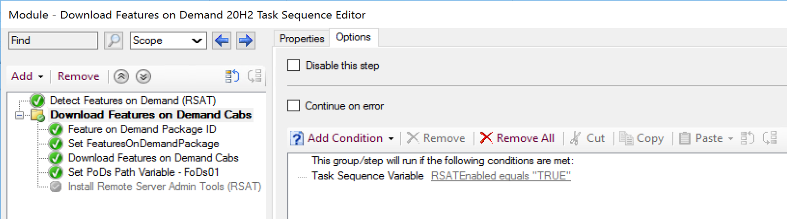](media/FoD05.png)

Here we create a Variable that holds the Package ID, used in the next step.
[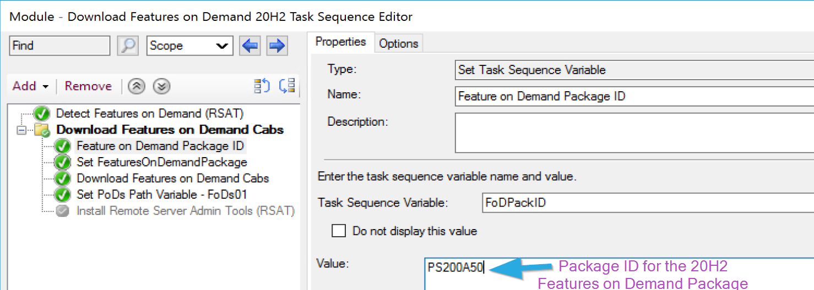](media/FoD06.png)

Now we take the ID and add :Pre-cache, which is the name of the Program on the RSAT Package.  With this information, the TS will know what to download.
[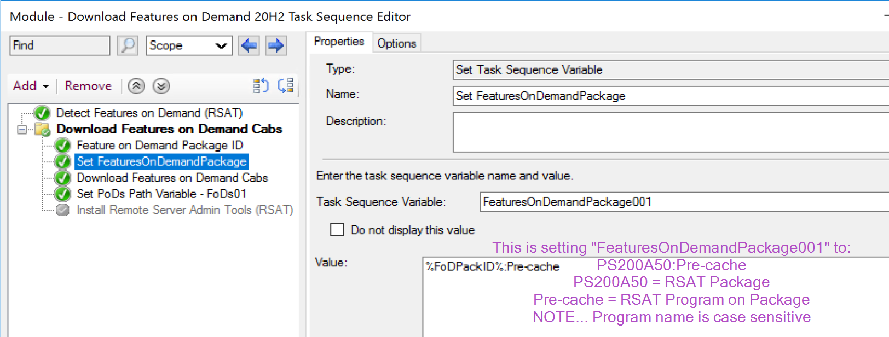](media/FoD07.png)

This step downloads the Package... because it runs the Program you created, which is why we have a "dummy" command line of "cmd.exe /c", so once it downloads the package, it runs the program instantly and does nothing, then moves on.  That's how we get package to download without referencing it.
[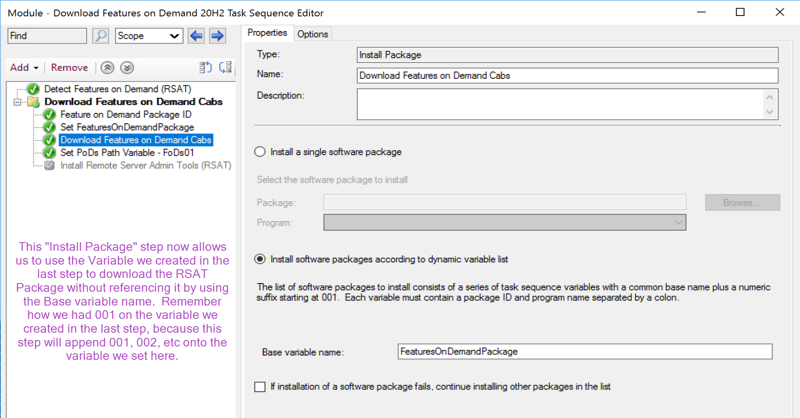](media/FoD08.png)

Now that it's downloaded, we need to keep track of where it is on the file system, so we can leverage the files in it later, thats where this powershell script comes in.
[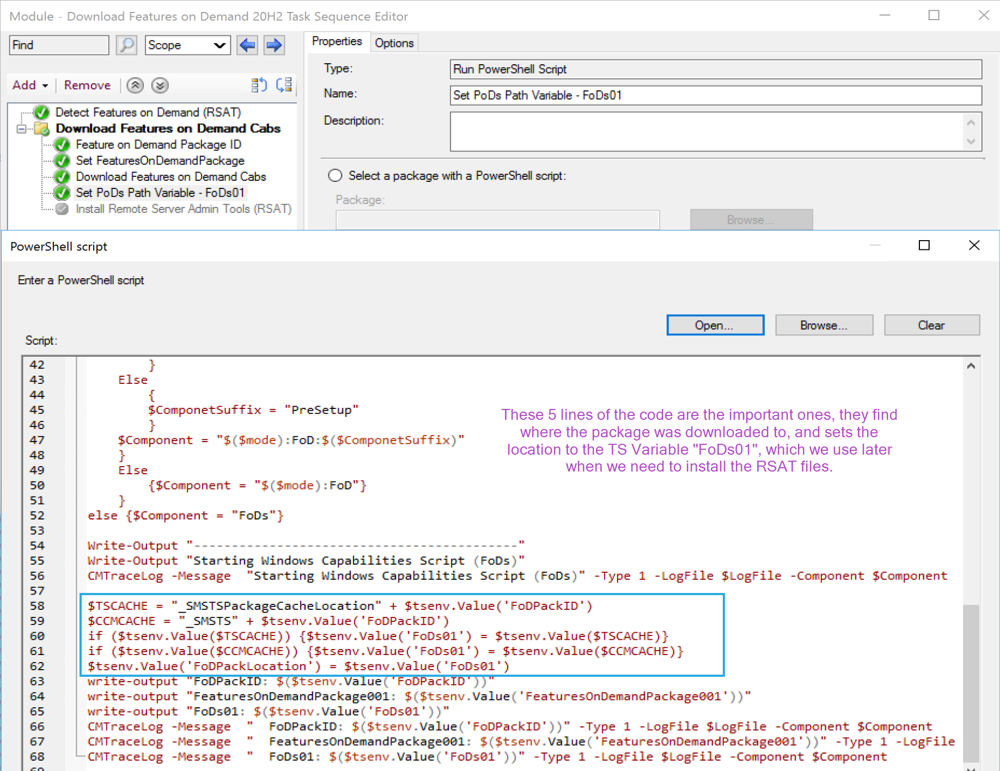](media/FoD09.png)

Basically to break it down, we're checking two possible variable locations it could have downloaded to, the task sequence cache area (_SMSTaskSeqeunce\Packages) or the CM Cache (c:\windows\ccmcache). If one of them exist in the TS variables, we grab the location and pass that into our own variable, in this case "FoDs01", so we can find the package contents later when we want to use them.

At this point, we've downloaded the content onto the machine and captured the location of the files, so we can let the machine upgrade windows.

## After Windows Upgrades - Reinstall of RSAT

After it the machine upgrades (1909 -> 20H2), we'll want to reinstall RSAT.  Leveraging the variable we created before the upgrade "RSATEnabled", we will call the script to reinstall RSAT, we also ensure that we have the location of the files "FoDs01" captured.

[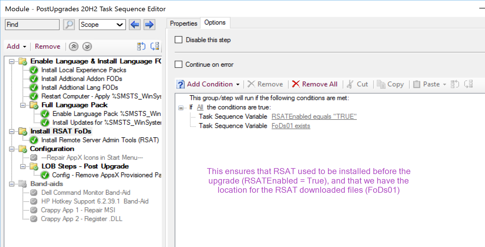](media/FoD11.png)

Then we leverage powershell again to install the Features on Demand.
[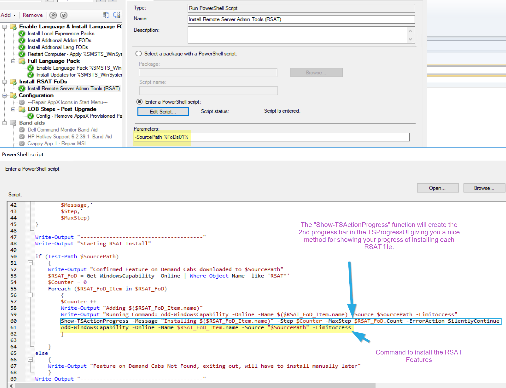](media/FoD12.png)
Script is on [GitHub](https://github.com/gwblok/garytown/blob/master/WaaS/Install_RSAT.ps1)

Note, if you have several languages installed on a single machine, you need to have all of the language files for each feature you want to install.  I ran into that issue when I was using the same test machine to reinstall several languages on a machine, and trying to reinstall RSAT.  RSAT install failed until I provided it all of the additional language RSAT files for each language I had installed.

**About Recast Software**
1 in 3 organizations using Microsoft Configuration Manager rely on Right Click Tools to surface vulnerabilities and remediate quicker than ever before.  
[Download Free Tools](https://www.recastsoftware.com/?utm_source=cmdocs&utm_medium=referral&utm_campaign=cmdocs#formarea)  
[Request Pricing](https://www.recastsoftware.com/pricing?utm_source=cmdocs&utm_medium=referral&utm_campaign=cmdocs)
