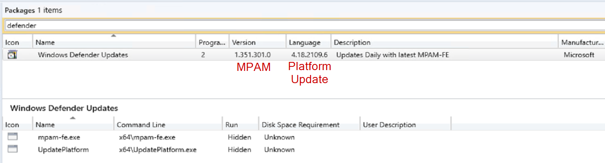
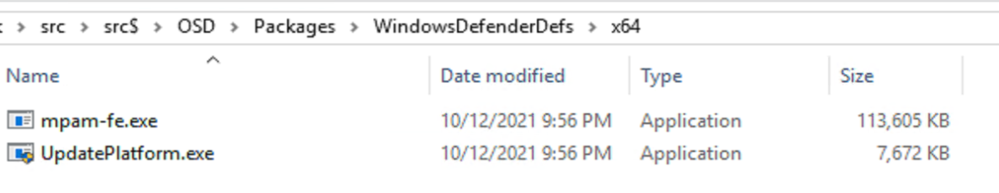
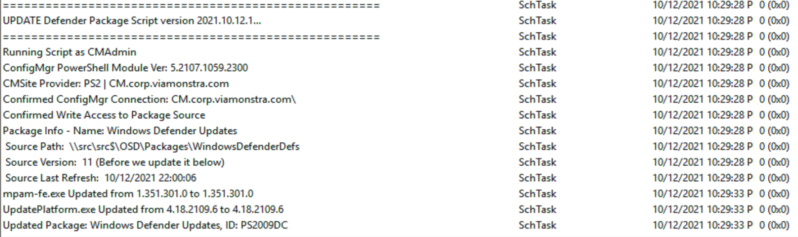
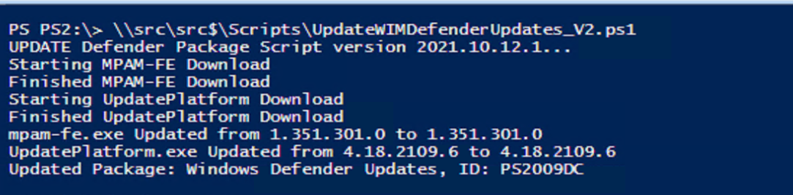
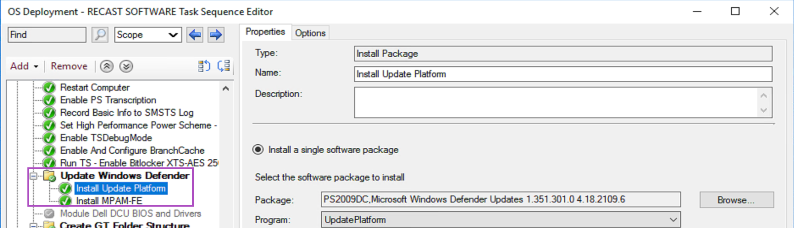

# Windows Defender - ConfigMgr Package Updater

Windows Defender is built into Windows, and there are a couple of updates that happen regularly.  Definition updates (MPAM-PE.exe) that happen daily, and Platform updates (UpdatePlatform.exe) which happen monthly.

To add these updates into OSD, so that Defender would be completely updated ASAP, I've setup a script that downloads the updates into a CM Package and distributes, making it available for OSD.

## MS Docs

- [Platform Updates Information](https://docs.microsoft.com/en-us/microsoft-365/security/defender-endpoint/manage-updates-baselines-microsoft-defender-antivirus?view=o365-worldwide#:~:text=Platform%20version%20included%20with%20Windows%2010%20releases%20,%20%201.1.15000.2%20%204%20more%20rows%20)
- [Latest security intelligence updates for Microsoft Defender Antivirus](https://www.microsoft.com/en-us/wdsi/defenderupdates?ranMID=24542&ranEAID=TnL5HPStwNw&ranSiteID=TnL5HPStwNw-ywv7diDw5Zx1d5vlZitDSQ&epi=TnL5HPStwNw-ywv7diDw5Zx1d5vlZitDSQ&irgwc=1&irclickid=_cdyqnmiqgckftliekk0sohzjxn2xpksmaywdhgac00)
- [Update Defender Offline](https://support.microsoft.com/en-us/topic/microsoft-defender-update-for-windows-operating-system-installation-images-1c89630b-61ff-00a1-04e2-2d1f3865450d)

## Updating Options

### Offline

Before I landed on this process I went with, I looked at updating our offline media so the Windows WIM would always be updated, but I'd have to do this frequently to keep the definitions constantly updated, so I ruled out this approach.  I was going to leverage a process that automatically downloaded the 'defender-update-kit-[x86|x64].zip' file and apply to the Windows Image in CM.  This would be a great way to keep the Platform updated monthly.

### Hybrid

This idea would leverage the idea above to update the Platform in the WIM monthly as we apply updates to the OS.  Then during OS, update the Definitions, based on the next idea.  This was the idea I was going to do, as there wasn't a way to easily download the Platform Updates until recently when MS create a static link to be able to always download the latest Platform Update.

### Online

This idea leaves the WIM alone, and applies all of the updates during OSD.  This is the process I landed on, as it was easy to script downloading the Definitions and the Platform updates into a CM package, and have them apply during OSD, which only add seconds to the entire process.   The Script is then controlled via a Scheduled Task that runs with a gSMA account that has rights to both the file system and ConfigMgr to be able to update the package.  I've set the scheduled task to run the script daily. 

## Example - In Action

Package in ConfigMgr:

Package Contents:

Log File for Script on Scheduled Task

PowerShell Output:

In Task Sequence:

## The Script

The script is located on [GitHub](https://github.com/gwblok/garytown/tree/master/Automation/WindowsDefender), and thanks goes to Johan Schrewelius & Andre Picker for getting the script started and making it easy to add in additional functionality. You can find the original script on [Johan's Page](https://onevinn.schrewelius.it/Scripts01.html), along with a lot of other amazing tools and scripts.

**About Recast Software**
1 in 3 organizations using Microsoft Configuration Manager rely on Right Click Tools to surface vulnerabilities and remediate quicker than ever before.  
[Download Free Tools](https://www.recastsoftware.com/?utm_source=cmdocs&utm_medium=referral&utm_campaign=cmdocs#formarea)  
[Request Pricing](https://www.recastsoftware.com/pricing?utm_source=cmdocs&utm_medium=referral&utm_campaign=cmdocs)
