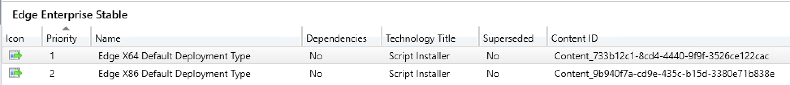
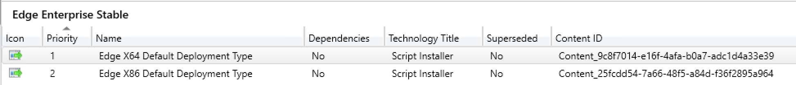
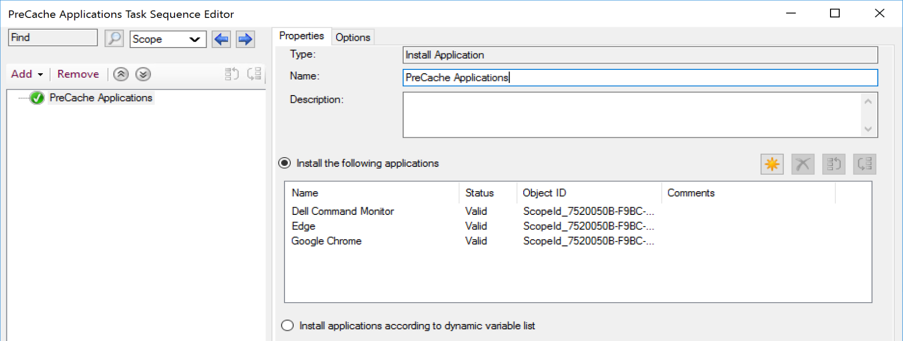
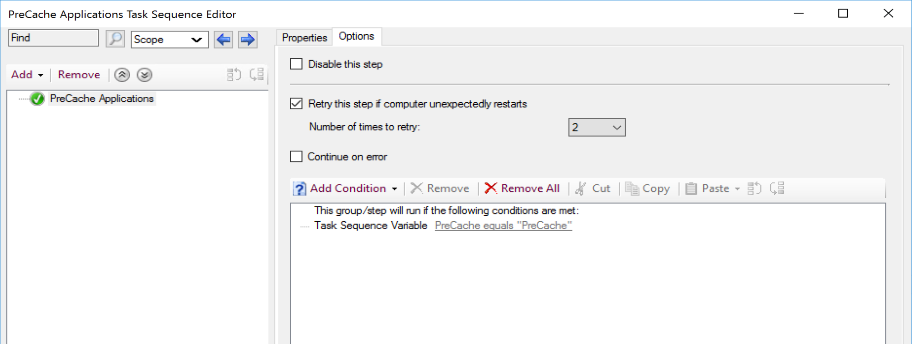
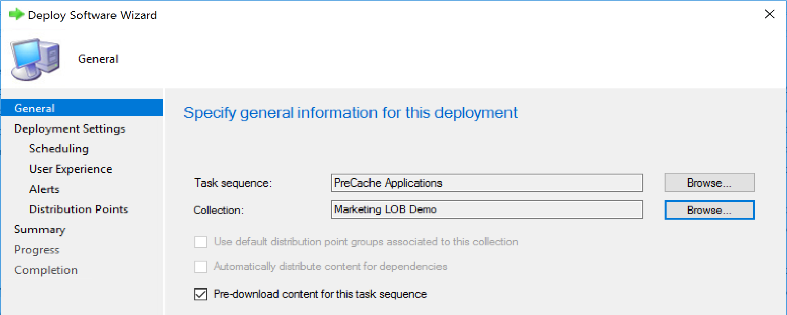
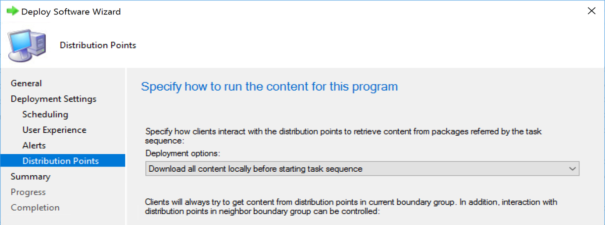

# Applications

Applications in Configuration Manager were introduced in ConfigMgr 2012.  With it, a new content identifier. Before this, everything had a PackageID, which you could track it's content source, but with Apps, not so.

## MS Docs

<https://docs.microsoft.com/en-us/mem/configmgr/apps/get-started/create-and-deploy-an-application>

## Content

[](media/Applications01.png)

The Content is unique per Application DT on the Application.  It all updates Each time you change the content for the app.

I've just "Updated Content" On both Application DTs
[](media/Applications02.png)

The Content ID's have changed.  This little fact makes monitoring Application Content in the Cache on end points quite difficult.

Running this powershell code will output any Applications that have content in the cache.

## CCM Cache on Client

``` powershell
$CMObject = New-Object -ComObject 'UIResource.UIResourceMgr'  
$CMCacheObjects = $CMObject.GetCacheInfo()
$CIModel = Get-CimInstance -Namespace root/ccm/CIModels -ClassName CCM_AppDeliveryTypeSynclet
$CCMCacheApps = $CMCacheObjects.GetCacheElements() | Where-Object {$_.ContentId -match "Content"}
```

``` output
[RECAST-04]: PS C:\Users\CMAdmin\Documents> $CMObject = New-Object -ComObject 'UIResource.UIResourceMgr'  
$CMCacheObjects = $CMObject.GetCacheInfo()
$CIModel = Get-CimInstance -Namespace root/ccm/CIModels -ClassName CCM_AppDeliveryTypeSynclet
$CCMCacheApps = $CMCacheObjects.GetCacheElements() | Where-Object {$_.ContentId -match "Content"}

[RECAST-04]: PS C:\Users\CMAdmin\Documents> $CCMCacheApps


ContentId         : Content_a2811030-8ca1-43cd-b5c0-dd386a437b08
ContentVersion    : 1
Location          : C:\WINDOWS\ccmcache\t
LastReferenceTime : 10/23/2020 3:08:52 PM
ReferenceCount    : 0
ContentSize       : 2482072
CacheElementId    : {0DCBCF2A-7D3F-40F0-AA48-F79962ECE1D8}

ContentId         : Content_2450c47d-de3b-4fd6-bfae-b940189efefd
ContentVersion    : 1
Location          : C:\WINDOWS\ccmcache\3
LastReferenceTime : 10/9/2020 7:39:46 PM
ReferenceCount    : 0
ContentSize       : 819
CacheElementId    : {24A7B509-DB72-460F-A81B-31353D9F59CE}

ContentId         : Content_2c0204fc-508f-4ec8-aef1-80876b6b548a
ContentVersion    : 1
Location          : C:\WINDOWS\ccmcache\v
LastReferenceTime : 10/23/2020 4:11:34 PM
ReferenceCount    : 0
ContentSize       : 60
CacheElementId    : {1C0DA068-70AD-4086-B731-9EA0BAC0F956}

ContentId         : Content_89764dcf-1a3c-4488-bdab-a8bc746b2e58
ContentVersion    : 1
Location          : C:\WINDOWS\ccmcache\1
LastReferenceTime : 10/9/2020 7:34:37 PM
ReferenceCount    : 0
ContentSize       : 996
CacheElementId    : {CFCF507E-1C09-4562-9DF5-C8CDA5E85258}
```

Now at this point, you'd have to look up the ContentId by checking out your console... or do some fancy WMI Queries to potentially find a match.

Script for gathering a bit more info via PowerShell on [GitHub](https://github.com/gwblok/garytown/blob/master/CM_PowerShell_Snips/Get-CCMCacheApps.ps1)

Results:

```Output
AppDeliveryTypeId   : ScopeId_7520050B-F9BC-452E-AD92-210A44FC8FDE/DeploymentType_019cc3d9-e441-4abe-9978-963945e6f6d9
AppDeliveryTypeName : Microsoft 365 Content
ContentVersion      : 1
LastReferenceTime   : 10/23/2020 3:08:52 PM
ContentId           : Content_a2811030-8ca1-43cd-b5c0-dd386a437b08
Location            : C:\WINDOWS\ccmcache\t
ContentSize         : 2482072

AppDeliveryTypeId   : ScopeId_7520050B-F9BC-452E-AD92-210A44FC8FDE/DeploymentType_1e4bea6b-c3df-4e6c-94d6-8e3192635a1a
AppDeliveryTypeName : WMIExplorer
ContentVersion      : 1
LastReferenceTime   : 10/9/2020 7:39:46 PM
ContentId           : Content_2450c47d-de3b-4fd6-bfae-b940189efefd
Location            : C:\WINDOWS\ccmcache\3
ContentSize         : 819

AppDeliveryTypeId   : ScopeId_7520050B-F9BC-452E-AD92-210A44FC8FDE/DeploymentType_f2f079af-a5c1-41c1-aa85-f85a98f7ad45
AppDeliveryTypeName : Microsoft 365 Office - Semi-Annual Enterprise Channel
ContentVersion      : 1
LastReferenceTime   : 10/23/2020 4:11:34 PM
ContentId           : Content_2c0204fc-508f-4ec8-aef1-80876b6b548a
Location            : C:\WINDOWS\ccmcache\v
ContentSize         : 60

AppDeliveryTypeId   : ScopeId_7520050B-F9BC-452E-AD92-210A44FC8FDE/DeploymentType_a41e39c2-f926-4d5f-9178-8bf2ec8f13f2
AppDeliveryTypeName : Local Administrator Password Solution - Windows Installer (*.msi file)
ContentVersion      : 1
LastReferenceTime   : 10/9/2020 7:34:37 PM
ContentId           : Content_89764dcf-1a3c-4488-bdab-a8bc746b2e58
Location            : C:\WINDOWS\ccmcache\1
ContentSize         : 996
```

From these results, the script maps the Content ID to an Application Deployment Type.

> [!NOTE]
> You won't always find a match from the cache to an AppDT.  If you've updated the Application, the Content ID Changes. There could be older applications in your ccmcache that have new Content ID in CM because you've updated the content. You'd not get a match on those.  
> The other reason you might not get a match is if you have an application in the cache for a referenced item that is not directly deployed to the machine.

## Pre-Cache Applications

If you want to pre-cache an application on a device, there are a few ways to do it.

- Required Deployment of the Application.  This will cause the clients to start downloading the content once the deployment becomes available.
- Task Sequence - Add a step "Install Application" add the applications:
[](media/Applications03.png)  Set the Options Conditions to a variable and a value that will NEVER be true, so this step will ALWAYS be SKIPPED.
[](media/Applications04.png)
  - Available Deployment of a Task Sequence with the Application
    - Check Box on deployment "Pre-download content for this task sequence" [](media/Applications05.png)

  - Available or Required Deployment of a Task Sequence with the Application
    - Set the Deployment Option to "Download all content locally before starting task sequence.  [](media/Applications06.png)

If you follow those things, the Application will be Pre-Cached on a device before being Installed.  This is helpful if you have specific applications you'd like to pre-cache on devices so when users go to install via software center, the content is already downloaded, or if you're updating applications via a Task Sequence or even normal required deployment, it ensures the content is already downloaded ahead of time so when deadline arrives, or Task Sequence is started, you won't have to wait for content.

> [!NOTE]
> This will Pre-Cache all of those applications in the Task Sequence, even if you don't need to.  All referenced items in a Task Sequence would be pre-cached.  

**About Recast Software**
1 in 3 organizations using Microsoft Configuration Manager rely on Right Click Tools to surface vulnerabilities and remediate quicker than ever before.  
[Download Free Tools](https://www.recastsoftware.com/?utm_source=cmdocs&utm_medium=referral&utm_campaign=cmdocs#formarea)  
[Request Pricing](https://www.recastsoftware.com/pricing?utm_source=cmdocs&utm_medium=referral&utm_campaign=cmdocs)
