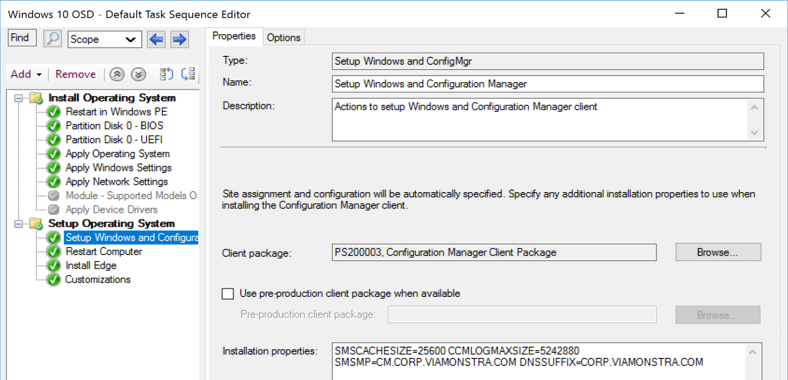
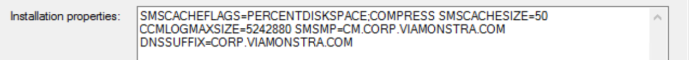
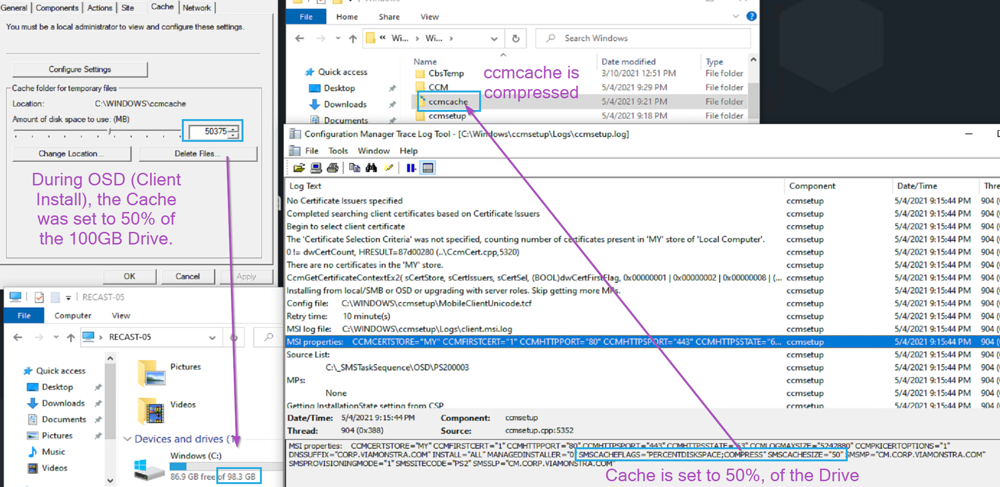
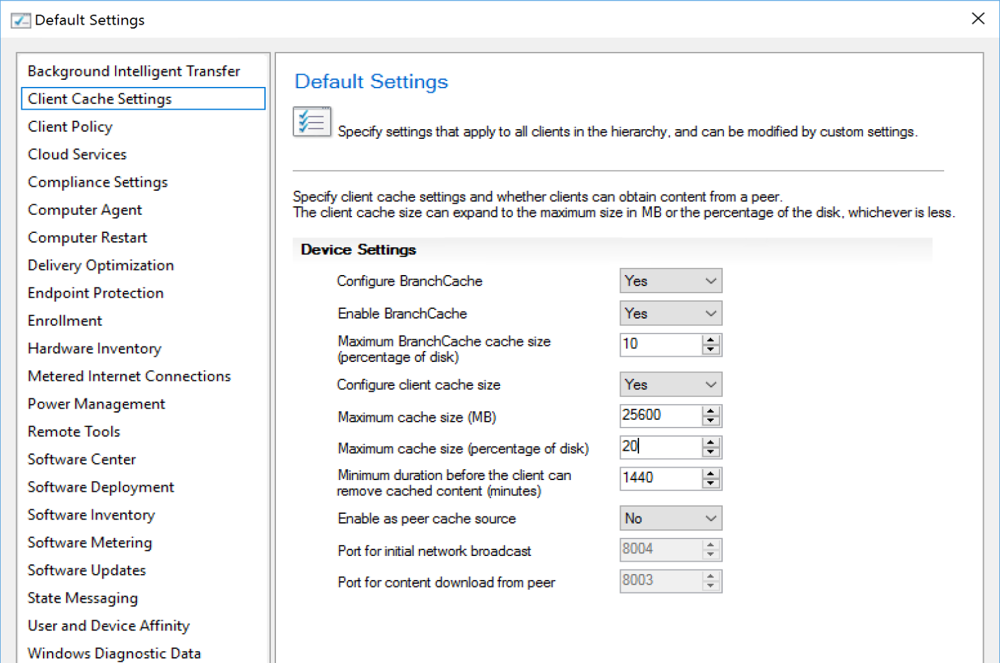
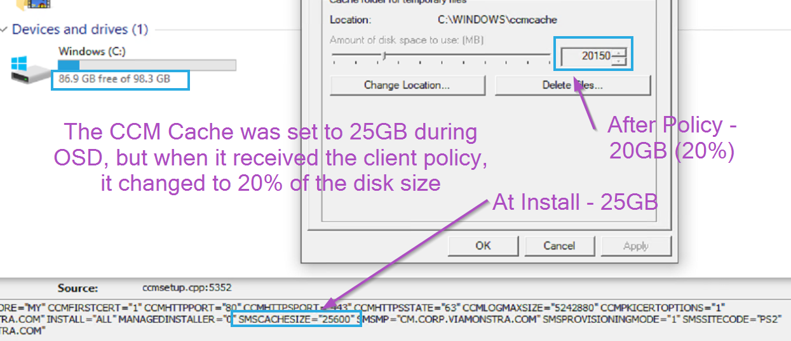
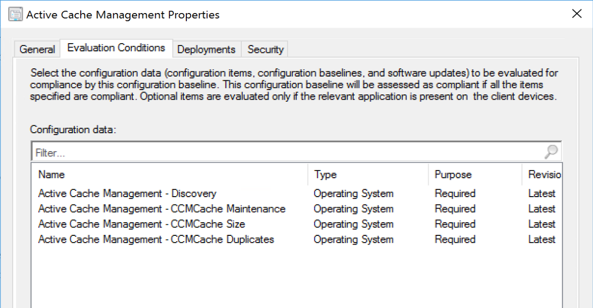
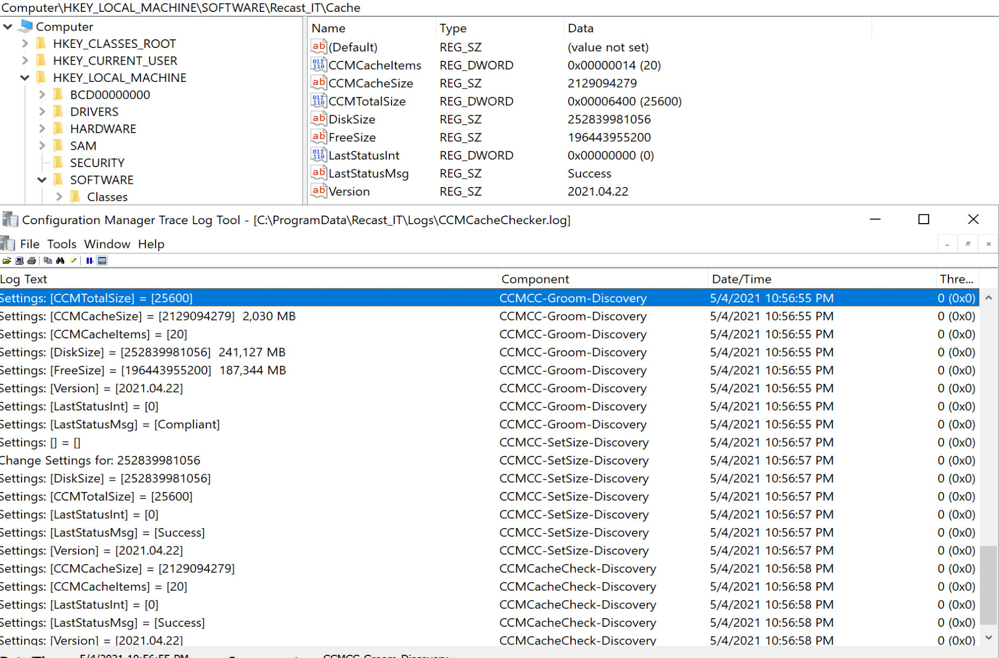
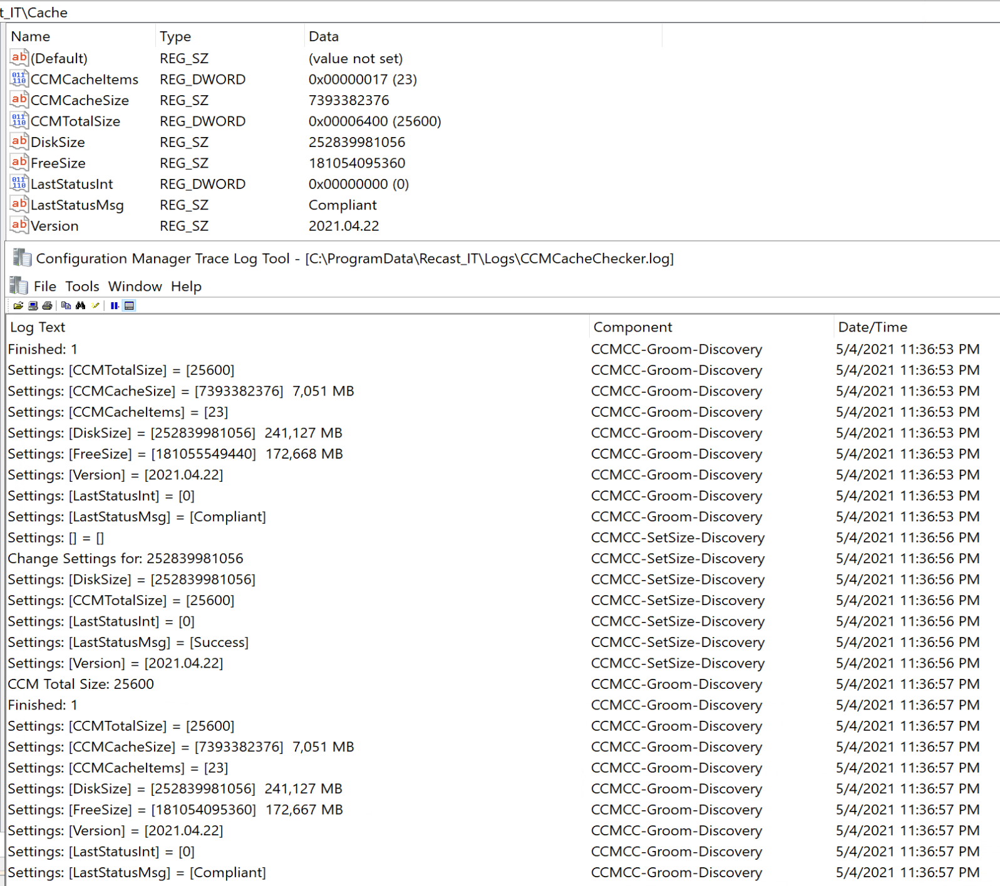

# Client Cache Management

In other sections, we've talked about the different content ConfigMgr uses, now it's time to cover Client Cache Management.  How do you manage the Client Cache Size, how do you control what is in there, how long it's in there, and when it cleans up?  We're going to cover several aspects of the cache, as well as a ConfigMgr Baseline to help manage that cache.

- Setting the Cache size during OSD | Client installation
- Setting the Cache size with a ConfigMgr Client Settings Policy
- Setting the Cache size dynamically with a ConfigMgr Baseline
- Leveraging Recast Software Right Click Tools for Client Cache Remediation

## Setting the Cache size during OSD | Client installation

This is a simple way to set the size of the cache from the start of the life of the CM Client.  This should be leveraged as even during OSD, you can easily go over the default 5GB cache limit the client sets.  Each environment will need to determine which size is best, but we've found 25GB to be a good minimum cache size.

There a several command line arguments to control the CM Cache, well documented on the [MS Doc Site](https://docs.microsoft.com/en-us/mem/configmgr/core/clients/deploy/about-client-installation-properties#values-for-the-smscacheflags-property)

You can keep it pretty simple by setting the Cache Size to a static number  or leverage some flags and get creative.
Examples:

- 1) Set the CM Cache to 25GB: CCMSetup.exe SMSCACHESIZE=25600
- 2) Set the CM Cache to 50% of Total Disk size: CCMSetup.exe SMSCACHEFLAGS=PERCENTDISKSPACE;COMPRESS SMSCACHESIZE=50

Example 1 in TS)

Example 2 in TS & After Deployment)

## Setting the Cache size with a ConfigMgr Client Settings Policy

This is an easy way to get all of your devices to an updated cache size, or setup a few different client settings and deploy to different groups of computers based on drive sizes.  This setting will be enforced and if you change it on an endpoint during troubleshooting, the next policy update, it will revert to the policy setting, which can be both good and bad.

Example of Client Cache Settings in the Default Setting:  

How it looks on the endpoint:  

## Setting the Cache size dynamically with a ConfigMgr Baseline

The previous scenarios will cover most environments well enough, but if you want to account for additional things, like a wide variety of disk sizes, free space, and leverage the same process to groom the cache, then a baseline is the route to go.

Goals:  Accommodate any disk size, be a good steward of the space we're using, and keep the cache tidy.  This meant setting a minimum size cache, which we set to 25GB, no matter the size of disk and a max of 50GB, otherwise, we used 10% of the disk size.
Now that we determined the cache size, how do we monitor and clean it?  This is where we had additional rules based on free space.  If free space of a device was low, we'd clean more items out of the cache.  We ideally would leave as much content in the cache as possible, as to "reserve" that space as "ours", but if the machine was getting low on space, we didn't want to be the team fingers got pointed at.

As mentioned in other topics in this section, there are different types of content in CM.  We gave different content different priorities in our grooming process. First thing on the chopping block are Windows Update Content, after that Apps and Packages were cleared based on age.  We'd also clean any duplicates (previous versions of the same content item).

Baseline:  

The Baseline logs what it is doing as well as captures information about the cache and places in the registry for the ability to collect with hardware inventory for reporting.

Log and Registry

After running a Pre-Cache job of 20H2, which includes several items:

The results show that the Items in the cache went from 20 to 23, and the size of the used cache went from 2GB to 7GB.

The Baseline gives you flexibility and reporting for troubleshooting.

[Scripts on GitHub](https://github.com/gwblok/garytown/tree/master/ConfigMgr/Baselines)  
[Export from CM on GitHub](https://github.com/gwblok/garytown/blob/master/ConfigMgr/Baselines/Active%20Cache%20Management.cab)

## Client Cache Management - Right Click Tools and ConfigMgr Cache Remediation  

If you're looking for more help with client cache management, you can turn to Right Click Tools for help.  I'm not going to paste all of the images and info here, but for greater detail to see how the tools operate, check out the links:

- [Clear Cache](https://docs.recastsoftware.com/features/Device_Management/Client_Tools_on_Collection/Clear_Client_Cache/index.html?q=Clear%20Cache)
- [Change Cache Size](https://docs.recastsoftware.com/features/Device_Management/Client_Tools_on_Collection/Change_Cache_Size/index.html?q=Clear%20Cache)
- Client Information Tool
  - [Cache](https://docs.recastsoftware.com/features/Device-Management/Client-Tools/Client_Information/index.html?q=client%20information#cache)
  - [Cache Details](https://docs.recastsoftware.com/features/Device-Management/Client-Tools/Client_Information/index.html?q=client%20information#cache-details)

  Those tools make it really easy to take control of the content in the configmgr client cache on endpoints, at the individual device level, or collection level.

**About Recast Software**
1 in 3 organizations using Microsoft Configuration Manager rely on Right Click Tools to surface vulnerabilities and remediate quicker than ever before.  
[Download Free Tools](https://www.recastsoftware.com/?utm_source=cmdocs&utm_medium=referral&utm_campaign=cmdocs#formarea)  
[Request Pricing](https://www.recastsoftware.com/pricing?utm_source=cmdocs&utm_medium=referral&utm_campaign=cmdocs)
