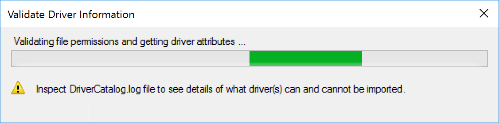

# Driver Packages

Driver Packages are more than just a traditional package of files that consist of drivers, it's a special package with additional meta data and requires additional setup behind a traditional standard package.

## MS Docs

<https://docs.microsoft.com/en-us/mem/configmgr/osd/get-started/manage-drivers>

Driver Packs are applied during WinPE to the Windows Driver Store in the Offline OS to be "installed" to the machine during the Mini Setup of OOBE in OSD.  To see a lot more details, check out the [Apply Driver Package Step](docs/ConfigMgr-Docs/TaskSequence/SCCM-TaskSequence-Step-Apply-Driver-Package.md) info.

### Creating an initial Driver Package

To Create a Driver Package, you have to first start by having a source of drivers, for the demo, I already downloaded a driver package from Dell Latitude E7470 and have extracted it on my Source Location.

> [!NOTE]
> In this Example, I'm using a Dell Latitude E7470.  I'm adding the Version into the folder names, and Categories. This makes it easy to update your Task Sequences with updated Drivers and be able to test each version by keeping them organized and separated.

At this point, we need to import them into ConfigMgr.
Go to Software Library | Operating System | Drivers.  Right click on Drivers, and choose "Import Driver", then point at your source location.

Once you've selected the drivers files, you'll see it processing for awhile:

Here it gives a summary of the drivers that will be imported and gives you the option to tag them on import with categories.  I'm going to go ahead and create a new category for the model.  In the past, I would have also tagged them with x64, when I had to support both x64 and x86, but no longer!  Point being, you might want to tag several categories, perhaps the Driver pack version for the Dell Model, A13 for example.

You then can add the drivers to a current package, or create a new package, or skip it all together, like you might do with WinPE drivers.  For this example, I'm making a Package for this Model, and version.
> [!NOTE]
> When you specify the path for CM to store the drivers for the package, it MUST be empty.

It then prompts to add the drivers to a Boot Image, I skip this step when I'm importing drivers for a specific model. But I do like this option when I'm importing drivers specificity for adding to the boot image, like NIC or Storage Drivers.

As it's processing, you'll see the folder you picked starts to be populated with the drivers by ConfigMgr.

The drivers will then show up with their categories.

And the Package, I go ahead and add the Version there.

Now we have a Driver Package.  To see it in action during OSD, check out that [Apply Driver Package Step](docs\ConfigMgr-Docs\TaskSequence\SCCM-TaskSequence-Step-Apply-Driver-Package.md) info.

### Add Drivers to existing Driver Package

During import, you can choose a current driver package to add them too, or boot media, or neither, and they just go into the drivers list.  For this example, we're going to assume you've already imported the drivers into CM, but they aren't in any package currently.

Here we're looking at a driver pack, currently 123 items, lets pretend a new driver came out and we just want to add one driver instead of replacing the entire driver pack.

We're going to add this intel NIC driver:

I'm selecting the driver, and checking the box on the driver package I want it added to.

After the wizard completes, you can see the package now contains 3 more items, those 3 items we just added.

At this point, you just need to trigger a distribution point update of your package, and you're set.

**About Recast Software**
1 in 3 organizations using Microsoft Configuration Manager rely on Right Click Tools to surface vulnerabilities and remediate quicker than ever before.  
[Download Free Tools](https://www.recastsoftware.com/?utm_source=cmdocs&utm_medium=referral&utm_campaign=cmdocs#formarea)  
[Request Pricing](https://www.recastsoftware.com/pricing?utm_source=cmdocs&utm_medium=referral&utm_campaign=cmdocs)
