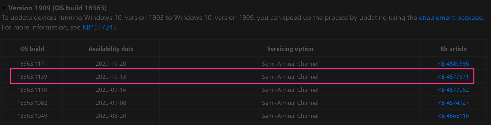

# Operating System Image Package

Operating System Image Package, it's a pretty simple package, it's one file.  One .wim file, either created using offline servicing, or a build and capture process.  In the past several years, the build and capture has been placed on the back shelf, as we move to using native Microsoft provided media, then service it offline to slip in patches and other items.  

Lets take a look at the console and see how it looks.

Pretty normal, the one thing that is nice is the OS Version, it includes the update build record (UBR), which you can then compare to [MS Docs](https://docs.microsoft.com/en-us/windows/release-information/) and see what patch is applied.  
For example, the 1909 build is 18362.1139

From that table on MS Docs, I can see that my WIM is using the update released on 2020-10-13 (KB 4577671), and I can see that there is a newer patch available if I wanted to update my media.

Now lets look at the properties.

If you import a native WIM from Microsoft, it might have several indexes, however you now have the option when you add a new OS Image to select the single index you want, which is great.  The "Images" tab provides details about the selected index.  
> [!NOTE]
> If you replace the media (install.wim), even if you update the DPs, you need to come in to this dialog and click "Reload" to have the information refresh.

The Image Path points at your WIM file, this is a single file, vs a folder like an Upgrade Media Package is, that's the big difference between the two.

More information about [build and capture process](docs/ConfigMgr-Docs/TaskSequence/SCCM-TaskSequence-Step-Capture-Operating-System-Image.md) in our ConfigMgr Docs Site

### Updating the Media

You'll want to keep your media Fresh, including updates, and potentially enabling other features.

You can do apply updates with the built in features in ConfigMgr.  It's very limited, but better than nothing.

Better options are to use WIMWITCH or OSDBuilder to service your media, then import the updated media into CM.

More info on the [Servicing Page](SCCM-Content-Servicing-Media.md)

**About Recast Software**
1 in 3 organizations using Microsoft Configuration Manager rely on Right Click Tools to surface vulnerabilities and remediate quicker than ever before.  
[Download Free Tools](https://www.recastsoftware.com/?utm_source=cmdocs&utm_medium=referral&utm_campaign=cmdocs#formarea)  
[Request Pricing](https://www.recastsoftware.com/pricing?utm_source=cmdocs&utm_medium=referral&utm_campaign=cmdocs)
