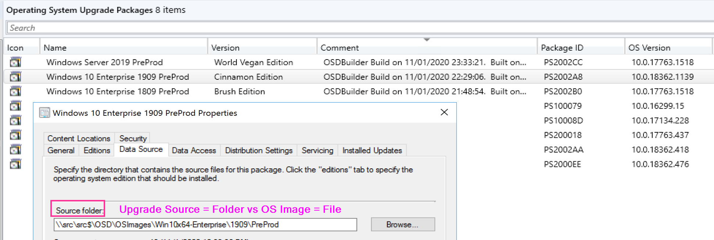
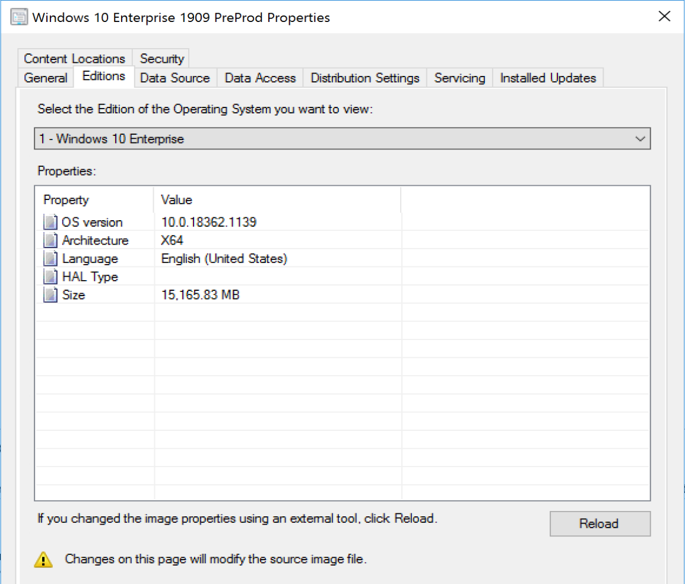
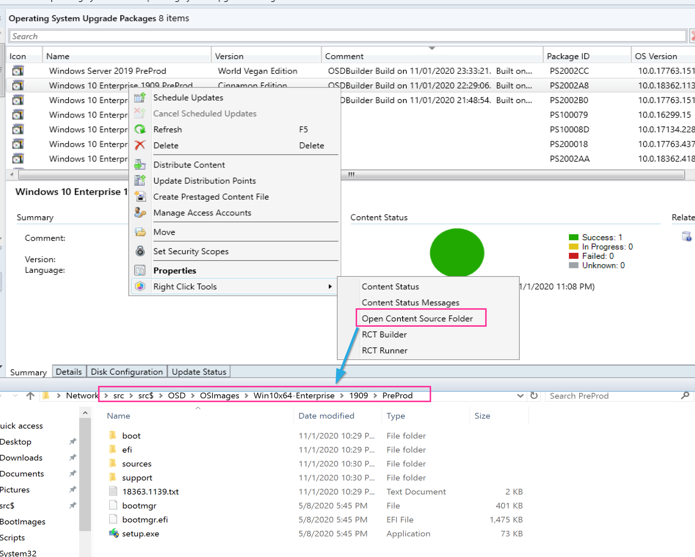

# Upgrade Operating System Package

The Upgrade Operating System Package is very similar to the Operating System Image, however, it's the full content of the Windows Media, not just a WIM file.  The Upgrade Package Contains the OS Image WIM File, but it's so much more.  It has all of the bits in it that allow you to run an upgrade.

## Console

\Software Library\Operating Systems\Operating System Upgrade Packages

This will show a list of all your Media.  Looking at the Data Source properties, it shows that unlike the OS Image, this points to a folder vs a single WIM file.

Additional details are found under the Editions Tab, and where you can choose which "Edition" or index of the media you want to view.

I always strip out the additional indexes, since they just take up space and are not useful to me, so I only ever have the Enterprise Edition available.

## File Source

The File source is basically the MS ISO extract into a folder location.  Shameless plug for Right Click Tools here, I find this so handy to right click and open the source location.

We remove the autorun.inf file, and we also add a text file with the build number, which helps with troubleshooting on the endpoint, we'll know if it's the current media or not.

### Updating the Media

You'll want to keep your media Fresh, including updates, and potentially enabling other features.

You can do apply updates with the built in features in ConfigMgr.  It's very limited, but better than nothing.

Better options are to use WIMWITCH or OSDBuilder to service your media, then import the updated media into CM.

More info on the [Servicing Page](SCCM-Content-Servicing-Media.md)

**About Recast Software**
1 in 3 organizations using Microsoft Configuration Manager rely on Right Click Tools to surface vulnerabilities and remediate quicker than ever before.  
[Download Free Tools](https://www.recastsoftware.com/?utm_source=cmdocs&utm_medium=referral&utm_campaign=cmdocs#formarea)  
[Request Pricing](https://www.recastsoftware.com/pricing?utm_source=cmdocs&utm_medium=referral&utm_campaign=cmdocs)