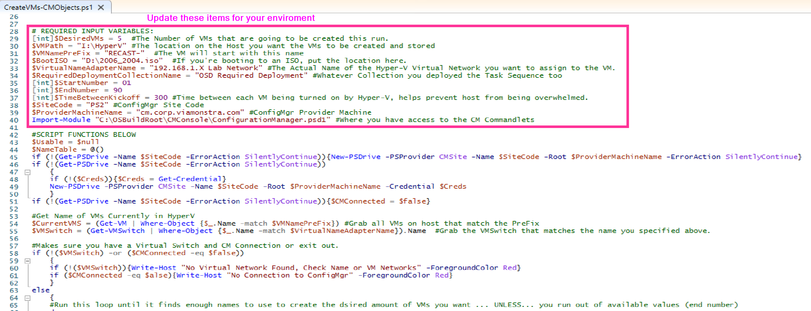
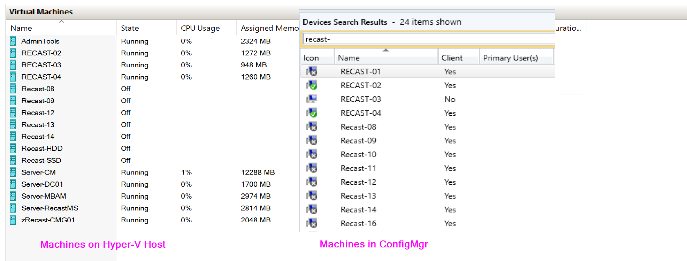
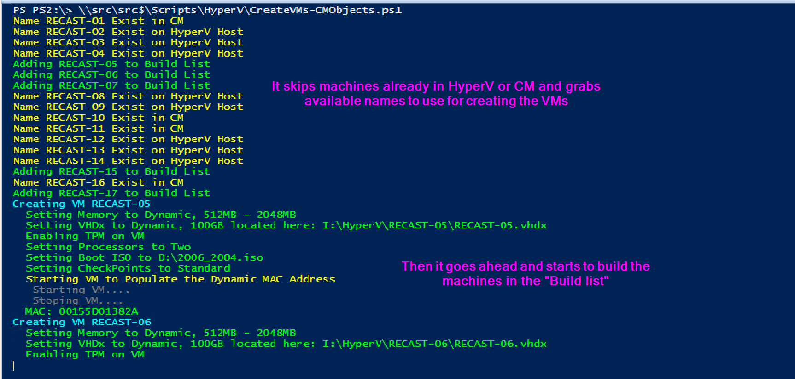
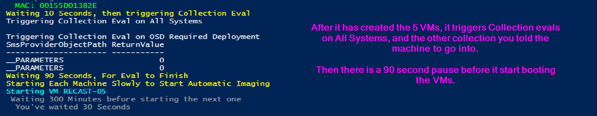
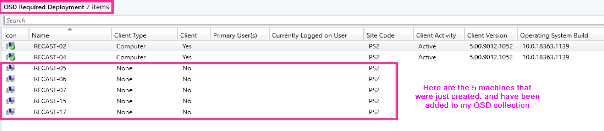
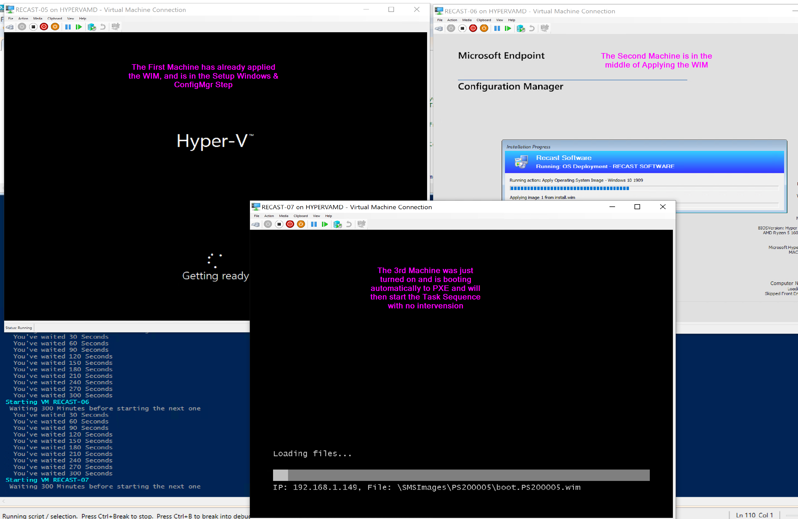
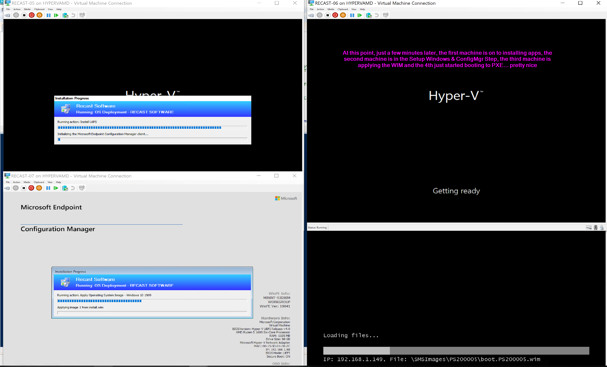

# Leveraging Hyper-V to Automate OSD Test Machines

So while Hyper-V isn't directly related to ConfigMgr, many of you might be using it for hosting labs, or test machines.  I'm not going to go over why I am a huge fan of Hyper-V, but I do like the price, and the integration with PowerShell.

On this page, I'm going to cover the process I'm using to create multiple VMs for testing.

The Script I am using it posted on [GitHub](https://github.com/gwblok/garytown/blob/master/HyperV/BuildVMs_OSD.ps1).  I also posted a very low budget video on [YouTube](https://www.youtube.com/watch?v=RLSejEE7YIY&feature=youtu.be) that demos the process to give a good understanding.  

## Goal

Automate the build of VMs, to then be used to test Operating System Deployment Task Sequences.

I do a lot of Task Sequence testing, and I was tried of all the extra clicks to create VMs to test, I know everything was possible with PowerShell that I wanted to do, so I sat down for a few hours one night and did it.

In a Nutshell, the script will create VMs in HyperV, and create the associated Device Object in CM.

## Required Input

It's a bit more involved than that, so lets go over what requirements.

- The Script was designed to be run on the Hyper-V Host.  
- Required Info:
  - Site Code
  - ConfigMgr Provider
  - Location to the CM PowerShell Module (to import)
  - Path to where to Store VM
  - Prefix (The Name you want to call the Device) Ex:
    - Device-
    - Computer-
  - Boot ISO Location (If you want to boot to ISO)
  - Hyper-V Virtual Adapter Name
  - ConfigMgr Collection you want machine added to
  - Start Number (Suffix of Machine)
    - Start of a Range of numbers to append to machine to keep unique, ex:
    - 10
  - End Number (Suffix of Machine)
    - End of Range, ex:
    - 30
  - DesiredVMs (How many VMs do you want to create on this run)
    - Total Machines Created, Ex:
    - 5
  - Time Between Kickoff
    - This is the amount of time between starting up each VM, as to not overload your Hyper-V Host with starting and imaging all the machines at the same time.

Once you've updated the script with those options, you just push "Go" and it will do what you want.

Lets talk through a scenario

## Test Run

I've set it to create 5 machines, they start with Recast, and will be between 01 and 90, depending on what is available.

You can see here, I already have some of machines with those names, so lets run the script and see what happens.

So, that looks good...

So from the images, you can see it did what I wanted.  It created the VMs, and devices in CM, accounting for ones already created as to avoid duplicates.

Now it's easy to quickly create new test machines for application deployment tests, OSD Task Sequence change tests, or just adding several machines to test patching on.  HyperV + ConfigMgr + PowerShell = Awesome. 

**About Recast Software**
1 in 3 organizations using Microsoft Configuration Manager rely on Right Click Tools to surface vulnerabilities and remediate quicker than ever before.  
[Download Free Tools](https://www.recastsoftware.com/?utm_source=cmdocs&utm_medium=referral&utm_campaign=cmdocs#formarea)  
[Request Pricing](https://www.recastsoftware.com/pricing?utm_source=cmdocs&utm_medium=referral&utm_campaign=cmdocs)
