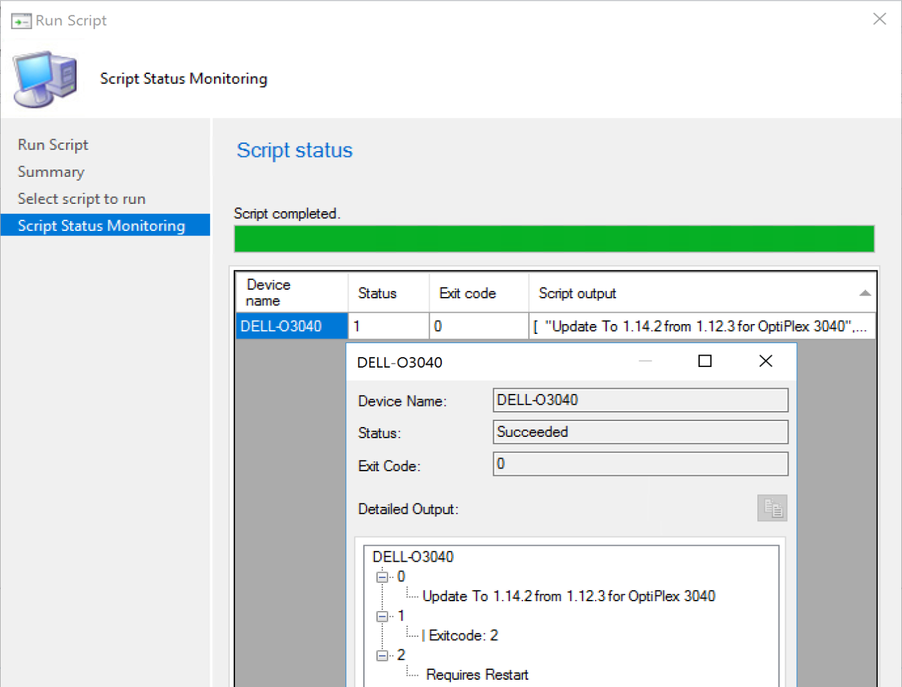
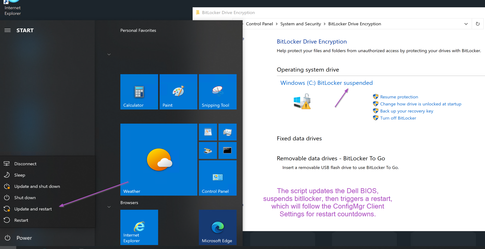
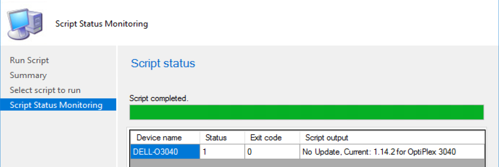

# Manufacturer Tools - Dell - ConfigMgr

## **DRAFT**

There are several ways you can leverage these tools, and it's going to be completely different based on your environment and business requirements.  Perhaps you want all of the content coming from your distribution points, and tightly managed bandwidth, or perhaps you want all of the updates coming from Dell so you don't have to manage that.  In these posts, we're going to leverage the ability to go back Dell, and not create packages in CM with all of the content.

This will be broken into several sub pages, as I found it was too much content of a single post, and will separate the tools into more bite size chunks.

Table of Contents:

- Using Dell Tools with ConfigMgr (OSD & Baselines & Run Scripts)
  - Automating Install of DCM & DCU
  - Automating Update of BIOS
  - Managing DCU Repository with Dell's Cloud Repository
  - Managing BIOS Settings

## Run Scripts

### Update BIOS

Troubleshooting devices, Run Scripts are the best.  While deploying BIOS is best left to normal deployment processes, sometimes updating the BIOS to the latest BIOS during troubleshooting is nice to do, and being able to do it remotely via run scripts, with minimal impact to the end user is nice too. 

This [script on GitHub](https://github.com/gwblok/garytown/blob/master/RunScripts/Update-DellBIOS.ps1) will check for the latest BIOS available from Dell, download it, and install.  Based on Exit code (2), it will trigger bitlocker suspend and a controlled restart leveraging ConfigMgr, adhering to the client restart settings, a trick borrowed from [sccmf12twice.com](https://sccmf12twice.com/2019/05/sccm-reboot-decoded-how-to-make-a-pc-cancel-start-extend-or-change-mandatory-reboot-to-non-mandatory-on-the-fly/)

The Script Runs, you can see the progress in the Scripts Node

On the end point you can see that it's pending a restart

If you re-run the script, or run it on a script that has current BIOS, it will exit out letting you know it's already current.

**About Recast Software**
1 in 3 organizations using Microsoft Configuration Manager rely on Right Click Tools to surface vulnerabilities and remediate quicker than ever before.  
[Download Free Tools](https://www.recastsoftware.com/?utm_source=cmdocs&utm_medium=referral&utm_campaign=cmdocs#formarea)  
[Request Pricing](https://www.recastsoftware.com/pricing?utm_source=cmdocs&utm_medium=referral&utm_campaign=cmdocs)
