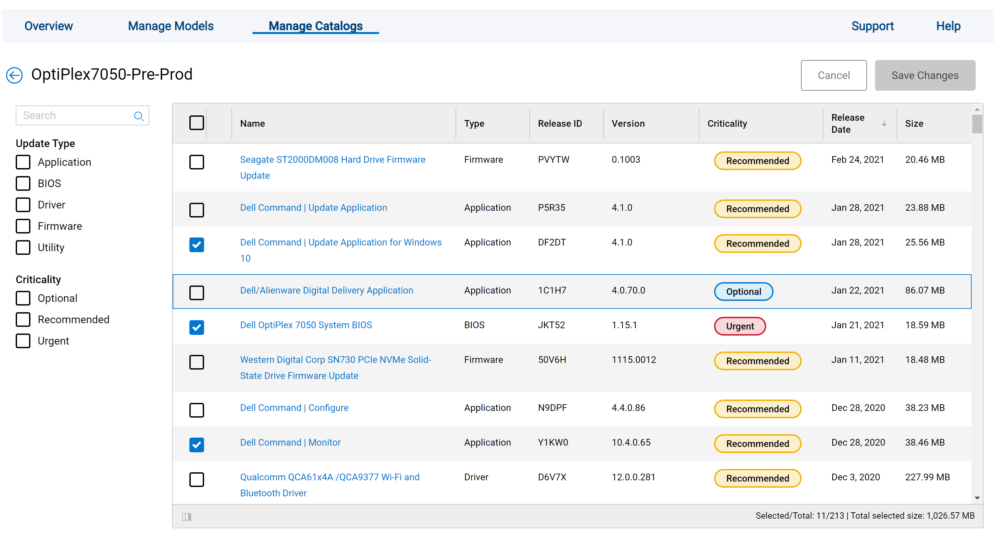
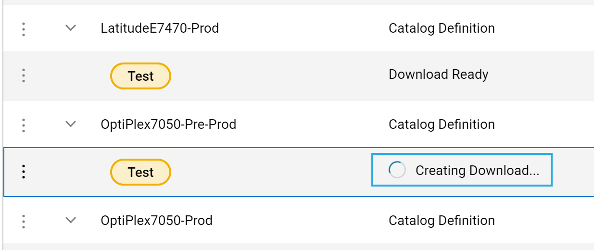
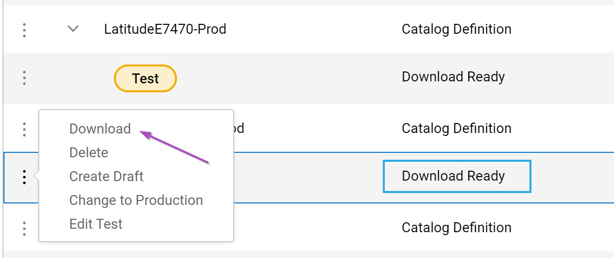

# Manufacturer Tools - Dell - Intune

Table of Contents:

- Short Overview Of Dell Tools
- Using Dell Tools with Intune
  - Automating Install of DCM & DCU
  - Automating Update of BIOS
  - Managing DCU Repository with Dell's Cloud Repository

## Dell Technologies

[Enterprise Tools Landing Page](https://www.delltechnologies.com/en-us/systems-management/client-command-suite.htm) | [Community Forum](https://www.dell.com/community/Dell-Community/ct-p/English) | [Refurbished Sale Site](https://www.dellrefurbished.com/) | [Outlet Site](https://www.dell.com/en-us/dfb/shop/refurbished-business/cp/outlet-dfb)

List of the Dell Tools, for more details, check the [Manufacturer Tools Parent page](https://docs.recastsoftware.com/ConfigMgr-Docs/ConfigMgr-Topics/Manufacturer-Tools.html).

- Dell Command | [Deploy](https://www.dell.com/support/article/en-us/sln312414/dell-command-deploy-driver-packs-for-enterprise-client-os-deployment?lang=en)  
- Dell Command | [Configure](https://www.dell.com/support/article/en-us/sln311302/dell-command-configure?lang=en)  
- Dell Command | [PowerShell Provider](https://www.dell.com/support/article/en-us/sln311262/dell-command-powershell-provider?lang=en)
- Dell Command | [Monitor](https://www.dell.com/support/article/en-us/sln311855/dell-command-monitor?lang=en)
- Dell Command | [Update](https://www.dell.com/support/article/en-us/sln311129/dell-command-update?lang=en)  
- Dell Command | [Cloud Repository Manager](https://www.dell.com/support/article/en-us/sln322893/dell-command-cloud-repository-manager?lang=en)
- Dell Command | [Integration Suite for System Center](https://www.dell.com/support/article/en-us/sln311125/dell-command-integration-suite-for-system-center?lang=en)
- Dell Command | [Intel vPro Out of Band](https://www.dell.com/support/article/en-us/sln311294/dell-command-intel-vpro-out-of-band?lang=en)
- [VMware Workspace ONE Integration](https://www.delltechnologies.com/en-us/endpointsecurity/manageability.htm)

## Integrating Dell Tools into Intune

Leveraging Dell Command Update and Dell Command Monitor are useful in managing your devices when using Intune.  Dell Command Monitor will help you with monitoring your Dell settings and allow you to set them.  Dell Command Update allows you to update Drivers & BIOS.  We're going to dig into a few things in this area:

- Installing and Updating Dell Command Monitor and Dell Command Update
- Updating BIOS
- Managing Dell Command Update via Dell's Portal

### Dell Command Monitor & Dell Command Update

In the future, I think the need for Dell Command Monitor will go away, but until you've lifecycle all of the devices that do not have native WMI support built in, you'll need it.  This will allow you to leverage WMI to set BIOS settings via PowerShell and use Remediation Scripts via intune.  Then there is Dell Command Update, this you'll be able leverage to keep your devices BIOS and Drivers updated.  You can then have DCU set to update willy nilly, pulling the latest updates from Dell, or you can create your own "baseline" which you've tested and have DCU adhere to that (while still downloading and applying your "managed baseline" driver & BIOS versions from Dell directly).

So the question is, how do we get DCM (Dell Command Monitor) & DCU (Dell Command Update) installed on the computers?  I like to avoid extra work, so if I can find a way to automatically make this happen, I will. Presented Solution.. powershell script that checks Dell for the versions of DCM & DCU then compares to the machine it's running on, and either installs or updates.  Script is setup to use inside intune's proactive remediation.

The Detection Script is on [GitHub](https://github.com/gwblok/garytown/blob/master/Intune/Update-DellApps-Detect.ps1), to get the Remediation Script, make a copy, rename "Detect" to "Remediate", and change $remediate from $false to $true.

**Intune Scripts**
 

**On Endpoints**

The Detection Script saw that it had an old version of DCM and no DCU, so it reported non-compliant, then remediation ran updating DCM to the latest and installing the latest version of DCU, straight from Dell.

### Updating BIOS

So here you now have a couple of options, you can leverage DCU to do it, now that you have that installed, or you can have another Proactive Remediation running that checks for Updated BIOS and Installed.

The Detection Script is on [GitHub](https://github.com/gwblok/garytown/blob/master/Intune/Update-DellBIOS-Detect.ps1), to get the Remediation Script, make a copy, rename "Detect" to "Remediate", and change $remediate from $false to $true.

**Intune Scripts**

**On Endpoints**

When the Detection runs, it checks Dell's XML to see if there is an updated BIOS available, if the BIOS installed matches the one available, you're compliant, otherwise the remediation will go ahead, download and install, triggering a reboot countdown.

The Script provides details about the BIOS, and also where the BIOS update log file itself is placed.

### Managing Dell Command Update via Dell's Portal

So this is more tricky, as you'll need an account on Dell's Tech Direct Portal.  If your company is already signed up for the portal, you'll have to get permission from your portal admin, otherwise you'll have to set your company setup, which I'll let you work with your management on.

Assuming you have access to the portal, you can go into the Cloud Repository area, and create Catalogs.  I've chosen to create two catalogs per device model, one Pre-Production (Pre-Prod) for testing, and one Production (Prod) for actual deployments.  How I manage Pre-Prod / Prod deployments "rings" are by intune groups.  I have one group for Pre-Prod devices, which tags the registry and scripts key off of that.  If the registry property "Ring" with Value "Pre-Prod" isn't there, it assumes Production.  

**Pre-Production Ring Machines in intune**

**Dell Tech Direct**  
In the [Dell Portal](https://techdirect.dell.com/Portal/SupportAssistAssets.aspx?action=manageUpdateCatalogs), I head to the Update Catalog area.

In this example, I'll be showing the OptiPlex7050-Pre-Prod Catalog.  
Click on the 3 dots in front of the Status (which in this case is "Test"), and you can Edit the Definitions.

Pick the updates you want your OptiPlex 7050 test group (Pre-Prod) to have available to it, and click Save Changes.  The lower right will show the amount of updates you've selected along with the download total if ALL of them had to be downloaded and updated on your target endpoints.

Once you've finished your selections youc click those dots again and choose "Create Download"  

This will start a process:  

Then you can go ahead and download your repository "baseline".  

Once Downloaded, you can grab the XML file, this is the only thing I'm using, because I still want the devices to go back to Dell to get the updates.

This is what the XML looks like, and there is a date stamp of when it was generated, this is how the Intune Proactive Remediation Script knows if the XML needs to be updated or not.  

I then need to place these somewhere all my endpoints can get to, I'm using github, since it's free and make it easier to blog about, but you could store them anywhere the clients can reach.

Back in intune, I have a remediation script that will run, check Github, grab the XML, check the date stamp, compare to the XML on the local machine, and update if needed. Script on [GitHub](https://github.com/gwblok/garytown/blob/master/Intune/Update-DellDCU-XML.ps1), to get the Remediation Script, make a copy, rename "Detect" to "Remediate", and change $remediate from $false to $true.

**On the Endpoints**

The Detection runs and finds that it needs to have the XML updated, it then updates the XML in the predetermined place, a folder I setup in ProgramData, and updates the Command Update software (Registry Value) to point to that XML for it's Repository information.

In this image you can see that I used to have DCU 3.1.2 installed, the Proactive Remediation Script noticed and updated it to 4.1.0, when I go into DCU, I see that it did successfully apply my XML file.

At this point, it will only update the items I've configured, and it will pull those updates from Dell.

The next step now is to configure other DCU settings via Intune... coming soon..

## Scripts Used
So while the scripts used on this page are listed in their respective areas, I know it's easy to miss them, so we're placing them all here as well:

- [Update Dell Apps](https://github.com/gwblok/garytown/blob/master/Intune/Update-DellApps-Detect.ps1)
- [Update Dell BIOS](https://github.com/gwblok/garytown/blob/master/Intune/Update-DellBIOS-Detect.ps1)
- [Apply Custom DCU XML](https://github.com/gwblok/garytown/blob/master/Intune/Update-DellBIOS-Detect.ps1)

These scripts were created and tested with intune, however the same scripts would work as ConfigMgr baselines, which will be covered in a future post, but you can grab them now and build yourselves.  They can also be used as "Run Scripts".
## Community Posts

- [Manage Dell BIOS settings with Proactive Remediation](https://www.systanddeploy.com/2020/10/manage-dell-bios-settings-with.html) ([Damien Van Robaeys](https://twitter.com/syst_and_deploy))
- [Proactive Remediation scripts: Detects devices that don't have a BIOS password](https://www.systanddeploy.com/2021/01/proactive-remediation-scripts-detects.html)  ([Damien Van Robaeys](https://twitter.com/syst_and_deploy))
- [Set Dell BIOS settings through Intune and PowerShell](https://www.systanddeploy.com/2019/10/set-dell-bios-settings-through-intune.html)  ([Damien Van Robaeys](https://twitter.com/syst_and_deploy))

**About Recast Software**
1 in 3 organizations using Microsoft Configuration Manager rely on Right Click Tools to surface vulnerabilities and remediate quicker than ever before.  
[Download Free Tools](https://www.recastsoftware.com/?utm_source=cmdocs&utm_medium=referral&utm_campaign=cmdocs#formarea)  
[Request Pricing](https://www.recastsoftware.com/pricing?utm_source=cmdocs&utm_medium=referral&utm_campaign=cmdocs)
