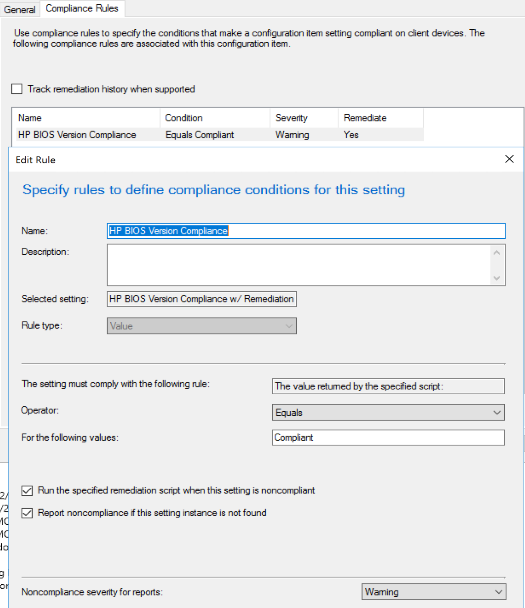

# Manufacturer Tools - HP Client Management Script Library - ConfigMgr or Intune

## **DRAFT**

There are several ways you can leverage HP tools, and it's going to be completely different based on your environment and business requirements.  Perhaps you want all of the content coming from your distribution points, and tightly managed bandwidth, or perhaps you want all of the updates coming from HP so you don't have to manage that.  These posts will focus on HPIA and HPCMSL.  
because those tools provide the best case for cross platform compatibly, meaning you can leverage the tools with both Intune and ConfigMgr managed devices, or other management tools, as long as you can deploy PowerShell Scripts.

This will be broken into several sub pages, as I found it was too much content of a single post, and will separate the tools into more bite size chunks.

All acronyms you can find details about on the parent Manufacturer tools page.

Table of Contents:

- Using HP Tools with ConfigMgr or Intune
  - Automating Install of HPCMSL
  - Automating Update of BIOS
    - Using HPCMSL
    - Using HPIA (Future Page)
  - Managing BIOS Settings
    - Using HPCMSL
    - Using HPIA (Future Page)d
    - Using Native WMI (PowerShell)

## Automating the Install of HPCMSL

In these examples, the scripts will be going directly to HP to download the software and update, which works great if you have high bandwidth or split tunnelling setup.  If you would like to deploy using on prem DPs, that too is possible, and allows you full control over the version you're deploying, you'll just have to pay more attention to updates as they come up.

There are 2 ways to install HPCMSL, using the softpaq.exe download and install method, or powershell Gallery.  

### PowerShell Gallery

If you'd like to use the PowerShell Gallery, I've uploaded the ConfigMgr CIs for a Baseline Deployment to [GitHub](https://github.com/gwblok/garytown/tree/master/hardware/HP/ConfigItems).  In my lab, I've setup a Baseline with those 3 CIs, and have them deployed to all HP Devices, along with some other CIs for BIOS setting management.  You can adapt those scripts into Proactive remediation for Intune and target those to a group of HP Devices.

### EXE Download

If your company blocks the PowerShell Gallery, or most of the internet in general, you might have to deploy from the EXE that you can download from the [HP Website](https://www.hp.com/us-en/ads/clientmanagement/download.html).  This method is pretty straight forward, you can use a standard CM Application deployment to deploy the EXE and use a registry value as the detection method.  If you have Intune and want to leverage Proactive Remediation, I have a script for that too on [GitHub](https://github.com/gwblok/garytown/blob/master/Intune/Update-HPCSML.ps1).  
## Automating Update of BIOS: HPCMSL

This is where you have lots of options, you can leverage baselines, script downloading and updating packages or applications for deployment of BIOS, use task sequences, proactive remediation in Intune.

Currently I leverage HPCMSL to update bios two different ways, one for a highly controlled method of having HPCMSL keep our CM BIOS Pre-Prod package always updated and notify us when it has been updated, which makes for easy reporting, then promotion to production once its been tested.  I also leverage HPCMSL in a Run-Script for on-demand updating of BIOS during trouble tickets.

HPCMSL has an entire [module dedicated to BIOS](https://developers.hp.com/hp-client-management/doc/bios-and-device), download, update, or configuration, it's all there.

If you are looking for the hands-off approach, you can leverage baselines in ConfigMgr or proactive remedation in Intune that will automatically do it all for you, and you never have to think about it again. The Process will run from the client, compare it's current BIOS to HP.com, then update if a newer version is found.  

### Update BIOS via Baseline in Full OS

Once you have HPCSML Installed, you can create all sorts of great CIs for your Baseline.  One such CI can monitor your BIOS Version, compare to HP and Update when downlevel.

Why is it so easy to update BIOS with HPCMSL... it does everything for you, and it's super flexible.  You want to see the code to update your BIOS, here you go:

```PowerShell
PS> Get-HPBIOSUpdates -Flash -BitLocker Suspend -Force -Yes
```

[!NOTE] HPCMSL will ONLY update BIOS on UEFI systems and requires 64-bit PowerShell, you'll need to leverage HPIA for Legacy systems. [More info](https://developers.hp.com/hp-client-management/doc/Get%E2%80%90HPBiosUpdates)

So that's pretty easy, then you can get fancy and add logic for passwords, for UEFI systems, logging, or even using pre-cached BIOS bin file.  Example, we run everything in offline mode, so we have HPCMSL on the machines, and we have a package per model with the latest BIOS Bin file, we then deploy the BIOS Update via ConfigMgr to machines using the HPCMSL command line, but pointing at the bin file we downloaded into the ccmcache.  HPCMSL is completely able to cover pretty much any scenario.  

For an example of a CI in a ConfigMgr Baseline that is used to detect and Remediate HP BIOS, check out this [GitHub](https://github.com/gwblok/garytown/tree/master/hardware/HP/ConfigItems/HPManagementBaseline), here it is, and this is how I setup most of my CIs.

[](media/HPBIOSCI01.png)
[](media/HPBIOSCI02.png)
[](media/HPBIOSCI03.png)
[](media/HPBIOSCI04.png)

I'll go over a couple more CIs later in the Manage BIOS settings area.

### Update BIOS via built-in BIOS Self-Updater when connected to Network

This is another great option if you just want to set it and forget it.  You can set your HP Device to update the BIOS using a built in Updater in firmware.  As long as the device is connected via Ethernet, it can check at different intervals and update itself, either silently or prompting the user.

To Control this Setting, I use a CI.

If you know the name of the setting, you're already in luck, if you don't I run this command to get the names.

```PowerShell
(Get-HPBIOSSettingsList).Name
```
[](media/HPBIOSCI05.png)

Then to get more info about the specific item:

```PowerShell
Get-HPBIOSSetting -Name "Update BIOS via Network"
Get-HPBIOSSetting -Name "Update Source"
Get-HPBIOSSetting -Name "Automatically Check for Updates"
Get-HPBIOSSetting -Name "Automatic BIOS Update Setting"
Get-HPBIOSSetting -Name "Use Proxy"
Get-HPBIOSSetting -Name "IPv4 Configuration"
Get-HPBIOSSetting -Name "Connected BIOS"
```

[](media/HPBIOSCI06.png)

Now you know the settings and the current values and what you have for options.
If you want to allow your devices to automatically upgrade from HP via network connections, you'll have to set several of those to the way you'd want them, like in this example:

```PowerShell
Set-HPBIOSSettingValue -Name "Update BIOS via Network" -Value "Enable" -Password P@ssw0rd
Set-HPBIOSSettingValue -Name "Update Source" -Value "HP" -Password P@ssw0rd
Set-HPBIOSSettingValue -Name "Automatically Check for Updates" -Value "Monthly" -Password P@ssw0rd
Set-HPBIOSSettingValue -Name "Automatic BIOS Update Setting" -Value "Let user decide whether to install updates" -Password P@ssw0rd
Set-HPBIOSSettingValue -Name "Use Proxy" -Value "Disable" -Password P@ssw0rd
Set-HPBIOSSettingValue -Name "IPv4 Configuration" -Value "Automatic" -Password P@ssw0rd
Set-HPBIOSSettingValue -Name "Connected BIOS" -Value "Enable" -Password P@ssw0rd
 ```

[](media/HPBIOSCI07.png)

[!NOTE] If you have a BIOS Admin password set, you don't need it to gather data, only to change/set BIOS setting values.

Typically how I create CIs, is have 1 BIOS Setting Per CI, then include them all into a baseline.

## Managing BIOS Settings with a Baseline & HPCMSL

If you made it this far, you can probably see where this is going, but I'm going to throw in a curve ball, what about skipping HPCMSL and just setting the settings via PowerShell without having the dependency of any other software?  Yeah, lets do it.

So if you already have HPCMSL installed on every HP device, sure, feel free to leverage that, if not, then here's a good method:


## Run Scripts

You can also leverage Run Scripts to deploy HPCMSL, or Run HPIA on an adhoc basis.  I use Run Scripts to update BIOS on machines I find downlevel, and it works like a charm.  If you have HPCMSL on a machine, then creating the run scripts is easy.  I have the Run Script check for newer BIOS from HP, then update if available, then trigger a ConfigMgr Agent controlled Restart, popping up the Restart Countdown. (NEED TO GET SCRIPT AND PUT ON GITHUB)

### Update BIOS

**About Recast Software**
1 in 3 organizations using Microsoft Configuration Manager rely on Right Click Tools to surface vulnerabilities and remediate quicker than ever before.  
[Download Free Tools](https://www.recastsoftware.com/?utm_source=cmdocs&utm_medium=referral&utm_campaign=cmdocs#formarea)  
[Request Pricing](https://www.recastsoftware.com/pricing?utm_source=cmdocs&utm_medium=referral&utm_campaign=cmdocs)
