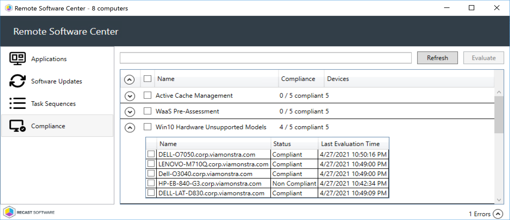
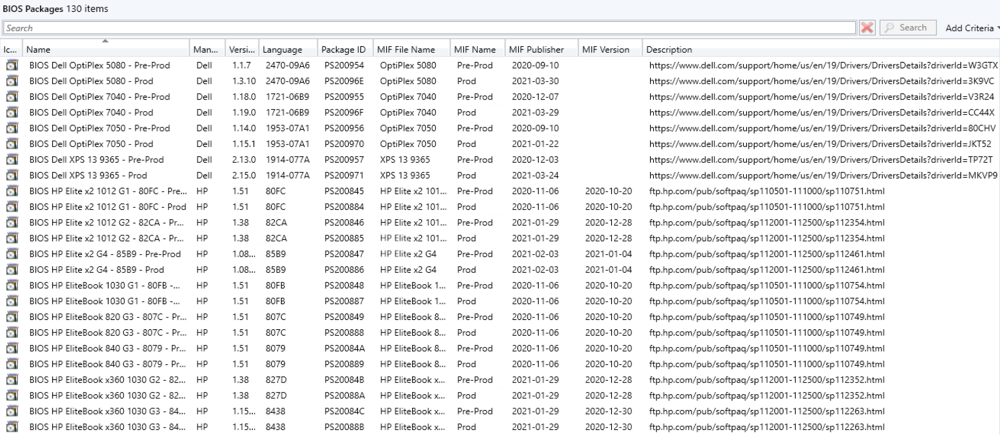

# Manufacturer Tools - Model Support

This page covers a few manufacturer tools that help control the models you support in your environment. I know not everyone has the luxury to stay on supported hardware, but if you do, we're going to cover some ways to keep tabs on your models, along with but in blockers to prevent upgrading unsupported machines, and raising some flags.

This page is not going to cover warranty support, which is also very important, but vendor support for your model on the current Windows 10 OS.  If you want to know about Warranty support of your devices, the easy way is to leverage [Enhansoft's Warranty Report](https://www.enhansoft.com/products-services/warranty-information-reporting/), the not so easy way is to create your own scripts to leverage vendor tools / APIs, then collect the data and create your own reports.

Table of Contents:

- Vendor Pages for Model to OS Release Support
- Model Management
  - Baseline of Supported or Unsupported devices in your environment.
  - Collections per Model
  - Task Sequence Step
- Driver & BIOS packages per Model

## Manufacturer Support Pages

Dell, Lenovo & HP maintain a list of Models along with the Releases of Windows they have tested and support on those models:

- ### Dell [Test Matrix for Windows 10 Release](https://www.dell.com/support/kbdoc/en-us/000180684/dell-computers-tested-for-windows-10-october-2020-update-and-previous-versions-of-windows-10)

- ### HP [Products Tested with Windows 10](https://support.hp.com/us-en/document/c05195282)

- ### Lenovo [Windows Support Center - Windows 10 Compatibility Check](https://support.lenovo.com/us/en/solutions/ht505476-windows-support-center-windows-10)

## Manufacturer Tools - Model Management Options

Based on the data provided by the Manufacturers, and the data you have in CM, you can start to build a list of items supported.  In our environment, we have done a block list.  We have hundreds of models, some with only a couple counts, those devices we're not fully supporting (Driver Packs, BIOS Updates, Etc), but we're not going to block either, as they might be test devices or something a CEO decided to buy for themselves.  However, we do know several models that we want to retire and no longer support, or update to the next Windows 10 Release, those we block, and mark for lifecycle to deal with.  How do we do that?  Reports mostly.  How do enforce it, Baselines and Collections.

Finding the Models in your environment, SQL:

``` SQL
-- HP
SELECT CS.Manufacturer0, CS.Model0, Count(*) as 'Count',BB.Product0
FROM v_GS_COMPUTER_SYSTEM CS
JOIN v_FullCollectionMembership fcm on CS.ResourceID=fcm.ResourceID
LEFT JOIN v_GS_BASEBOARD BB on CS.ResourceID=BB.ResourceID
WHERE fcm.CollectionID='SMS00001'and CS.Manufacturer0  LIKE 'HP'
GROUP BY CS.Model0, CS.Manufacturer0, BB.Product0
ORDER BY Count DESC

-- LENOVO
SELECT CS.Manufacturer0 ,CS.Model0, Count(*) as 'Count',CSP.Version0
FROM v_GS_COMPUTER_SYSTEM CS
JOIN v_FullCollectionMembership fcm on CS.ResourceID=fcm.ResourceID
LEFT JOIN v_GS_COMPUTER_SYSTEM_PRODUCT CSP on CS.ResourceID=CSP.ResourceID
WHERE fcm.CollectionID='SMS00001'and CS.Manufacturer0  LIKE 'LENOVO'
GROUP BY CS.Model0, CS.Manufacturer0,CSP.Version0
ORDER BY Count DESC

-- Everything Else
SELECT CS.Manufacturer0 ,CS.Model0, Count(*) as 'Count'
FROM v_GS_COMPUTER_SYSTEM CS
JOIN v_FullCollectionMembership fcm on CS.ResourceID=fcm.ResourceID
WHERE fcm.CollectionID='SMS00001' and CS.Manufacturer0  NOT LIKE 'HP' and CS.Manufacturer0  NOT LIKE 'LENOVO'
GROUP BY CS.Model0, CS.Manufacturer0
ORDER BY Count DESC
```

[](media/ModelSupport01.png)

### Creating a Baseline for Supported Models

#### **Dell & Lenovo**

For Dell & Lenovo, we use the "Model" info, but for HP we use Product.

Dell / Lenovo (Using Dell as Example)
Settings: Using WQL Query, which looks to the Model Property in Win32_ComputerSystem:
[](media/ModelSupport02.png)
The Compliance Rules are a list of the machines that are NOT Supported, by leveraging the Operator "None of".  If the Query returns one of the models in the list, it will mark the CI as non-compliant.  
[](media/ModelSupport03.png)

#### **HP**

For HP, we use Product, so the CI is setup slightly different for Settings.

[](media/ModelSupport05.png)
[](media/ModelSupport06.png)

Detection Methods:  
[](media/ModelSupport04.png)

```PowerShell
#Dell CI
if ((Get-WmiObject win32_computersystem).Manufacturer -like "Dell*"){Write-Host "Dell"}

#Lenovo CI
if ((Get-WmiObject win32_computersystem).Manufacturer -like "Lenovo"){Write-Host "Lenovo"}

# HP CI
if ((Get-WmiObject win32_computersystem).Manufacturer -like "H*"){Write-Host "HP"}
```

#### **Baseline**

The 3 CIs are added to a Baseline and deployed to the Dell, HP & Lenovo Devices.
[](media/ModelSupport08.png)
Checking out several of my devices leveraging Recast's Remote Software Center:
[](media/ModelSupport07.png)

This shows that 4 of the models are compliant meaning we support them in our environment moving forward, and 1 is non-compliant, and should be prioritized for replacement.

At this point you have a baseline, you can run a report to get the non-compliant machines. You could also use the CI's in part of a larger Baseline for another process, like your Windows Upgrade Checks.  There is a community Post on [GARYTOWN.COM](https://garytown.com/waas-preassessment-preflight-using-config-items) that talks about incorporating a baseline into a Task Sequence as a preflight, which is next level stuff.

### Creating Collections of Supported Models

Collections are also a great way to keep track of our models, especially for deploying model specific items, like BIOS or Drivers.

[](media/ModelSupport10.png)

Script on [GitHub](https://github.com/gwblok/garytown/blob/master/CreateDeviceCollections) that will look through your site and build these collections.  We've setup collections for all models, then have other collections with the Model Collections as the limiting collection.

We have 3 Collections for each Model

- Model Query Collection that pulls in all devices of that model
- Production Deployment of Drivers & BIOS to Model
  - Limiting Collection = Model Collection | Includes Production Collections
- Pre-Production Deployments of Drivers & BIOS to Model
  - Limiting Collection = Model Collection | Include all test group collections

Using this process, we can have 1 query for the model, yet deploy device specific items to Test groups and Production groups separately. This is just one example to show the value of having a model collection.  

#### **Queries**

- HP - All Dell Devices

```WQL
select SMS_R_SYSTEM.ResourceID,SMS_R_SYSTEM.ResourceType,SMS_R_SYSTEM.Name,SMS_R_SYSTEM.SMSUniqueIdentifier,SMS_R_SYSTEM.ResourceDomainORWorkgroup,SMS_R_SYSTEM.Client from SMS_R_System inner join SMS_G_System_COMPUTER_SYSTEM on SMS_G_System_COMPUTER_SYSTEM.ResourceId = SMS_R_System.ResourceId where SMS_G_System_COMPUTER_SYSTEM.Manufacturer like "H%"
```

- HP - Individual Models (Replace the Product after the =, for other models Collections) - Requires you inventory Baseboard Product on HP Devices, [check out this Blog Post for a How to](https://www.recastsoftware.com/resources/enable-product-in-win32-baseboard-for-hardware-inventory/).

```WQL
select SMS_R_SYSTEM.ResourceID,SMS_R_SYSTEM.ResourceType,SMS_R_SYSTEM.Name,SMS_R_SYSTEM.SMSUniqueIdentifier,SMS_R_SYSTEM.ResourceDomainORWorkgroup,SMS_R_SYSTEM.Client from SMS_R_System  INNER JOIN SMS_G_System_BASEBOARD ON SMS_G_System_BASEBOARD.ResourceID = SMS_R_System.ResourceID  WHERE SMS_G_System_BASEBOARD.Product = "8079"
```

- Dell - All Dell Devices

```WQL
select SMS_R_SYSTEM.ResourceID,SMS_R_SYSTEM.ResourceType,SMS_R_SYSTEM.Name,SMS_R_SYSTEM.SMSUniqueIdentifier,SMS_R_SYSTEM.ResourceDomainORWorkgroup,SMS_R_SYSTEM.Client from SMS_R_System inner join SMS_G_System_COMPUTER_SYSTEM on SMS_G_System_COMPUTER_SYSTEM.ResourceId = SMS_R_System.ResourceId where SMS_G_System_COMPUTER_SYSTEM.Manufacturer like "Dell%"
```

- Dell - Individual Models (Replace the Model after the =, for other models Collections)

```WQL
select SMS_R_SYSTEM.ResourceID,SMS_R_SYSTEM.ResourceType,SMS_R_SYSTEM.Name,SMS_R_SYSTEM.SMSUniqueIdentifier,SMS_R_SYSTEM.ResourceDomainORWorkgroup,SMS_R_SYSTEM.Client from SMS_R_System  INNER JOIN SMS_G_System_COMPUTER_SYSTEM ON SMS_G_System_COMPUTER_SYSTEM.ResourceID = SMS_R_System.ResourceID  WHERE SMS_G_System_COMPUTER_SYSTEM.Model = "Latitude E7470"
```

- Lenovo - All Lenovo Devices

```WQL
select SMS_R_SYSTEM.ResourceID,SMS_R_SYSTEM.ResourceType,SMS_R_SYSTEM.Name,SMS_R_SYSTEM.SMSUniqueIdentifier,SMS_R_SYSTEM.ResourceDomainORWorkgroup,SMS_R_SYSTEM.Client from SMS_R_System inner join SMS_G_System_COMPUTER_SYSTEM on SMS_G_System_COMPUTER_SYSTEM.ResourceId = SMS_R_System.ResourceId where SMS_G_System_COMPUTER_SYSTEM.Manufacturer like "Lenovo"
```

- Lenovo - Individual Models (Replace the Model after the =, for other models Collections) Use the first 4 letters of the Model to group Model Families, or use the entire Model if you want to be granular.

```WQL
select SMS_R_System.ResourceId, SMS_R_System.ResourceType, SMS_R_System.Name, SMS_R_System.SMSUniqueIdentifier, SMS_R_System.ResourceDomainORWorkgroup, SMS_R_System.Client from  SMS_R_System inner join SMS_G_System_COMPUTER_SYSTEM_PRODUCT on SMS_G_System_COMPUTER_SYSTEM_PRODUCT.ResourceID = SMS_R_System.ResourceId where SMS_G_System_COMPUTER_SYSTEM_PRODUCT.Name like "10MQ%"
```

### Creating Task Sequence Fail out Step

Sometimes you'll have a Task Sequence, but you want to block it from running on specific models.  Perhaps you're running OSD on unknown machines, so you can't leverage a baseline or limiting collection, so the TS itself has to be aware of the models you support, or don't support.  For OSD, I'm a fan of building a "Supported Model" List, and then Popping a message (or using a front end like UI++) to let the Tech know the model isn't supported.

For model support, I'm combining it with Setting the Driver Package download for Applying Drivers.  Now if you have models you still want to support for OSD that you don't have Driver Packs for, you can still leverage this method by being creative with conditions.

[](media/ModelSupport11.png)

So the premise here is, if there is a driver package mapped to the varaible, then the model is supported, if not, then pop up a box saying that the model isn't supported and ask if they want to continue.

[](media/ModelSupport12.png)

[Export of TS Module](https://github.com/gwblok/garytown/blob/master/OSD/ModelSupportTS-CM2103.zip)

## Packages for your Drivers & BIOS

In addition to manufacturer tools, there are community tools. You can leverage the great community tool [Driver Automation Tool](https://msendpointmgr.com/driver-automation-tool/) to create packages and populate them, or you can do it manually.  In the previous example, the Task Sequence step gave a hint into how we leverage packages.  

[](media/ModelSupport13.png)
[](media/ModelSupport14.png)

By having packages per model for drivers and BIOS, you have full control over your testing and production deployments, removing variables during Windows Deployments and Upgrades.  All of the information in the packages also allows for transparent reporting, and automation. If you read this section, and you're interested in a deeper drive into how to set this up, hit us up and we'll add it to our list of upcoming posts.

### Another SQL Query, one query for your hardware models

Thanks to Garth Jones, a simple Query to provide your models, which also pulls in the HP's Product & Lenovo's Version info.

```SQL
;with cte as (
SELECT
 RV.ResourceID as 'RecsourceID',
 CS.Manufacturer0 as 'Manufacturer',
 case
  when CS.Manufacturer0 like 'LENOVO' then CSP.Version0
  Else isnull(BB.Product0,'')
 end as 'PModel',
 CS.Model0 as 'Model'
FROM
 dbo.v_R_System_Valid RV
 join dbo.v_GS_COMPUTER_SYSTEM CS on RV.ResourceID = CS.ResourceID
 JOIN dbo.v_FullCollectionMembership fcm on RV.ResourceID=fcm.ResourceID and fcm.CollectionID='SMS00001'
 LEFT JOIN v_GS_BASEBOARD BB on RV.ResourceID=BB.ResourceID
 LEFT JOIN v_GS_COMPUTER_SYSTEM_PRODUCT CSP on RV.ResourceID=CSP.ResourceID
)
Select
 cte.Manufacturer as 'Manufacturer',
 cte.PModel as 'pmodel',
 cte.Model as 'Model',
 count(*) as 'total'
from cte
group by
 cte.Manufacturer,
 cte.PModel,
 cte.Model
order by
 4 desc
```

[](media/ModelSupport09.png)

## Recast Software Hardware Support

Beyond Manufacturer Tools - Recast Software and Hardware Support, [Recast Software](https://www.recastsoftware.com/) provides not only reporting with reports, but also console dashboards about your hardware.

- [Hardware DashBoard](https://docs.recastsoftware.com/features/Security_And_Compliance/Hardware_and_Firmware_Audit/index.html)
- [System Information](https://docs.recastsoftware.com/features/Device_Management/Console_Tools/System_Information/index.html)
- Reports
  - [Count by Manufacturers (System Enclosure)](https://www.enhansoftknowledge.com/knowledge-base/count-by-manufacturers-system-enclosure/)
  - [Count by Chassis Types](https://www.enhansoftknowledge.com/knowledge-base/count-by-chassis-types/)
  - [All-in-One Computer View](https://www.enhansoftknowledge.com/knowledge-base/all-in-one-computer-view/)

**About Recast Software**
1 in 3 organizations using Microsoft Configuration Manager rely on Right Click Tools to surface vulnerabilities and remediate quicker than ever before.  
[Download Free Tools](https://www.recastsoftware.com/?utm_source=cmdocs&utm_medium=referral&utm_campaign=cmdocs#formarea)  
[Request Pricing](https://www.recastsoftware.com/pricing?utm_source=cmdocs&utm_medium=referral&utm_campaign=cmdocs)
