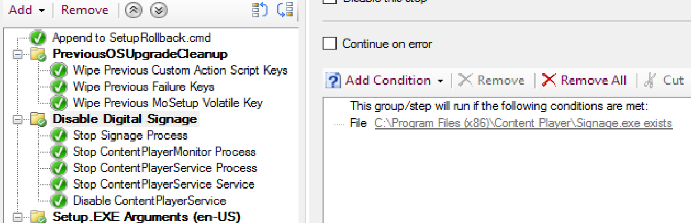
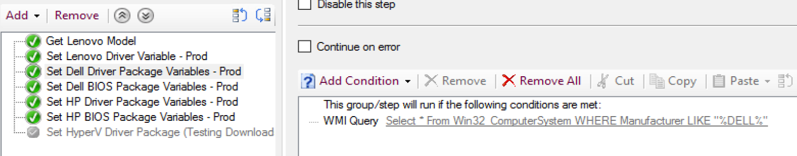
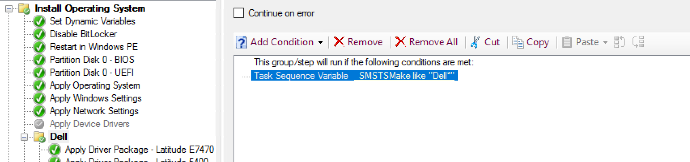
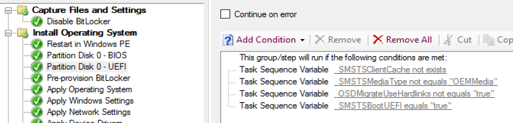
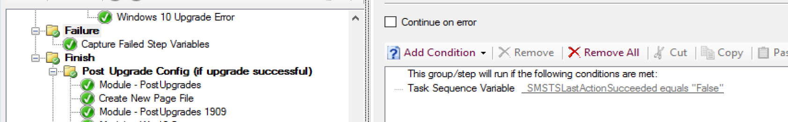

# Conditions [Step Logics]

Conditions are options on each step that can be set to determine if a step will run or not during the task sequence.
Conditions are NOT required and if left blank, the step will always run (unless disabled).
Conditions can be simple or very complex, depending on your requirements.

Typical application of Conditions:

- Apply Model Specific Drivers / Firmware
- If WinPE or Full OS
- UEFI or Legacy BIOS Mode (for formatting the drive properly)
- Applying Language Specific Features on Demand
- Error Handling

> [!NOTE]
> The 'like' operator is evaluated using Windows wild characters '*' and '?'

**Examples:**  

If Specific program is installed, run a group during the Task Sequence.
[File condition] 

If Machines is a Dell, then run this step
[WMI Query Condition] or [_SMSTSMake LIKE Dell*]

Default UEFI Format Step, you can see there are several rules in place before the format step would run.  There are several safe guards in place to make sure it doesn't format the drive if you're doing a refresh and have data on the machine that is supposed to be retrained.  [Based on build in task sequence variables]
  

If the last step failed, run this group.  
[Based on build in task sequence variables]
  

Conditions, along with variables are what allow you to have complete control over what steps run, and allows you to use the same Task Sequence for multiple functions.

**About Recast Software**
1 in 3 organizations using Microsoft Configuration Manager rely on Right Click Tools to surface vulnerabilities and remediate quicker than ever before.  
[Download Free Tools](https://www.recastsoftware.com/?utm_source=cmdocs&utm_medium=referral&utm_campaign=cmdocs#formarea)  
[Request Pricing](https://www.recastsoftware.com/pricing?utm_source=cmdocs&utm_medium=referral&utm_campaign=cmdocs)