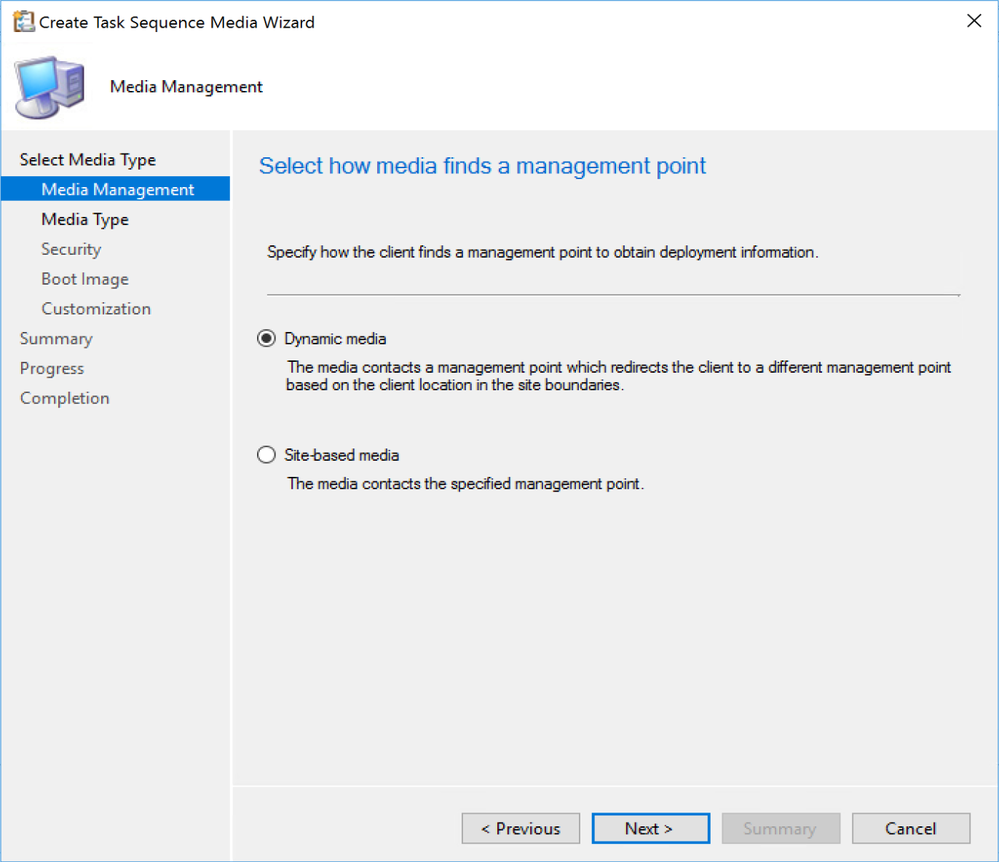
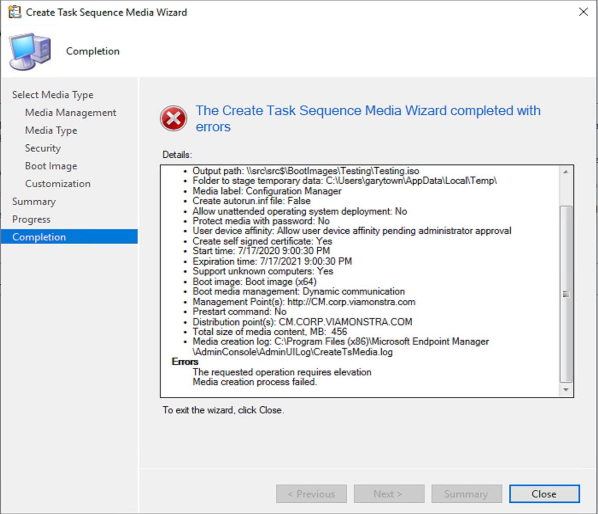

# Create Boot Media (ISO)

Once you've setup your boot images in CM with the requirements you need, you can rely on PXE to boot a machine, USB or ISO.  I will not be covering PXE, at least not yet.  USB & ISO are basically the same, I never create USB Media anymore, just ISO files which I would then extract to a USB If needed.

## MS Docs

MS Docs: <https://docs.microsoft.com/en-us/mem/configmgr/osd/deploy-use/create-bootable-media>

PowerShell:

- [Get-CMBootImage](https://docs.microsoft.com/en-us/powershell/module/configurationmanager/Get-CMBootImage?view=sccm-ps)
- [New-CMBootImage](https://docs.microsoft.com/en-us/powershell/module/configurationmanager/New-CMBootImage?view=sccm-ps)
- [Set-CMBootImage](https://docs.microsoft.com/en-us/powershell/module/configurationmanager/Set-CMBootImage?view=sccm-ps)
- [Set-CMDriverBootImage](https://docs.microsoft.com/en-us/powershell/module/configurationmanager/Set-CMDriverBootImage?view=sccm-ps)
- [New-CMBootableMedia](https://docs.microsoft.com/en-us/powershell/module/configurationmanager/New-CMBootableMedia?view=sccm-ps)

**Under the Hood:**  
Log File: "C:\Program Files (x86)\Microsoft Endpoint Manager\AdminConsole\AdminUILog\CreateTsMedia.log"
Exe Used: "C:\Program Files (x86)\Microsoft Endpoint Manager\AdminConsole\bin\i386\CreateMedia.exe"

**Boot Media Wizard:**  
Right Click Task Sequences -> Create Task Sequence Media
  
  
We're going to focus on the Bootable media option here, as I've never had a need personally for the other 3 options.
> [!NOTE]
> One thing of importance on this page is the option _"Allow unattended operating system deployment"_.  If you're planning to do required deployment where you want to boot the machine and have it automatically kick off a task sequence and run OSD, you'll need to check that box. I've forgotten to check that box a few times and had to recreate the media.  DO NOT Check the box if you want to use the Boot media for available deployments. If no Required deployments are found, the machine will reboot as it didn't find a required deployment.  You need to have separate boot media for Required Deployments and Available Deployments... unless you use PXE.

  

- Dynamic media: This will be your typical option as you can then add several of your MPs into the list allowing the device you're going to run OSD on to dynamically connect to an MP.

- Site-based media: This will be static options allowing the media you create to only connect to the MP you've chosen.  This will be for specific use cases where you'd want to ensure the machine you are building is using a specific MP due to connectivity reasons, or perhaps you want to ensure a specific primary site to have the client join if you have several primary servers.  Could be many reasons for wanting to control this.

  

- Media Type Here you can choose your path of media, USB or ISO.  I always use ISO, even when I need to build a USB Flash Drive.  I find it faster to create a single ISO and then have our techs replace the content on their current flash drive with that of the ISO.  
- Media File, pick a UNC Path that you have access to.  I've created a "BootImages" folder in the root of my source server which all my Tech's have access to for easy sharing.
- Staging folder: Here you can also pick a staging folder, where the process will stage the files while it builds the media.  This does NOT require ADK installed on workstation.  Anywhere your account has rights on the local machine is fine, I've never needed to change the default
- Media Label: This is how the Media will show up in Explorer when the ISO or USB is connected.  I've always left the default, but if you have different systems, it might be worth adding "LAB" or "Primary Site 1" to the name to quickly see if you have the correct media.
- Autorun: by default it also no longer adds the autorun.inf file which often would get flagged by AV systems.  If you still need this, it is available.

  

- Enable unknown computers:  If you
  don't plan to import machines and create records in CM before you run OSD, you'll have to enable this.  You'll have to also make sure you have the unknown computer collection included in your OSD Deployment Collection if you're planning to use this feature to deploy Windows.
- Password:  If you want to safeguard who can run OSD, add a password.  Depending on how you've setup your deployments, there might not be any need for this.  However if you have over bearing risk managers who want additional assurances, then yeah, check the box, make a password and say you've got it locked down.
- Self Signed Cert: This is the default, it will create a self-signed certificate for communications with your DPs.
- PKI Cert: If you're using HTTPS, you'll need to get the PKI cert to add to your boot media.
  - PKI Cert Info: <https://docs.microsoft.com/en-us/mem/configmgr/core/plan-design/network/pki-certificate-requirements>
    - Check this area in the docs: Site systems that have a distribution point installed - Workstation Authentication
- User device affinity: For associating a PC with a user out of the gate vs waiting for the system to figure it out.
  - <https://docs.microsoft.com/en-us/mem/configmgr/osd/get-started/associate-users-with-a-destination-computer>

  

- Boot Image: Pick the Boot Image you'll be using do deploy Windows.
- DP: This will be the DP used in the process of creating the Boot Image.  It has no relevance to the Boot Media after the Media is created.  It does not mean that it is the DP that will be used when you run OSD.
- Management Points:  This will be a list of all of the different Management Points you want your Machine to be able to reach out to during OSD to get information.  I only have one in my lab, so that's why I only have one in the example above.

  

- Variables:  Here you can add variables that will be used during OSD.  You can be as creative as you want, for example you could have each tech put in their user name, and then during OSD that could get stamped to the machine, and you could do reports on which techs imaged which computers for accountability.  
- Enable prestart command: This will start a command before the Task Sequence would launch.
- Include files:  If you need to include any content for your prestart command to run properly, you can add them here.

## Potential Issues

**Requires Local Administrative Rights:**
  
  

Other things that I've run into that has caused me pain is the the _"Allow unattended operating system deployment"_ check box as shown on the _"Select Media Type"_ dialog. If you check that box, you will not be able to use the media for available deployments, only required deployments, which will automatically start.  If you check that box when building your media, and then try to use it on a machine that does not have required deployments, you'll experience a boot loop as such:  
You'll boot up to the CM Boot Media, you will NOT get any dialog boxes, it will look like nothing is happening, and after a few minutes, it will automatically reboot.  If you open the smsts log, you will see that it is looking for policy and when it doesn't find any required deployments, it reboots.  This behavior is intentional, as perhaps the required deployment policy hasn't replicated through your environment yet, so instead of the machine just freezing and never going, it reboot, and assuming you have it automatically boot to the media, it will then boot back into the CM Boot Media, and try again to load the required TS deployment.

**About Recast Software**
1 in 3 organizations using Microsoft Configuration Manager rely on Right Click Tools to surface vulnerabilities and remediate quicker than ever before.  
[Download Free Tools](https://www.recastsoftware.com/?utm_source=cmdocs&utm_medium=referral&utm_campaign=cmdocs#formarea)  
[Request Pricing](https://www.recastsoftware.com/pricing?utm_source=cmdocs&utm_medium=referral&utm_campaign=cmdocs)
