# Modify Boot Images

## MS Docs

MS Docs: <https://docs.microsoft.com/en-us/mem/configmgr/osd/get-started/manage-boot-images#BKMK_ModifyBootImages>

MS Docs (Win-PE): <https://docs.microsoft.com/en-us/windows-hardware/manufacture/desktop/winpe-intro>

PowerShell:

- [Get-CMBootImage](https://docs.microsoft.com/en-us/powershell/module/configurationmanager/Get-CMBootImage?view=sccm-ps)
- [New-CMBootImage](https://docs.microsoft.com/en-us/powershell/module/configurationmanager/New-CMBootImage?view=sccm-ps)
- [Set-CMBootImage](https://docs.microsoft.com/en-us/powershell/module/configurationmanager/Set-CMBootImage?view=sccm-ps)
- [Set-CMDriverBootImage](https://docs.microsoft.com/en-us/powershell/module/configurationmanager/Set-CMDriverBootImage?view=sccm-ps)
- [New-CMBootableMedia](https://docs.microsoft.com/en-us/powershell/module/configurationmanager/New-CMBootableMedia?view=sccm-ps)

Reasons to Modify the Boot Images:

- Common Reasons
  - Update CM Client
  - Update OS Version
  - Add Components
  - Add Drivers
  - Enable F8 Support (Command Prompt)
- Additional, but less common reasons
  - Customize Boot Media
    - Enable Pre-Start Command
    - Customize Wallpaper (Replace the Default Microsoft Endpoint Manager Wallpaper)

### Requirements

Microsoft Windows Assessment and Deployment Kit (Windows ADK).  You'll want to check out the ConifgMgr Support page for which versions of Windows and ADK are supported.  You need two parts, the Base ADK installer, and the WinPE Add-on.  It needs to be installed on:

- The site server of the top-level site in the hierarchy
- The site server of each primary site in the hierarchy
- Every instance of the SMS Provider
- MS Docs - [ADK ConfigMgr Infrastructure](https://docs.microsoft.com/en-us/mem/configmgr/osd/plan-design/infrastructure-requirements-for-operating-system-deployment#windows-adk-for-windows-10)

Links:

- MS Docs - [Supported ADK with ConfigMgr](https://docs.microsoft.com/en-us/mem/configmgr/core/plan-design/configs/support-for-windows-10#windows-10-adk)
- MS Docs - [ADK Download](https://docs.microsoft.com/en-us/windows-hardware/get-started/adk-install)
- Community - [ConfigMgr Prerequisites Tool](https://msendpointmgr.com/configmgr-prerequisites-tool/)
  - This will automate the download and install of the ADK.

> [!NOTE]
> If you're upgrading ADK, you need to uninstall the previous version first. My personal experience and recommendation is to reboot the machine after uninstall of the old ADK before installing the new version, then reboot again after the install of the new version.

### Example of Updating  

Current Boot Image Info:
[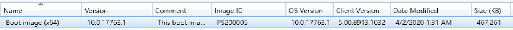](media/ModifyBoot01.png)  
Updating to new CM Client Version & New OS Build Version
In this example, the Boot Image is currently 17763 (1809) and I've updated my ADK on the server to 19041 (2004).
[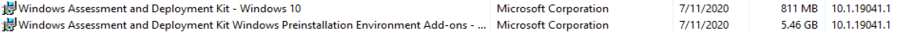](media/ModifyBoot02.png)  
Now I want to update my Boot image to reflect the new ADK & CM Clients. Right Click Media -> Update Distribution Points.  That will launch this wizard:
[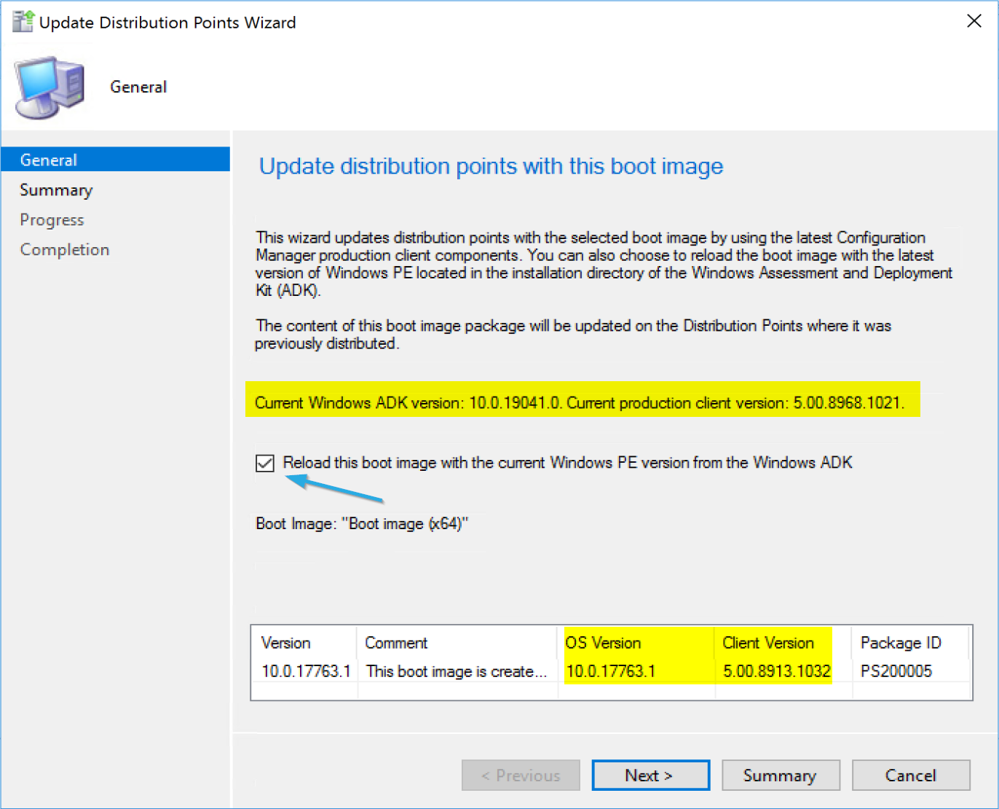](media/ModifyBoot03.png)  

Here you can see that it detects the updated ADK that is installed on the server which is newer than the boot image, and it also shows the current CM Client, which is newer than what is in the boot image.  Check the box to reload the boot image to incorporate the updates. Let's go ahead and do this!
  [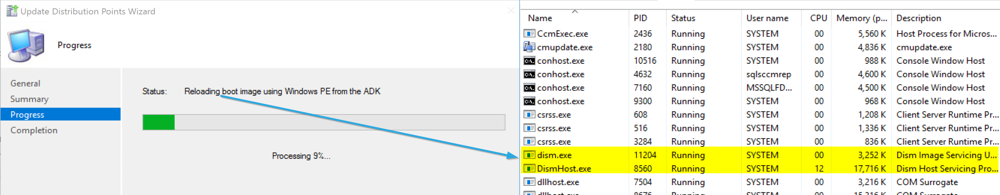](media/ModifyBoot04.png)

When it runs, behind the scenes it is using DISM to mount the boot image and apply the changes for you.  This is why you'll need ADMINISTRATOR access on the Server that is building the boot image, or it will fail with access denied.
You can watch the status bar for a while, or you can follow along in the dism log (c:\windows\logs\dism\dism.log)

Once Complete:
[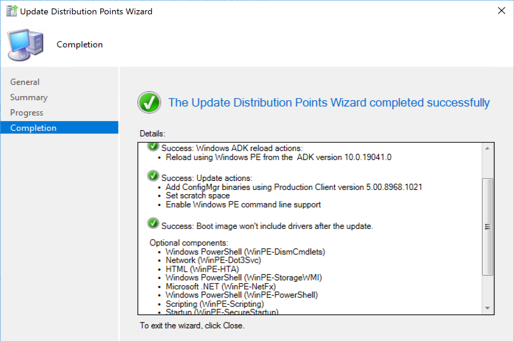](media/ModifyBoot05.png)
[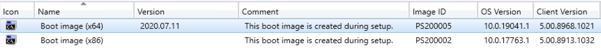](media/ModifyBoot06.png)
You can see my boot image OS Version has updated to match the ADK, and the Client Version has updated to match the production CM Client in the Console.  I don't bother to update the x86 image, as I don't use it.   I manually updated the Version column with the date.  Then if the date modified doesn't match, I know that CM updated it for me, vs me doing it manually.

### Adding Drivers

<https://docs.microsoft.com/en-us/mem/configmgr/osd/get-started/manage-boot-images#drivers>
To Add drivers to the boot image, you first must have imported them into CM as drivers, so they are available for your boot media to use.
[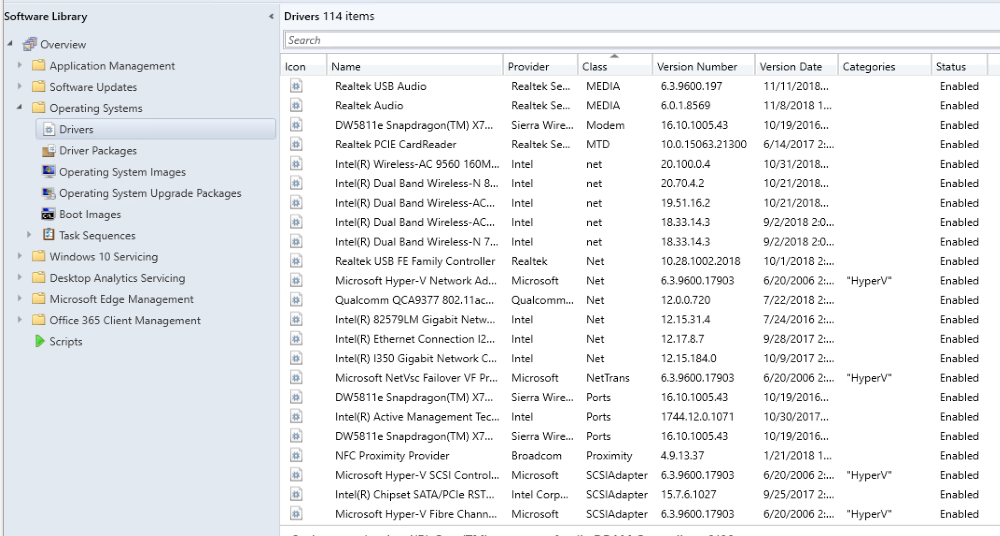](media/ModifyBoot07.png)

I'll be honest, I haven't needed to import drivers into the boot image for doing OSD on physical machines for a very long time.  The only thing I've had to add drivers for in the past several years has been VMWare, so I can image VMWare VMs.  
So once you have drivers imported, you can add them to a boot image.
[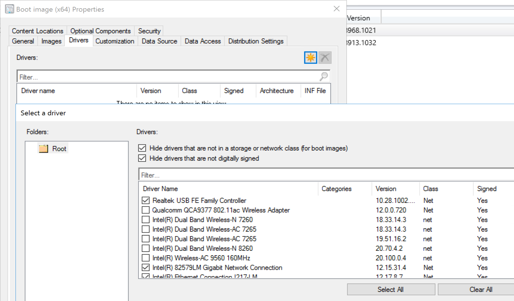](media/ModifyBoot08.png)
When you go to the Drivers tab, you can click the little start to add drivers, which launching the "select a driver" dialog.  At this point they pre-filter a lot of things out for you.  In  VMWare, I was adding a mouse driver, so I had to uncheck the first box so I could find the mouse driver.
In this example, I'm adding a few Network Card Drivers, then clicking OK which adds them into the Boot Image Drivers Properties as shown below:
[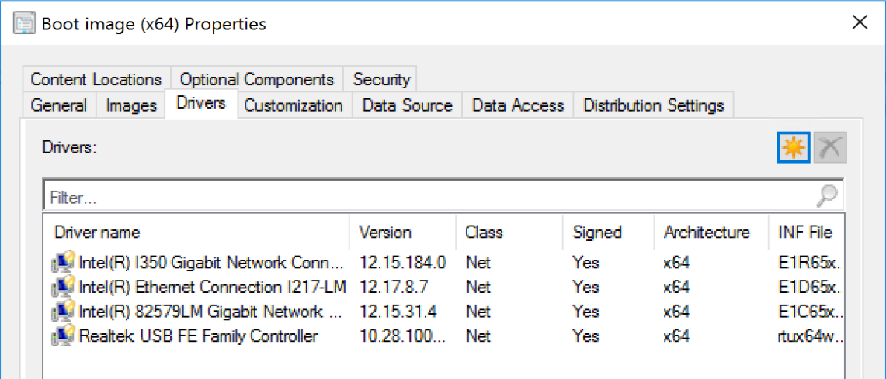](media/ModifyBoot09.png)
When I click Ok on the properties, I now get a notification that I'd have to update it to make the changes be applied:
[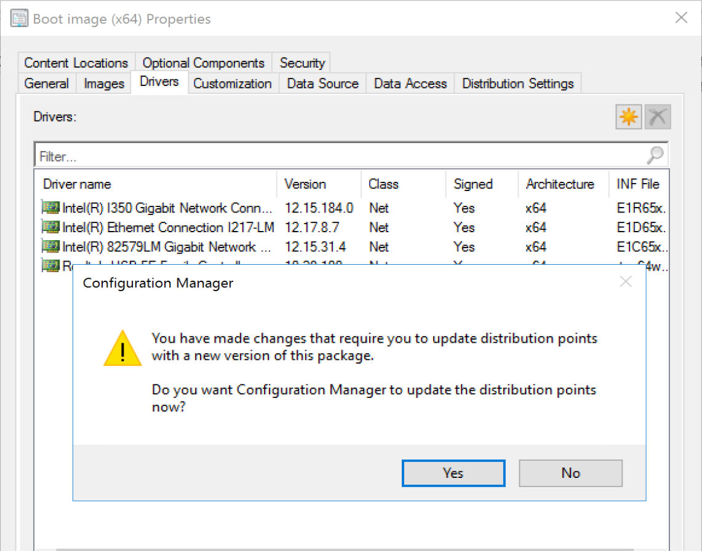](media/ModifyBoot10.png)
If you click "Yes" it will go ahead and start the process.

### Adding Command Prompt (F8) Support

If you're creating and testing, this is a must have.  This was one of your only options before the TS Debugger was created, which I'll cover in another post and link when I get that far.
This is a simple check box, check the box, and rebuild.
[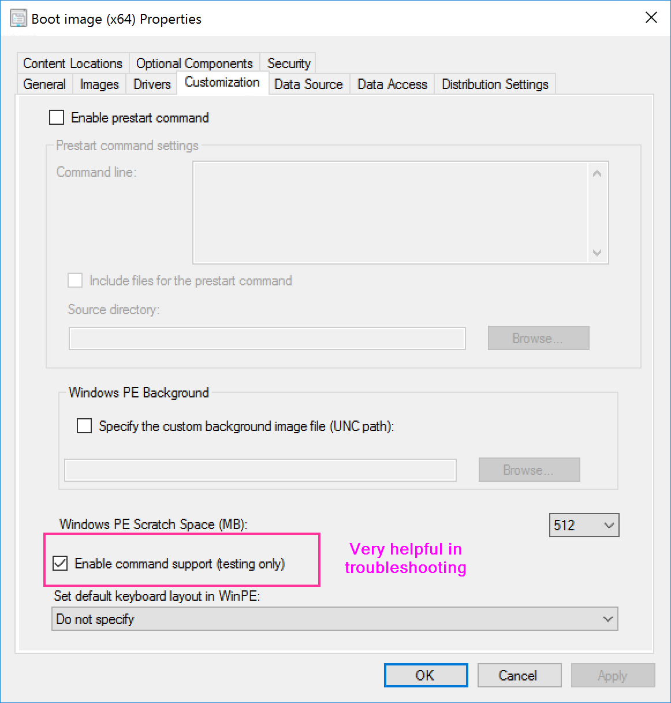](media/ModifyBoot11.png)
After the rebuild is complete, you will now have the modified boot images to be used in your boot media.

### Adding Custom Background

You want to add a simple item to let your users know that when a computer boots to your WinPE, that's it coming from you and not some malware thing?  A Corporate Background says a lot.
 On the Customization Tab, check a box for the custom background, browse to your file, and then it will prompt to update your media.
[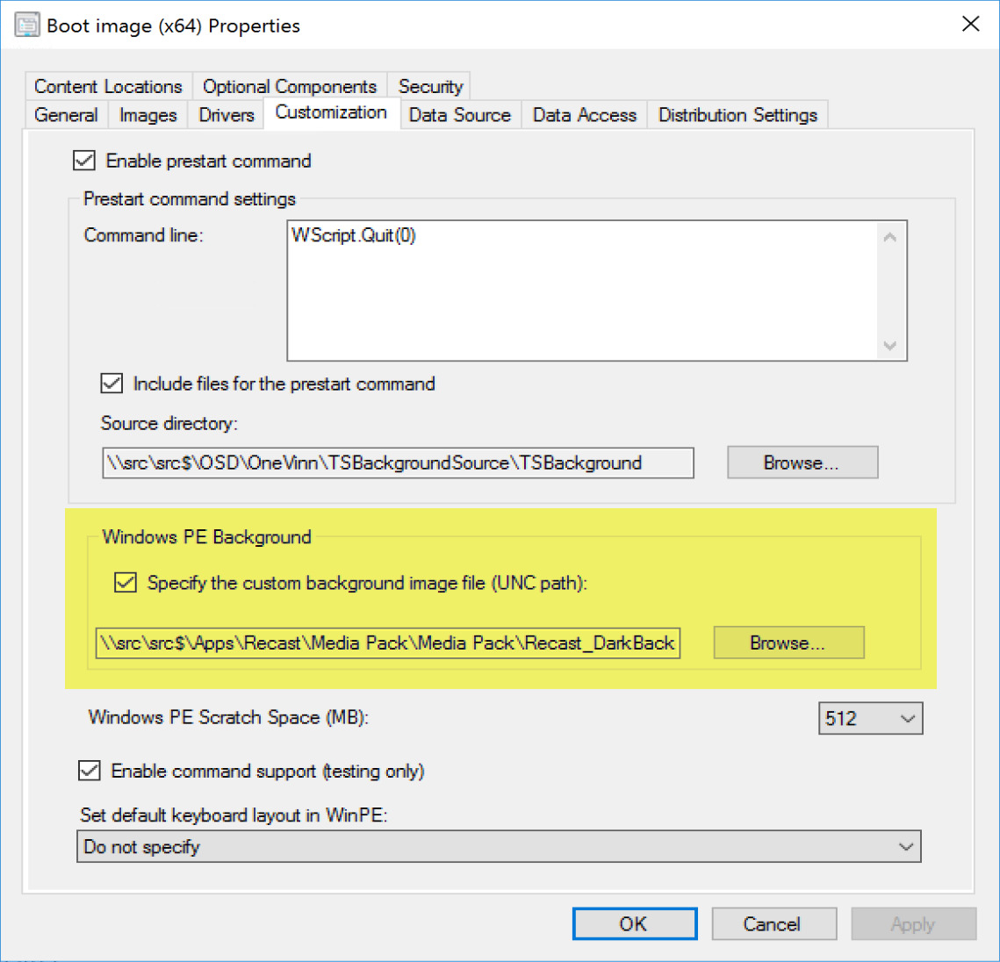](media/ModifyBoot12.png)
[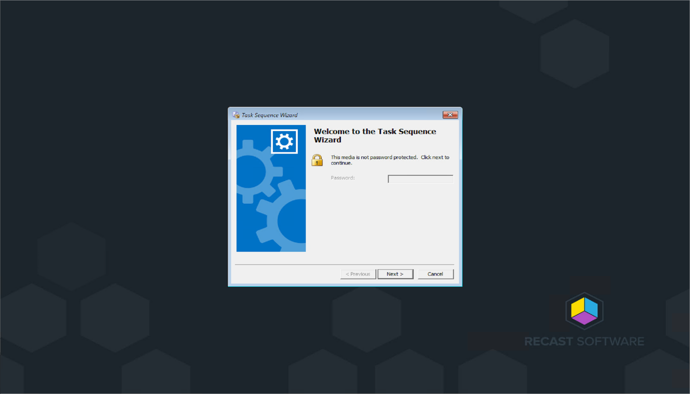](media/ModifyBoot13.png)

### Community Links

- [Create a new WinPE Boot Image](https://sysmansquad.com/2021/02/22/create-a-new-winpe-boot-image/)

### Recast Examples

Check the [Leverage BGInfo in WinPE](SCCM_TaskSequence_Leverage_BGInfo.md) page.

**About Recast Software**
1 in 3 organizations using Microsoft Configuration Manager rely on Right Click Tools to surface vulnerabilities and remediate quicker than ever before.  
[Download Free Tools](https://www.recastsoftware.com/?utm_source=cmdocs&utm_medium=referral&utm_campaign=cmdocs#formarea)  
[Request Pricing](https://www.recastsoftware.com/pricing?utm_source=cmdocs&utm_medium=referral&utm_campaign=cmdocs)
