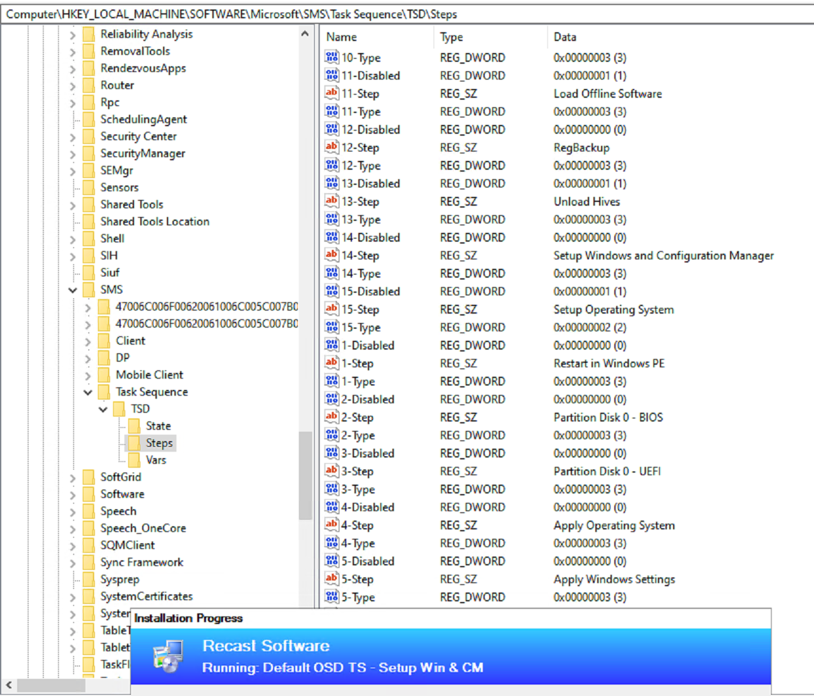
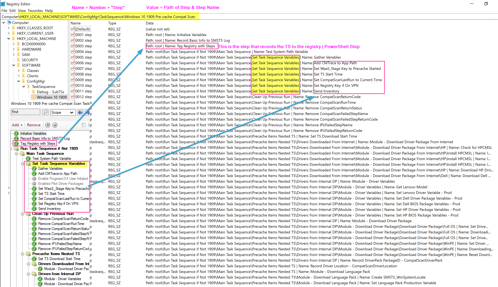

# Task Sequence Tips

This is going to be a random collection of things I find interesting and want to document / share, but not really worth an entire page.  This will be a pretty fluid page and continue to update as I find more things, so check back randomly.

Feel free to submit tips as well, DM me on twitter @gwblok and I'll check out your tip.

## TS Log Locations

- WinPE: %temp%\SMSTSLog\ (%temp% is typically X:\Windows\Temp)
- Full OS: C:\_SMSTaskSequence\Logs\
  - I never use this location
- Full OS (After CM Client Installed): C:\Windows\CCM\Logs\SMSTSLog\
- Post OSD: C:\SMSTSLog\
  - The Intial OSD Task Sequence logs are copied there, all future TS Logs will go to the normal C:\Windows\CCM\Logs\ location

> [!IMPORTANT]
> In Windows, during an ACTIVE TS, the log will be in C:\Windows\CCM\Logs\SMSTSlogs\smsts.log, but once the TS is done, it merges into the parent folder: c:\Windows\CCM\Logs\smsts.log 

> [!TIP]
> During an Active TS, you can have a step that deletes or renames c:\windows\ccm\logs\smsts.log, so after the TS, when your current TS merges into the parent folder, it will only have information from the last TS deployment, instead of having to weed out the other ts deployments.  Helpful when troubleshooting, not really a great idea to have set as default.

## GPO Processing Paused during TS

Ever wonder why during OSD, Group Policy Doesn't apply, it's how the Task Sequence leverages SetupComplete.cmd to keep the TS alive.  

Check out this [page to go deeper about SetupComplete.cmd](https://docs.microsoft.com/en-us/windows-hardware/manufacture/desktop/add-a-custom-script-to-windows-setup#run-a-script-after-setup-is-complete-setupcompletecmd), where it explains why GPO doesn't run while SetupComplete.cmd is active.

Check out this [Recast Doc for Setup Windows and ConfigMgr step](https://docs.recastsoftware.com/ConfigMgr-Docs/TaskSequence/SCCM-TaskSequence-Step-Setup-Windows-And-ConfigMgr.html) to see how it works:

> [!NOTE]
> OSDSetupWindows.exe then calls OSDSetupHook.exe /Install:c:\windows  
This creates the folder: c:\windows\setup\Scripts
setupcomplete.cmd  (Runs at the end of Windows Setup)  
Contents: "%windir%\system32\osdsetuphook.exe /execute

## Task Sequence Tip Posts (Recast Software Blog)

- [Tag Version in Description](https://www.recastsoftware.com/resources/a-week-of-task-sequence-tips-day-01/)
- [Task Sequence Pause](https://www.recastsoftware.com/resources/a-week-of-task-sequence-tips-day-02/)
- [Variables Gather and Capture](https://www.recastsoftware.com/resources/a-week-of-task-sequence-tips-day-03/)
- [SMSTS Log Stamping](https://www.recastsoftware.com/resources/a-week-of-task-sequence-tips-day-04/)
- [Run Task Sequence Step](https://www.recastsoftware.com/resources/a-week-of-task-sequence-tips-day-05/)
- [Static IP Addresses and OSD](https://www.recastsoftware.com/resources/a-week-of-task-sequence-tips-day-06/)
- [Run PowerShell Step](https://www.recastsoftware.com/resources/a-week-of-task-sequence-tips-day-07/)


## Trigger Task Sequence from Command Line

Assumptions, the Task Sequence has been deployed to the machine and in Policy.

- WMI: This leverages WMI Methods to trigger the Task Sequence.  I wrote a function to do this and have it on [GitHub](https://github.com/gwblok/garytown/blob/master/CM_PowerShell_Snips/Start-TaskSequence.ps1)
- Command Line Tool: New EXE in CM 2002: TSPLaunch.exe (Limited Use available)
  - Syntax: TSPLaunch.exe /TSDeploymentID:PS100011
  - This gets used when triggering a Task Sequence during the ccmsetup.exe install using the [PROVISIONTS](https://docs.microsoft.com/en-us/mem/configmgr/core/clients/deploy/about-client-installation-properties#provisionts) option
  - Task Sequence (Non IPU / OSD) must be deployed to the Provisioning Collection

## Task Sequence Step info in Registry (DebugMode)

Check out Key:  

```
HKLM\Software\Microsoft\SMS\Task Sequence\TSD\
```

However, you have to have the TS Debugger enabled for that data. [TS Debugger Info](SCCM-TaskSequence-Debugger.html)
[](media/TSTips01.png)

[](media/TSTips01.png)

### Community Version on [GitHub](https://github.com/gwblok/garytown/blob/master/CM_PowerShell_Snips/WriteTSStepsRegistry.ps1)

[](media/TSTips03.png)

## Delete Execution History for Task Sequence

Ever want to clear out the "Failed" status in Software Center, or just reset it, so it shows as "Available"?  
Delete Key:  

```
HKLM\SOFTWARE\Microsoft\SMS\Mobile Client\Software Distribution\Execution History\System\(IPU Package ID)
```

I have a 3 Functions on [GitHub](https://github.com/gwblok/garytown/blob/master/CM_PowerShell_Snips/TSExecutionHistory.ps1) to Get, Set, Remove the Execution History.

## Troubleshooting

Common issues, besides the ones listed below, there are also some listed on the related steps, in the Task Sequence Steps section.

- Content Related
  - Boundary Groups, the machine doesn't have a DP in the boundary group to pull content from, or a fall back wasn't enabled for the content.
  - Content wasn't distributed, or in the middle of distribution.
- Typos
  - This has been the number 1 issue for me personally, bad syntax, wrong "quotes" or typos.
- Good Practices
  - Use a Hyper-V VM to test a Task Sequence
    - Removes the variables created by hardware
    - Easy to test both Legacy BIOS and UEFI
  - Keep a Simple Default CM TS that is proven to work, and test your problematic steps there while in debug mode.
- Issues during Setup Windows & ConfigMgr Step
  - Swap your WIM for Native MS WIM
  - Create a Default CM OSD TS and test your WIM
  - Check your settings on the following Steps
    - Apply OS Image
    - Apply Windows Settings
    - Apply Network Settings
    - Setup Windows & ConfigMgr Step
- Issues during WinPE
  - Make sure your WinPE supports the action
    - If you're calling a PowerShell Script, make sure you've enabled PowerShell... etc.
  - If something in WinPE fails on Physical, test same process in HyperV VM. Rule out Drivers
  - ADKs have had their share of issues lately, so check Twitter / Reddit for other with same issue, or check the ADK known issues. [ADK What's New](https://docs.microsoft.com/en-us/windows-hardware/get-started/what-s-new-in-kits-and-tools)
  - Unable to set Static IP.  I've seen where if you've tried to set a valid address on a NIC on a machine that has several NICs, then you noticed that it was the wrong NIC, and you tried to set the IP on the right NIC, it gives you invalid IP Address.  If you find you accidentally set the IP on wrong NIC, reboot, and try again, don't try to fix it with rebooting.
  
  **About Recast Software**
1 in 3 organizations using Microsoft Configuration Manager rely on Right Click Tools to surface vulnerabilities and remediate quicker than ever before.  
[Download Free Tools](https://www.recastsoftware.com/?utm_source=cmdocs&utm_medium=referral&utm_campaign=cmdocs#formarea)  
[Request Pricing](https://www.recastsoftware.com/pricing?utm_source=cmdocs&utm_medium=referral&utm_campaign=cmdocs)
