# ConfigMgr Task Sequence Debugger

The Task Sequence Debugger is an essential tool to become familiar with for any admin who works with OSD.  I'm going to show how you can enable it, then how you can leverage it.

## MS Docs

<https://docs.microsoft.com/en-us/mem/configmgr/osd/deploy-use/debug-task-sequence>

## Variables

- [TSDebugMode](https://docs.microsoft.com/en-us/mem/configmgr/osd/understand/task-sequence-variables#TSDebugMode)
- [TSDebugOnError](https://docs.microsoft.com/en-us/mem/configmgr/osd/understand/task-sequence-variables#TSDebugOnError)
The docs are a good place to start, it talked about two methods to enable the Debugger, I'm going to show you both.

## Related Posts

- [Recast TS Tips](https://www.recastsoftware.com/blog/a-week-of-task-sequence-tips-day-02) - Check out the video that I show it in action (towards the end of the video)
- [Pause a Task Sequence without the Task Sequence Debugger](https://z-nerd.com/blog/2021/01/21-pause-a-ts-without-the-task-sequence-debugger/) (Nathan Ziehnert [@theznerd](https://twitter.com/theznerd))
- [Breaking down the Task Sequence Debugger](http://www.potentengineer.com/breaking-down-the-task-sequence-debugger/) (Daniel Ratliff [@PotentEngineer](https://twitter.com/PotentEngineer))

> [!NOTE]
> When launching a Task Sequence in debug mode from Software Center, you will be prompted for Adminstrator Credentials.  If none are provided, the TS wil stall.

> [!WARNING]
>There is a "Bug" with the Debugger, if you are going to use it in OSD, you need to "Turn it off and back on again" before & after your "Setup Windows & ConfigMgr Step.  More info, check out [THIS POST](https://sccmf12twice.com/2020/04/task-sequence-debugger-hanging-during-oobe/) from Mike Marable

### Collection / Machine Variable

This is my preferred way to enable it, I find it easier to add it to a test machine vs creating a deployment to a collection.  Typically I only want to test it on one machine anyway.

[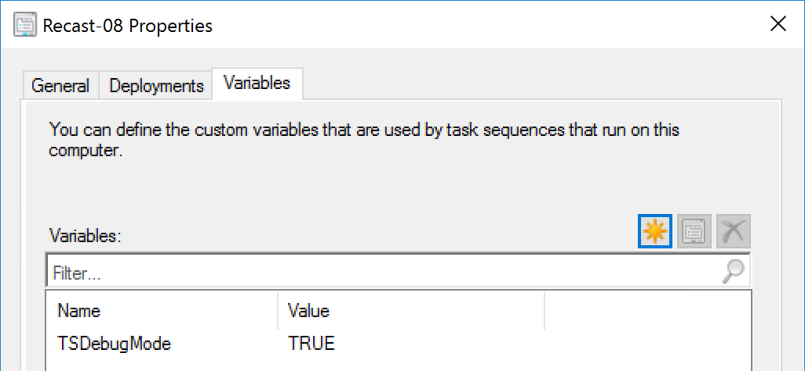](media/TSDebugger15.png)

Here I'm going to show that I've created a "Debug" Collection, and add my test machines.  I've set the variable on this collection, so each machine will have the debugger enabled.

Every machine in this collection will now have the variable "TSDebugMode = True" Applied to it.  So ANY Task Sequence that any of the machines in this collection run, will run in Debug Mode.
[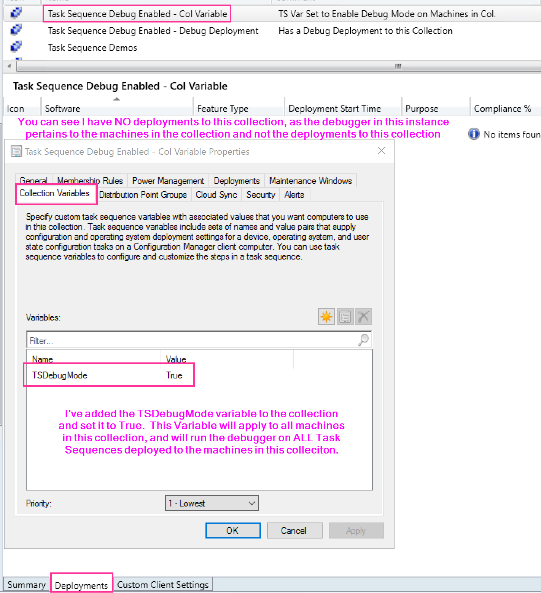](media/TSDebugger01.png)

As Example, the machine Recast-03 is in this collection, and will have the any of the Task Sequence Deployments run in Debug Mode
[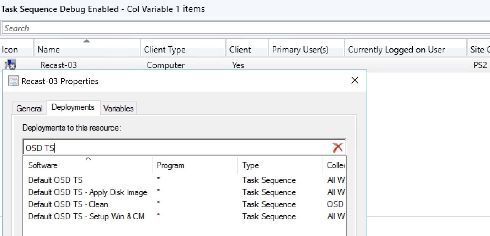](media/TSDebugger02.png)

When I start the machine (Recast-03) and run the TS, the Debugger opens as before the first step runs:
[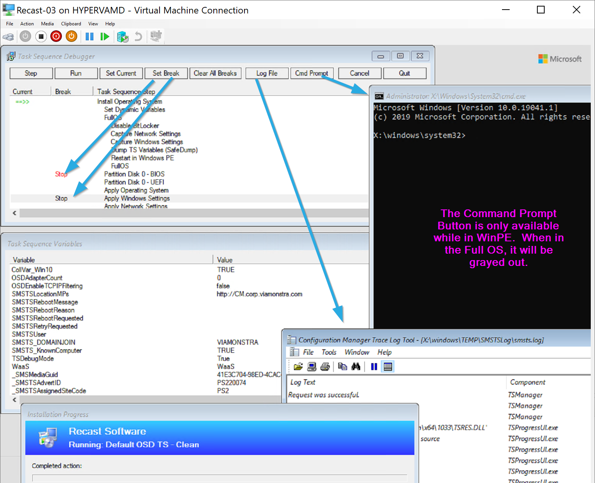](media/TSDebugger03.png)

#### Actions

- **Step** will forward you 1 step
- **Run** will allow the task sequence to run without pausing until it hits a break or the machine restarts, at which time you'd have to click run again.
- **Set Current**, allows you to go forward or backwards.  Personally, I'd only use this to go backwards and retry something, moving forward is probably a bad test, as many times things later in the TS rely on things set early
- **Set Break** allows you to set a break point, allowing you to click run and having the TS run normal until it reaches a place you'd like to observe more closely.
- **Clear all Breaks**... clears the breaks you created
- **Log File**, launches the SMSTS.log file
- **Cmd Prompt** - while in WinPE, it will launch the Command Prompt
- **Cancel** will error out the TS and your done.
- **Exit** will close the debugger and allow the TS to run normally.

### Debug Deployment

If you'd rather control the debugger at the Task Sequence level, you can do that was well. This method is handy if you're unable to create additional collections, set machine variables, or want to limit the debugging to a single TS, but have it debug on any machine that runs that deployment.  In this example, any of the machines in this collection would be able to debug this Task Sequence, but any other task sequence deployment would be left unaffected.

[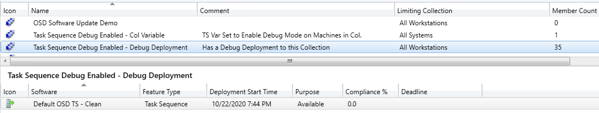](media/TSDebugger04.png)
[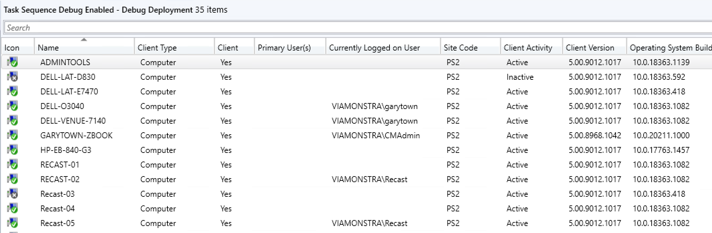](media/TSDebugger05.png)

In this example, I've created a Debug Deployment using this method:

Right Click on The Task Sequence you want to debug, and choose Debug, this will launch the deployment wizard
[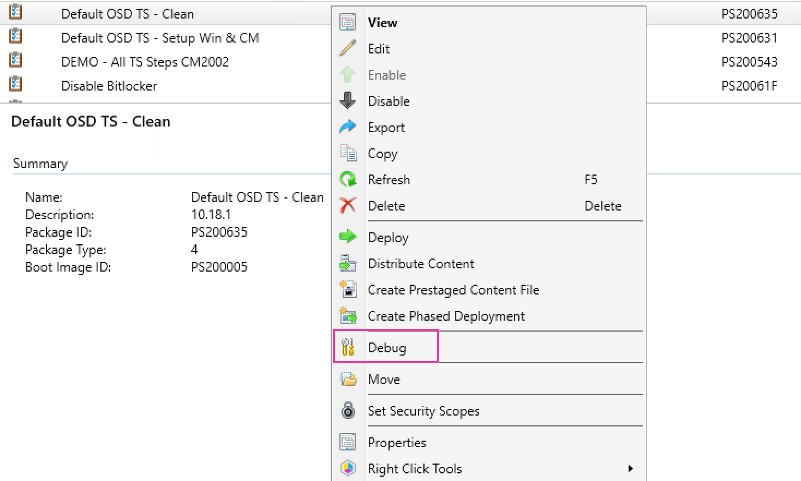](media/TSDebugger06.png)
[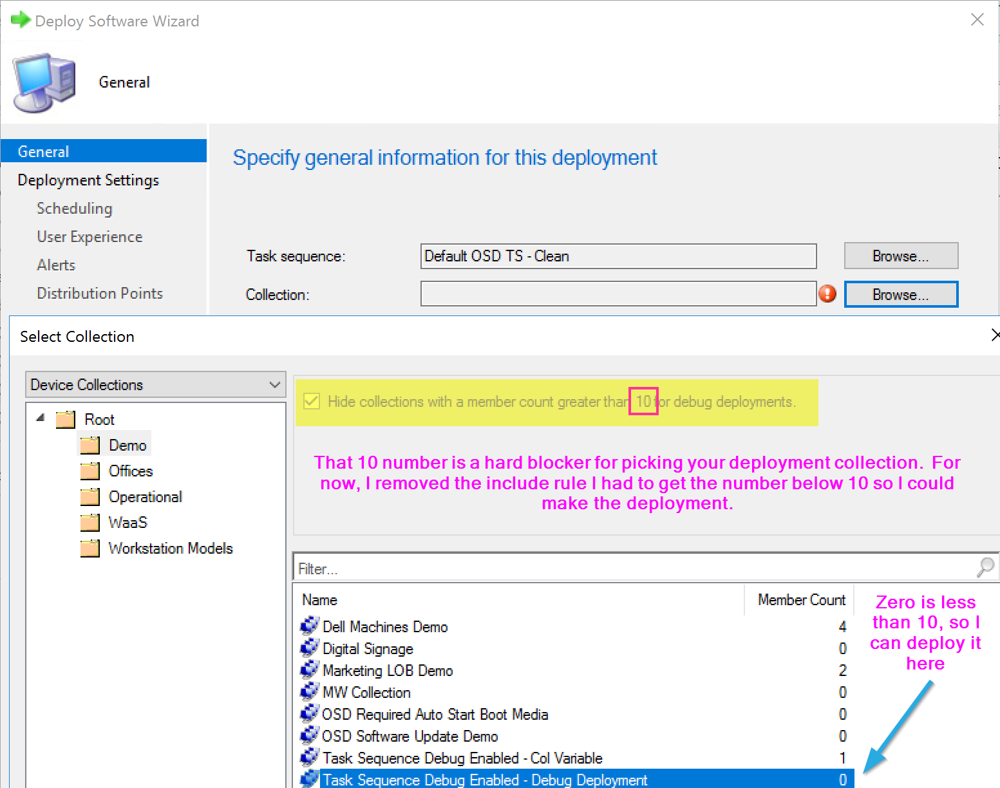](media/TSDebugger07.png)
[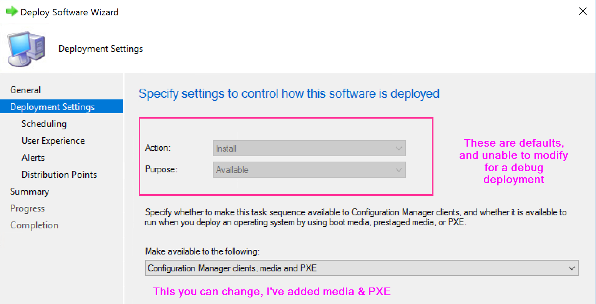](media/TSDebugger08.png)
[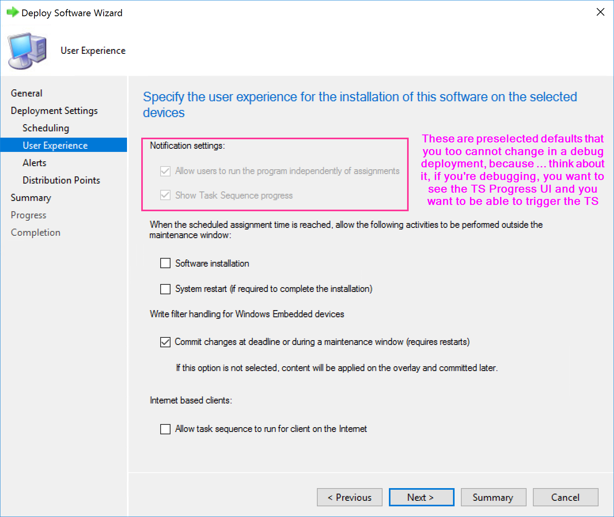](media/TSDebugger09.png)
[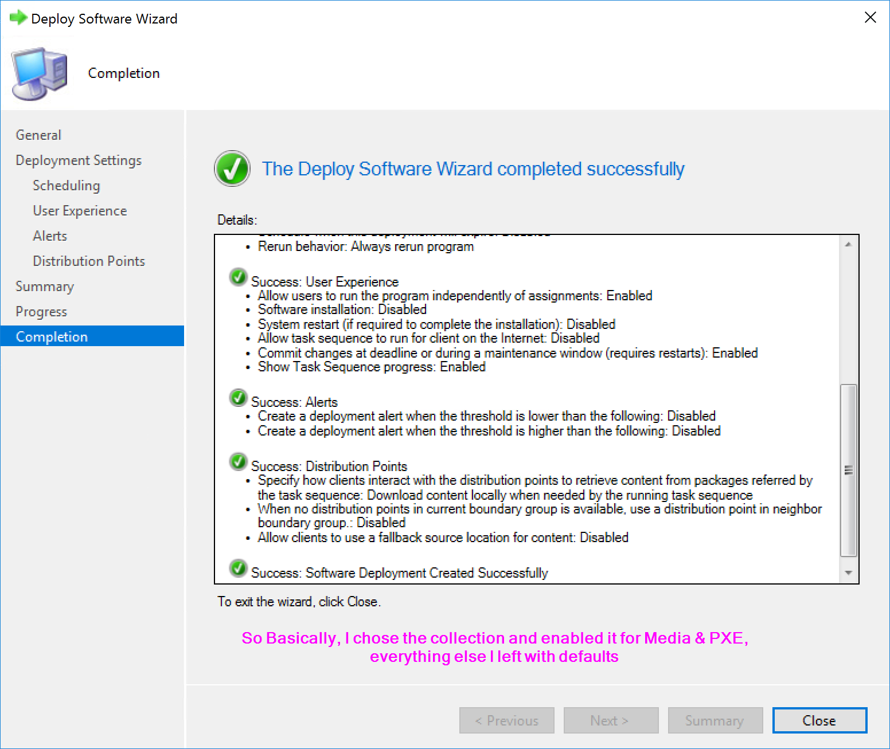](media/TSDebugger10.png)

In the wizard, I choose my collection, which I made sure had less than 10 (at the time I created the deployment), and used all the defaults, except I allowed it to run from Media & PXE.

When you go to run the TS, you'll see it has a tag, "[Debug]" behind it
[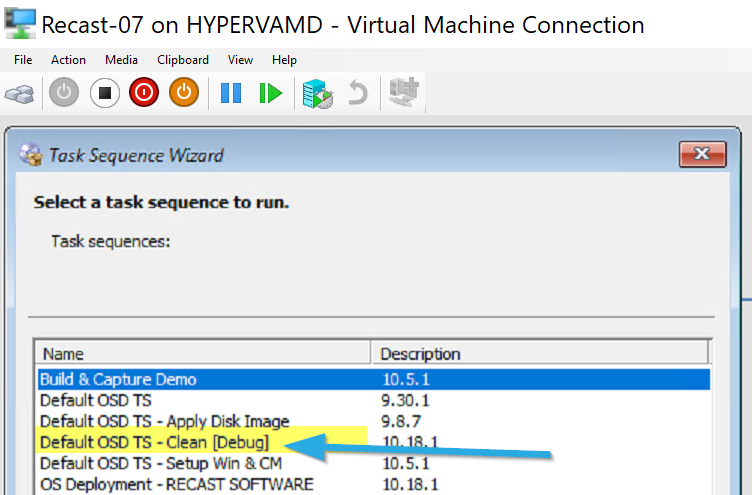](media/TSDebugger11.png)

Note, if you have the same TS Deployed in non Debug Mode, you might find that you don't see the Debug Mode Version.
[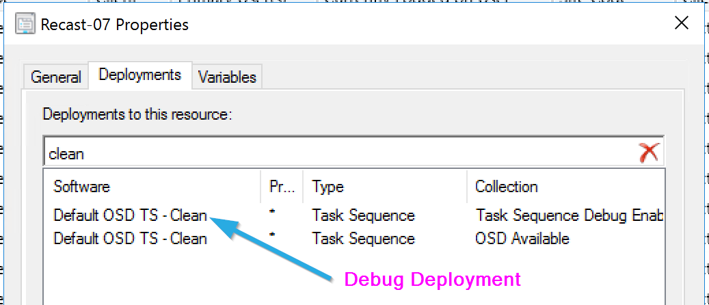](media/TSDebugger12.png)
[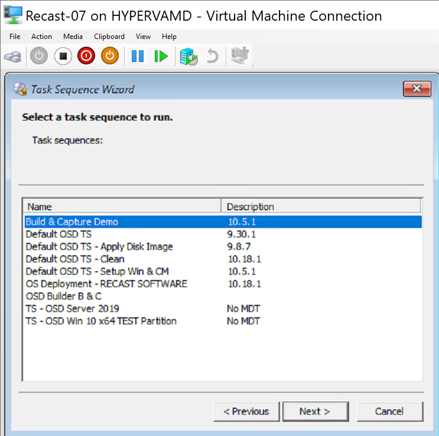](media/TSDebugger13.png)

What happens is, if you had a "regular" Deployment of that Task Sequence first, it wins.  Whichever Deployment is older, is the winner.

In my testing, I deleted the deployments and tested having them created in different orders, and whichever of the two deployments were created first, always won as the option to run.

### Behind the Curtains

The Debugger lives in the Boot Media and as part of the CM Client install.  TSD.exe is the brain behind it.  
WinPE: x:\sms\bin\x64\TSD.exe
Client: c:\windows\ccm\TSD.exe

The TSManger component controls the debugger, but you'll see additional information in the log depending on what you're doing with the debugger

[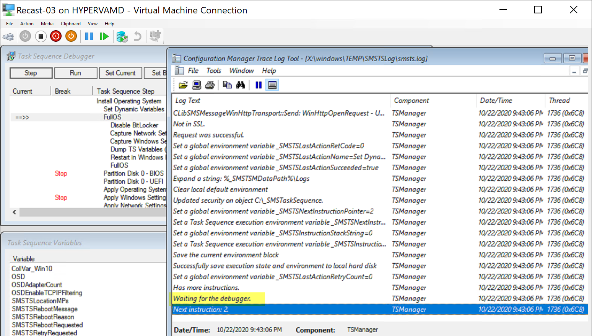](media/TSDebugger14.png)

And there you have it, the Task Sequence Debugger in all it's usefulness.

**About Recast Software**
1 in 3 organizations using Microsoft Configuration Manager rely on Right Click Tools to surface vulnerabilities and remediate quicker than ever before.  
[Download Free Tools](https://www.recastsoftware.com/?utm_source=cmdocs&utm_medium=referral&utm_campaign=cmdocs#formarea)  
[Request Pricing](https://www.recastsoftware.com/pricing?utm_source=cmdocs&utm_medium=referral&utm_campaign=cmdocs)
