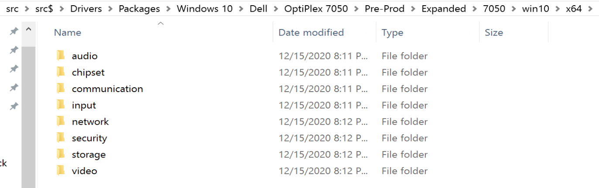
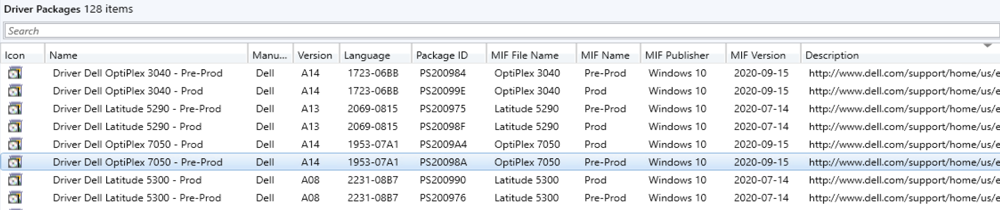
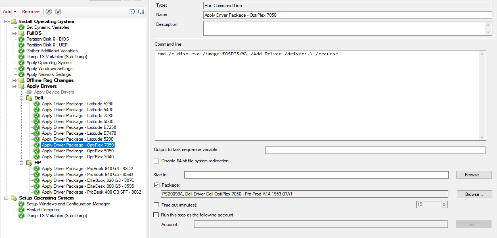
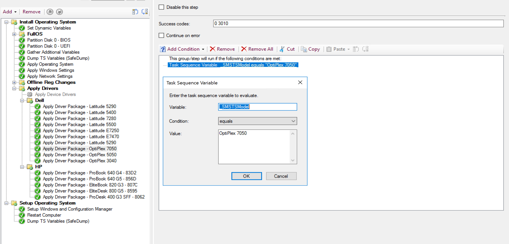
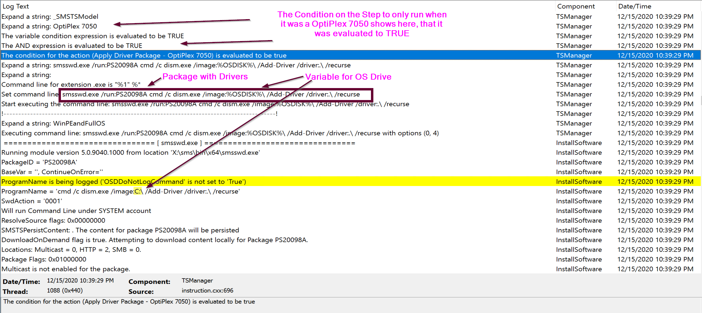
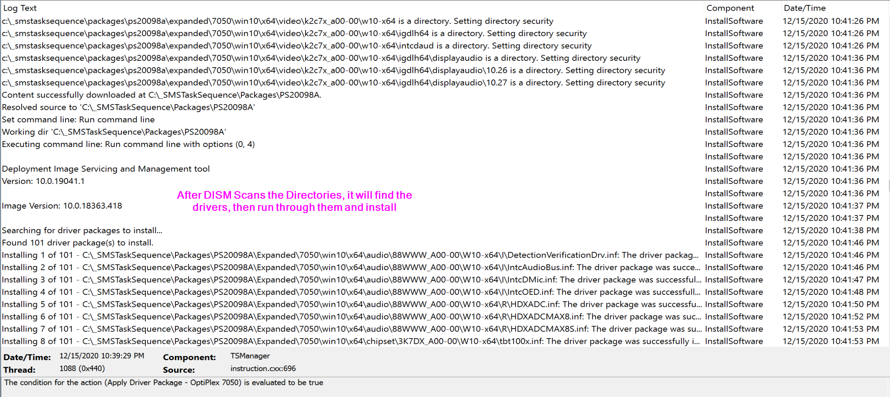
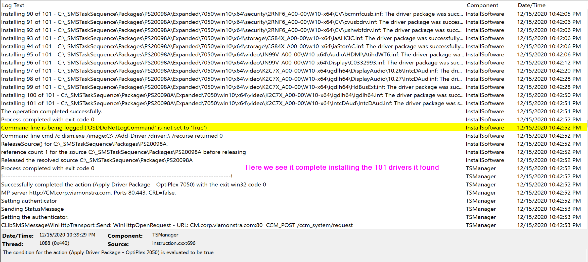

# Apply Drivers during OSD with Legacy Package and DISM

The standard method to apply drivers during OSD is to leverage the two default methods in the Task Sequence

- [Auto Apply Drivers](SCCM-TaskSequence-Step-Auto-Apply-Drivers.md)
- [Apply Driver Package](SCCM-TaskSequence-Step-Apply-Driver-Package.md)

But you can bypass the import of drivers into CM, keeping you console cleaner and only importing the drivers required for WinPE, and still support several models of devices with custom drivers.  

Basically, the idea is, the drivers are kept organized on our source share, you create a legacy package for each model, no program is needed, then during OSD a "Run Command Line" Step would be used to DISM the drivers, just like the built in steps would do for you.

Lets walk through this, for an example, I'm going to use the Dell Latitude 5290.  I've already downloaded the Driver Pack Cab from their website and extracted the contents to my source server in my folder structure:

[](media/DriverPackage01.png)

This is how I've laid out my structure

**Drivers\ItemType\OS\Manufacturer\Model\Stage\DriverPackContents**  
Ex:
**Drivers\Packages\Windows 10\Dell\OptiPlex 7050\Pre-Prod\\** Driver Pack Contents  
Lets look at that a bit more:

- Drivers
  - DriverPackages (Used with Native Driver Packages)
  - Source (Source location for importing drivers from)
  - Packages (Legacy Packages for Drivers)
    - Server
    - Windows 10
      - Lenovo
      - HP
      - Dell
        - Latitude 5290
        - OptiPlex 7050
          - Prod
          - Pre-Prod

I've found that a good way to keep organized.  
We have both Production and Pre-Production version of Driver Packages.  The idea here is, as new driver packs are released from a vendor, we replace the contents of the Pre-Prod Package, run tests with the Pre-Prod Package Drivers, and after we deem them "good", we promote the Pre-Prod Drivers into the Production Package.

The Package in CM then looks like this:

### The Console

[](media/DriverPackage02.png)

We capture several data points that we then place into the package for reporting and automation to leverage, but that's for another time.

So now you have your Packages for each model, with Drivers that you want to apply during OSD.

### The Task Sequence

Leveraging the Run Command Line step type, I've added the command line: [(Assuming you set osdisk to your primary windows partition during the format step)](https://docs.recastsoftware.com/ConfigMgr-Docs/TaskSequence/SCCM_TaskSequence_Step_FormatandPartitionDisk.html#options)

```
cmd /c dism.exe /image:%OSDISK%\ /Add-Driver /driver:.\ /recurse
```

[](media/DriverPackage03.png)
It then it set to reference the package for that model.  Then using conditions, it knows to run the correct driver step:
[](media/DriverPackage04.png)

And there you have it, a simple direct relationship from the model to a driver pack (legacy package).  There are of course several community solutions out there that kick it up a notch, making things dynamic, or having the drivers download directly from the vendor during OSD skipping the need to pull drivers into CM at all.  It really comes down to your comfort level, your infrastructure, and how tightly want to control everything.

Lets run a couple tests and look at logs, because I know, that's why you're all here.
### SMSTS Log
[](media/DriverPackage05.png)
[](media/DriverPackage06.png)
[](media/DriverPackage07.png)

### Additional Info

We've covered the basics, and now you can use a typical package to manage your drivers.  You can then take this to the next level by Compressing the Drivers into a WIM File, dynamically downloading them, and then integrate setup based drivers into your builds.

**About Recast Software**
1 in 3 organizations using Microsoft Configuration Manager rely on Right Click Tools to surface vulnerabilities and remediate quicker than ever before.  
[Download Free Tools](https://www.recastsoftware.com/?utm_source=cmdocs&utm_medium=referral&utm_campaign=cmdocs#formarea)  
[Request Pricing](https://www.recastsoftware.com/pricing?utm_source=cmdocs&utm_medium=referral&utm_campaign=cmdocs)
