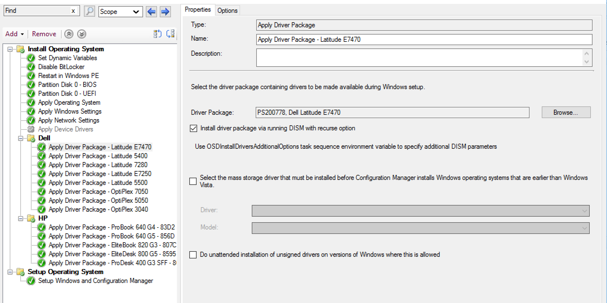
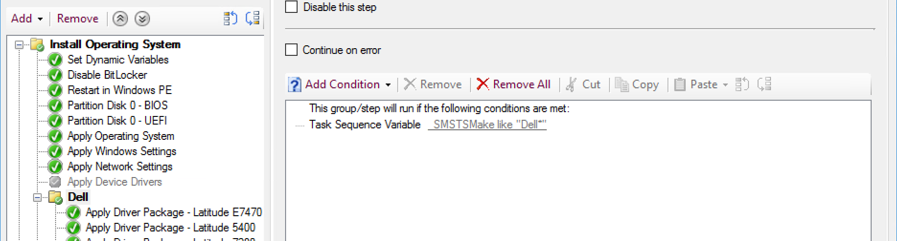
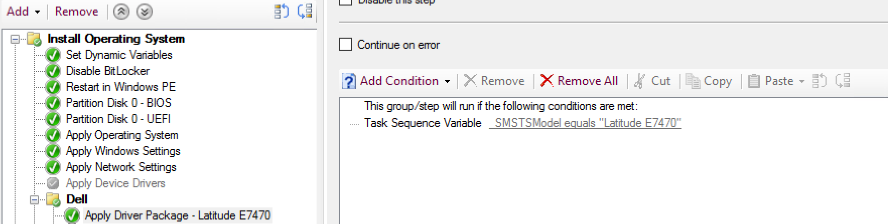
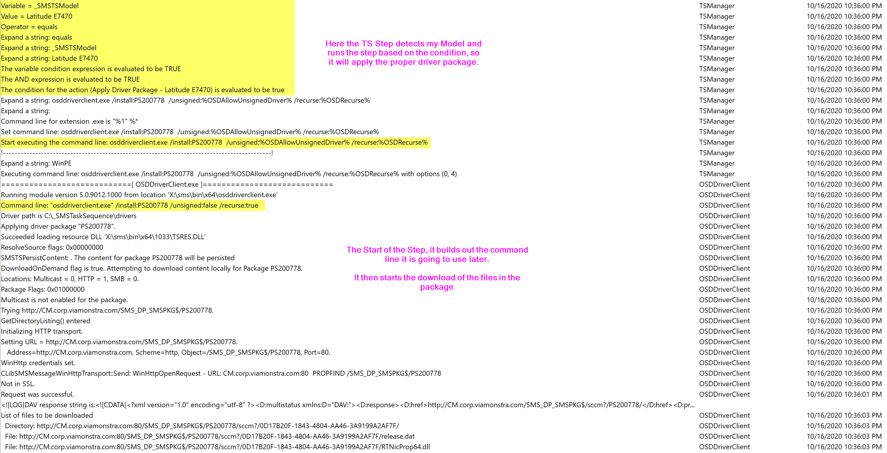
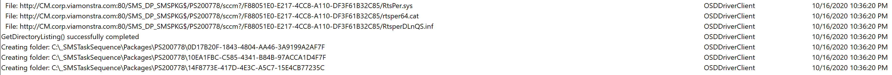
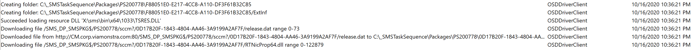
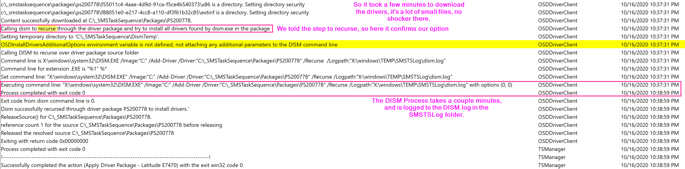
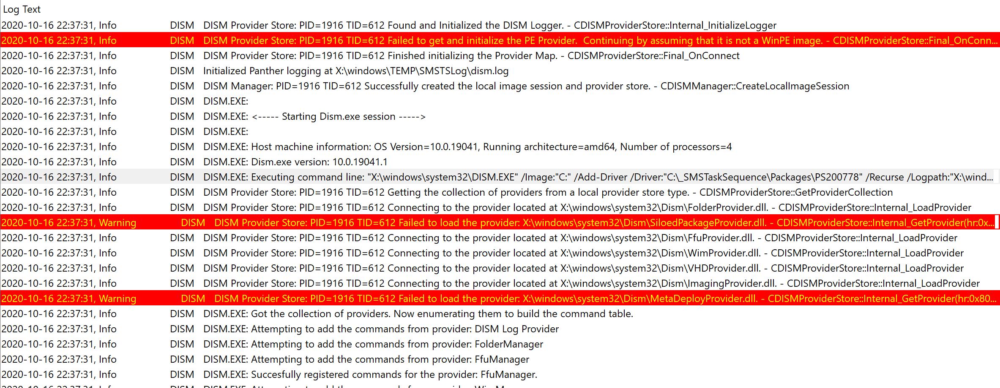
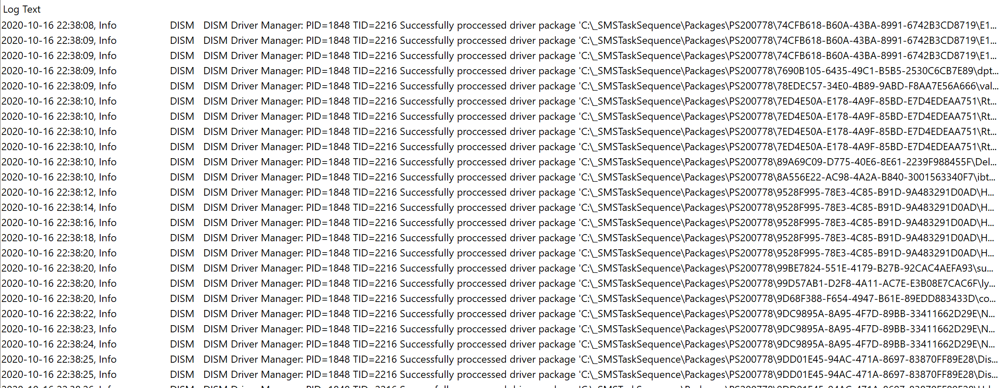
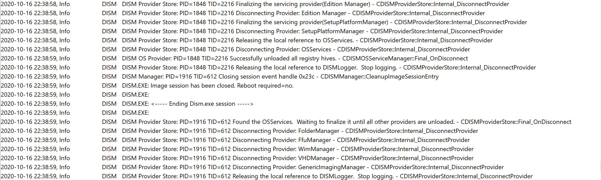

# Apply Driver Package

Similar to Auto Apply Drivers, this step adds drivers to the Windows Driver Store to be applied during the Windows Setup (OOBE) that will happen after the restart.  This step is typically used to apply a specific driver package to a model of computer.  Typically a step is duplicated per model, and conditions control which one is run.

Both Apply Driver Package and Auto Apply Driver rely on DISM to add drivers to the Windows Driver Store, however, they work completely differently.  Auto Apply does a compare of the hardware id on the machine with all of the drivers you have imported in CM, while Apply Driver Package downloads the drivers in the package, and just has DISM hammer though all of them trying to apply them all and seeing if they land, more on that later.

> [!NOTE]
> Many organizations have dropped using this step and creating driver packages and gone with using legacy packages to store driver files, then running a command line step to have DISM recursively apply the drivers in the package contents.  This essentially does the same thing without the need of importing the drivers into CM.

> [!TIP]
> More information about Driver Package Creation can be found [here in the content area.](docs/ConfigMgr-Docs/Content/SCCM-Content-Driver-Packages.md)

## MS Docs

<https://docs.microsoft.com/en-us/mem/configmgr/osd/understand/task-sequence-steps#BKMK_ApplyDriverPackage>

## PowerShell

- [Get-CMTSStepApplyDriverPackage](https://docs.microsoft.com/en-us/powershell/module/configurationmanager/Get-CMTSStepApplyDriverPackage)
- [New-CMTSStepApplyDriverPackage](https://docs.microsoft.com/en-us/powershell/module/configurationmanager/New-CMTSStepApplyDriverPackage)
- [Remove-CMTSStepApplyDriverPackage](https://docs.microsoft.com/en-us/powershell/module/configurationmanager/Remove-CMTSStepApplyDriverPackage)
- [Set-CMTSStepApplyDriverPackage](https://docs.microsoft.com/en-us/powershell/module/configurationmanager/Set-CMTSStepApplyDriverPackage)

## Variables

- [OSDApplyDriverBootCriticalContentUniqueID](https://docs.microsoft.com/en-us/mem/configmgr/osd/understand/task-sequence-variables#OSDApplyDriverBootCriticalContentUniqueID)
- [OSDApplyDriverBootCriticalHardwareComponent](https://docs.microsoft.com/en-us/mem/configmgr/osd/understand/task-sequence-variables#OSDApplyDriverBootCriticalHardwareComponent)
- [OSDApplyDriverBootCriticalID](https://docs.microsoft.com/en-us/mem/configmgr/osd/understand/task-sequence-variables#OSDApplyDriverBootCriticalID)
- [OSDApplyDriverBootCriticalINFFile](https://docs.microsoft.com/en-us/mem/configmgr/osd/understand/task-sequence-variables#OSDApplyDriverBootCriticalINFFile)
- [OSDInstallDriversAdditionalOptions](https://docs.microsoft.com/en-us/mem/configmgr/osd/understand/task-sequence-variables#OSDInstallDriversAdditionalOptions)

  I've set the Driver Package to my Dell Test Device, and checked the box to recurse.

### Demo - Install driver package w/ Recurse

In this Demo, I'm using my Dell Latitude E7470, I've setup logic in my TS to determine Make and Model and choose the correct package that way.

Lets go to the logs!

We start by showing the pre-step condition evaluation, which determined which Apply Driver Package step should run, the one that matches the hardware it's running on.
It then downloads the payload and runs the dism command to add the drivers to the windows driver store, recursing the driver package content.

The DISM Log will show all of the Drivers that were processed and applied.  

So overall, it's a straight forward process.  The Task Sequence downloads the drivers in a driver package, then leverages DISM to apply them to the Offline Image, which then get installed during the Windows Setup Process.

Because the Task Sequence is just leveraging DISM, this is what has opened up the community to doing all sorts of variants for managing and deploying drivers.  Personally, we only use standard packages now, containing drivers, and no longer import drivers themselves into CM.

## Related Vendor Links

- [Dell's Guide](https://downloads.dell.com/FOLDER06379812M/1/Deploying%20Operating%20System%20on%20Dell%20Busines%20Clients%20using%20SCCM%20and%20Driver%20Packs.pdf)
- [HP's Guide](https://ftp.hp.com/pub/caps-softpaq/cmit/whitepapers/HP%20Manageability%20Integration%20Kit%20User%20Guide.pdf) - Page 92(ish)
- [Lenovo Recipes](https://support.lenovo.com/us/en/solutions/ht104042)

## Community Blog Posts

- [ConfigMgr Driver Management in just four steps – By Matthew Teegarden](https://deploymentresearch.com/configmgr-driver-management-in-just-four-steps-by-matthew-teegarden/)
- [Speed Up Driver Package Downloads for ConfigMgr OSD](https://deploymentresearch.com/speed-up-driver-package-downloads-for-configmgr-osd/)

**About Recast Software**
1 in 3 organizations using Microsoft Configuration Manager rely on Right Click Tools to surface vulnerabilities and remediate quicker than ever before.  
[Download Free Tools](https://www.recastsoftware.com/?utm_source=cmdocs&utm_medium=referral&utm_campaign=cmdocs#formarea)  
[Request Pricing](https://www.recastsoftware.com/pricing?utm_source=cmdocs&utm_medium=referral&utm_campaign=cmdocs)
