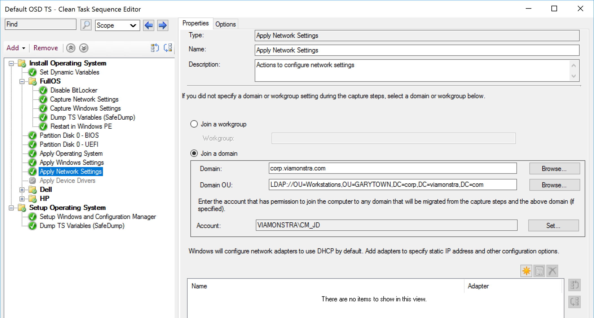
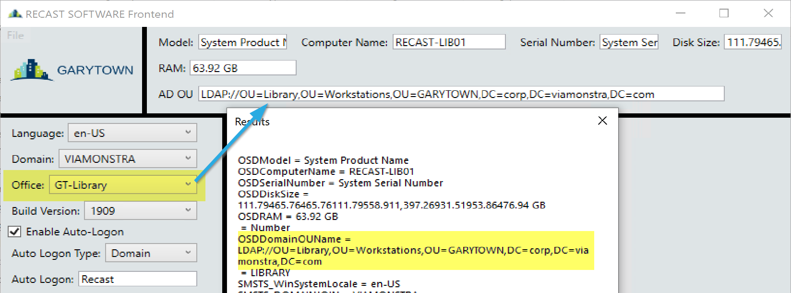
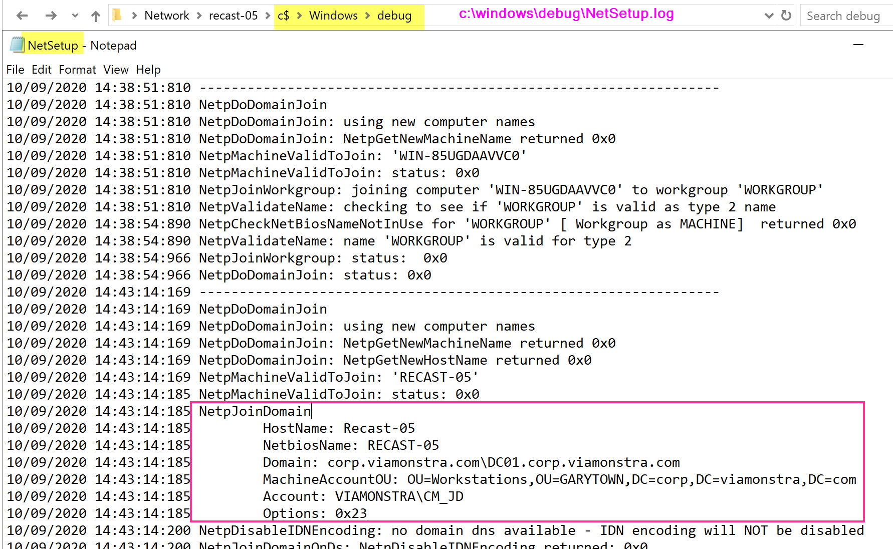

# Apply Network Settings

This page will be quite limited to specifics about the step itself, to see it integrated into OSD, check out the Combination Page. [Capture, Apply, Network and Windows Settings](SCCM-TaskSequence-Step-Capture-Apply-Windows-Network-Settings.md)

## MS Docs

<https://docs.microsoft.com/en-us/mem/configmgr/osd/understand/task-sequence-steps#BKMK_ApplyNetworkSettings>

### Variables

- [OSDAdapter](https://docs.microsoft.com/en-us/mem/configmgr/osd/understand/task-sequence-variables#OSDAdapter)
- [OSDAdapterCount](https://docs.microsoft.com/en-us/mem/configmgr/osd/understand/task-sequence-variables#OSDAdapterCount)
- [OSDDNSDomain](https://docs.microsoft.com/en-us/mem/configmgr/osd/understand/task-sequence-variables#OSDDNSDomain)
- [OSDDNSSuffixSearchOrder](https://docs.microsoft.com/en-us/mem/configmgr/osd/understand/task-sequence-variables#OSDDNSSuffixSearchOrder)
- [OSDDomainName](https://docs.microsoft.com/en-us/mem/configmgr/osd/understand/task-sequence-variables#OSDDomainName)
- [OSDDomainOUName](https://docs.microsoft.com/en-us/mem/configmgr/osd/understand/task-sequence-variables#OSDDomainOUName)
- [OSDEnableTCPIPFiltering](https://docs.microsoft.com/en-us/mem/configmgr/osd/understand/task-sequence-variables#OSDEnableTCPIPFiltering)
- [OSDJoinAccount](https://docs.microsoft.com/en-us/mem/configmgr/osd/understand/task-sequence-variables#OSDJoinAccount)
- [OSDJoinPassword](https://docs.microsoft.com/en-us/mem/configmgr/osd/understand/task-sequence-variables#OSDJoinPassword)
- [OSDWorkgroupName](https://docs.microsoft.com/en-us/mem/configmgr/osd/understand/task-sequence-variables#OSDWorkgroupName)

### PowerShell

- [Get-CMTSStepApplyNetworkSetting](https://docs.microsoft.com/en-us/powershell/module/configurationmanager/Get-CMTSStepApplyNetworkSetting)
- [New-CMTSStepApplyNetworkSetting](https://docs.microsoft.com/en-us/powershell/module/configurationmanager/New-CMTSStepApplyNetworkSetting)
- [Remove-CMTSStepApplyNetworkSetting](https://docs.microsoft.com/en-us/powershell/module/configurationmanager/Remove-CMTSStepApplyNetworkSetting)
- [Set-CMTSStepApplyNetworkSetting](https://docs.microsoft.com/en-us/powershell/module/configurationmanager/Set-CMTSStepApplyNetworkSetting)

Ok, these settings give you a ton of power to automate Static IP Addresses on a machine.  I've rarely seen these used in Workstation OSD, but it's been essential on Server OSD.

The Variables can be a bit confusing too, to get it to work, you are required to use several if you use some.

Some Blogs with examples:

- [Network Adapter Teaming in MEMCM (aka 'ConfigMgr') OSD](https://tcsmug.org/blogs/jeff-carreon/561-netadapter-teaming-in-memcm-osd)
- [Static IP Addresses and OSD](https://www.recastsoftware.com/blog/a-week-of-task-sequence-tips-day-06)

### Step

### Choosing different OU

As shown in the step, you can pick the OU in the step, have a default there.  But using the [OSDDomainOUName](https://docs.microsoft.com/en-us/mem/configmgr/osd/understand/task-sequence-variables#OSDDomainOUName) variable, you can override that, and have the computer go to any OU you'd like.  Typically this will be done via a Machine Variable on the object for a competely zero-touch OSD, or via a Front End tool that collects specific attributes at the start of OSD from a technician who is physically present.  As an example, in my lab frontend, if I pick a different "Office Location" it will set the OU to a different location, then set the variable, so during OSD, it will go to that OU instead of my default OU I've set in the step.

### Troubleshooting Domain Join

The log file for the domain join lives in **c:\windows\debug\NetSetup.log**  
From that you will get detailed information about the failure or successful domain join process.

More info on [MS Docs](https://docs.microsoft.com/en-us/windows/win32/api/lmjoin/nf-lmjoin-netjoindomain) about Domain Join, along with potential return values.

**About Recast Software**
1 in 3 organizations using Microsoft Configuration Manager rely on Right Click Tools to surface vulnerabilities and remediate quicker than ever before.  
[Download Free Tools](https://www.recastsoftware.com/?utm_source=cmdocs&utm_medium=referral&utm_campaign=cmdocs#formarea)  
[Request Pricing](https://www.recastsoftware.com/pricing?utm_source=cmdocs&utm_medium=referral&utm_campaign=cmdocs)
