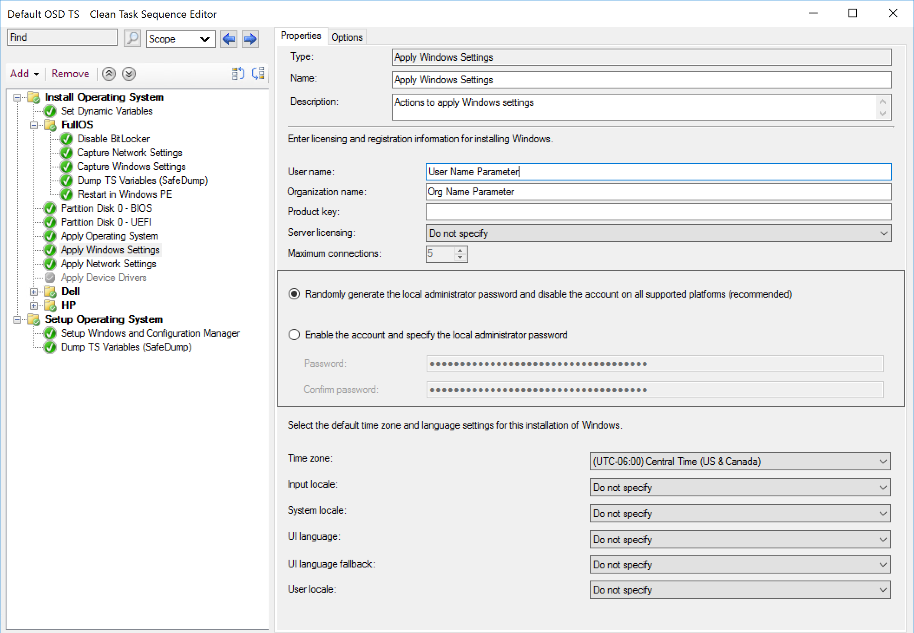
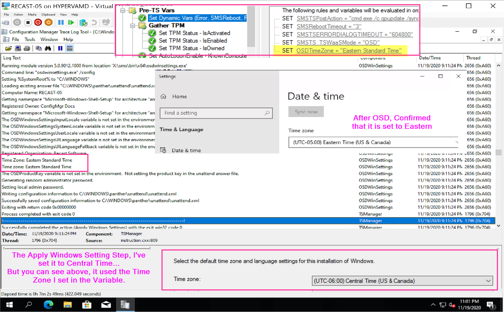

# Apply Windows Settings

This page will be quite limited to specifics about the step itself, to see it integrated into OSD, check out the Combination Page. [Capture, Apply, Network and Windows Settings](SCCM-TaskSequence-Step-Capture-Apply-Windows-Network-Settings.md)

## MS Docs
<https://docs.microsoft.com/en-us/mem/configmgr/osd/understand/task-sequence-steps#BKMK_ApplyWindowsSettings>

### Variables

- [OSDComputerName](https://docs.microsoft.com/en-us/mem/configmgr/osd/understand/task-sequence-variables#OSDComputerName-input)
- [OSDLocalAdminPassword](https://docs.microsoft.com/en-us/mem/configmgr/osd/understand/task-sequence-variables#OSDLocalAdminPassword)
- [OSDProductKey](https://docs.microsoft.com/en-us/mem/configmgr/osd/understand/task-sequence-variables#OSDProductKey)
- [OSDRandomAdminPassword](https://docs.microsoft.com/en-us/mem/configmgr/osd/understand/task-sequence-variables#OSDRandomAdminPassword)
- [OSDRegisteredOrgName](https://docs.microsoft.com/en-us/mem/configmgr/osd/understand/task-sequence-variables#OSDRegisteredOrgName-input)
- [OSDRegisteredUserName](https://docs.microsoft.com/en-us/mem/configmgr/osd/understand/task-sequence-variables#OSDRegisteredUserName)
- [OSDServerLicenseConnectionLimit](https://docs.microsoft.com/en-us/mem/configmgr/osd/understand/task-sequence-variables#OSDServerLicenseConnectionLimit)
- [OSDServerLicenseMode](https://docs.microsoft.com/en-us/mem/configmgr/osd/understand/task-sequence-variables#OSDServerLicenseMode)
- [OSDTimeZone](https://docs.microsoft.com/en-us/mem/configmgr/osd/understand/task-sequence-variables#OSDTimeZone-input)
  - [Time Zone Names to be used in Variable](https://docs.microsoft.com/en-us/windows-hardware/manufacture/desktop/default-time-zones)
- [OSDWindowsSettingsInputLocale](https://docs.microsoft.com/en-us/mem/configmgr/osd/understand/task-sequence-variables#OSDWindowsSettingsInputLocale)
- [OSDWindowsSettingsSystemLocale](https://docs.microsoft.com/en-us/mem/configmgr/osd/understand/task-sequence-variables#OSDWindowsSettingsSystemLocale)
- [OSDWindowsSettingsUILanguage](https://docs.microsoft.com/en-us/mem/configmgr/osd/understand/task-sequence-variables#OSDWindowsSettingsUILanguage)
- [OSDWindowsSettingsUILanguageFallback](https://docs.microsoft.com/en-us/mem/configmgr/osd/understand/task-sequence-variables#OSDWindowsSettingsUILanguageFallback)
- [OSDWindowsSettingsUserLocale](https://docs.microsoft.com/en-us/mem/configmgr/osd/understand/task-sequence-variables#OSDWindowsSettingsUserLocale)

### PowerShell

- [Get-CMTSStepApplyWindowsSetting](https://docs.microsoft.com/en-us/powershell/module/configurationmanager/Get-CMTSStepApplyWindowsSetting)
- [New-CMTSStepApplyWindowsSetting](https://docs.microsoft.com/en-us/powershell/module/configurationmanager/Get-CMTSStepApplyWindowsSetting)
- [Remove-CMTSStepApplyWindowsSetting](https://docs.microsoft.com/en-us/powershell/module/configurationmanager/Remove-CMTSStepApplyWindowsSetting)
- [Set-CMTSStepApplyWindowsSetting](https://docs.microsoft.com/en-us/powershell/module/configurationmanager/Set-CMTSStepApplyWindowsSetting)

So many variables for this step. You can see how they compare to the step gui. This step is one of the essentials to allow you to customize your OSD to fit your environment.  You need to assign a different language, keyboard layout, timezone, and so many more thing, this is the step that does it.  It takes that information, slips it into the unattend.xml and it gets applied to the Windows Setup during Windows Setup Process.  It's pretty freaking sweet.

### Step

> [!NOTE]
> If you set a variable for these options in your TS, they will NOT be overwritten by the step.  Your Pre-Set variables will trump what the steps options have available.

**About Recast Software**
1 in 3 organizations using Microsoft Configuration Manager rely on Right Click Tools to surface vulnerabilities and remediate quicker than ever before.  
[Download Free Tools](https://www.recastsoftware.com/?utm_source=cmdocs&utm_medium=referral&utm_campaign=cmdocs#formarea)  
[Request Pricing](https://www.recastsoftware.com/pricing?utm_source=cmdocs&utm_medium=referral&utm_campaign=cmdocs)
