# Auto Apply Drivers

This step will take a group of imported drivers, then apply them to your machine during OSD.  I see this step phasing out, as most people are moving to a more dynamic way of doing drivers, and leveraging standard packages.  Personally, we don't have any drivers imported into our ConfigMgr system, EXCEPT drivers that need to be added into our WinPE boot images.  But that is a topic for another time, and this page is dedicated to explaining how this step works, not if it is the best solution for your OSD.

## MS Docs

<https://docs.microsoft.com/en-us/mem/configmgr/osd/understand/task-sequence-steps#BKMK_AutoApplyDrivers>

## PowerShell

- [Get-CMTSStepAutoApplyDriver](https://docs.microsoft.com/en-us/powershell/module/configurationmanager/Get-CMTSStepAutoApplyDriver)
- [New-CMTSStepAutoApplyDriver](https://docs.microsoft.com/en-us/powershell/module/configurationmanager/New-CMTSStepAutoApplyDriver)
- [Remove-CMTSStepAutoApplyDriver](https://docs.microsoft.com/en-us/powershell/module/configurationmanager/Remove-CMTSStepAutoApplyDriver)
- [Set-CMTSStepAutoApplyDriver](https://docs.microsoft.com/en-us/powershell/module/configurationmanager/Set-CMTSStepAutoApplyDriver)

## Variables

- [OSDAutoApplyDriverBestMatch](https://docs.microsoft.com/en-us/mem/configmgr/osd/understand/task-sequence-variables#OSDAutoApplyDriverBestMatch)
- [OSDAutoApplyDriverCategoryList](https://docs.microsoft.com/en-us/mem/configmgr/osd/understand/task-sequence-variables#OSDAutoApplyDriverCategoryList)
- [SMSTSDriverRequestConnectTimeOut](https://docs.microsoft.com/en-us/mem/configmgr/osd/understand/task-sequence-variables#SMSTSDriverRequestConnectTimeOut)
- [SMSTSDriverRequestReceiveTimeOut](https://docs.microsoft.com/en-us/mem/configmgr/osd/understand/task-sequence-variables#SMSTSDriverRequestReceiveTimeOut)
- [SMSTSDriverRequestResolveTimeOut](https://docs.microsoft.com/en-us/mem/configmgr/osd/understand/task-sequence-variables#SMSTSDriverRequestResolveTimeOut)
- [SMSTSDriverRequestSendTimeOut](https://docs.microsoft.com/en-us/mem/configmgr/osd/understand/task-sequence-variables#SMSTSDriverRequestSendTimeOut)

### Step Image

[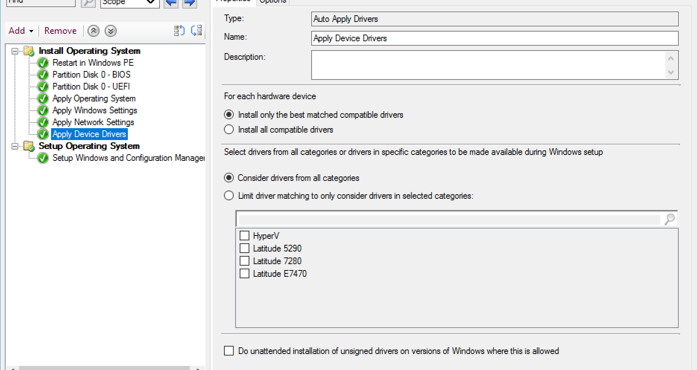](media/ApplyDrivers00.png)

Not too many options here, but a few.  These are the defaults, and for the example I've left them alone.  You can limit to a specific category, and perhaps you could use this as a way to apply drivers based on some criteria, like how I have categories setup by Model.  Perhaps you've downloaded several drivers and built your own "Dell" or "HP" Category with the drivers to cover all of the models you have for Dell or HP and you want this step to apply them.  Personally, I wouldn't do that, but you could.

### Demo 1 - Defaults - Best Match

[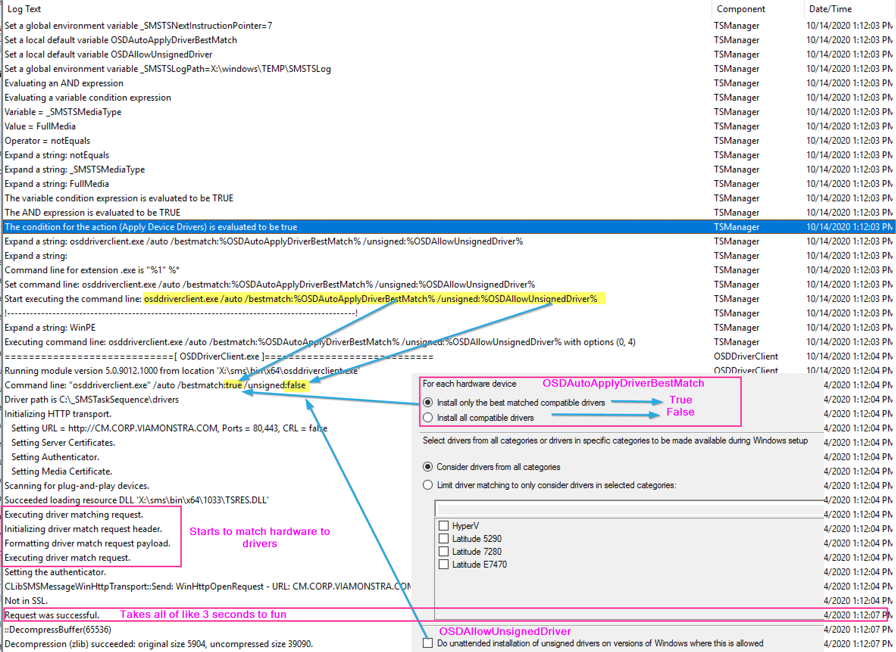](media/ApplyDrivers01.png)
The Step starts by running  osddriverclient.exe with a few parameters leveraging variables created by the step options.
The steps runs a "gather" to determine hardware and asks CM for a comparison.
[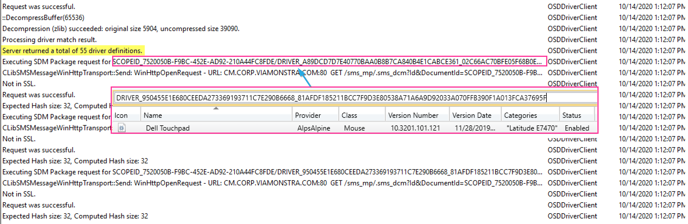](media/ApplyDrivers02.png)
A list is generated then it moves on to downloading and adding drivers to the Windows Driver Store to be available when the machine reboots into OOBE and the Windows Setup determines the drivers it needs.
[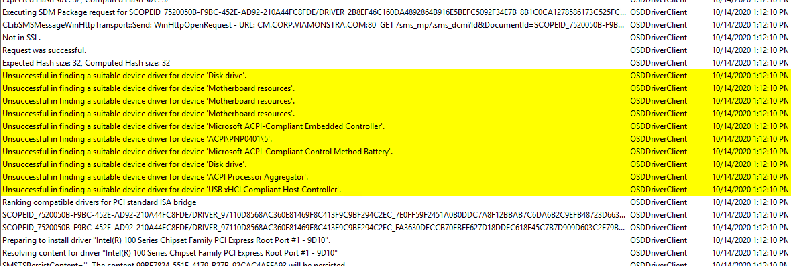](media/ApplyDrivers03.png)
The step determines that there are several hardware ids that don't have a match in CM.  It then moves on to installing the drivers it did find a match for.  I'm going to give an example here for one of the hardware items (Audio), rest look pretty much the same.
[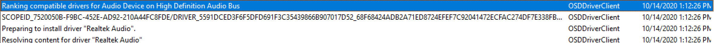](media/ApplyDrivers04.png)
[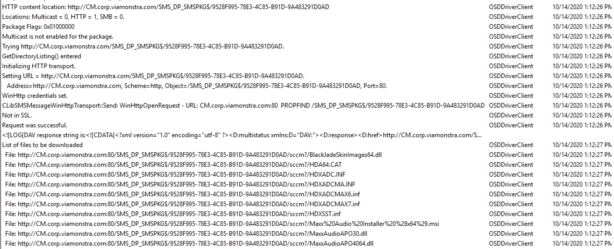](media/ApplyDrivers05.png)
[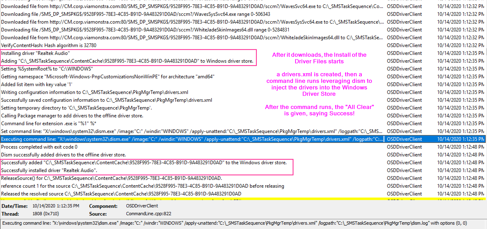](media/ApplyDrivers06.png)

For Each Hardware ID, The TS Reaches out, pulls down the driver, runs dism to inject it into the Windows Driver Store.  This part of the log can get quite long.

After it gets through all of the hardware and installs the drivers, it's done.
[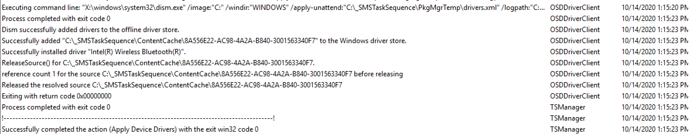](media/ApplyDrivers07.png)

### Demo 2 - All Compatible

[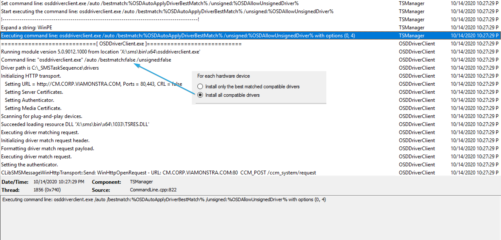](media/ApplyDrivers09.png)

So basically everything looks the same, other than that command.  The process takes a bit longer and additional drivers are downloaded and shoved into the Windows Driver Store to be made available to the Windows Setup Engine to apply during OOBE.

You can see the extra drivers that had been added:
[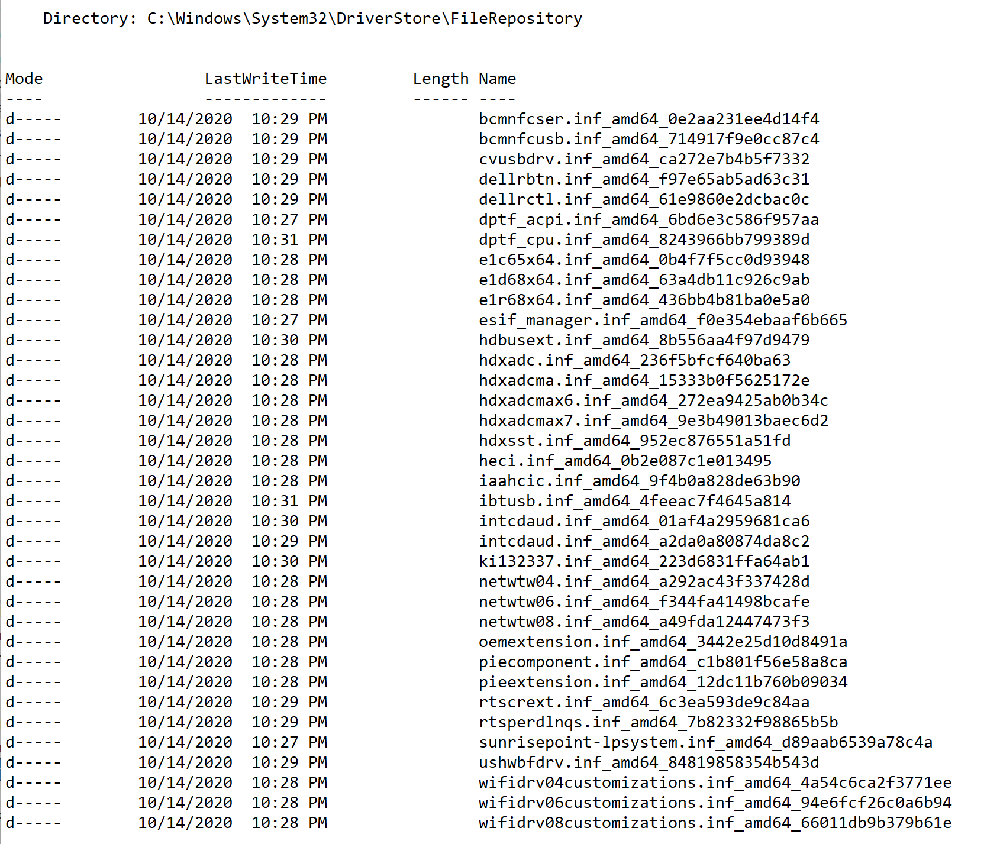](media/ApplyDrivers10.png)
Those are folders inside the c:\windows\system32\DriverStore\FileRepository folder.

## Driver.XML

The Driver.XML & DISM.log are created the temp location C:\_SMSTaskSequence\PkgMgrTemp for each driver. It's created and deleted very quickly, so it's hard to grab a copy during OSD for Demo. The XML file looks like this every time, other than path.
[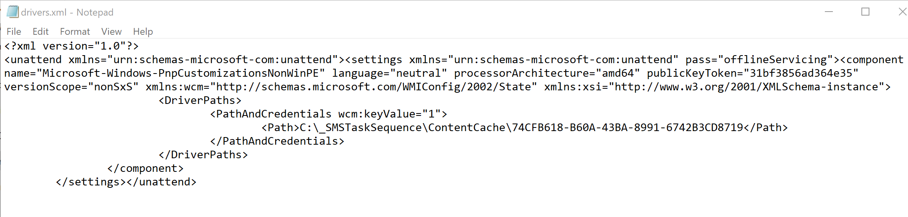](media/ApplyDrivers08.png)

So that's how this step works.  It grabs the drivers it thinks would work well for the hardware and adds them to the Windows Driver Store to be available after the machine reboots and runs setup.

**About Recast Software**
1 in 3 organizations using Microsoft Configuration Manager rely on Right Click Tools to surface vulnerabilities and remediate quicker than ever before.  
[Download Free Tools](https://www.recastsoftware.com/?utm_source=cmdocs&utm_medium=referral&utm_campaign=cmdocs#formarea)  
[Request Pricing](https://www.recastsoftware.com/pricing?utm_source=cmdocs&utm_medium=referral&utm_campaign=cmdocs)
