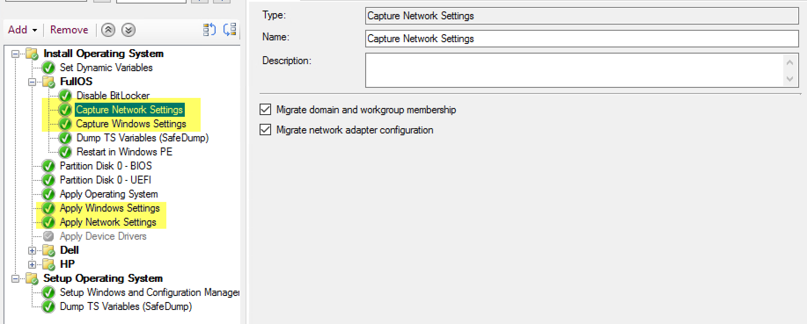
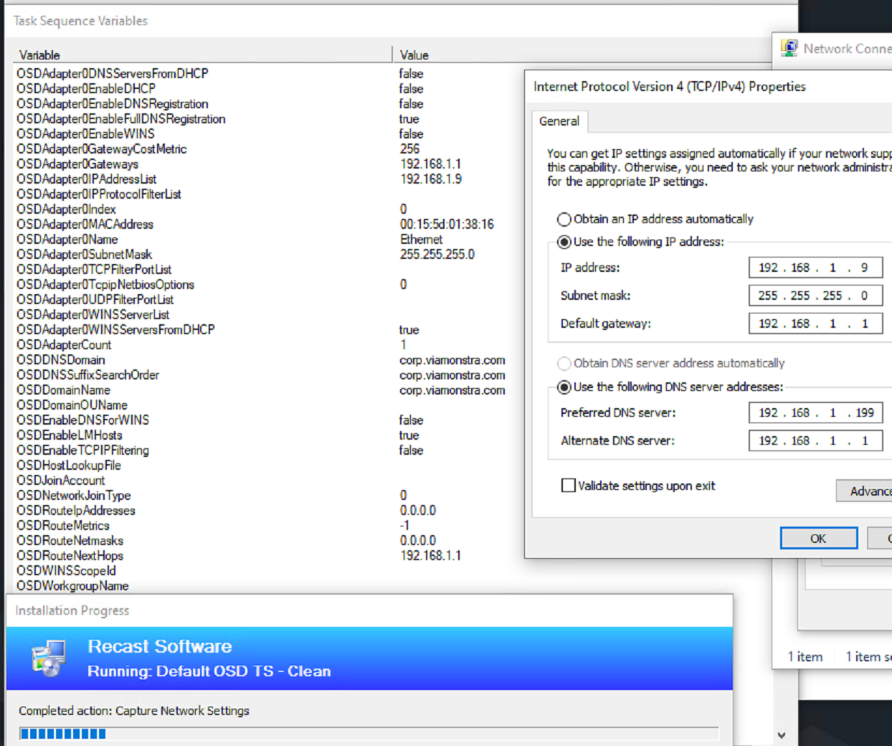
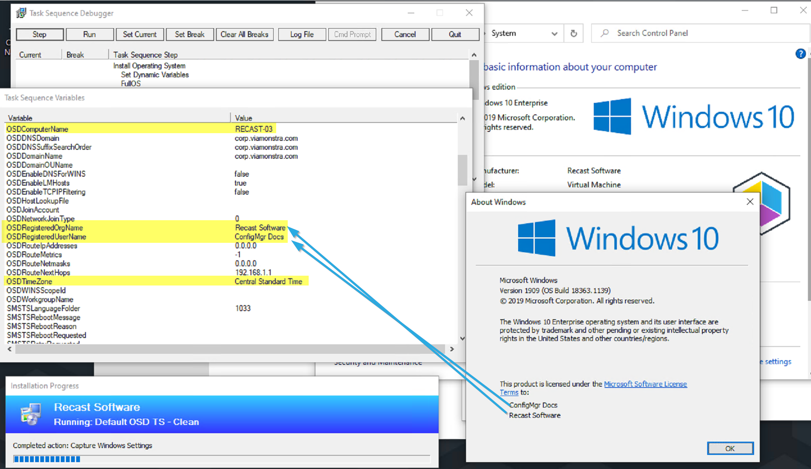
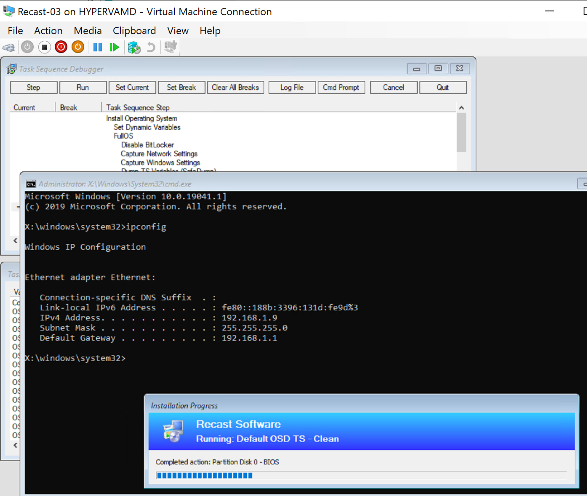
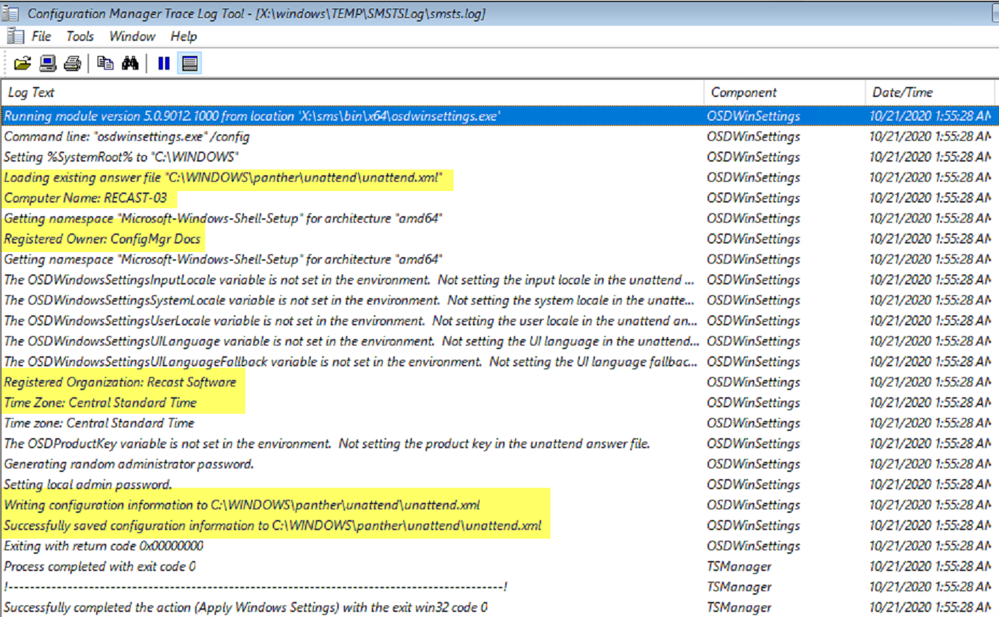
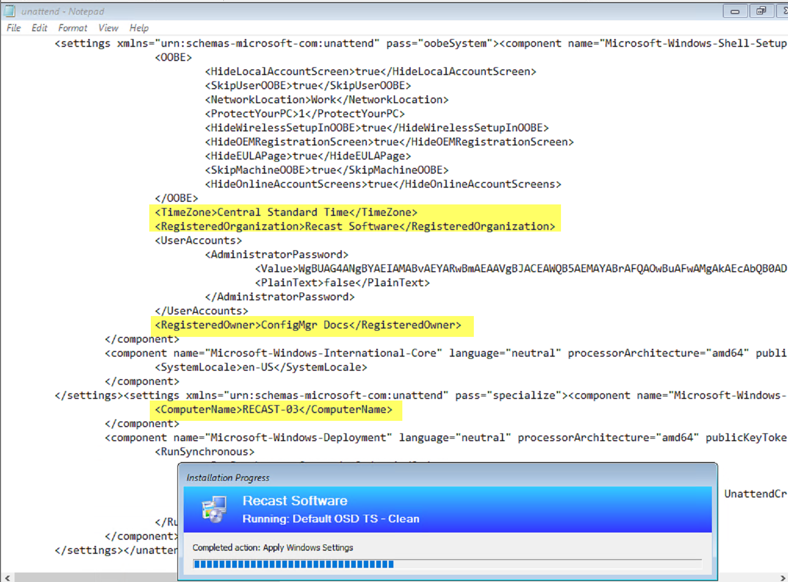
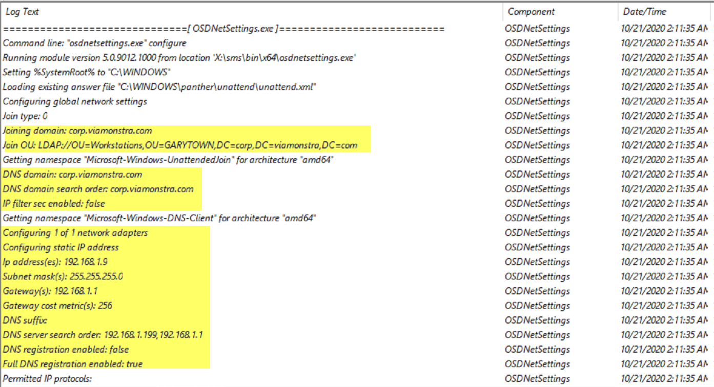
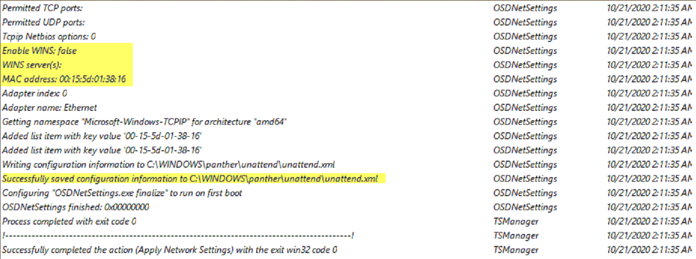
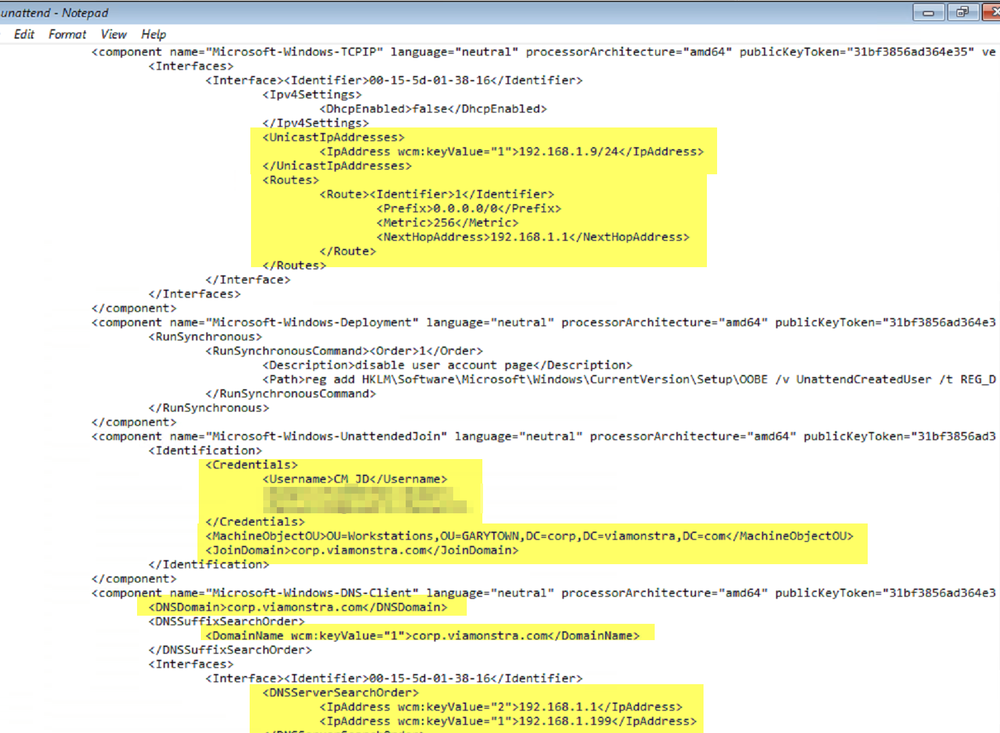

# Capture and Apply Network and Windows Settings Steps

This is an overall combination page, the steps all work so closely together, that for Demos it would be difficult to break them apart.  I went back and forth about creating individual pages, so I've done both.  I created individual pages that give very high level overview, then for demos, linked here.

- [Capture Network Settings](SCCM-TaskSequence-Step-Capture-Network-Settings.md)
- [Capture Windows Settings](SCCM-TaskSequence-Step-Capture-Windows-Settings.md)
- [Apply Network Settings](SCCM-TaskSequence-Step-Apply-Network-Settings.md)
- [Apply Windows Settings](SCCM-TaskSequence-Step-Apply-Windows-Settings.md)

Lets go into the demos now, since the individual details are in the posts above, lets use the steps together, as they would in the real world.

This will be a very simple Task Sequence to be able to easier highlight these steps.

In this Demo, we're going to start in the OS and do a "Refresh" of the OS, so we can capture settings.  My demo machine has a Static IP address, and I've set several other custom fields.

As the Task Sequence starts in the Full OS, it runs the capture steps, and you can see it populating the information into Variables.

The Task Sequence then reboots into WinPE to format the drive and apply the image.  I've run ipconfig showing that WinPE has already applied the static IP Address used in the Full OS.

When the Apply Windows Settings Step runs, it loads the unattend.xml file, takes the variables you've captures (or manually set), and injects them into the XML file.

After the Apply Windows Setting step finishes, it moves on to the Apply Network Settings, were we see similar behavior where it takes the information captured and injects it into the unattend.xml

At this point, all of the information is in the Unattend.XML file which will get applied to the machine during the "Setup Windows and ConfigMgr" step.

To see more details about that, check out the page for that step: [Setup Windows and ConfigMgr](SCCM-TaskSequence-Step-Setup-Windows-And-ConfigMgr.md)

**About Recast Software**
1 in 3 organizations using Microsoft Configuration Manager rely on Right Click Tools to surface vulnerabilities and remediate quicker than ever before.  
[Download Free Tools](https://www.recastsoftware.com/?utm_source=cmdocs&utm_medium=referral&utm_campaign=cmdocs#formarea)  
[Request Pricing](https://www.recastsoftware.com/pricing?utm_source=cmdocs&utm_medium=referral&utm_campaign=cmdocs)