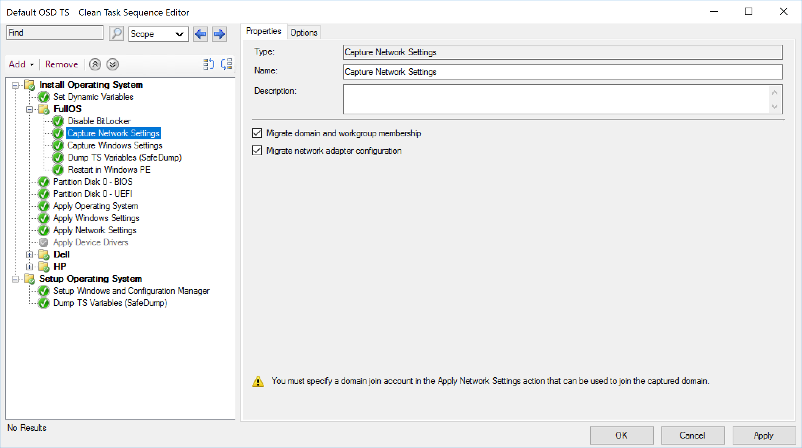

# Capture Network Settings

This page will be quite limited to specifics about the step itself, to see it integrated into OSD, check out the Combination Page. [Capture, Apply, Network and Windows Settings](SCCM-TaskSequence-Step-Capture-Apply-Windows-Network-Settings.md)

## MS Docs
<https://docs.microsoft.com/en-us/mem/configmgr/osd/understand/task-sequence-steps#BKMK_CaptureNetworkSettings>

### Variables

- [OSDMigrateAdapterSettings](https://docs.microsoft.com/en-us/mem/configmgr/osd/understand/task-sequence-variables#OSDMigrateAdapterSettings)
- [OSDMigrateNetworkMembership](https://docs.microsoft.com/en-us/mem/configmgr/osd/understand/task-sequence-variables#OSDMigrateNetworkMembership)

### PowerShell

- [Get-CMTSStepCaptureNetworkSettings](https://docs.microsoft.com/en-us/powershell/module/configurationmanager/Get-CMTSStepCaptureNetworkSettings)
- [New-CMTSStepCaptureNetworkSettings](https://docs.microsoft.com/en-us/powershell/module/configurationmanager/New-CMTSStepCaptureNetworkSettings)
- [Remove-CMTSStepCaptureNetworkSettings](https://docs.microsoft.com/en-us/powershell/module/configurationmanager/Remove-CMTSStepCaptureNetworkSettings)
- [Set-CMTSStepCaptureNetworkSettings](https://docs.microsoft.com/en-us/powershell/module/configurationmanager/Set-CMTSStepCaptureNetworkSettings)

I rarely see this get used.  Most of the time Workstations use DHCP, have one network card, and don't require anything special.  If it's a reimage, the machine would be re-joined to domain in the same OU, because the machine object is already there.  This I believe would be more useful in Server OSD,  and yet at the same time, I never see Servers reimaged in a way that they want to keep the same name and IP information.  

I typically only see two spectrums of Server OSD, almost completely manual setup of these settings, or heavily automated where scripts or an automation platform would create all of the variables required to apply network settings and apply to a device object in ConfigMgr.  

If you use this step, I'd be interested to hear how you leverage it.

### Step

**About Recast Software**
1 in 3 organizations using Microsoft Configuration Manager rely on Right Click Tools to surface vulnerabilities and remediate quicker than ever before.  
[Download Free Tools](https://www.recastsoftware.com/?utm_source=cmdocs&utm_medium=referral&utm_campaign=cmdocs#formarea)  
[Request Pricing](https://www.recastsoftware.com/pricing?utm_source=cmdocs&utm_medium=referral&utm_campaign=cmdocs)