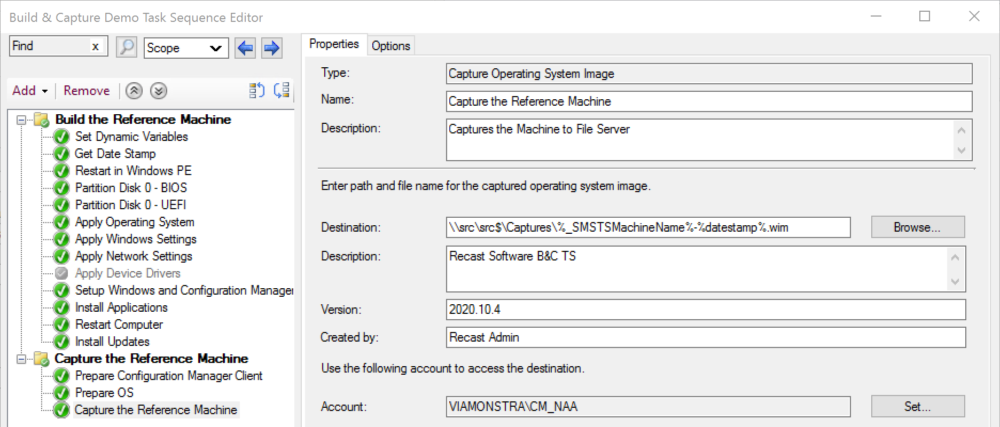
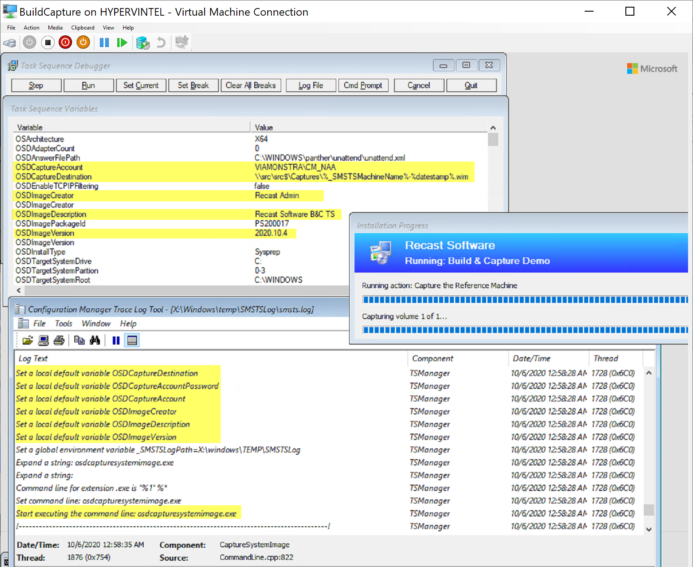
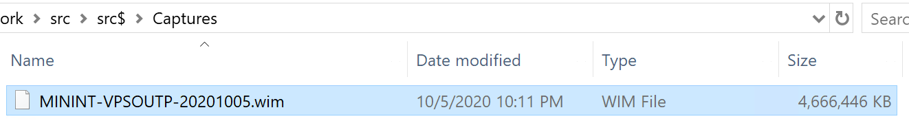
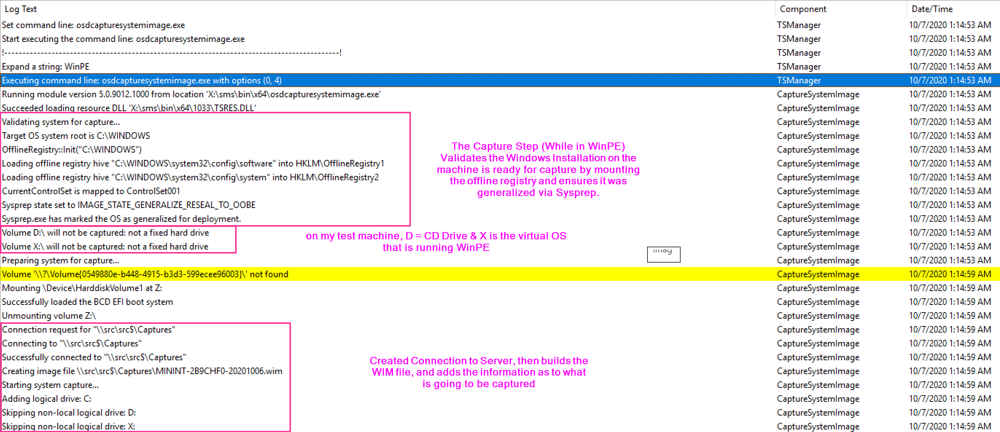
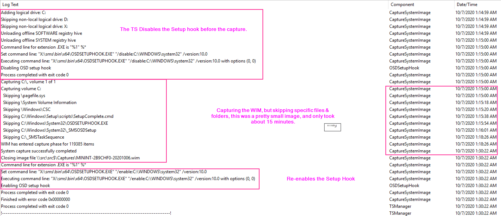

# Capture Operating System Image

This step is typically used in conjunction with Prepare ConfigMgr Client & Prepare Windows for Capture in a Build and Capture type task sequence.  I did write about hijacking this step to use for creating a backup of a machine, but as a reminder, it isn't supported by Microsoft in that way.  
In this post I'm going to go over a full Build & Capture Process, linking to other steps that get leveraged, and then focus down on the Capture step itself.

Before we get started, lets just talk about the idea of Build & Capture in general. Why / When would use use this option, when it really no longer fits the "modern" way to manage devices.  

## Thick vs Thin Images

- **Thin Image**
  - Typically referred to a Windows Image (WIM) that did not under go a build and capture process
  - Windows Media Only, either default Media downloaded from MS Directly, or serviced offline.
    - No additional applications "baked" in, it's just Windows and Windows Components

- Pros
  - Easy to produce and keep updated monthly
  - Little chance for human error to create "bad image" to break deployment
  - Can be used for both OSD & IPU
  - Lots of community Support and tools to make complex WIMs
- Cons
  - Minimal customizations
  - Can't include any additional software (C++ RunTimes, or other "Base Apps")

- **Thick Image**
  - Created using Build & Capture
  - Goal is 100% Automated via a Task Sequence
  - Can be used to include manually installed software that is difficult to automate deployments for
  - Typically used for Labs, where there are lots of large applications installed and it reduces deployment time.

- Pros
  - Include additional applications
  - Can decrease overall deployment time of OSD if you have to install several applications in the OSD process that could have been in the captured WIM.
  - Lots of community support and blogs to provide tools and ideas

- Cons
  - Typically more work to keep current and updated.
  - Can't use for Windows Upgraded (IPU)
  - Can create more issues with OSD if something is "bad" in the captured WIM
  - Overall, adds complexity to process, harder to troubleshoot.

So with that said, I'm sure there are still folks out there that are using build and capture.  I personally always push people to using "Thin" images based on Service Media not skip build and capture, but I understand there is still a need for them.  With that longer than normal into, lets get into it.

## MS Docs

<https://docs.microsoft.com/en-us/mem/configmgr/osd/understand/task-sequence-steps#BKMK_CaptureOperatingSystemImage>

## PowerShell

- [Get-CMTSStepCaptureSystemImage](https://docs.microsoft.com/en-us/powershell/module/configurationmanager/Get-CMTSStepCaptureSystemImage)
- [New-CMTSStepCaptureSystemImage](https://docs.microsoft.com/en-us/powershell/module/configurationmanager/New-CMTSStepCaptureSystemImage)
- [Remove-CMTSStepCaptureSystemImage](https://docs.microsoft.com/en-us/powershell/module/configurationmanager/Remove-CMTSStepCaptureSystemImage)
- [Set-CMTSStepCaptureSystemImage](https://docs.microsoft.com/en-us/powershell/module/configurationmanager/Set-CMTSStepCaptureSystemImage)

## Variables

- [OSDCaptureAccount](https://docs.microsoft.com/en-us/mem/configmgr/osd/understand/task-sequence-variables#OSDCaptureAccount)
- [OSDCaptureAccountPassword](https://docs.microsoft.com/en-us/mem/configmgr/osd/understand/task-sequence-variables#OSDCaptureAccountPassword)
- [OSDCaptureDestination](https://docs.microsoft.com/en-us/mem/configmgr/osd/understand/task-sequence-variables#OSDCaptureDestination)
- [OSDImageCreator](https://docs.microsoft.com/en-us/mem/configmgr/osd/understand/task-sequence-variables#OSDImageCreator)
- [OSDImageDescription](https://docs.microsoft.com/en-us/mem/configmgr/osd/understand/task-sequence-variables#OSDImageDescription)
- [OSDImageVersion](https://docs.microsoft.com/en-us/mem/configmgr/osd/understand/task-sequence-variables#OSDImageVersion)
- [OSDTargetSystemRoot](https://docs.microsoft.com/en-us/mem/configmgr/osd/understand/task-sequence-variables#OSDTargetSystemRoot-input)

## The Step

I think from the image, it's pretty easy to see which variables align to the step itself.  We're going to play around with the variable and the steps over the next several demos to make sure you have a good understanding of how it all works.

The Options in the Step correspond to the variables, and below you can see how they were set.

To the logs:

The Capture step is straight forward.  Captures the OS and allows you to deploy it as your base image.

**About Recast Software**
1 in 3 organizations using Microsoft Configuration Manager rely on Right Click Tools to surface vulnerabilities and remediate quicker than ever before.  
[Download Free Tools](https://www.recastsoftware.com/?utm_source=cmdocs&utm_medium=referral&utm_campaign=cmdocs#formarea)  
[Request Pricing](https://www.recastsoftware.com/pricing?utm_source=cmdocs&utm_medium=referral&utm_campaign=cmdocs)
