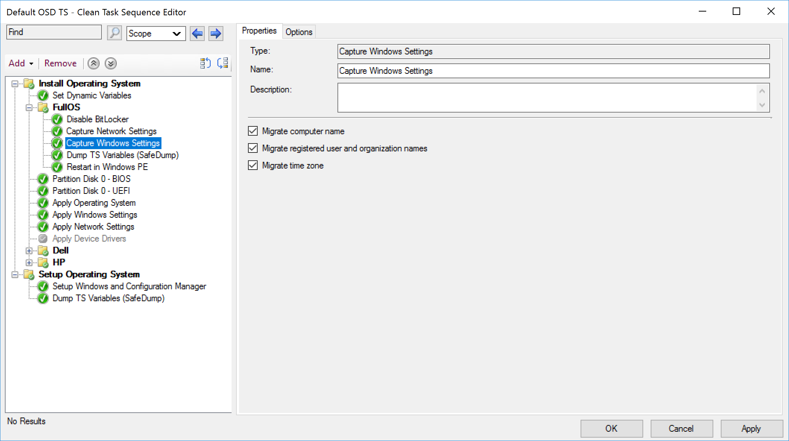

# Capture Windows Settings

This page will be quite limited to specifics about the step itself, to see it integrated into OSD, check out the Combination Page. [Capture, Apply, Network and Windows Settings](SCCM-TaskSequence-Step-Capture-Apply-Windows-Network-Settings.md)

## MS Docs

https://docs.microsoft.com/en-us/mem/configmgr/osd/understand/task-sequence-steps#BKMK_CaptureWindowsSettings

### Variables

- [OSDComputerName](https://docs.microsoft.com/en-us/mem/configmgr/osd/understand/task-sequence-variables#OSDComputerName-output)
- [OSDMigrateComputerName](https://docs.microsoft.com/en-us/mem/configmgr/osd/understand/task-sequence-variables#OSDMigrateComputerName)
- [OSDMigrateRegistrationInfo](https://docs.microsoft.com/en-us/mem/configmgr/osd/understand/task-sequence-variables#OSDMigrateRegistrationInfo)
- [OSDMigrateTimeZone](https://docs.microsoft.com/en-us/mem/configmgr/osd/understand/task-sequence-variables#OSDMigrateTimeZone)
- [OSDRegisteredOrgName](https://docs.microsoft.com/en-us/mem/configmgr/osd/understand/task-sequence-variables#OSDRegisteredOrgName-output)
- [OSDTimeZone](https://docs.microsoft.com/en-us/mem/configmgr/osd/understand/task-sequence-variables#OSDTimeZone-output)

### PowerShell

- [Get-CMTSStepCaptureWindowsSettings](https://docs.microsoft.com/en-us/powershell/module/configurationmanager/Get-CMTSStepCaptureWindowsSettings)
- [New-CMTSStepCaptureWindowsSettings](https://docs.microsoft.com/en-us/powershell/module/configurationmanager/New-CMTSStepCaptureWindowsSettings)
- [Remove-CMTSStepCaptureWindowsSettings](https://docs.microsoft.com/en-us/powershell/module/configurationmanager/Remove-CMTSStepCaptureWindowsSettings)
- [Set-CMTSStepCaptureWindowsSettings](https://docs.microsoft.com/en-us/powershell/module/configurationmanager/Set-CMTSStepCaptureWindowsSettings)

This step is tailored for reimage scenarios. It will grab several key pieces of information and place into variables. This information will override the defaults you set in the "Apply Windows Setting" Step.  

### Step

**About Recast Software**
1 in 3 organizations using Microsoft Configuration Manager rely on Right Click Tools to surface vulnerabilities and remediate quicker than ever before.  
[Download Free Tools](https://www.recastsoftware.com/?utm_source=cmdocs&utm_medium=referral&utm_campaign=cmdocs#formarea)  
[Request Pricing](https://www.recastsoftware.com/pricing?utm_source=cmdocs&utm_medium=referral&utm_campaign=cmdocs)