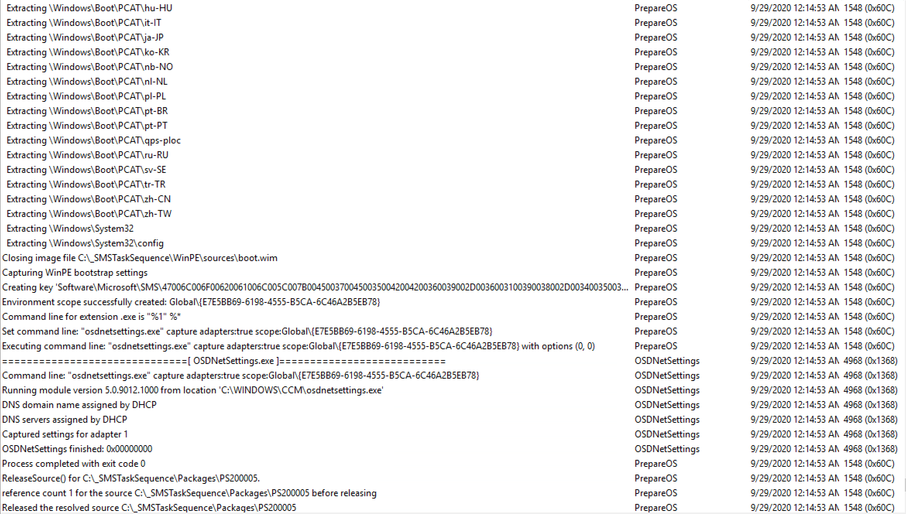

# Prepare ConfigMgr Client for Capture

This step is essential for a build and capture task sequence.  It is closely related to the Prepare Windows for Capture Step.  To see the full impact of this step, we really have to see how it interacts with the remainder of the TS after it's called, which is why if you scroll down, you see a pile of logs.  This post is really stealing the thunder from the Prepare Windows step.

## MS Docs

<https://docs.microsoft.com/en-us/mem/configmgr/osd/understand/task-sequence-steps#BKMK_PrepareConfigMgrClientforCapture>

## PowerShell

- [Get-CMTSStepPrepareConfigMgrClient](https://docs.microsoft.com/en-us/powershell/module/configurationmanager/Get-CMTSStepPrepareConfigMgrClient)
- [New-CMTSStepPrepareConfigMgrClient](https://docs.microsoft.com/en-us/powershell/module/configurationmanager/New-CMTSStepPrepareConfigMgrClient)
- [Remove-CMTSStepPrepareConfigMgrClient](https://docs.microsoft.com/en-us/powershell/module/configurationmanager/Remove-CMTSStepPrepareConfigMgrClient)
- [Set-CMTSStepPrepareConfigMgrClient](https://docs.microsoft.com/en-us/powershell/module/configurationmanager/Set-CMTSStepPrepareConfigMgrClient)

## Variables

- SMSTSUninstallCCMClient

### The Step

When you create a default build & capture TS, it places the step in the correct place for you.

## Process

- step starts phase 1
  - osdpreparesmsclient.exe runs
  - step triggers restart to clear any pending operations
  - machine restarts back into task sequence
- step continues into "phase 2"
  - system check
  - clears CM Cache
  - stops ccmexec service
  - removes policy and unassign client
  - resets root key
  - deletes instance of CCM_CLient
  - deletes any TS execution requests
  - deletes any maintenance tasks
  - resets registration to "not registered"
  - disables provisioning mode
  - cleans up TS Policy
  - deletes polcies in WMI
  - sets **SMSTSUninstallCCMClient** variable to **TRUE**
  - returns "SMS CLient has been successfully prepared for OS capture"

  The step is then complete.  The Client is then uninstalled at the end of the Prepare OS step just before it reboots to capture.

I'm going to go pretty heavy on the logs here to show the entire process, and to actually see the entire process. Here at the start you see the Prepare CM Client step run, where it triggers and restarts the machine, then when the machine comes back to life, starts to do a lot of the prep work as I listed above.

The Client left behind a few items, but overall it's gone:

At this point, the machine can be captured as it ran Prepare steps beforehand.

Recently I used this step for creating our Non-Persistent VDI Image.  It worked brilliantly to have the client removed at the end of the TS in a supported way.  

> [!NOTE]
> The SMSTSPostAction variable does NOT work if you have the client removed.

If you add the step into a normal OSD task sequence, a non-build and capture, but OSD task sequence, it does bad things.  
It will not uninstall the CM Client by default, but when you finally get into the full os, the CM Client is completely crippled and not assigned to any site.  The Task Sequence will complete, but hang for about 30 minutes for a timeout.

  

If you cheat and set SMSTSUninstallCCMClient to TRUE before that step, then the Client will actually uninstall directly after the reboot that the step initiates.

The Task Sequence dies at this point and exits out to Windows.  The CM Client is gone and just a few logs are left behind.

Hopefully this information was helpful, often times you won't need to troubleshoot this step, but it is nice to know what is going on behind the scenes.

**About Recast Software**
1 in 3 organizations using Microsoft Configuration Manager rely on Right Click Tools to surface vulnerabilities and remediate quicker than ever before.  
[Download Free Tools](https://www.recastsoftware.com/?utm_source=cmdocs&utm_medium=referral&utm_campaign=cmdocs#formarea)  
[Request Pricing](https://www.recastsoftware.com/pricing?utm_source=cmdocs&utm_medium=referral&utm_campaign=cmdocs)
