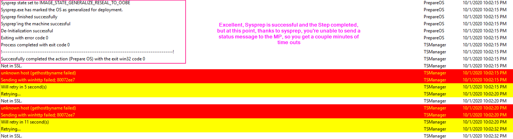

# Prepare Windows for Capture

This step will sysprep the machine so it's ready for you to capture.  Make sure you trigger this step while in the full os and make sure you didn't join your reference machine to the domain.

# MS Docs

<https://docs.microsoft.com/en-us/mem/configmgr/osd/understand/task-sequence-steps#BKMK_PrepareWindowsforCapture>

Related: [SysPrep Docs](https://docs.microsoft.com/en-us/windows-hardware/manufacture/desktop/sysprep-process-overview)

## Variables

- [OSDKeepActivation](https://docs.microsoft.com/en-us/mem/configmgr/osd/understand/task-sequence-variables#OSDKeepActivation)
- [OSDTargetSystemRoot](https://docs.microsoft.com/en-us/mem/configmgr/osd/understand/task-sequence-variables#OSDTargetSystemRoot-output)

## PowerShell

- [Get-CMTSStepPrepareWindows](https://docs.microsoft.com/en-us/powershell/module/configurationmanager/Get-CMTSStepPrepareWindows)
- [New-CMTSStepPrepareWindows](https://docs.microsoft.com/en-us/powershell/module/configurationmanager/New-CMTSStepPrepareWindows)
- [Remove-CMTSStepPrepareWindows](https://docs.microsoft.com/en-us/powershell/module/configurationmanager/Remove-CMTSStepPrepareWindows)
- [Set-CMTSStepPrepareWindows](https://docs.microsoft.com/en-us/powershell/module/configurationmanager/Set-CMTSStepPrepareWindows)

## The Step

Options are pretty limited for this step, I've never actually found a reason to use any of the options.

- Automatically build mass storage driver list.  This is based on the reference machine, and since I'd never user a physical machine for a reference machine there would not be any point in using this option.
- Do not reset activation flag. I've always used KMS services.  I never bothered to activate the reference computer in the first place so this would be useless to me
- Shutdown the computer after running this action.  I could see this potentially being useful if you were going to use another process to capture the image than the CM Task Sequence itself.  

This Step doesn't take too long and the guts of it is running sysprep.  The step also triggers the machine to restart into WinPE so that it can then run the capture process.

Lets break down the log:

You can then follow along with what happened in the sysprep process in the in SysPrep log file:
c:\windows\system32\sysprep\panther\setupact.log  
The entire sysprep process took under a minute.

If you ever find you'd like more info, or run into issues with this step, let me know.  

**About Recast Software**
1 in 3 organizations using Microsoft Configuration Manager rely on Right Click Tools to surface vulnerabilities and remediate quicker than ever before.  
[Download Free Tools](https://www.recastsoftware.com/?utm_source=cmdocs&utm_medium=referral&utm_campaign=cmdocs#formarea)  
[Request Pricing](https://www.recastsoftware.com/pricing?utm_source=cmdocs&utm_medium=referral&utm_campaign=cmdocs)
